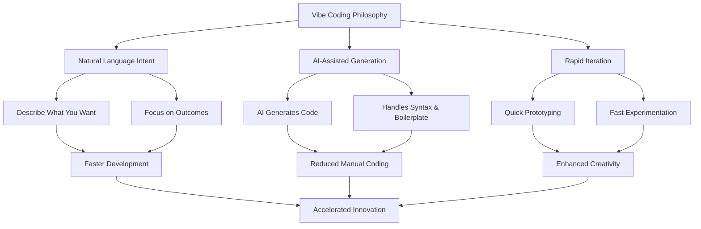
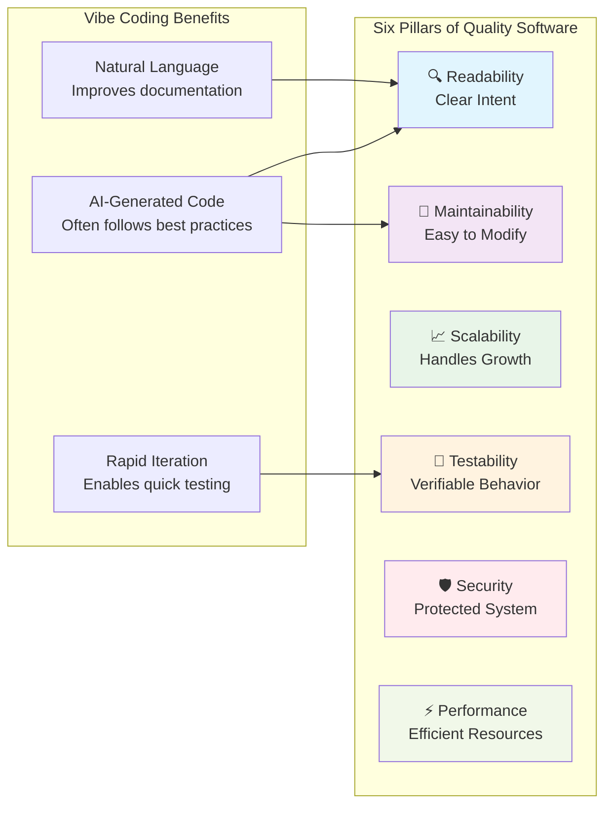

# Chapter 1: Introduction to Vibe Software Engineering

> *"Software is not just about solving problems; it's about creating solutions that can grow, evolve, and inspire the developers who work with them."*

---

## Learning Objectives

By the end of this chapter, you will be able to:
- Define "Vibe Coding" and understand its AI-assisted programming approach
- Identify the six pillars of high-quality software and their interdependencies
- Understand how vibe coding can accelerate development while maintaining quality
- Apply vibe coding techniques using natural language prompts with AI assistants

---

## 1.1 What is "Vibe Coding" and Why It Matters

### Definition and Philosophy

"Vibe coding" is an AI-assisted programming approach where developers use natural language to describe what they want to build, and AI tools (particularly Large Language Models) generate the corresponding code. Coined by Andrej Karpathy in early 2025, vibe coding represents a paradigm shift where developers focus on expressing intent and desired outcomes rather than writing syntax manually.

The term "vibe" captures the intuitive, conversational nature of this approach—you describe the "vibe" or feeling of what you want your software to do, and AI translates that into functional code. This methodology emphasizes rapid prototyping, experimentation, and leveraging AI as a coding partner.

### Core Principles of Vibe Coding



1. **Intent-Driven Development**: Focus on describing what you want rather than how to implement it
2. **AI as Coding Partner**: Leverage AI to handle routine coding tasks and boilerplate
3. **Natural Language Interface**: Use conversational prompts to guide development
4. **Rapid Prototyping**: Quickly test ideas and iterate on solutions
5. **Human-AI Collaboration**: Combine human creativity with AI's code generation capabilities

### The Human Dimension of Vibe Coding

Vibe coding transforms the developer experience by:

- **Lowering Barriers**: Enables faster entry into new technologies and frameworks
- **Accelerating Learning**: AI explanations help understand generated code patterns
- **Enhancing Creativity**: Frees mental energy for higher-level problem solving
- **Improving Productivity**: Reduces time spent on syntax and boilerplate code
- **Enabling Experimentation**: Makes it easier to try different approaches quickly

### When Vibe Coding Excels

Vibe coding is particularly effective for:
- **Rapid Prototyping**: Building MVPs and proof-of-concepts quickly
- **Learning New Technologies**: Exploring unfamiliar frameworks with AI guidance
- **Boilerplate Generation**: Creating standard code structures and patterns
- **Quick Scripts**: Building utility tools and automation scripts
- **Experimentation**: Testing different approaches and solutions

### 💡 **Vibe Coding Prompt: Project Kickstart**

**Scenario**: You need to quickly prototype a task management web application to validate a business idea.

**Your Vibe Coding Prompt**:
```
I want to create a simple task management web app with the following features:

1. **Core Functionality**:
   - Add, edit, and delete tasks
   - Mark tasks as complete/incomplete
   - Organize tasks by priority (high, medium, low)
   - Filter tasks by status and priority

2. **Technical Requirements**:
   - Use React for the frontend
   - Include a clean, modern UI with responsive design
   - Store data in localStorage for now (no backend needed)
   - Add basic form validation

3. **User Experience**:
   - Intuitive interface that feels smooth and responsive
   - Visual feedback for user actions
   - Pleasant color scheme and typography

Please generate the complete application structure including:
- Component architecture
- State management approach
- Styling recommendations
- Basic error handling

Also explain the code structure so I can understand and modify it later.
```

**How to Use**: Copy this prompt into your AI coding assistant (like Cursor, GitHub Copilot, or ChatGPT) and let it generate the initial application structure. Then iterate with follow-up prompts to refine specific features.

---

## 1.2 The Six Pillars of High-Quality Software

Even when using vibe coding techniques, maintaining software quality remains crucial. High-quality software rests on six fundamental pillars that work together to create robust, maintainable systems.

### The Six Pillars

1. **🔍 Readability**: Code that clearly communicates its intent to human readers
2. **🔧 Maintainability**: Ease of modifying, fixing, and extending the system
3. **📈 Scalability**: Ability to handle increasing loads and growing complexity
4. **🧪 Testability**: Capability to verify behavior through automated and manual testing
5. **🛡️ Security**: Protection against vulnerabilities and malicious attacks
6. **⚡ Performance**: Efficient use of system resources and responsive behavior

### Vibe Coding and Quality Pillars



Vibe coding can actually enhance these pillars when used thoughtfully:
- **AI-generated code** often follows established patterns and best practices
- **Natural language prompts** serve as living documentation of intent
- **Rapid iteration** enables quick testing and validation of different approaches

### 💡 **Vibe Coding Prompt: Quality-Focused Code Generation**

**Scenario**: You need to create a user authentication system that adheres to all six quality pillars.

**Your Vibe Coding Prompt**:
```
I need to build a secure user authentication system for a web application. Please generate code that prioritizes all six quality pillars:

**Requirements**:
1. **Readability**: Use clear variable names, proper comments, and logical structure
2. **Maintainability**: Modular design with separation of concerns
3. **Scalability**: Design that can handle growing user base
4. **Testability**: Include unit tests and make components easily testable
5. **Security**: Implement proper password hashing, input validation, and security headers
6. **Performance**: Efficient database queries and caching where appropriate

**Technical Specifications**:
- Node.js/Express backend
- JWT for session management
- bcrypt for password hashing
- Input validation and sanitization
- Rate limiting for login attempts
- Comprehensive error handling

**Deliverables**:
- Authentication middleware
- User registration and login endpoints
- Password reset functionality
- Unit tests for all components
- Security best practices documentation

Please explain how each part of the generated code addresses the six quality pillars, and provide guidance on how to extend this system safely.
```

**Follow-up Prompts for Iteration**:
- "Add two-factor authentication to this system"
- "Optimize the database queries for better performance"
- "Add comprehensive logging for security monitoring"
- "Create integration tests for the authentication flow"

---

## 1.3 Vibe Coding in Practice: Tools and Techniques

### Essential Vibe Coding Tools

**AI Coding Assistants**:
- **Cursor**: AI-powered code editor with natural language interface
- **GitHub Copilot**: AI pair programmer integrated with popular editors
- **ChatGPT/Claude**: General-purpose AI for code generation and explanation
- **Replit**: Online IDE with built-in AI assistance

**Voice-to-Text Tools** (for hands-free vibe coding):
- **SuperWhisper**: High-quality speech-to-text for coding
- **Dragon NaturallySpeaking**: Professional dictation software
- **Built-in OS tools**: macOS Dictation, Windows Speech Recognition

### Effective Vibe Coding Techniques

1. **Start with Clear Intent**: Describe what you want to achieve, not how to implement it
2. **Provide Context**: Include relevant technical constraints and requirements
3. **Iterate Incrementally**: Build up complexity through multiple prompts
4. **Ask for Explanations**: Request code explanations to understand generated solutions
5. **Specify Quality Requirements**: Explicitly ask for testable, secure, performant code

### 💡 **Vibe Coding Prompt: Learning New Technology**

**Scenario**: You need to quickly learn and implement a feature using a technology you're unfamiliar with.

**Your Vibe Coding Prompt**:
```
I'm new to GraphQL and need to create an API for a blog application. I want to understand both the implementation and the concepts.

**What I need**:
1. **GraphQL Schema** for:
   - Blog posts (title, content, author, publishDate, tags)
   - Authors (name, email, bio)
   - Comments (content, author, postId, createdAt)

2. **Resolvers** that:
   - Fetch posts with pagination
   - Allow filtering by tags and author
   - Handle nested queries (posts with their comments and authors)

3. **Learning Support**:
   - Explain GraphQL concepts as you implement them
   - Show how this differs from REST APIs
   - Include examples of queries I can test with

4. **Best Practices**:
   - Error handling patterns
   - Performance optimization (N+1 problem solutions)
   - Security considerations

**Technical Stack**: Node.js, Apollo Server, and a simple in-memory data store for now.

Please build this step-by-step, explaining each concept as we go, so I can understand both the "what" and the "why" behind GraphQL.
```

**Progressive Learning Prompts**:
- "Now add mutations for creating and updating posts"
- "Show me how to add authentication to these resolvers"
- "Optimize this for production with database integration"
- "Add real-time subscriptions for new comments"

---

## 1.4 Overview of This Textbook's Approach

This textbook combines traditional software engineering principles with modern vibe coding techniques. Each chapter includes:

### Traditional Foundations
- **Core Design Principles**: SOLID, DRY, KISS, YAGNI
- **Architecture Patterns**: Layered, microservices, event-driven
- **Quality Practices**: Testing, CI/CD, code review

### Vibe Coding Integration
- **AI-Assisted Implementation**: Using natural language to generate code
- **Rapid Prototyping**: Quick validation of architectural decisions
- **Learning Acceleration**: AI explanations of complex concepts

### Part 1: Foundations of Effective Software Design
**Core Design Principles** enhanced with vibe coding:
- Use AI to generate examples of SOLID principles in action
- Rapid prototyping of different architectural approaches
- AI-assisted refactoring of legacy code

### Part 2: Architecture and System Design
**Architectural Thinking** accelerated by AI:
- Generate multiple architectural options quickly
- Prototype different patterns to compare trade-offs
- AI-assisted documentation and diagramming

### Part 3: Code Quality and Maintainability
**Quality Practices** supported by AI:
- AI-generated tests and test cases
- Automated code review and improvement suggestions
- Natural language documentation generation

### Part 4: Testing and Continuous Integration
**Modern Development Practices** enhanced with AI:
- AI-assisted test generation and TDD
- Automated CI/CD pipeline creation
- Intelligent monitoring and alerting setup

### 💡 **Vibe Coding Prompt: Personal Learning Path**

**Scenario**: You want to create a personalized learning plan that combines traditional software engineering with vibe coding techniques.

**Your Vibe Coding Prompt**:
```
Help me create a personalized learning plan that combines traditional software engineering principles with modern vibe coding techniques.

**My Current Situation**:
- 3 years of Python/Django development experience
- Working primarily with web applications and REST APIs
- Strong in backend development, want to improve frontend and DevOps skills
- Familiar with basic testing but want to master TDD and advanced testing strategies

**Learning Goals**:
1. Master core software engineering principles
2. Become proficient with AI-assisted development
3. Build a portfolio of high-quality projects
4. Stay current with industry best practices

**Constraints**:
- 10-15 hours per week available for learning
- Prefer hands-on learning with practical projects
- Goal to become a senior developer within 18 months
- Want to transition into a tech lead role eventually

**Deliverables I Want**:
1. **Weekly Learning Schedule**: Balanced between theory and practice
2. **Project Ideas**: Progressive complexity using vibe coding techniques
3. **Skill Assessment Framework**: How to measure progress
4. **Resource Recommendations**: Books, courses, tools, communities
5. **Practice Exercises**: Specific vibe coding prompts for each topic

Please create a comprehensive 6-month learning plan that will make me proficient in both traditional software engineering and modern AI-assisted development techniques.
```

**Customization Prompts**:
- "Adjust this plan for someone with [X years] of experience"
- "Focus more on [specific technology or domain]"
- "Add more hands-on projects and fewer theoretical concepts"
- "Include preparation for [specific certification or role]"

---

## Summary

Vibe coding represents a revolutionary approach to software development that combines human creativity with AI capabilities. By using natural language to express intent and letting AI handle implementation details, developers can:

- **Accelerate Development**: Build prototypes and MVPs faster
- **Lower Learning Curves**: Explore new technologies with AI guidance
- **Enhance Creativity**: Focus on problem-solving rather than syntax
- **Maintain Quality**: Use AI to implement best practices consistently

The key to successful vibe coding is understanding when and how to use it effectively while maintaining the fundamental principles of good software engineering. This textbook will guide you through both traditional practices and modern AI-assisted techniques, helping you become a more effective and productive developer.

Remember: Vibe coding is not about replacing software engineering knowledge—it's about augmenting your capabilities and accelerating your development process while maintaining high standards of quality and craftsmanship. 