# Chapter 1: Introduction to Vive Software Engineering

> *"Software is not just about solving problems; it's about creating solutions that can grow, evolve, and inspire the developers who work with them."*

---

## Learning Objectives

By the end of this chapter, you will be able to:
- Define "Vive Coding" and articulate its core philosophy
- Identify the six pillars of high-quality software and their interdependencies
- Understand the comprehensive framework of principles and practices covered in this textbook
- Apply initial assessment techniques to evaluate software quality

---

## 1.1 What is "Vive Coding" and Why It Matters

### Definition and Philosophy

"Vive coding" encapsulates the aspiration for software development that yields high-quality, maintainable, scalable, and resilient systems through disciplined engineering practices. The term "vive" (meaning "live" or "alive" in French and Spanish) symbolizes software that is vibrant, adaptable, and sustainable over time. This approach extends beyond simply writing functional code; it encompasses a philosophy where the resulting codebase is easy to understand, modify, and extend, thereby reducing developer frustration and increasing overall project success.

### The Human Dimension of Software Quality

The emphasis on "vive coding" underscores a deeper objective: to foster a positive and productive development environment. When code is readable, maintainable, and testable, developers experience less friction in their daily tasks. This ease of interaction with the codebase translates into:

- **Increased Productivity**: Developers can focus on solving business problems rather than fighting with complex, unclear code
- **Reduced Stress**: Clear code structures minimize debugging time and cognitive load
- **Enhanced Team Morale**: Collaborative work becomes more enjoyable when code is approachable
- **Improved Retention**: Developers are more likely to stay with projects that don't frustrate them daily

### Long-term Strategic Benefits

The long-term benefits of embracing disciplined "vive coding" methodology include:

1. **Significant Reduction in Technical Debt**: Proactive quality measures prevent accumulation of shortcuts and quick fixes
2. **Accelerated Feature Delivery**: Well-structured code enables faster implementation of new features
3. **Enhanced Team Collaboration**: Shared understanding through clear code and documentation
4. **Improved System Reliability**: Robust engineering practices lead to more stable software
5. **Future-Proofing**: Adaptable architecture accommodates changing requirements and technologies

### 💡 **Vive Coding Prompt: Quarterly Quality Assessment**

**Scenario**: As your development team begins a new quarter, leadership wants to establish a baseline for code quality improvement.

**Your Task**: 
1. **Audit Current State**: Select 3 critical modules from your current codebase and perform a "vive coding" health check:
   - How many developers can explain each module without referring to documentation?
   - How long does it take a new team member to make their first meaningful contribution to each module?
   - What's the average time to diagnose and fix bugs in these modules?

2. **Set SMART Goals**: Based on your audit, establish specific, measurable targets:
   - "Reduce bug report rate by 20% while improving feature deployment speed by 30%"
   - "Decrease onboarding time for new developers from 2 weeks to 1 week"

3. **Implementation Strategy**: Focus on writing clean, testable, and well-documented code. Create a team charter that defines what "vive coding" means for your specific project context.

**Deliverable**: A one-page "Vive Coding Charter" that your team commits to following.

---

## 1.2 The Six Pillars of High-Quality Software

High-quality software rests on six fundamental pillars that are intricately interconnected and mutually reinforcing. Understanding these pillars and their relationships is crucial for achieving "vive coding" excellence.

### The Six Pillars

1. **🔍 Readability**: Code that clearly communicates its intent to human readers
2. **🔧 Maintainability**: Ease of modifying, fixing, and extending the system
3. **📈 Scalability**: Ability to handle increasing loads and growing complexity
4. **🧪 Testability**: Capability to verify behavior through automated and manual testing
5. **🛡️ Security**: Protection against vulnerabilities and malicious attacks
6. **⚡ Performance**: Efficient use of system resources and responsive behavior

### Pillar Interdependencies

These pillars are not independent; they form a reinforcing ecosystem:

```mermaid
graph LR
    subgraph "Six Pillars of Quality Software"
        R["🔍 Readability<br/>Clear Intent"]
        M["🔧 Maintainability<br/>Easy to Modify"]
        S["📈 Scalability<br/>Handles Growth"]
        T["🧪 Testability<br/>Verifiable Behavior"]
        SEC["🛡️ Security<br/>Protected System"]
        P["⚡ Performance<br/>Efficient Resources"]
    end
    
    R --> M
    M --> T
    T --> S
    SEC --> M
    P --> S
    R --> T
    
    style R fill:#e1f5fe
    style M fill:#f3e5f5
    style S fill:#e8f5e8
    style T fill:#fff3e0
    style SEC fill:#ffebee
    style P fill:#f1f8e9
```

- **Readability → Maintainability**: Code that is highly readable is inherently easier to maintain and test
- **Maintainability → Testability**: Well-structured, modular design improves both maintainability and testability
- **Security → Reliability**: Secure systems are less prone to vulnerabilities that could compromise reliability
- **Performance → Scalability**: Efficient code provides a foundation for scalable architecture

### The Holistic Approach

The pursuit of "vive coding" necessitates a holistic approach to these pillars, recognizing that:
- Strength in one area often positively impacts others
- Weakness in one pillar can undermine the entire system
- Trade-offs must be made consciously and with full understanding of consequences

### 💡 **Vive Coding Prompt: Six-Pillar Code Review**

**Scenario**: You're conducting a comprehensive code review of a critical data processing module that handles customer transactions.

**Your Task**: 
1. **Systematic Evaluation**: Using the six pillars framework, conduct a thorough assessment:
   
   **Readability Checklist:**
   - Are variable names self-explanatory? (`customerTransactionAmount` vs `amt`)
   - Is the code structure logical and easy to follow?
   - Are complex algorithms properly commented?

   **Maintainability Analysis:**
   - How many files would need to be modified to add a new transaction type?
   - Are responsibilities clearly separated?
   - Is the code modular and loosely coupled?

   **Scalability Assessment:**
   - Can this module handle 10x the current transaction volume?
   - Are there any obvious bottlenecks (N+1 queries, inefficient algorithms)?
   - How would the system behave under peak load?

   **Testability Review:**
   - Can individual components be tested in isolation?
   - Are dependencies injected or hard-coded?
   - What percentage of the code is covered by automated tests?

   **Security Audit:**
   - Are all inputs validated and sanitized?
   - Is sensitive data properly encrypted and secured?
   - Are there any potential injection vulnerabilities?

   **Performance Analysis:**
   - Are there any memory leaks or resource management issues?
   - Is the algorithm complexity appropriate for the use case?
   - Are database queries optimized?

2. **Priority Matrix**: Create a 2x2 matrix plotting "Impact" vs "Effort" for identified improvements.

3. **Action Plan**: Develop a prioritized improvement plan that addresses the most critical issues first while considering pillar interdependencies.

**Deliverable**: A comprehensive code review report with specific, actionable recommendations for each pillar.

---

## 1.3 Overview of Design Principles and Engineering Practices

This textbook provides a comprehensive exploration of the principles and practices essential for achieving "vive coding" excellence. The content is organized into four main parts that build upon each other systematically.

### Part 1: Foundations of Effective Software Design

**Core Design Principles** form the intellectual foundation:
- **SOLID Principles**: Single Responsibility, Open-Closed, Liskov Substitution, Interface Segregation, and Dependency Inversion
- **DRY (Don't Repeat Yourself)**: Eliminating redundancy through abstraction
- **KISS (Keep It Simple, Stupid)**: Embracing simplicity over complexity
- **YAGNI (You Aren't Gonna Need It)**: Avoiding premature optimization and over-engineering
- **Separation of Concerns (SoC)**: Dividing systems into distinct, focused components
- **Coupling and Cohesion**: Achieving modular, understandable code architecture

### Part 2: Architectural Patterns for Scalable Systems

**System-Level Design Patterns** provide blueprints for structure:
- Understanding Software Architecture fundamentals
- Common patterns: Layered, Event-Driven, Microservices, Client-Server
- Specialized patterns: Microkernel, Pipe-Filter, Broker, Master-Slave
- Clean Architecture principles and implementation

### Part 3: Essential Engineering Practices

**Daily Development Excellence** through proven practices:
- Writing readable and maintainable code
- Robust error handling and structured logging
- Performance optimization techniques
- Secure coding practices and vulnerability management

### Part 4: Modern Development Methodologies

**Team-Based Quality Assurance** and delivery practices:
- Test-Driven Development (TDD) and the Red-Green-Refactor cycle
- Continuous Integration and Continuous Delivery (CI/CD)
- Collaboration tools and version control strategies

### The Integrated Approach

These elements work synergistically to create a comprehensive framework:

1. **Principles** provide the "why" and guide decision-making
2. **Patterns** offer the "what" through proven structural solutions
3. **Practices** deliver the "how" through concrete implementation techniques
4. **Methodologies** ensure the "when" through systematic processes

### 💡 **Vive Coding Prompt: Personal Development Roadmap**

**Scenario**: You want to systematically improve your software engineering skills using the framework presented in this textbook.

**Your Task**: 
1. **Self-Assessment**: Rate your current proficiency (1-5 scale) in each area:
   - Design Principles (SOLID, DRY, KISS, YAGNI)
   - Architectural Patterns (Layered, Microservices, Clean Architecture)
   - Engineering Practices (Testing, Error Handling, Performance)
   - Modern Methodologies (TDD, CI/CD, Collaboration)

2. **Gap Analysis**: Identify your three biggest improvement opportunities based on:
   - Current skill level
   - Relevance to your current role
   - Potential impact on your team/project

3. **Learning Plan**: For each improvement area, create a specific plan:
   - **Concrete Goal**: "Master TDD by implementing it in my next feature"
   - **Learning Resources**: Relevant chapters, external materials, practice projects
   - **Success Metrics**: How will you measure improvement?
   - **Timeline**: Realistic milestones and deadlines
   - **Application Opportunities**: Where will you practice these skills?

4. **Accountability System**: Design a system to track your progress:
   - Weekly self-reflection questions
   - Peer review or mentorship checkpoints
   - Regular practice project commits

**Deliverable**: A personalized 90-day learning plan with weekly milestones and specific practice commitments.

---

## Chapter Summary

"Vive coding" represents more than technical proficiency—it embodies a philosophy of creating software that is alive, adaptable, and enjoyable to work with. By understanding the six pillars of quality software and their interdependencies, developers can make informed decisions that improve not just code quality, but team productivity and project success.

The journey toward masterful software engineering requires systematic application of proven principles, patterns, practices, and methodologies. This textbook provides that systematic framework, ensuring that each concept builds upon the previous ones to create a comprehensive understanding of what it means to write truly excellent software.

### Key Takeaways

1. **Holistic Quality**: Software quality emerges from the interplay of multiple factors, not just technical correctness
2. **Human-Centered Development**: The best code serves both machines and the humans who work with it
3. **Systematic Improvement**: Consistent application of proven principles leads to measurable improvements
4. **Continuous Learning**: Software engineering mastery is a journey, not a destination

---

## Further Reading

- **Next Chapter**: Core Design Principles - Deep dive into SOLID principles and fundamental design concepts
- **Supplementary Resources**: 
  - *Clean Code* by Robert C. Martin
  - *Design Patterns* by Gang of Four
  - *The Pragmatic Programmer* by Andrew Hunt and David Thomas 