# Chapter 1: Introduction to Vibe Software Engineering

> *"The hottest new programming language is English."* - Andrej Karpathy, 2025

---

## Learning Objectives

By the end of this chapter, you will be able to:
- Define "Vibe Coding" and understand its AI-assisted programming approach
- Identify the six pillars of high-quality software and their interdependencies
- Understand how vibe coding can accelerate development while maintaining quality
- Apply vibe coding techniques using natural language prompts with AI assistants
- Recognize when vibe coding is most effective and when traditional approaches are preferred

---

## 1.1 What is "Vibe Coding" and Why It Matters

### Definition and Philosophy

**Vibe coding** is an AI-assisted programming paradigm coined by Andrej Karpathy in February 2025, where developers use natural language to describe software requirements and AI tools generate the corresponding code. Rather than writing code line-by-line, developers focus on expressing **intent** and **desired outcomes**, allowing Large Language Models (LLMs) to handle implementation details.

The term "vibe" captures the intuitive, conversational nature of this approach—you describe the "vibe" or essence of what you want your software to accomplish, and AI translates that vision into functional code. This represents a fundamental shift from traditional programming where humans wrote explicit instructions to a new paradigm where humans provide high-level guidance and AI handles low-level implementation.

**Key Insight**: Vibe coding doesn't replace programming knowledge—it amplifies human creativity by automating routine tasks and enabling developers to focus on architecture, design, and problem-solving rather than syntax and boilerplate code.

### Historical Context and Evolution


### Core Principles of Vibe Coding

```mermaid
graph TD
    subgraph "Vibe Coding Ecosystem"
        A["🧠 Human Developer"] --> B["Natural Language Intent"]
        B --> C["🤖 AI Assistant"]
        C --> D["Generated Code"]
        D --> E["🔄 Iterative Refinement"]
        E --> B
        
        subgraph "Human Responsibilities"
            F["🎯 Define Requirements"]
            G["🏗️ Architecture Decisions"]
            H["✅ Quality Validation"]
            I["🔍 Code Review"]
        end
        
        subgraph "AI Capabilities"
            J["📝 Code Generation"]
            K["🛠️ Boilerplate Creation"]
            L["🔧 Pattern Implementation"]
            M["📚 Documentation"]
        end
        
        subgraph "Collaboration Benefits"
            N["⚡ Faster Development"]
            O["🚀 Rapid Prototyping"]
            P["💡 Enhanced Creativity"]
            Q["📈 Improved Productivity"]
        end
    end
    
    A --> F
    A --> G
    A --> H
    A --> I
    
    C --> J
    C --> K
    C --> L
    C --> M
    
    F --> N
    G --> O
    H --> P
    I --> Q
    
    style A fill:#e8f5e8
    style C fill:#e3f2fd
    style N fill:#fff3e0
    style O fill:#f3e5f5
    style P fill:#f1f8e9
    style Q fill:#ffebee
```



**The Vibe Coding Philosophy rests on four foundational principles:**

1. **Intent-Driven Development**: Focus on describing what you want rather than how to implement it
2. **AI as Coding Partner**: Leverage AI to handle routine coding tasks while humans focus on creativity and architecture
3. **Natural Language Interface**: Use conversational prompts to guide development, making programming more accessible
4. **Rapid Iteration Cycles**: Quickly test ideas, get feedback, and refine solutions through continuous collaboration

### The Human-AI Collaboration Model

Vibe coding transforms the developer experience by establishing a clear division of responsibilities:

**👨‍💻 Human Strengths:**
- Creative problem-solving and architectural thinking
- Understanding business requirements and user needs
- Making strategic technical decisions
- Ensuring code quality and security standards
- Providing context and domain expertise

**🤖 AI Strengths:**
- Rapid code generation and pattern implementation
- Handling repetitive tasks and boilerplate code
- Maintaining consistent coding standards
- Generating comprehensive documentation
- Suggesting optimizations and best practices

**🤝 Collaboration Benefits:**
- **Accelerated Learning**: AI explanations help developers understand new concepts
- **Reduced Cognitive Load**: Focus on high-level design rather than syntax details
- **Enhanced Experimentation**: Easily try different approaches and solutions
- **Improved Code Quality**: AI often follows established patterns and practices

### When Vibe Coding Excels

Vibe coding is particularly effective for:

**🎯 Ideal Use Cases:**
- **Rapid Prototyping**: Building MVPs and proof-of-concepts quickly
- **Learning New Technologies**: Exploring unfamiliar frameworks with AI guidance
- **Boilerplate Generation**: Creating standard code structures and patterns
- **Utility Development**: Building tools and automation scripts
- **Creative Experimentation**: Testing different approaches and solutions
- **Documentation**: Generating comprehensive project documentation

**⚠️ Proceed with Caution:**
- **Mission-Critical Systems**: Where failure has serious consequences
- **High-Security Applications**: Requiring thorough security review
- **Performance-Critical Code**: Where optimization is paramount
- **Regulatory Compliance**: Needing detailed audit trails
- **Long-term Maintenance**: Systems requiring decade-long support

### 💡 **Vibe Coding Prompt: Project Kickstart**

**Scenario**: You need to quickly prototype a task management web application to validate a business idea.

**Context**: This prompt demonstrates effective vibe coding by providing clear requirements, technical constraints, and success criteria while allowing AI to handle implementation details.

**Your Vibe Coding Prompt**:
```
I want to create a modern task management web application for rapid business validation. Here are my requirements:

**🎯 Core Functionality**:
- Add, edit, delete, and organize tasks
- Mark tasks as complete/incomplete with visual feedback
- Organize tasks by priority (high, medium, low) with color coding
- Filter and search tasks by status, priority, and keywords
- Due date management with overdue indicators
- Simple drag-and-drop task reordering

**⚙️ Technical Requirements**:
- Use React 18+ with TypeScript for type safety
- Implement responsive design that works on mobile and desktop
- Store data in localStorage for MVP (no backend complexity)
- Include form validation with helpful error messages
- Use modern CSS (Flexbox/Grid) with a clean, professional design
- Add loading states and smooth animations for better UX

**🎨 User Experience Goals**:
- Intuitive interface that feels smooth and responsive
- Pleasant color scheme following modern design principles
- Accessible design (proper ARIA labels, keyboard navigation)
- Visual feedback for all user actions
- Error handling with user-friendly messages

**📚 Deliverables Needed**:
1. Complete component architecture with clear separation of concerns
2. TypeScript interfaces for type safety
3. State management strategy (React hooks or Context API)
4. CSS modules or styled-components setup
5. Basic unit tests for core functionality
6. README with setup and usage instructions

**💡 Success Criteria**:
- A user can complete the full task lifecycle in under 30 seconds
- The app loads in under 2 seconds on mobile
- Code is maintainable and well-documented
- Easy to extend with new features

Please generate a production-ready application structure with:
- Clear explanation of architectural decisions
- Code comments explaining complex logic
- Suggestions for future enhancements
- Best practices for scalability

Focus on creating something that could realistically be shown to potential customers or investors.
```

**🎓 Learning Objectives:**
This prompt teaches you to:
- Provide clear, specific requirements while leaving implementation flexibility
- Balance technical constraints with business goals
- Structure requests for production-ready code
- Include quality gates and success criteria
- Request educational explanations alongside code generation

**⚡ Pro Tips for Effective Vibe Coding:**
1. **Be Specific About Constraints**: Mention framework versions, browser support, performance requirements
2. **Define Success Metrics**: How will you know the generated code meets your needs?
3. **Request Explanations**: Ask AI to explain architectural decisions for learning
4. **Include Quality Requirements**: Don't just ask for working code, ask for maintainable code
5. **Think Long-term**: Consider how the generated code will evolve and scale

---

## 1.2 The Six Pillars of High-Quality Software

Even when using vibe coding techniques, maintaining software quality remains crucial. High-quality software rests on six fundamental pillars that work together to create robust, maintainable systems.

### The Six Pillars

1. **🔍 Readability**: Code that clearly communicates its intent to human readers
2. **🔧 Maintainability**: Ease of modifying, fixing, and extending the system
3. **📈 Scalability**: Ability to handle increasing loads and growing complexity
4. **🧪 Testability**: Capability to verify behavior through automated and manual testing
5. **🛡️ Security**: Protection against vulnerabilities and malicious attacks
6. **⚡ Performance**: Efficient use of system resources and responsive behavior

### Vibe Coding and Quality Pillars


Vibe coding can actually enhance these pillars when used thoughtfully:
- **AI-generated code** often follows established patterns and best practices
- **Natural language prompts** serve as living documentation of intent
- **Rapid iteration** enables quick testing and validation of different approaches

### 💡 **Vibe Coding Prompt: Quality-Focused Code Generation**

**Scenario**: You need to create a user authentication system that adheres to all six quality pillars.

**Your Vibe Coding Prompt**:
```
I need to build a secure user authentication system for a web application. Please generate code that prioritizes all six quality pillars:

**Requirements**:
1. **Readability**: Use clear variable names, proper comments, and logical structure
2. **Maintainability**: Modular design with separation of concerns
3. **Scalability**: Design that can handle growing user base
4. **Testability**: Include unit tests and make components easily testable
5. **Security**: Implement proper password hashing, input validation, and security headers
6. **Performance**: Efficient database queries and caching where appropriate

**Technical Specifications**:
- Node.js/Express backend
- JWT for session management
- bcrypt for password hashing
- Input validation and sanitization
- Rate limiting for login attempts
- Comprehensive error handling

**Deliverables**:
- Authentication middleware
- User registration and login endpoints
- Password reset functionality
- Unit tests for all components
- Security best practices documentation

Please explain how each part of the generated code addresses the six quality pillars, and provide guidance on how to extend this system safely.
```

**Follow-up Prompts for Iteration**:
- "Add two-factor authentication to this system"
- "Optimize the database queries for better performance"
- "Add comprehensive logging for security monitoring"
- "Create integration tests for the authentication flow"

---

## 1.3 Vibe Coding in Practice: Tools and Techniques

### Essential Vibe Coding Tools

**AI Coding Assistants**:
- **Cursor**: AI-powered code editor with natural language interface
- **GitHub Copilot**: AI pair programmer integrated with popular editors
- **ChatGPT/Claude**: General-purpose AI for code generation and explanation
- **Replit**: Online IDE with built-in AI assistance

**Voice-to-Text Tools** (for hands-free vibe coding):
- **SuperWhisper**: High-quality speech-to-text for coding
- **Dragon NaturallySpeaking**: Professional dictation software
- **Built-in OS tools**: macOS Dictation, Windows Speech Recognition

### Effective Vibe Coding Techniques

1. **Start with Clear Intent**: Describe what you want to achieve, not how to implement it
2. **Provide Context**: Include relevant technical constraints and requirements
3. **Iterate Incrementally**: Build up complexity through multiple prompts
4. **Ask for Explanations**: Request code explanations to understand generated solutions
5. **Specify Quality Requirements**: Explicitly ask for testable, secure, performant code

### 💡 **Vibe Coding Prompt: Learning New Technology**

**Scenario**: You need to quickly learn and implement a feature using a technology you're unfamiliar with.

**Your Vibe Coding Prompt**:
```
I'm new to GraphQL and need to create an API for a blog application. I want to understand both the implementation and the concepts.

**What I need**:
1. **GraphQL Schema** for:
   - Blog posts (title, content, author, publishDate, tags)
   - Authors (name, email, bio)
   - Comments (content, author, postId, createdAt)

2. **Resolvers** that:
   - Fetch posts with pagination
   - Allow filtering by tags and author
   - Handle nested queries (posts with their comments and authors)

3. **Learning Support**:
   - Explain GraphQL concepts as you implement them
   - Show how this differs from REST APIs
   - Include examples of queries I can test with

4. **Best Practices**:
   - Error handling patterns
   - Performance optimization (N+1 problem solutions)
   - Security considerations

**Technical Stack**: Node.js, Apollo Server, and a simple in-memory data store for now.

Please build this step-by-step, explaining each concept as we go, so I can understand both the "what" and the "why" behind GraphQL.
```

**Progressive Learning Prompts**:
- "Now add mutations for creating and updating posts"
- "Show me how to add authentication to these resolvers"
- "Optimize this for production with database integration"
- "Add real-time subscriptions for new comments"

---

## 1.4 Overview of This Textbook's Approach

This textbook combines traditional software engineering principles with modern vibe coding techniques. Each chapter includes:

### Traditional Foundations
- **Core Design Principles**: SOLID, DRY, KISS, YAGNI
- **Architecture Patterns**: Layered, microservices, event-driven
- **Quality Practices**: Testing, CI/CD, code review

### Vibe Coding Integration
- **AI-Assisted Implementation**: Using natural language to generate code
- **Rapid Prototyping**: Quick validation of architectural decisions
- **Learning Acceleration**: AI explanations of complex concepts

### Part 1: Foundations of Effective Software Design
**Core Design Principles** enhanced with vibe coding:
- Use AI to generate examples of SOLID principles in action
- Rapid prototyping of different architectural approaches
- AI-assisted refactoring of legacy code

### Part 2: Architecture and System Design
**Architectural Thinking** accelerated by AI:
- Generate multiple architectural options quickly
- Prototype different patterns to compare trade-offs
- AI-assisted documentation and diagramming

### Part 3: Code Quality and Maintainability
**Quality Practices** supported by AI:
- AI-generated tests and test cases
- Automated code review and improvement suggestions
- Natural language documentation generation

### Part 4: Testing and Continuous Integration
**Modern Development Practices** enhanced with AI:
- AI-assisted test generation and TDD
- Automated CI/CD pipeline creation
- Intelligent monitoring and alerting setup

### 💡 **Vibe Coding Prompt: Personal Learning Path**

**Scenario**: You want to create a personalized learning plan that combines traditional software engineering with vibe coding techniques.

**Your Vibe Coding Prompt**:
```
Help me create a personalized learning plan that combines traditional software engineering principles with modern vibe coding techniques.

**My Current Situation**:
- 3 years of Python/Django development experience
- Working primarily with web applications and REST APIs
- Strong in backend development, want to improve frontend and DevOps skills
- Familiar with basic testing but want to master TDD and advanced testing strategies

**Learning Goals**:
1. Master core software engineering principles
2. Become proficient with AI-assisted development
3. Build a portfolio of high-quality projects
4. Stay current with industry best practices

**Constraints**:
- 10-15 hours per week available for learning
- Prefer hands-on learning with practical projects
- Goal to become a senior developer within 18 months
- Want to transition into a tech lead role eventually

**Deliverables I Want**:
1. **Weekly Learning Schedule**: Balanced between theory and practice
2. **Project Ideas**: Progressive complexity using vibe coding techniques
3. **Skill Assessment Framework**: How to measure progress
4. **Resource Recommendations**: Books, courses, tools, communities
5. **Practice Exercises**: Specific vibe coding prompts for each topic

Please create a comprehensive 6-month learning plan that will make me proficient in both traditional software engineering and modern AI-assisted development techniques.
```

**Customization Prompts**:
- "Adjust this plan for someone with [X years] of experience"
- "Focus more on [specific technology or domain]"
- "Add more hands-on projects and fewer theoretical concepts"
- "Include preparation for [specific certification or role]"

---

## 1.4 The Vibe Coding Ecosystem: Tools and Platforms

### Modern AI Coding Assistants

The vibe coding revolution is powered by sophisticated AI tools that have emerged in 2024-2025. Understanding these tools helps students choose the right approach for their projects.


### Choosing the Right Tool for Your Needs

| Tool Category | Best For | Strengths | Considerations |
|---------------|----------|-----------|----------------|
| **IDE-Integrated** | Daily coding workflow | Seamless integration, context-aware | Requires existing IDE knowledge |
| **Conversational** | Learning, exploration | Detailed explanations, flexible | May need copy-paste workflow |
| **Specialized Platforms** | Rapid prototyping | End-to-end solutions | Less customization control |
| **Quality-Focused** | Production code | Automated testing, security | Requires code review skills |

### Vibe Coding Best Practices (2025 Edition)

**🎯 Effective Prompting Strategies:**

1. **The CLEAR Framework:**
   - **C**ontext: Provide relevant background information
   - **L**imitations: Specify constraints and requirements
   - **E**xamples: Show desired patterns or styles
   - **A**ctions: Define what you want the AI to do
   - **R**esults: Describe expected outcomes

2. **Iterative Refinement:**
   - Start with basic functionality
   - Add complexity gradually
   - Test and validate each iteration
   - Refine based on results

3. **Quality Gates:**
   - Always review generated code
   - Test thoroughly before deployment
   - Validate security and performance
   - Ensure maintainability

**⚠️ Common Pitfalls to Avoid:**

- **Over-reliance**: Don't accept all suggestions blindly
- **Insufficient Context**: Provide enough information for accurate generation
- **Ignoring Edge Cases**: AI may miss unusual scenarios
- **Security Negligence**: Always validate security implications
- **Documentation Gaps**: Ensure code is properly documented

### The Future of Vibe Coding

As we move deeper into 2025, several trends are shaping the future of vibe coding:

**🔮 Emerging Trends:**

1. **Multimodal Development**: Combining voice, visual, and text inputs
2. **AI-Pair Programming**: Real-time collaboration with AI partners
3. **Intelligent Code Evolution**: AI that learns from your coding patterns
4. **Domain-Specific Models**: AI trained for specific industries or frameworks
5. **Automated Testing**: AI that generates comprehensive test suites

**🌟 Impact on Software Development:**

- **Democratization**: Making programming accessible to non-technical users
- **Acceleration**: Reducing time from idea to working prototype
- **Quality Improvement**: AI-enforced best practices and patterns
- **Learning Enhancement**: Interactive tutoring and explanation
- **Innovation Catalyst**: Enabling rapid experimentation and creativity

### 💡 **Vibe Coding Prompt: Tool Selection Guide**

**Scenario**: You're starting a new project and need to choose the right vibe coding tools for your team.

**Your Vibe Coding Prompt**:
```
I'm planning a software development project and need guidance on selecting the best vibe coding tools. Here's my situation:

**Project Context**:
- Building a [describe your project type: web app, mobile app, desktop software, etc.]
- Team size: [number] developers with [experience level]
- Timeline: [duration] 
- Budget constraints: [budget level]

**Technical Requirements**:
- Primary programming languages: [languages]
- Target platforms: [web, mobile, desktop]
- Integration needs: [existing systems, APIs, databases]
- Performance requirements: [specific needs]

**Team Preferences**:
- Current development tools: [IDEs, frameworks]
- AI experience level: [beginner, intermediate, advanced]
- Learning vs. productivity focus: [preference]

Please recommend:
1. The most suitable vibe coding tools for our specific needs
2. A step-by-step adoption strategy
3. Best practices for our team's skill level
4. Potential challenges and mitigation strategies
5. Success metrics to track our progress

Also provide specific examples of how these tools would improve our development workflow and productivity.
```

This framework helps students make informed decisions about tool selection based on their specific context and needs.

---

## Summary

Vibe coding represents a revolutionary approach to software development that combines human creativity with AI capabilities. By using natural language to express intent and letting AI handle implementation details, developers can:

- **Accelerate Development**: Build prototypes and MVPs faster
- **Lower Learning Curves**: Explore new technologies with AI guidance
- **Enhance Creativity**: Focus on problem-solving rather than syntax
- **Maintain Quality**: Use AI to implement best practices consistently

The key to successful vibe coding is understanding when and how to use it effectively while maintaining the fundamental principles of good software engineering. This textbook will guide you through both traditional practices and modern AI-assisted techniques, helping you become a more effective and productive developer.

Remember: Vibe coding is not about replacing software engineering knowledge—it's about augmenting your capabilities and accelerating your development process while maintaining high standards of quality and craftsmanship. 