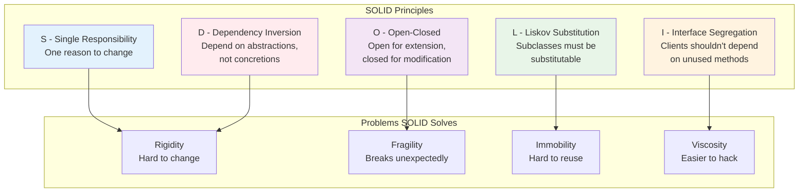
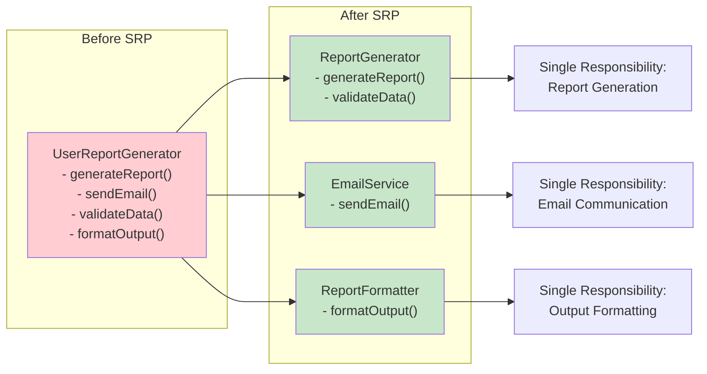
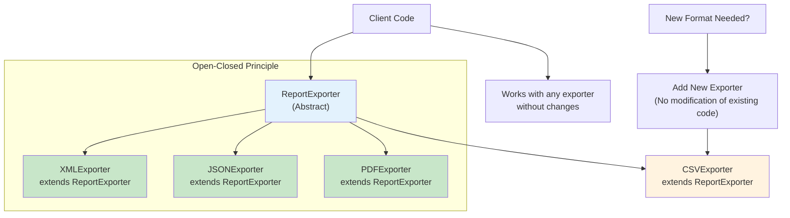
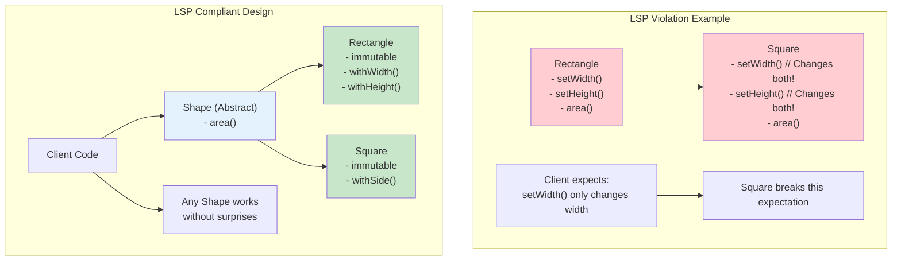

# Chapter 2: Core Design Principles

> *"Good design is not about following rules blindly; it's about understanding principles deeply enough to know when and how to apply them."*

---

## Learning Objectives

By the end of this chapter, you will be able to:
- Apply all five SOLID principles to improve code design and maintainability
- Implement DRY, KISS, and YAGNI principles in daily development practices
- Design systems with proper separation of concerns
- Evaluate and optimize coupling and cohesion in software modules
- Make informed trade-offs between different design principles

---

## 2.1 The SOLID Principles: Building Robust and Maintainable Systems

The SOLID principles represent a set of five fundamental design guidelines that, when applied systematically, lead to software systems that are more robust, maintainable, and extensible. Originally formulated by Robert C. Martin, these principles are widely recognized in object-oriented programming but hold relevance across various paradigms and modern development approaches.

### Why SOLID Matters

Before diving into each principle, it's crucial to understand the problems SOLID principles solve:



- **Rigidity**: Systems that are hard to change because every change affects too many other parts
- **Fragility**: Systems that break in unexpected places when you make changes
- **Immobility**: Systems where you can't easily reuse components in other applications
- **Viscosity**: When it's easier to hack than to preserve design integrity

---

### 2.1.1 Single Responsibility Principle (SRP)

> *"A class should have one, and only one, reason to change."* - Robert C. Martin

#### The Principle Explained

The Single Responsibility Principle mandates that every class or module within a software system should be responsible for a single, well-defined piece of functionality. This principle is often misunderstood as "a class should do only one thing," but it's more accurately described as "a class should have only one reason to change."

#### Identifying Responsibilities

To identify whether a class violates SRP, ask these questions:
1. **Who are the stakeholders?** Different stakeholders represent different reasons for change
2. **What would cause this class to change?** Multiple reasons indicate multiple responsibilities
3. **Can you describe the class in a single sentence without using "and" or "or"?**

#### Benefits of SRP

- **Easier Testing**: Smaller, focused classes are simpler to test comprehensively
- **Reduced Coupling**: Classes with single responsibilities have fewer dependencies
- **Improved Maintainability**: Changes affect smaller, more isolated code sections
- **Enhanced Reusability**: Focused classes are more likely to be useful in different contexts

#### Common SRP Violations



| Violation Type | Example | Problem | Solution |
|---|---|---|---|
| **Mixed Concerns** | `UserReportGenerator` handles both data logic and email sending | Two reasons to change: data format changes and email service changes | Split into `ReportGenerator` and `EmailService` |
| **God Classes** | `OrderManager` handles validation, persistence, notifications, and calculations | Multiple stakeholders, multiple reasons to change | Break into focused services following domain boundaries |
| **Utility Classes** | `Utils` class with unrelated helper methods | Grows without bounds, unclear purpose | Create specific utility classes for related functions |

### 💡 **Vibe Coding Prompt: SRP Refactoring Challenge**

**Scenario**: You've identified a class that violates the Single Responsibility Principle and want to use AI to help refactor it properly.

**Your Vibe Coding Prompt**:

```
I have a class that's doing too many things and violates the Single Responsibility Principle. I want to refactor it using SRP best practices.

**Current problematic class**: 
```python
class UserReportGenerator:
    def __init__(self, database_connection):
        self.db = database_connection
        
    def generate_user_report(self, user_id, report_type):
        # Fetch user data
        user = self.db.query(f"SELECT * FROM users WHERE id = {user_id}")
        
        # Generate report content
        if report_type == "summary":
            content = f"User: {user['name']}, Email: {user['email']}"
        elif report_type == "detailed":
            content = f"User: {user['name']}, Email: {user['email']}, Created: {user['created_at']}"
        
        # Format as HTML
        html_content = f"<html><body><h1>Report</h1><p>{content}</p></body></html>"
        
        # Send email
        import smtplib
        server = smtplib.SMTP('smtp.gmail.com', 587)
        server.starttls()
        server.login("admin@company.com", "password123")
        server.sendmail("admin@company.com", user['email'], html_content)
        server.quit()
        
        return html_content
```

**What I need you to do**:

1. **Generate a refactored version** that follows SRP by:
   - Splitting responsibilities into separate, focused classes
   - Creating clear interfaces between the new classes
   - Maintaining the same external API so existing code doesn't break

2. **Provide the complete refactored code** including:
   - All new classes with single responsibilities
   - Proper dependency injection where needed
   - Clear, descriptive class and method names
   - Basic error handling

3. **Include unit tests** for each new class that demonstrate:
   - How each class can be tested in isolation
   - Mock objects for dependencies
   - Edge cases and error conditions

4. **Add documentation** explaining:
   - What each class is responsible for
   - How the classes work together
   - Migration steps from the old design

5. **Create a checklist** I can use in future code reviews to catch SRP violations early.

Please generate working, production-ready code that I can immediately use in my project. Focus on practical implementation rather than theoretical explanations.


**Follow-up Prompts for Iteration**:
- "Add logging to track how these classes interact"
- "Create a factory pattern to manage the creation of these objects"
- "Add configuration options to make the behavior more flexible"
- "Generate integration tests that verify the classes work together correctly"

**How to Use**: This example shows a class that violates SRP by handling data access, report generation, formatting, and email sending. Use this prompt with AI coding assistants like Cursor, GitHub Copilot, or ChatGPT to get immediate, working refactored code.

---

### 2.1.2 Open-Closed Principle (OCP)

> *"Software entities should be open for extension but closed for modification."* - Bertrand Meyer

#### The Principle Explained

The Open-Closed Principle states that you should be able to extend a class's behavior without modifying its existing code. This might seem contradictory, but it's achievable through abstraction mechanisms like inheritance, interfaces, and composition.

#### Achieving OCP Through Abstraction

**Strategy 1: Interface-Based Extension**
```python
# Closed for modification, open for extension
class ReportExporter:
    def export(self, data: ReportData) -> str:
        raise NotImplementedError
    
class XMLExporter(ReportExporter):
    def export(self, data: ReportData) -> str:
        # XML-specific implementation
        pass

class JSONExporter(ReportExporter):
    def export(self, data: ReportData) -> str:
        # JSON-specific implementation
        pass
```

**Strategy 2: Configuration-Driven Behavior**
```python
class NotificationService:
    def __init__(self, strategies: List[NotificationStrategy]):
        self.strategies = strategies
    
    def notify(self, message: Message):
        for strategy in self.strategies:
            strategy.send(message)
```

#### Benefits of OCP



- **Reduced Risk**: New features don't require changing tested code
- **Easier Maintenance**: Bug fixes in new features don't affect existing functionality
- **Better Testing**: New behavior can be tested independently
- **Improved Modularity**: Clear extension points make architecture more understandable

### 💡 **Vibe Coding Prompt: Open-Closed Principle Implementation**

**Scenario**: You need to add new functionality to your system without modifying existing code, following the Open-Closed Principle.

**Your Vibe Coding Prompt**:

```
I need to extend my system with new functionality while following the Open-Closed Principle (open for extension, closed for modification).

**Current code**: 
```python
class ReportGenerator:
    def generate_pdf_report(self, data):
        # Generate PDF report
        pdf_content = self.create_pdf(data)
        return pdf_content
    
    def create_pdf(self, data):
        # PDF creation logic
        return f"PDF: {data}"
```

**New functionality needed**: Add Excel and CSV export capabilities without modifying existing PDF functionality

**Generate for me**:

1. **Refactored extensible architecture** that:
   - Creates proper abstractions/interfaces for extension points
   - Converts any if-else chains or switch statements to polymorphic designs
   - Uses appropriate design patterns (Strategy, Template Method, Factory, etc.)
   - Maintains backward compatibility with existing code

2. **Complete working implementation** including:
   - Abstract base classes or interfaces
   - Existing functionality converted to the new pattern
   - The new functionality implemented as an extension
   - Proper dependency injection and configuration

3. **Extension template** showing:
   - How to add future implementations easily
   - Code structure and naming conventions
   - Required methods and contracts
   - Example of adding another extension

4. **Comprehensive tests** covering:
   - All existing functionality still works
   - New functionality works correctly
   - Multiple extensions can coexist
   - Edge cases and error handling

5. **Configuration system** that:
   - Allows runtime selection of implementations
   - Supports multiple active extensions
   - Provides clear error messages for misconfigurations

Please provide complete, runnable code that I can immediately integrate into my project. Include clear comments explaining the OCP benefits of this design.
```

**Follow-up Prompts for Enhancement**:
- "Add a plugin system that can load extensions dynamically"
- "Create a registry pattern to manage all available implementations"
- "Add validation to ensure new extensions meet the required contracts"
- "Generate documentation for how other developers can add extensions"

**How to Use**: Replace the placeholders with your specific code and requirements, then use this with AI assistants to get a complete, extensible implementation.

---

### 2.1.3 Liskov Substitution Principle (LSP)

> *"Objects of a superclass should be replaceable with objects of its subclasses without breaking the application."* - Barbara Liskov

#### The Principle Explained

LSP is often the most challenging SOLID principle to grasp and apply correctly. It requires that derived classes must be substitutable for their base classes without altering the correctness of the program. This goes beyond simple inheritance—it's about behavioral compatibility.

#### LSP Requirements

For a subclass to properly substitute its parent class, it must maintain:

1. **Preconditions cannot be strengthened**: Subclasses cannot make stricter demands than the parent
2. **Postconditions cannot be weakened**: Subclasses must meet or exceed parent guarantees
3. **Invariants must be preserved**: Class-level constraints must remain valid
4. **History constraint**: Subclasses shouldn't allow state changes that the parent wouldn't allow

#### Common LSP Violations

**The Rectangle-Square Problem**:
```python
class Rectangle:
    def set_width(self, width):
        self._width = width
    
    def set_height(self, height):
        self._height = height
    
    def area(self):
        return self._width * self._height

class Square(Rectangle):  # LSP Violation!
    def set_width(self, width):
        self._width = width
        self._height = width  # Unexpected behavior
    
    def set_height(self, height):
        self._width = height  # Unexpected behavior
        self._height = height
```

**Why This Violates LSP**:
```python
def calculate_area_increase(rectangle: Rectangle):
    original_area = rectangle.area()
    rectangle.set_width(rectangle.width + 1)
    return rectangle.area() - original_area

# This function behaves differently with Square vs Rectangle
```

#### Better Design Approaches



**Option 1: Immutable Design**
```python
from abc import ABC, abstractmethod

class Shape(ABC):
    @abstractmethod
    def area(self) -> float:
        pass

class Rectangle(Shape):
    def __init__(self, width: float, height: float):
        self._width = width
        self._height = height
    
    def area(self) -> float:
        return self._width * self._height
    
    def with_width(self, width: float) -> 'Rectangle':
        return Rectangle(width, self._height)

class Square(Shape):
    def __init__(self, side: float):
        self._side = side
    
    def area(self) -> float:
        return self._side ** 2
```

### 💡 **Vibe Coding Prompt: Liskov Substitution Principle Validation**

**Scenario**: You need to create or fix an inheritance hierarchy that properly follows the Liskov Substitution Principle.

**Your Vibe Coding Prompt**:

```
I need to design an inheritance hierarchy that follows the Liskov Substitution Principle (LSP) - where subclasses can be substituted for their parent classes without breaking functionality.

**Current inheritance design**: [PASTE YOUR INHERITANCE HIERARCHY HERE]

**Use cases that must work**: [DESCRIBE WHAT THE CLASSES NEED TO DO]

**Generate for me**:

1. **LSP-compliant inheritance hierarchy** that:
   - Ensures all subclasses can truly substitute their parent class
   - Eliminates any "NotImplemented" or "NotSupported" exceptions
   - Maintains behavioral contracts (preconditions, postconditions, invariants)
   - Uses composition over inheritance where appropriate

2. **Complete working implementation** including:
   - Abstract base classes with proper contracts
   - Concrete implementations that respect LSP
   - Clear method signatures and return types
   - Proper error handling that doesn't violate LSP

3. **Comprehensive test suite** that:
   - Verifies substitutability by testing parent references with child objects
   - Validates that all subclasses behave consistently
   - Tests edge cases and boundary conditions
   - Includes property-based tests for contract verification

4. **Alternative design options** showing:
   - When to use composition instead of inheritance
   - Interface-based designs that avoid LSP issues
   - Factory patterns for creating appropriate implementations
   - Strategy patterns for varying behaviors

5. **Usage examples** demonstrating:
   - How client code can work with any subclass
   - Polymorphic behavior in action
   - Error handling that works across all implementations
   - Performance considerations for different implementations

Please provide complete, runnable code that I can immediately use. Include comments explaining how the design ensures LSP compliance and why certain decisions were made.
```

**Follow-up Prompts for Enhancement**:
- "Add validation to ensure new subclasses maintain LSP compliance"
- "Create a testing framework that automatically checks LSP violations"
- "Generate documentation explaining the behavioral contracts"
- "Add logging to track which implementations are being used"

**How to Use**: Replace the placeholders with your specific inheritance needs and use this with AI assistants to get a complete, LSP-compliant design.

---

### 2.1.4 Interface Segregation Principle (ISP)

> *"Clients should not be forced to depend upon interfaces they do not use."* - Robert C. Martin

#### The Principle Explained

ISP advocates for creating focused, client-specific interfaces rather than large, monolithic ones. When interfaces are too broad, clients become coupled to methods they don't need, leading to unnecessary dependencies and more fragile code.

#### Benefits of ISP

- **Reduced Coupling**: Clients depend only on the methods they actually use
- **Better Testability**: Smaller interfaces are easier to mock and test
- **Improved Maintainability**: Changes to unused methods don't affect clients
- **Enhanced Flexibility**: Different clients can evolve independently

#### ISP in Practice

**Before ISP (Fat Interface)**:
```python
class WorkerInterface:
    def work(self): pass
    def eat(self): pass
    def sleep(self): pass
    def supervise(self): pass
    def program(self): pass
```

**After ISP (Segregated Interfaces)**:
```python
class Workable:
    def work(self): pass

class Eatable:
    def eat(self): pass

class Sleepable:
    def sleep(self): pass

class Supervisable:
    def supervise(self): pass

class Programmable:
    def program(self): pass

# Clients implement only what they need
class Human(Workable, Eatable, Sleepable):
    pass

class Robot(Workable, Programmable):
    pass

class Manager(Supervisable, Eatable, Sleepable):
    pass
```

### 💡 **Vibe Coding Prompt: Interface Segregation Implementation**

**Scenario**: You have a large, monolithic interface that forces clients to depend on methods they don't use.

**Your Task - Use this prompt with your actual code**:

```
I have an interface that's become too large and forces clients to implement or depend on methods they don't actually need. Here's my current interface: [PASTE YOUR INTERFACE CODE HERE]

The different types of clients that use this interface are: [DESCRIBE YOUR CLIENT TYPES AND THEIR NEEDS]

Please help me:

1. **Interface Analysis**:
   - Identify which methods are actually used by each client type
   - Point out where clients are forced to implement methods they don't need
   - Explain how the current design violates the Interface Segregation Principle

2. **Segregation Strategy**:
   - Design focused, client-specific interfaces that contain only relevant methods
   - Suggest meaningful names for the segregated interfaces
   - Show how to group related methods logically

3. **Implementation Approach**:
   - Demonstrate how a single class can implement multiple segregated interfaces
   - Suggest how clients should receive only the interfaces they need
   - Recommend dependency injection patterns for interface segregation

4. **Migration Plan**:
   - Provide a step-by-step approach to refactor existing code
   - Suggest how to maintain backward compatibility during transition
   - Recommend testing strategies to ensure nothing breaks

5. **Client-Interface Mapping**:
   - Create a clear mapping showing which clients use which interfaces
   - Suggest how to handle clients that need multiple interfaces
   - Recommend patterns for composing interfaces when needed

6. **Future Evolution**:
   - Design the interfaces to support adding new client types easily
   - Suggest versioning strategies for interface evolution
   - Recommend documentation standards for interface contracts

Please provide concrete, implementable solutions that make my interfaces more focused and client-friendly.
```

**How to Use**: Replace the placeholders with your actual interface and client information to get specific guidance on implementing ISP.

---

### 2.1.5 Dependency Inversion Principle (DIP)

> *"High-level modules should not depend on low-level modules. Both should depend on abstractions."* - Robert C. Martin

#### The Principle Explained

DIP is fundamental to achieving flexible, testable architecture. It has two key parts:
1. High-level modules should not depend on low-level modules. Both should depend on abstractions.
2. Abstractions should not depend on details. Details should depend on abstractions.

#### Traditional Dependency Flow (Problem)
```
High-Level Module → Low-Level Module
    (Business Logic) → (Database/Framework)
```

#### Inverted Dependency Flow (Solution)
```
High-Level Module → Abstraction ← Low-Level Module
    (Business Logic) → (Interface) ← (Database/Framework)
```

#### DIP Implementation Patterns

**Pattern 1: Interface Injection**
```python
from abc import ABC, abstractmethod

class PaymentRepository(ABC):
    @abstractmethod
    def save_payment(self, payment: Payment) -> bool:
        pass
    
    @abstractmethod
    def find_payment(self, payment_id: str) -> Payment:
        pass

class PaymentService:  # High-level module
    def __init__(self, repository: PaymentRepository):
        self._repository = repository  # Depends on abstraction
    
    def process_payment(self, payment_data: dict) -> PaymentResult:
        # Business logic doesn't depend on specific database
        payment = Payment(payment_data)
        success = self._repository.save_payment(payment)
        return PaymentResult(success, payment.id)

class SQLPaymentRepository(PaymentRepository):  # Low-level module
    def save_payment(self, payment: Payment) -> bool:
        # SQL-specific implementation
        pass
```

**Pattern 2: Factory Pattern**
```python
class DatabaseFactory:
    @staticmethod
    def create_repository(db_type: str) -> PaymentRepository:
        if db_type == "sql":
            return SQLPaymentRepository()
        elif db_type == "nosql":
            return NoSQLPaymentRepository()
        else:
            raise ValueError(f"Unknown database type: {db_type}")
```

#### Benefits of DIP

- **Testability**: High-level modules can be tested with mock implementations
- **Flexibility**: Easy to swap implementations without changing business logic
- **Reduced Coupling**: Business logic is independent of technical details
- **Better Architecture**: Clear separation between policy and implementation

### 💡 **Vibe Coding Prompt: Dependency Inversion Implementation**

**Scenario**: You have high-level business logic that's tightly coupled to low-level implementation details.

**Your Task - Use this prompt with your actual code**:

```
I have business logic that's tightly coupled to specific implementations, making it hard to test and modify. Here's my current code: [PASTE YOUR TIGHTLY COUPLED CODE HERE]

The external dependencies my code currently uses are: [LIST YOUR DEPENDENCIES: databases, APIs, file systems, etc.]

Please help me:

1. **Dependency Analysis**:
   - Identify all the low-level dependencies in my current code
   - Explain how these dependencies make the code hard to test and maintain
   - Point out where business logic is mixed with implementation details

2. **Abstraction Design**:
   - Create appropriate interfaces/abstractions for each dependency
   - Define clear contracts that capture essential operations without implementation details
   - Suggest meaningful names for the abstractions

3. **Inversion Strategy**:
   - Show how to refactor the business logic to depend only on abstractions
   - Demonstrate dependency injection patterns (constructor, setter, or interface injection)
   - Recommend how to structure the code for maximum flexibility

4. **Implementation Management**:
   - Suggest how to organize concrete implementations
   - Recommend patterns for creating and wiring dependencies
   - Show how to handle complex dependency graphs

5. **Testing Strategy**:
   - Demonstrate how the new design enables easy unit testing
   - Suggest mocking strategies for the abstracted dependencies
   - Recommend integration testing approaches

6. **Configuration and Environment Management**:
   - Design a system for managing different implementations across environments
   - Suggest configuration patterns for dependency selection
   - Recommend how to handle environment-specific settings

7. **Migration Plan**:
   - Provide a step-by-step approach to refactor existing code
   - Suggest how to maintain functionality during the transition
   - Recommend testing strategies to ensure correctness

Please provide concrete, implementable solutions that make my code more testable and flexible.
```

**How to Use**: Replace the placeholders with your actual tightly coupled code and dependencies to get specific guidance on implementing DIP.
- Implement retry logic for failed external service calls
- Add comprehensive logging and monitoring

**Testing Requirements**:
- Write unit tests that don't require external services
- Create integration tests that verify the wiring works correctly
- Design contract tests to ensure implementations satisfy interfaces

**Deliverable**: A completely refactored order processing system that demonstrates proper dependency inversion with comprehensive test coverage.

---

### SOLID Principles Summary

| Principle | Key Question | Main Benefit | Common Violation |
|-----------|--------------|--------------|------------------|
| **SRP** | "What would cause this class to change?" | Focused, testable classes | God classes with multiple responsibilities |
| **OCP** | "Can I add new behavior without changing existing code?" | Risk-free extension | Long if-else chains for new features |
| **LSP** | "Can I substitute any subclass for its parent?" | Reliable polymorphism | Subclasses that change expected behavior |
| **ISP** | "Do all clients need all these methods?" | Minimal coupling | Fat interfaces with unused methods |
| **DIP** | "Does my business logic depend on implementation details?" | Testable, flexible architecture | Direct dependencies on frameworks/databases |

---

## 2.2 DRY (Don't Repeat Yourself): Eliminating Redundancy

### The Principle Defined

The "Don't Repeat Yourself" (DRY) principle, formulated by Andy Hunt and Dave Thomas in "The Pragmatic Programmer," states: *"Every piece of knowledge must have a single, unambiguous, authoritative representation within a system."*

### Understanding "Knowledge" in DRY

DRY isn't just about avoiding duplicate code—it's about avoiding duplicate *knowledge*. This includes:
- **Business Rules**: Validation logic, calculation formulas, workflow rules
- **Configuration**: Database connections, API endpoints, feature flags
- **Data Structures**: Schema definitions, message formats, API contracts
- **Algorithms**: Sorting logic, encryption methods, parsing rules

### DRY vs. WET vs. AHA

| Approach | Philosophy | When to Use |
|----------|------------|-------------|
| **DRY** | Eliminate all duplication | When patterns are truly identical and will evolve together |
| **WET** (Write Everything Twice) | Allow some duplication | When unsure if similarities are coincidental |
| **AHA** (Avoid Hasty Abstractions) | Abstract after patterns emerge | When you see the same thing three times |

### 💡 **Vibe Coding Prompt: DRY Principle Implementation**

**Scenario**: You've identified code duplication in your project that violates the DRY principle.

**Your Task - Use this prompt with your actual code**:

```
I have code duplication in my project that's making maintenance difficult. Here are the duplicated sections: [PASTE YOUR DUPLICATED CODE HERE]

The contexts where this duplication appears are: [DESCRIBE WHERE THE DUPLICATION OCCURS]

Please help me:

1. **Duplication Analysis**:
   - Identify what specific knowledge or logic is being duplicated
   - Explain why this duplication is problematic for maintenance
   - Distinguish between true duplication and coincidental similarity

2. **Abstraction Strategy**:
   - Design a reusable solution that eliminates the duplication
   - Suggest appropriate abstractions (functions, classes, modules)
   - Recommend meaningful names for the extracted components

3. **Variation Handling**:
   - Identify how the duplicated code differs across contexts
   - Design a flexible solution that handles these variations
   - Suggest configuration or parameter approaches for differences

4. **Implementation Plan**:
   - Provide a step-by-step refactoring approach
   - Show how each original location would use the new abstraction
   - Recommend testing strategies to ensure correctness

5. **Flexibility Design**:
   - Make the solution extensible for future variations
   - Suggest how to add new rules or behaviors easily
   - Recommend documentation for the abstracted component

6. **Maintenance Guidelines**:
   - Create guidelines to prevent similar duplication in the future
   - Suggest code review checklist items for DRY violations
   - Recommend when duplication might be acceptable (WET principle)

Please provide concrete, implementable solutions that eliminate duplication while maintaining flexibility.
```

**How to Use**: Replace the placeholders with your actual duplicated code and contexts to get specific guidance on implementing DRY.

---

## 2.3 KISS (Keep It Simple, Stupid): Embracing Simplicity

### The Philosophy of Simplicity

The KISS principle, originating from the U.S. Navy, emphasizes that systems work best when they are kept simple rather than made complex. In software development, this translates to choosing the simplest solution that effectively solves the problem.

### Simplicity Guidelines

1. **Favor Composition Over Inheritance**: Complex inheritance hierarchies are hard to understand
2. **Use Standard Library Solutions**: Don't reinvent common functionality
3. **Minimize Dependencies**: Each dependency adds complexity
4. **Clear Over Clever**: Code should be obvious, not impressive
5. **Delete Dead Code**: Remove unused functionality

### Complexity Indicators

**Warning Signs Your Code Might Be Too Complex**:
- New team members need more than a day to understand a component
- You need extensive documentation to explain basic operations
- Changes in one area unexpectedly break other areas
- Unit tests are difficult to write or understand

### 💡 **Vibe Coding Prompt: KISS Principle Implementation**

**Scenario**: You have code that's become unnecessarily complex and hard to understand or maintain.

**Your Task - Use this prompt with your actual code**:

```
I have code that seems overly complex for what it's trying to accomplish. Here's the current implementation: [PASTE YOUR COMPLEX CODE HERE]

The actual requirements this code needs to fulfill are: [DESCRIBE THE REAL REQUIREMENTS]

Please help me:

1. **Complexity Analysis**:
   - Identify what makes this code unnecessarily complex
   - Point out over-engineering or premature optimization
   - Explain how complexity is hurting maintainability

2. **Requirements Validation**:
   - Help me distinguish between actual requirements and assumed future needs
   - Identify which features are currently used vs. theoretically useful
   - Suggest which complexity can be removed without losing functionality

3. **Simplification Strategy**:
   - Propose a simpler solution that meets the actual requirements
   - Suggest using standard library functions instead of custom implementations
   - Recommend removing unnecessary abstractions or design patterns

4. **Trade-off Analysis**:
   - Explain what we gain by simplifying (maintainability, readability, etc.)
   - Identify what we might lose (flexibility, performance, etc.)
   - Help me decide if the trade-offs are worth it

5. **Implementation Plan**:
   - Provide a step-by-step approach to simplify the code
   - Suggest how to test that the simplified version works correctly
   - Recommend how to handle any lost functionality if it becomes needed later

6. **Simplicity Guidelines**:
   - Create guidelines to prevent over-engineering in the future
   - Suggest code review questions that promote simplicity
   - Recommend when complexity is justified vs. when it should be avoided

Please provide concrete, implementable solutions that make my code simpler while maintaining necessary functionality.
```

**How to Use**: Replace the placeholders with your actual complex code and requirements to get specific guidance on applying KISS.

---

## 2.4 YAGNI (You Aren't Gonna Need It): Avoiding Premature Optimization

### The Principle Explained

YAGNI, from Extreme Programming (XP), states that developers should not add functionality until it is demonstrably necessary. The principle combats the tendency to build features based on speculation rather than actual requirements.

### YAGNI Implementation Strategies

1. **Build the Minimum Viable Feature**: Implement only what's needed now
2. **Refactor When Needed**: Add complexity only when requirements demand it
3. **Test-Driven Development**: Let tests drive what functionality is actually needed
4. **Continuous Integration**: Small, frequent changes make it easier to add features later

### YAGNI vs. Good Design

YAGNI doesn't mean ignoring good design principles:
- **Do**: Follow SOLID principles, write clean code, create good abstractions
- **Don't**: Build features you think you'll need someday
- **Do**: Design for change and extension
- **Don't**: Over-engineer for hypothetical requirements

### 💡 **Vibe Coding Prompt: YAGNI Principle Implementation**

**Scenario**: You're facing pressure to add features "for the future" that aren't currently needed.

**Your Task - Use this prompt with your actual situation**:

```
I'm working on a feature and there's discussion about adding extra functionality "for the future" that isn't currently required. Here's the current situation:

Current actual requirements: [LIST WHAT'S ACTUALLY NEEDED NOW]

Proposed additional features: [LIST SUGGESTED "FUTURE-PROOFING" FEATURES]

Please help me:

1. **YAGNI Analysis**:
   - Categorize each proposed feature as "build now," "build later," or "don't build"
   - Explain why each feature does or doesn't violate YAGNI
   - Identify which features are based on speculation vs. real needs

2. **Cost-Benefit Assessment**:
   - Estimate the cost of building each feature now vs. adding it later
   - Identify the risks of building features that might never be used
   - Calculate the opportunity cost of time spent on speculative features

3. **Minimal Foundation Design**:
   - Suggest what minimal foundation would make future additions easier
   - Recommend design patterns that support extension without over-engineering
   - Identify which abstractions are worth creating now vs. later

4. **Decision Framework**:
   - Create criteria for when to add complexity vs. when to wait
   - Suggest questions to ask when evaluating "future-proofing" proposals
   - Recommend how to handle pressure from stakeholders who want "just in case" features

5. **Implementation Strategy**:
   - Design a phased approach that delivers value incrementally
   - Suggest how to structure code to make future additions easier
   - Recommend documentation for future enhancement points

6. **Communication Guidelines**:
   - Help me explain YAGNI benefits to stakeholders
   - Suggest how to handle pushback about "short-sighted" decisions
   - Recommend how to track and validate assumptions about future needs

Please provide practical advice for applying YAGNI while maintaining good relationships with stakeholders.
```

**How to Use**: Replace the placeholders with your actual requirements and proposed features to get specific guidance on applying YAGNI.

---

## 2.5 Separation of Concerns (SoC): Dividing Responsibilities

### The Principle Defined

Separation of Concerns involves dividing a computer program into distinct sections, each addressing a separate "concern" or responsibility. This creates systems where every part fulfills a meaningful and intuitive role while maximizing adaptability to change.

### Types of Separation

1. **Horizontal Separation**: Dividing by architectural layers (UI, Business Logic, Data)
2. **Vertical Separation**: Dividing by business functionality (User Management, Payment Processing)
3. **Aspect Separation**: Dividing cross-cutting concerns (logging, security, caching)

### Implementation Approaches

**Layered Architecture**:
```
Presentation Layer    → User Interface, Controllers
Business Logic Layer  → Services, Domain Models
Data Access Layer     → Repositories, Database
```

**Domain-Driven Design**:
```
User Context     → User registration, authentication
Payment Context  → Payment processing, billing
Order Context    → Order management, fulfillment
```

### 💡 **Vibe Coding Prompt: Separation of Concerns Implementation**

**Scenario**: You have code that mixes multiple responsibilities and violates separation of concerns principles.

**Your Task - Use this prompt with your actual code**:

```
I have code that handles multiple responsibilities and violates separation of concerns, making it hard to test and maintain. Here's my situation:

Code with mixed responsibilities: [PASTE YOUR CODE WITH MIXED CONCERNS HERE]

Current responsibilities being handled: [LIST ALL THE DIFFERENT THINGS YOUR CODE DOES]

Architecture constraints: [DESCRIBE ANY CONSTRAINTS - frameworks, existing interfaces, performance requirements, etc.]

Please help me:

1. **Concern Identification and Analysis**:
   - Analyze my code and identify all the different concerns it handles
   - Explain why mixing these concerns creates problems for testing and maintenance
   - Categorize the concerns by type (presentation, business logic, data access, infrastructure, etc.)
   - Identify which concerns should be separated and which can remain together

2. **Separation Strategy Design**:
   - Design a layered architecture that properly separates the identified concerns
   - Suggest appropriate abstractions and interfaces for each layer
   - Recommend how to handle dependencies between separated concerns
   - Show how to maintain cohesion within each separated concern

3. **Refactoring Implementation Plan**:
   - Provide a step-by-step approach to separate the concerns safely
   - Show how the refactored code would be structured
   - Suggest how to handle data flow between separated components
   - Recommend patterns for managing dependencies and configuration

4. **Interface and Contract Design**:
   - Define clear contracts between the separated concerns
   - Suggest how to design interfaces that support testing and flexibility
   - Recommend how to handle error conditions and edge cases across boundaries
   - Design APIs that make correct usage easy and incorrect usage difficult

5. **Testing Strategy Improvement**:
   - Explain how separation of concerns improves testability
   - Show how to test each concern in isolation
   - Suggest mocking strategies for external dependencies
   - Recommend integration testing approaches for the separated system

6. **Architectural Guidelines**:
   - Create guidelines for maintaining separation of concerns in future development
   - Suggest code review criteria for evaluating concern separation
   - Recommend how to prevent concerns from becoming mixed again
   - Design patterns that naturally support good separation

Please provide specific, actionable guidance that results in cleaner, more maintainable, and testable code architecture.
```

**How to Use**: Replace the placeholders with your actual code and context to get specific guidance on implementing proper separation of concerns.

---

## 2.6 Coupling and Cohesion: Achieving Modular Design

### Understanding the Relationship

Coupling and cohesion are inversely related quality metrics that together determine the maintainability and reliability of software systems:
- **Low Coupling + High Cohesion = Good Design**
- **High Coupling + Low Cohesion = Poor Design**

### Types of Coupling (Worst to Best)

| Coupling Type | Description | Example | Coupling Level |
|---------------|-------------|---------|----------------|
| **Content Coupling** | One module modifies another's internal data | Direct access to private variables | Highest (Worst) |
| **Common Coupling** | Modules share global data | Global variables | Very High |
| **External Coupling** | Modules depend on external formats | File format dependencies | High |
| **Control Coupling** | One module controls another's flow | Passing control flags | Medium-High |
| **Data Coupling** | Modules share data through parameters | Method parameters only | Low (Best) |

### Types of Cohesion (Worst to Best)

| Cohesion Type | Description | Example | Cohesion Level |
|---------------|-------------|---------|----------------|
| **Coincidental** | Elements grouped arbitrarily | Utility class with unrelated methods | Lowest (Worst) |
| **Logical** | Elements perform similar operations | All I/O operations in one class | Low |
| **Temporal** | Elements executed at same time | Initialization routines | Medium-Low |
| **Procedural** | Elements follow execution sequence | Sequential processing steps | Medium |
| **Communicational** | Elements operate on same data | CRUD operations for same entity | Medium-High |
| **Sequential** | Output of one is input to next | Data processing pipeline | High |
| **Functional** | Elements contribute to single task | Calculate tax for order | Highest (Best) |

### 💡 **Vibe Coding Prompt: Coupling and Cohesion Improvement**

**Scenario**: You have modules or classes with poor coupling and cohesion that need restructuring for better maintainability.

**Your Task - Use this prompt with your actual code**:

```
I have code with poor coupling and cohesion that's making it difficult to maintain and test. Here's my situation:

Problematic code structure: [PASTE YOUR CODE WITH COUPLING/COHESION ISSUES HERE]

Current problems I'm experiencing: [DESCRIBE SPECIFIC ISSUES - hard to test, difficult to change, unclear responsibilities, etc.]

System requirements and constraints: [LIST FUNCTIONAL REQUIREMENTS AND TECHNICAL CONSTRAINTS]

Please help me:

1. **Coupling Analysis**:
   - Analyze my code and identify all coupling issues and their types
   - Explain why the current coupling creates problems for maintenance and testing
   - Classify the coupling types (content, common, external, control, data coupling)
   - Prioritize which coupling issues should be addressed first

2. **Cohesion Analysis**:
   - Identify cohesion problems in my code and classify them
   - Explain why low cohesion makes the code harder to understand and maintain
   - Suggest how to group related functionality for better cohesion
   - Recommend which elements belong together and which should be separated

3. **Architecture Redesign**:
   - Design a better structure with high cohesion within modules and low coupling between modules
   - Suggest appropriate module boundaries and responsibilities
   - Recommend abstractions and interfaces that reduce coupling
   - Show how to organize code for better separation of concerns

4. **Dependency Management**:
   - Design clear interfaces and contracts between modules
   - Suggest dependency injection or inversion patterns where appropriate
   - Recommend how to handle shared dependencies and resources
   - Show how modules should interact without tight coupling

5. **Restructuring Implementation**:
   - Provide a step-by-step plan to restructure the code safely
   - Show how to extract cohesive modules from the existing code
   - Suggest how to introduce interfaces and abstractions gradually
   - Recommend testing strategies during the restructuring process

6. **Testing and Validation Strategy**:
   - Demonstrate how improved coupling and cohesion enhances testability
   - Show how to test modules in isolation after restructuring
   - Suggest mocking strategies for dependencies
   - Recommend integration testing approaches for the new structure

Please provide specific, actionable guidance that results in a more modular, maintainable, and testable codebase.
```

**How to Use**: Replace the placeholders with your actual code and specific coupling/cohesion problems to get customized guidance on improving your module structure.

---

## Chapter Summary

Design principles provide the foundation for creating maintainable, extensible software systems. The principles covered in this chapter work together synergistically:

- **SOLID principles** provide object-oriented design guidelines that promote modularity and flexibility
- **DRY** eliminates knowledge duplication to reduce maintenance burden
- **KISS** keeps solutions simple and understandable
- **YAGNI** prevents over-engineering and premature optimization
- **Separation of Concerns** creates clear boundaries between different aspects of the system
- **Coupling and Cohesion** metrics help evaluate and improve modular design

### Key Principles Integration

| Scenario | Primary Principles | Secondary Principles |
|----------|-------------------|---------------------|
| **Adding new features** | OCP, YAGNI | SRP, DIP |
| **Refactoring legacy code** | SRP, DRY | SoC, Coupling/Cohesion |
| **Designing new components** | SRP, ISP, DIP | KISS, SoC |
| **Code review** | All principles | Focus on violations |

### Practical Application Guidelines

1. **Start with SRP**: Ensure each class has a single, clear responsibility
2. **Apply DRY judiciously**: Eliminate knowledge duplication, not code duplication
3. **Design for extension**: Use OCP and DIP to create flexible architectures
4. **Keep it simple**: Apply KISS and YAGNI to avoid unnecessary complexity
5. **Measure and improve**: Use coupling and cohesion metrics to guide refactoring

---

## Further Reading

- **Next Chapter**: Understanding Software Architecture - Learn how design principles scale to system-level decisions
- **Recommended Books**:
  - *Clean Code* by Robert C. Martin
  - *Refactoring* by Martin Fowler
  - *Design Patterns* by Gang of Four
  - *The Pragmatic Programmer* by Andy Hunt and David Thomas 
