# Chapter 2: Software Development Processes for Vibe Coding

> *"The best process is the one that adapts to change, embraces collaboration, and delivers value to customers as quickly and reliably as possible."* - Modern Agile Philosophy

---

## Learning Objectives

By the end of this chapter, you will be able to:
- Compare traditional software development processes with AI-enhanced methodologies
- Design development workflows that leverage vibe coding for rapid iteration
- Implement hybrid processes that combine agile principles with AI assistance
- Establish quality gates and validation mechanisms for AI-generated code
- Adapt team collaboration patterns for human-AI development partnerships
- Measure and optimize development velocity in vibe coding environments
- Apply modern AI-first development lifecycle models

---

## 2.1 Evolution of Software Development Processes

### From Waterfall to Vibe Coding: The Journey of Software Development

Software development processes have evolved dramatically, each era bringing new challenges and solutions. Understanding this evolution helps us appreciate how vibe coding fits into the broader context of software engineering.


**Timeline of Process Evolution**:
- **1970s: Waterfall** - Sequential, document-heavy approach with clear phases
- **1980s: Spiral** - Risk-driven, iterative development with continuous assessment
- **1990s: RAD** - Rapid Application Development with user involvement
- **2001: Agile** - People-focused, adaptive methodologies with short iterations
- **2010s: DevOps** - Continuous integration, delivery, and infrastructure automation
- **2025+: Vibe Coding** - AI-assisted, natural language driven development with human-AI collaboration

### The AI-Enhanced Development Lifecycle

Modern vibe coding introduces a new development lifecycle that integrates AI assistance at every stage:

```mermaid
graph TD
    subgraph "Traditional Development Lifecycle"
        A1["📝 Requirements"] --> A2["🎨 Design"]
        A2 --> A3["💻 Implementation"]
        A3 --> A4["🧪 Testing"]
        A4 --> A5["🚀 Deployment"]
        A5 --> A6["🔧 Maintenance"]
    end
    
    subgraph "Vibe Coding Enhanced Lifecycle"
        B1["💬 Conversational Requirements"] --> B2["🤖 AI-Assisted Design"]
        B2 --> B3["⚡ Rapid Implementation"]
        B3 --> B4["🔄 Continuous Validation"]
        B4 --> B5["🎯 Automated Deployment"]
        B5 --> B6["🧠 Intelligent Maintenance"]
        
        subgraph "AI Integration Points"
            C1["Natural Language Processing"]
            C2["Code Generation"]
            C3["Automated Testing"]
            C4["Performance Optimization"]
            C5["Security Analysis"]
            C6["Predictive Maintenance"]
        end
    end
    
    B1 --> C1
    B2 --> C2
    B3 --> C2
    B4 --> C3
    B5 --> C4
    B5 --> C5
    B6 --> C6
    
    style B1 fill:#e8f5e8
    style B2 fill:#e3f2fd
    style B3 fill:#fff3e0
    style B4 fill:#f3e5f5
    style B5 fill:#f1f8e9
    style B6 fill:#ffebee
```



### The Four P's in AI-Enhanced Development

Traditional software development focuses on four key elements, now enhanced by AI capabilities:

| Element | Traditional Focus | Vibe Coding Enhancement | AI-Powered Benefits |
|---------|------------------|------------------------|--------------------|
| **People** | Human developers and stakeholders | Human-AI collaboration teams | Enhanced productivity, reduced learning curves |
| **Process** | Manual workflows and ceremonies | AI-augmented processes and automated workflows | Faster iterations, intelligent quality gates |
| **Product** | Code, documentation, artifacts | AI-generated code, living documentation, intelligent artifacts | Higher quality, self-documenting systems |
| **Project** | Timeline, budget, scope management | Adaptive planning with AI-powered estimation and risk assessment | Better predictions, proactive risk management |

---

## 2.2 Traditional Development Processes: Strengths and Limitations

### Code-and-Fix: The Wild West Approach

**Process Flow**:
```
Requirements (in developer's mind) → Code → Fix bugs as they appear
```

**In Vibe Coding Context**:
- **Strengths**: Natural fit for rapid prototyping with AI
- **Weaknesses**: Scales poorly, lacks documentation, unsustainable
- **AI Enhancement**: AI can provide structure and best practices even in ad-hoc development

```javascript
// Traditional code-and-fix with AI assistance
// Prompt: "I need a quick user authentication system. Make it secure and scalable."

// AI generates structured, best-practice code even for rapid development:
class AuthenticationService {
  constructor(config) {
    this.jwtSecret = config.jwtSecret;
    this.bcrypt = require('bcrypt');
    this.rateLimit = config.rateLimit || 5;
  }
  
  async authenticate(email, password) {
    // AI includes proper error handling, security measures
    try {
      const user = await this.findUserByEmail(email);
      if (!user) throw new Error('Invalid credentials');
      
      await this.checkRateLimit(email);
      const isValid = await this.bcrypt.compare(password, user.hashedPassword);
      
      if (!isValid) {
        await this.incrementFailedAttempts(email);
        throw new Error('Invalid credentials');
      }
      
      return this.generateJWT(user);
    } catch (error) {
      this.logSecurityEvent(email, error.message);
      throw error;
    }
  }
}
```

### Waterfall: The Sequential Giant

**Process Flow**:
```
Requirements → Analysis & Design → Implementation → Testing → Maintenance
```

**Benefits in AI Context**:
- Clear phases allow for AI specialization at each stage
- Documentation-heavy approach works well with AI-generated documentation
- Predictable timeline helps with AI model training and optimization

**Limitations**:
- Reduced flexibility conflicts with AI's rapid iteration capabilities
- Late testing misses opportunities for continuous AI validation

### Agile: Embracing Change

**Core Principles Enhanced by AI**:

| Original Agile Principle | Vibe Coding Enhancement |
|-------------------------|------------------------|
| "Individuals and interactions over processes and tools" | **Human-AI collaboration** over rigid automation |
| "Working software over comprehensive documentation" | **AI-generated working prototypes** with living documentation |
| "Customer collaboration over contract negotiation" | **Continuous stakeholder feedback** through rapid AI prototyping |
| "Responding to change over following a plan" | **AI-adaptive planning** that evolves with changing requirements |

---

## 2.3 The Vibe Coding Development Process

### Core Principles of Vibe Coding Methodology

1. **Intent-Driven Development**: Focus on describing outcomes, not implementation details
2. **Rapid Validation Cycles**: Use AI to quickly test ideas and approaches
3. **Continuous Collaboration**: Human insight guides AI generation
4. **Adaptive Quality**: Quality gates that evolve with the codebase
5. **Living Architecture**: Systems that self-document and self-optimize

### Daily Vibe Coding Workflow

**Morning Standup (AI-Enhanced)**:
```
1. Human Team Sync (5 minutes)
   - What did we accomplish yesterday?
   - What are we tackling today?
   - Any blockers or dependencies?

2. AI Collaboration Planning (5 minutes)
   - Review AI-generated insights from yesterday's work
   - Identify opportunities for AI assistance today
   - Align on prompting strategies and code generation goals

3. Quality & Technical Debt Review (5 minutes)
   - AI-identified code quality issues
   - Technical debt prioritization
   - Refactoring opportunities
```

**Development Session Structure**:
```
1. Intent Definition (10 minutes)
   - Clearly articulate what you want to build
   - Define success criteria
   - Identify constraints and requirements

2. AI-Assisted Implementation (60-90 minutes)
   - Iterative prompting and code generation
   - Real-time validation and testing
   - Continuous refactoring and improvement

3. Human Review & Enhancement (20-30 minutes)
   - Code review and architectural validation
   - Integration with existing systems
   - Documentation updates

4. Stakeholder Validation (15 minutes)
   - Quick demo or prototype sharing
   - Gather feedback for next iteration
   - Adjust direction if needed
```

---

## 1.1.4 Quality Gates in Vibe Coding

### Automated Quality Metrics

```yaml
# .github/workflows/vibe-coding-quality.yml
name: Vibe Coding Quality Gates

on:
  push:
    branches: [main, develop]
  pull_request:
    branches: [main]

jobs:
  ai-code-quality:
    runs-on: ubuntu-latest
    steps:
      - uses: actions/checkout@v3
      
      - name: AI Code Review
        run: |
          # Analyze AI-generated code for quality and best practices
          python scripts/ai-code-analyzer.py --threshold 85
          
      - name: Prompt Quality Analysis
        run: |
          # Validate that prompts are clear and specific
          python scripts/prompt-quality-checker.py
          
      - name: Generated Code Coverage
        run: |
          # Ensure AI-generated code has adequate test coverage
          npm run test:coverage -- --threshold 90
          
      - name: Architecture Compliance
        run: |
          # Check that generated code follows architectural patterns
          python scripts/architecture-validator.py
```

### Human Review Checklist

**Technical Review**:
- [ ] Does the AI-generated code align with system architecture?
- [ ] Are security best practices properly implemented?
- [ ] Is error handling comprehensive and appropriate?
- [ ] Does the code follow team coding standards?
- [ ] Are performance implications considered?

**Business Review**:
- [ ] Does the implementation meet the stated requirements?
- [ ] Is the user experience intuitive and accessible?
- [ ] Are edge cases and error scenarios handled?
- [ ] Is the solution scalable for expected usage?
- [ ] Does it integrate properly with existing systems?

---

## 1.1.5 Team Collaboration in Vibe Coding

### Roles and Responsibilities

#### **Intent Architect**
- Defines clear, comprehensive prompts
- Ensures AI-generated code meets architectural standards
- Bridges business requirements and technical implementation

#### **AI Collaboration Specialist**
- Optimizes AI interaction patterns
- Maintains prompt libraries and best practices
- Monitors AI performance and capabilities

#### **Quality Guardian**
- Reviews AI-generated code for quality and security
- Ensures proper testing and validation
- Maintains quality standards and metrics

#### **Integration Engineer**
- Manages AI-generated code integration
- Handles complex system interactions
- Optimizes performance and scalability

### 💡 **Vibe Coding Prompt: Team Workflow Design**

**Scenario**: You're setting up a development team to use vibe coding for a complex web application project.

**Your Vibe Coding Prompt**:

```
Design a comprehensive team workflow for vibe coding development that includes:

**Team Structure**:
- 1 Product Manager
- 1 Senior Developer (Intent Architect)
- 2 Mid-level Developers
- 1 QA Engineer
- 1 DevOps Engineer

**Project Context**:
- E-commerce platform with microservices architecture
- 6-month timeline with monthly releases
- High quality and security requirements
- Need for rapid iteration and customer feedback

**Workflow Requirements**:

1. **Daily Collaboration Pattern**:
   - How team members interact with AI tools
   - Handoff procedures between human work and AI generation
   - Quality checkpoints throughout the day

2. **Sprint Planning Process**:
   - How to translate business requirements into AI-friendly prompts
   - Estimation techniques for AI-assisted development
   - Risk assessment and mitigation strategies

3. **Code Review Process**:
   - Review criteria specific to AI-generated code
   - Integration with existing code review tools
   - Documentation and knowledge sharing procedures

Please provide specific procedures, templates, and best practices that the team can implement immediately.
```

---

## 1.1.6 Measuring Success in Vibe Coding

### Key Performance Indicators (KPIs)

#### **Development Velocity Metrics**
```javascript
// AI-powered velocity tracking
const velocityMetrics = {
  // Traditional metrics enhanced by AI insights
  storyPointsCompleted: calculateStoryPoints(),
  featureDeliveryTime: measureFeatureDelivery(),
  
  // Vibe coding specific metrics
  promptEffectiveness: analyzePromptQuality(),
  aiCodeQuality: assessGeneratedCodeQuality(),
  iterationSpeed: measurePrototypingVelocity(),
  stakeholderSatisfaction: trackFeedbackLoops(),
  
  // Quality metrics
  defectRate: calculateBugDensity(),
  testCoverage: measureTestCoverage(),
  technicalDebtGrowth: analyzeTechnicalDebt(),
  
  // Team collaboration metrics
  humanAiCollaboration: measureCollaborationEffectiveness(),
  knowledgeSharing: trackPromptLibraryUsage(),
  learningCurve: assessTeamAdoption()
};
```

### Continuous Process Improvement

**Weekly Retrospectives Enhanced by AI**:
```
1. Data-Driven Analysis (10 minutes)
   - Review AI-generated metrics and insights
   - Identify patterns in development velocity
   - Analyze quality trends and bottlenecks

2. Human Experience Review (15 minutes)
   - Discuss collaboration effectiveness
   - Share successful prompting strategies
   - Identify frustrations and challenges

3. Process Optimization (10 minutes)
   - Adjust workflows based on data and feedback
   - Update prompt libraries and best practices
   - Plan experiments for next sprint

4. AI Tool Evaluation (10 minutes)
   - Assess current AI tool effectiveness
   - Explore new AI capabilities and features
   - Plan training and skill development
```

---

## 1.1.7 Adapting Traditional Processes for Modern Challenges

### When to Use Which Process

| Situation | Recommended Process | AI Enhancement Strategy |
|-----------|-------------------|------------------------|
| **Rapid Prototyping** | Code-and-Fix + AI | Use AI for structure and best practices |
| **Large Enterprise Project** | Waterfall + AI | AI-generated documentation and validation |
| **Product Development** | Agile + AI | Continuous AI-assisted iteration |
| **Research & Innovation** | Lean + AI | AI-powered experimentation and validation |
| **Legacy System Modernization** | Hybrid + AI | AI-assisted migration and refactoring |

---

## Summary

Software development processes in the vibe coding era represent a fundamental evolution in how we build software. By combining the best aspects of traditional methodologies with AI-enhanced capabilities, teams can achieve unprecedented levels of productivity, quality, and stakeholder satisfaction.

### Key Principles for Vibe Coding Processes

1. **Human Intent Drives AI Action**: Clear human direction guides AI capabilities
2. **Continuous Validation**: Rapid feedback loops ensure quality and alignment
3. **Adaptive Quality Gates**: Quality standards that evolve with capabilities
4. **Collaborative Intelligence**: Human creativity enhanced by AI efficiency
5. **Measured Improvement**: Data-driven process optimization

### Implementation Recommendations

1. **Start Small**: Begin with simple AI-assisted tasks and gradually expand
2. **Invest in Training**: Ensure team members understand both traditional processes and AI collaboration
3. **Establish Clear Roles**: Define how humans and AI contribute to different process stages
4. **Measure Everything**: Track both traditional metrics and AI-specific indicators
5. **Iterate Rapidly**: Use AI's speed to experiment with process improvements

### Future Outlook

As AI capabilities continue to evolve, software development processes will become even more adaptive and intelligent. Teams that master the principles of vibe coding today will be best positioned to leverage future AI advancements for even greater development effectiveness.

The goal is not to replace human judgment and creativity, but to amplify it through intelligent automation and AI collaboration. The most successful teams will be those that find the optimal balance between human insight and AI capabilities, creating processes that are both efficient and effective. 