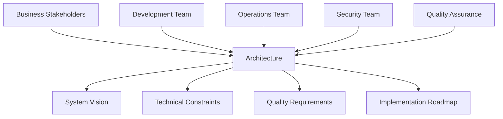

# Chapter 3: Understanding Software Architecture

> *"Architecture is about the important stuff. Whatever that is."* - Ralph Johnson

---

## Learning Objectives

By the end of this chapter, you will be able to:
- Define software architecture and distinguish it from design and implementation
- Analyze the relationship between architecture and system quality attributes
- Apply architectural thinking to solve complex system design problems
- Evaluate architectural decisions using systematic approaches
- Design architectures that balance competing requirements and constraints
- Document and communicate architectural decisions effectively

---

## Introduction: The Architect's Perspective

Software architecture represents the fundamental organization of a system, embodying the decisions that are hard to change once implemented. It's the bridge between abstract requirements and concrete code, defining how a system's components interact to achieve business objectives while satisfying quality requirements.

### What Makes Architecture Different

Architecture differs from detailed design in several key ways:

| Aspect | Architecture | Detailed Design |
|--------|-------------|-----------------|
| **Scope** | System-wide structure | Component-specific structure |
| **Focus** | Component relationships | Internal component logic |
| **Stakeholders** | Business + Technical | Primarily technical |
| **Timeframe** | Long-term stability | Short-term implementation |
| **Change Cost** | High cost to change | Lower cost to change |
| **Abstraction Level** | High-level concepts | Low-level implementation |

### The Economics of Architectural Decisions

Poor architectural decisions compound over time, creating technical debt that becomes increasingly expensive to address:

- **Initial Cost**: Architectural decisions may seem expensive upfront
- **Compounding Benefits**: Good architecture pays dividends through reduced maintenance and faster feature development
- **Change Amplification**: Architectural changes affect multiple components simultaneously
- **Opportunity Cost**: Poor architecture limits future options and capabilities

---

## 3.1 The Role of Architecture in Software Engineering

Software architecture serves as the blueprint for both the system and the project developing it. It defines the structure, behavior, and interaction of system components while providing the foundation for achieving quality attributes.

### Architecture as a Communication Tool

#### **Stakeholder Communication**
Architecture serves as a common language between different stakeholders:



#### **Decision Documentation**
Architecture captures and communicates critical decisions:

```markdown
# Architectural Decision Record (ADR)

## Title: Use Event-Driven Architecture for Order Processing

### Status: Accepted

### Context
Our e-commerce platform needs to handle complex order processing workflows 
involving inventory management, payment processing, shipping coordination, 
and customer notifications. The current synchronous approach is creating 
bottlenecks and tight coupling between services.

### Decision
We will implement an event-driven architecture using Apache Kafka as the 
message broker for order processing workflows.

### Consequences
**Positive:**
- Improved scalability and performance
- Reduced coupling between services
- Better fault tolerance and resilience
- Easier to add new processing steps

**Negative:**
- Increased complexity in debugging and monitoring
- Need for eventual consistency handling
- Additional infrastructure requirements
- Team learning curve for event-driven patterns

### Alternatives Considered
1. **Synchronous microservices** - Rejected due to coupling and performance issues
2. **Monolithic approach** - Rejected due to scalability limitations
3. **Message queues (RabbitMQ)** - Rejected due to limited scalability for our volume
```

### Architecture as a Risk Management Tool

#### **Technical Risk Mitigation**
Architecture helps identify and mitigate technical risks early:

```python
# Example: Architecture decision to mitigate single point of failure
class OrderProcessingArchitecture:
    def __init__(self):
        # Multiple payment processor integration to mitigate vendor risk
        self.payment_processors = [
            StripePaymentProcessor(),
            PayPalPaymentProcessor(),
            BraintreePaymentProcessor()
        ]
        
        # Circuit breaker pattern to handle service failures
        self.circuit_breakers = {
            'inventory_service': CircuitBreaker(failure_threshold=5),
            'payment_service': CircuitBreaker(failure_threshold=3),
            'notification_service': CircuitBreaker(failure_threshold=10)
        }
    
    def process_order(self, order):
        # Fallback processing strategy
        for processor in self.payment_processors:
            try:
                if self.circuit_breakers['payment_service'].is_closed():
                    return processor.process_payment(order.payment_info)
            except PaymentProcessorError:
                continue
        
        raise PaymentProcessingError("All payment processors unavailable")
```

#### **Business Risk Mitigation**
Architecture supports business continuity and compliance:

```yaml
# Example: Multi-region architecture for business continuity
business_continuity_architecture:
  regions:
    primary:
      location: "us-east-1"
      services: ["web", "api", "database", "cache"]
      capacity: "100%"
    
    secondary:
      location: "us-west-2"
      services: ["web", "api", "database-replica", "cache"]
      capacity: "50%"
    
    disaster_recovery:
      location: "eu-west-1"
      services: ["database-backup", "essential-services"]
      capacity: "25%"
  
  failover_strategy:
    automatic_failover: true
    rto: "15 minutes"  # Recovery Time Objective
    rpo: "5 minutes"   # Recovery Point Objective
    
  compliance_requirements:
    data_residency: "GDPR compliant"
    audit_logging: "SOX compliant"
    encryption: "AES-256 at rest and in transit"
```

### Architecture as a Quality Attribute Enabler

#### **Quality Attribute Scenarios**
Architecture enables specific quality attributes through design decisions:

```python
# Example: Architecture for high availability
class HighAvailabilityArchitecture:
    def __init__(self):
        # Load balancing for availability
        self.load_balancer = LoadBalancer(
            algorithm='round_robin',
            health_check_interval=30,
            failover_threshold=3
        )
        
        # Database clustering for data availability
        self.database_cluster = DatabaseCluster(
            primary_nodes=3,
            replica_nodes=6,
            backup_strategy='continuous'
        )
        
        # Caching for performance and availability
        self.cache_cluster = CacheCluster(
            nodes=5,
            replication_factor=2,
            eviction_policy='LRU'
        )
    
    def calculate_availability(self):
        # Calculate system availability based on component reliabilities
        lb_availability = 0.999  # Load balancer availability
        app_availability = 0.995  # Application server availability
        db_availability = 0.999   # Database cluster availability
        cache_availability = 0.997 # Cache cluster availability
        
        # Series reliability (all components must work)
        system_availability = (lb_availability * 
                             app_availability * 
                             db_availability * 
                             cache_availability)
        
        return system_availability  # ~0.990 (99.0% availability)
```

### 💡 **Vive Coding Prompt: Architecture Assessment Framework**

**Scenario**: You've been asked to create an architecture assessment framework that can be used to evaluate the quality and effectiveness of software architectures across different projects in your organization.

**Current Challenge**: Your organization has multiple development teams working on different projects with varying architectural approaches. There's no standardized way to assess architectural quality, leading to:
- Inconsistent architectural decisions across teams
- Difficulty in sharing architectural knowledge
- No clear criteria for architectural improvement
- Challenges in evaluating architectural trade-offs

**Assessment Scope**: The framework should evaluate architectures across multiple dimensions:
- Technical quality (modularity, coupling, cohesion)
- Quality attributes (performance, security, maintainability)
- Business alignment (cost, time-to-market, scalability)
- Team and organizational factors (skill requirements, development velocity)

**Your Task**:

1. **Assessment Criteria Design**:
   - Define measurable criteria for architectural quality
   - Create scoring rubrics for different architectural aspects
   - Design both quantitative and qualitative assessment methods
   - Plan for different types of systems (web apps, microservices, mobile, etc.)

2. **Evaluation Framework**:
   - Create a systematic process for conducting architectural assessments
   - Design templates and checklists for consistent evaluation
   - Plan for both self-assessment and peer review processes
   - Include stakeholder feedback mechanisms

3. **Metrics and Measurement**:
   - Define architectural metrics that can be automatically collected
   - Create manual assessment procedures for subjective qualities
   - Design trend analysis and improvement tracking
   - Plan for benchmarking against industry standards

4. **Reporting and Recommendations**:
   - Design report templates for different audiences (technical, management)
   - Create action item prioritization frameworks
   - Plan for architectural improvement roadmaps
   - Design communication strategies for assessment results

5. **Tool and Process Integration**:
   - Integrate with existing development tools and processes
   - Plan for regular assessment cycles
   - Create training materials for assessment execution
   - Design governance processes for architectural decisions

**Constraints**:
- Must work across different technology stacks
- Should integrate with existing development workflows
- Must be practical for busy development teams
- Should provide actionable insights, not just scores

**Deliverable**: 
- Complete architectural assessment framework
- Assessment templates and checklists
- Scoring rubrics and measurement criteria
- Sample assessment reports and improvement plans
- Implementation guide for rolling out across teams

---

## 3.2 Architectural Thinking and Design Process

Architectural thinking is a systematic approach to understanding and solving complex system design problems. It involves analyzing requirements, identifying constraints, making trade-offs, and designing solutions that balance competing concerns.

### The Architectural Design Process

#### **1. Requirements Analysis and Stakeholder Identification**

```python
# Example: Stakeholder requirements analysis
class ArchitecturalRequirements:
    def __init__(self):
        self.stakeholders = {}
        self.functional_requirements = []
        self.quality_attributes = {}
        self.constraints = []
    
    def add_stakeholder(self, name, role, concerns):
        self.stakeholders[name] = {
            'role': role,
            'primary_concerns': concerns,
            'influence_level': self.assess_influence(role),
            'involvement_level': self.assess_involvement(role)
        }
    
    def add_quality_attribute(self, attribute, scenarios):
        """
        Quality attribute scenarios define specific, measurable requirements
        """
        self.quality_attributes[attribute] = {
            'scenarios': scenarios,
            'priority': self.assess_priority(attribute),
            'measurable_criteria': self.define_criteria(attribute)
        }

# Example usage
requirements = ArchitecturalRequirements()

# Add stakeholders
requirements.add_stakeholder(
    "Product Manager", 
    "Business",
    ["Time to market", "Feature flexibility", "Cost efficiency"]
)

requirements.add_stakeholder(
    "Operations Team",
    "Technical",
    ["System reliability", "Monitoring capabilities", "Deployment automation"]
)

# Add quality attribute scenarios
requirements.add_quality_attribute("Performance", [
    {
        "scenario": "Normal load handling",
        "stimulus": "1000 concurrent users",
        "response": "Page load time < 2 seconds",
        "measure": "95th percentile response time"
    },
    {
        "scenario": "Peak load handling", 
        "stimulus": "5000 concurrent users",
        "response": "System remains responsive",
        "measure": "Response time < 5 seconds, no errors"
    }
])
```

#### **2. Architectural Constraint Analysis**

```python
class ArchitecturalConstraints:
    def __init__(self):
        self.technical_constraints = []
        self.business_constraints = []
        self.regulatory_constraints = []
        self.organizational_constraints = []
    
    def analyze_constraints(self):
        """
        Analyze how constraints impact architectural decisions
        """
        constraint_analysis = {
            'technology_stack': self.assess_technology_constraints(),
            'budget_limitations': self.assess_budget_constraints(),
            'compliance_requirements': self.assess_regulatory_constraints(),
            'team_capabilities': self.assess_team_constraints(),
            'time_constraints': self.assess_schedule_constraints()
        }
        
        return self.prioritize_constraints(constraint_analysis)
    
    def assess_technology_constraints(self):
        return {
            'existing_systems': "Must integrate with legacy SAP system",
            'technology_standards': "Must use approved cloud services only",
            'security_requirements': "Must meet SOC 2 Type II compliance",
            'performance_requirements': "Must handle 10,000 TPS peak load"
        }
    
    def assess_budget_constraints(self):
        return {
            'development_budget': "$500K for initial development",
            'operational_budget': "$50K/month for cloud infrastructure",
            'licensing_costs': "Prefer open-source solutions",
            'maintenance_budget': "Limited budget for ongoing maintenance"
        }
```

#### **3. Architecture Option Generation and Evaluation**

```python
class ArchitecturalOptions:
    def __init__(self):
        self.options = []
        self.evaluation_criteria = []
    
    def generate_options(self, requirements, constraints):
        """
        Generate multiple architectural options based on requirements
        """
        options = [
            self.generate_monolithic_option(requirements, constraints),
            self.generate_microservices_option(requirements, constraints),
            self.generate_serverless_option(requirements, constraints),
            self.generate_hybrid_option(requirements, constraints)
        ]
        
        return [option for option in options if option.is_feasible()]
    
    def evaluate_options(self, options, criteria):
        """
        Evaluate options against multiple criteria
        """
        evaluation_matrix = {}
        
        for option in options:
            evaluation_matrix[option.name] = {}
            
            for criterion in criteria:
                score = self.calculate_criterion_score(option, criterion)
                weight = criterion.weight
                weighted_score = score * weight
                
                evaluation_matrix[option.name][criterion.name] = {
                    'raw_score': score,
                    'weighted_score': weighted_score,
                    'rationale': self.get_evaluation_rationale(option, criterion)
                }
        
        return self.rank_options(evaluation_matrix)

# Example architectural option
class MicroservicesArchitectureOption:
    def __init__(self):
        self.name = "Microservices Architecture"
        self.description = "Decompose system into independently deployable services"
        self.components = self.define_components()
        self.benefits = self.identify_benefits()
        self.risks = self.identify_risks()
        self.costs = self.estimate_costs()
    
    def define_components(self):
        return {
            'user_service': {
                'responsibilities': ['Authentication', 'User management', 'Profiles'],
                'technology': 'Node.js + Express',
                'database': 'PostgreSQL',
                'apis': ['REST', 'GraphQL']
            },
            'order_service': {
                'responsibilities': ['Order processing', 'Order history', 'Order status'],
                'technology': 'Java + Spring Boot',
                'database': 'PostgreSQL',
                'apis': ['REST', 'Event streaming']
            },
            'payment_service': {
                'responsibilities': ['Payment processing', 'Billing', 'Refunds'],
                'technology': 'Python + Django',
                'database': 'PostgreSQL',
                'apis': ['REST', 'Webhooks']
            },
            'api_gateway': {
                'responsibilities': ['Routing', 'Authentication', 'Rate limiting'],
                'technology': 'Kong',
                'database': 'Redis',
                'apis': ['REST', 'GraphQL']
            }
        }
    
    def identify_benefits(self):
        return [
            "Independent deployment and scaling",
            "Technology diversity and team autonomy",
            "Improved fault isolation",
            "Better alignment with business domains"
        ]
    
    def identify_risks(self):
        return [
            "Increased operational complexity",
            "Network latency and reliability issues",
            "Distributed system debugging challenges",
            "Data consistency complexity"
        ]
```

### Architectural Trade-off Analysis

#### **Quality Attribute Trade-off Analysis**

```python
class QualityAttributeTradeoffs:
    def __init__(self):
        self.trade_off_matrix = self.create_trade_off_matrix()
    
    def create_trade_off_matrix(self):
        """
        Matrix showing how quality attributes affect each other
        """
        return {
            'performance': {
                'vs_security': 'Often conflicting - security measures add overhead',
                'vs_maintainability': 'Performance optimizations can reduce readability',
                'vs_portability': 'Platform-specific optimizations reduce portability'
            },
            'security': {
                'vs_usability': 'Strong security can impact user experience',
                'vs_performance': 'Encryption and validation add latency',
                'vs_availability': 'Security measures can create single points of failure'
            },
            'maintainability': {
                'vs_performance': 'Clean code may sacrifice micro-optimizations',
                'vs_cost': 'Good architecture requires upfront investment',
                'vs_time_to_market': 'Proper design takes more initial time'
            }
        }
    
    def analyze_trade_offs(self, primary_quality_attributes):
        """
        Analyze trade-offs for given quality attributes
        """
        analysis = {}
        
        for attr in primary_quality_attributes:
            analysis[attr] = {
                'supportive_patterns': self.get_supportive_patterns(attr),
                'conflicting_patterns': self.get_conflicting_patterns(attr),
                'mitigation_strategies': self.get_mitigation_strategies(attr)
            }
        
        return analysis
    
    def get_supportive_patterns(self, quality_attribute):
        patterns = {
            'performance': ['Caching', 'Load balancing', 'Database optimization'],
            'security': ['Defense in depth', 'Least privilege', 'Secure by design'],
            'maintainability': ['Modular design', 'Clean architecture', 'SOLID principles'],
            'scalability': ['Microservices', 'Event-driven architecture', 'Horizontal scaling']
        }
        return patterns.get(quality_attribute, [])
```

### 💡 **Vive Coding Prompt: Trade-off Decision Framework**

**Scenario**: You're leading the architecture design for a new financial trading platform that needs to balance multiple critical quality attributes: ultra-low latency performance, regulatory compliance, high availability, and security.

**System Requirements**:
- **Performance**: Sub-millisecond trade execution latency
- **Compliance**: Must meet MiFID II, GDPR, and SOX requirements
- **Availability**: 99.99% uptime during trading hours
- **Security**: Handle sensitive financial data and prevent fraud
- **Scalability**: Support 100,000+ concurrent users
- **Maintainability**: Easy to update for regulatory changes

**Conflicting Requirements**:
- Ultra-low latency vs. comprehensive security logging
- High availability vs. regulatory data residency requirements
- Performance optimization vs. maintainable code structure
- Real-time processing vs. audit trail completeness
- Cost efficiency vs. regulatory compliance overhead

**Your Task**:

1. **Trade-off Analysis Framework**:
   - Create a systematic approach for analyzing architectural trade-offs
   - Design criteria for evaluating trade-off decisions
   - Develop a scoring system for different architectural options
   - Plan for handling conflicting stakeholder priorities

2. **Stakeholder Alignment Process**:
   - Design a process for engaging different stakeholders in trade-off decisions
   - Create communication materials for non-technical stakeholders
   - Plan for conflict resolution when stakeholder priorities clash
   - Design approval processes for architectural decisions

3. **Architecture Option Evaluation**:
   - Generate multiple architectural options that handle trade-offs differently
   - Create detailed evaluation criteria for each quality attribute
   - Design sensitivity analysis for key architectural decisions
   - Plan for iterative refinement of architectural options

4. **Decision Documentation**:
   - Create templates for documenting architectural decisions and rationale
   - Design traceability from requirements to architectural decisions
   - Plan for decision review and revision processes
   - Create communication strategies for architectural decisions

5. **Implementation and Validation**:
   - Design prototypes to validate key architectural decisions
   - Plan for measuring and monitoring quality attributes in production
   - Create feedback loops for architectural decision effectiveness
   - Design processes for architectural evolution over time

**Constraints**:
- Regulatory requirements are non-negotiable
- System must be operational within 18 months
- Limited budget for specialized hardware
- Existing team has mixed experience with high-performance systems

**Deliverable**: 
- Comprehensive trade-off analysis framework
- Detailed evaluation of architectural options
- Stakeholder communication materials
- Decision documentation templates
- Implementation and validation plan

---

## 3.3 Architectural Views and Documentation

Effective architectural documentation communicates the architecture to different stakeholders through multiple views, each highlighting different aspects of the system. The key is to provide just enough documentation to support decision-making and system understanding without creating a maintenance burden.

### The 4+1 Architectural View Model

#### **1. Logical View - The Functionality**
The logical view describes the system's functionality and structure from the end-user's perspective:

```python
# Example: Logical view of an e-commerce system
class ECommerceLogicalView:
    def __init__(self):
        self.business_components = {
            'user_management': {
                'responsibilities': [
                    'User registration and authentication',
                    'Profile management',
                    'Preference management'
                ],
                'key_entities': ['User', 'Profile', 'Preferences'],
                'business_rules': [
                    'Users must verify email before activation',
                    'Profiles can be private or public',
                    'Users can have multiple delivery addresses'
                ]
            },
            'catalog_management': {
                'responsibilities': [
                    'Product information management',
                    'Category management',
                    'Search and filtering'
                ],
                'key_entities': ['Product', 'Category', 'Brand'],
                'business_rules': [
                    'Products must belong to at least one category',
                    'Product prices are set by sellers',
                    'Products can have multiple variants'
                ]
            },
            'order_management': {
                'responsibilities': [
                    'Shopping cart management',
                    'Order processing',
                    'Order fulfillment tracking'
                ],
                'key_entities': ['Cart', 'Order', 'OrderItem'],
                'business_rules': [
                    'Orders cannot be modified after payment',
                    'Partial shipments are allowed',
                    'Orders can be cancelled within 24 hours'
                ]
            }
        }
    
    def get_component_interactions(self):
        return {
            'user_management → catalog_management': [
                'Provide user preferences for personalized recommendations',
                'Validate user permissions for restricted products'
            ],
            'catalog_management → order_management': [
                'Provide product information for cart items',
                'Validate product availability during checkout'
            ],
            'order_management → user_management': [
                'Update user order history',
                'Provide order status notifications'
            ]
        }
```

#### **2. Development View - The Software Management**
The development view describes the system's organization from the developer's perspective:

```yaml
# Development view showing module organization
development_view:
  modules:
    presentation_layer:
      components:
        - web_ui
        - mobile_app
        - admin_console
      technologies:
        - React.js
        - React Native
        - Angular
      team_ownership: "Frontend Team"
    
    business_logic_layer:
      components:
        - user_service
        - catalog_service
        - order_service
        - payment_service
      technologies:
        - Java Spring Boot
        - Node.js Express
        - Python Flask
      team_ownership: "Backend Team"
    
    data_access_layer:
      components:
        - user_repository
        - catalog_repository
        - order_repository
      technologies:
        - JPA/Hibernate
        - MongoDB drivers
        - Redis clients
      team_ownership: "Backend Team"
    
    integration_layer:
      components:
        - api_gateway
        - message_bus
        - external_service_adapters
      technologies:
        - Kong Gateway
        - Apache Kafka
        - REST clients
      team_ownership: "Platform Team"

  build_and_deployment:
    build_tools:
      - Maven (Java services)
      - npm (Node.js services)
      - Docker (containerization)
    
    deployment_pipeline:
      - Source control (Git)
      - CI/CD (GitHub Actions)
      - Container registry (Docker Hub)
      - Orchestration (Kubernetes)
    
    testing_strategy:
      - Unit tests (JUnit, Jest)
      - Integration tests (TestContainers)
      - End-to-end tests (Cypress)
```

#### **3. Process View - The Dynamic Behavior**
The process view shows how the system behaves at runtime:

```python
# Example: Process view showing order processing workflow
class OrderProcessingWorkflow:
    def __init__(self):
        self.process_steps = [
            {
                'step': 'cart_to_order',
                'description': 'Convert shopping cart to order',
                'participants': ['Order Service', 'Catalog Service'],
                'duration': '< 500ms',
                'error_handling': 'Retry with exponential backoff'
            },
            {
                'step': 'inventory_check',
                'description': 'Verify product availability',
                'participants': ['Order Service', 'Inventory Service'],
                'duration': '< 200ms',
                'error_handling': 'Return availability error to user'
            },
            {
                'step': 'payment_processing',
                'description': 'Process payment authorization',
                'participants': ['Order Service', 'Payment Service', 'External Payment Gateway'],
                'duration': '< 3000ms',
                'error_handling': 'Implement payment retry logic'
            },
            {
                'step': 'order_confirmation',
                'description': 'Confirm order and send notifications',
                'participants': ['Order Service', 'Notification Service'],
                'duration': '< 1000ms',
                'error_handling': 'Queue notifications for retry'
            }
        ]
    
    def define_concurrency_model(self):
        return {
            'synchronous_operations': [
                'User authentication',
                'Cart validation',
                'Payment authorization'
            ],
            'asynchronous_operations': [
                'Order confirmation emails',
                'Inventory updates',
                'Analytics event publishing'
            ],
            'parallel_operations': [
                'Multiple payment method validation',
                'Shipping cost calculation',
                'Tax calculation'
            ]
        }
    
    def define_error_handling(self):
        return {
            'timeout_handling': {
                'payment_service': '30 seconds',
                'inventory_service': '10 seconds',
                'notification_service': '5 seconds'
            },
            'retry_policies': {
                'payment_processing': 'Exponential backoff, max 3 retries',
                'inventory_check': 'Immediate retry, max 2 attempts',
                'notifications': 'Queue for later processing'
            },
            'fallback_strategies': {
                'payment_failure': 'Offer alternative payment methods',
                'inventory_unavailable': 'Suggest similar products',
                'notification_failure': 'Log for manual follow-up'
            }
        }
```

#### **4. Physical View - The Deployment**
The physical view shows how software components are deployed to hardware:

```yaml
# Physical deployment view
physical_deployment:
  environments:
    production:
      regions:
        us_east:
          load_balancer:
            type: "AWS Application Load Balancer"
            instances: 2
            configuration: "High availability across AZs"
          
          web_servers:
            type: "Kubernetes pods"
            instances: 6
            resources: "2 CPU, 4GB RAM per pod"
            auto_scaling: "2-10 pods based on CPU utilization"
          
          application_servers:
            type: "Kubernetes pods"
            instances: 8
            resources: "4 CPU, 8GB RAM per pod"
            auto_scaling: "4-20 pods based on request volume"
          
          databases:
            primary:
              type: "AWS RDS PostgreSQL"
              instance: "db.r5.2xlarge"
              storage: "1TB SSD"
              backup: "Daily automated backups"
            
            read_replicas:
              count: 2
              type: "AWS RDS PostgreSQL"
              instance: "db.r5.xlarge"
          
          cache:
            type: "AWS ElastiCache Redis"
            instances: 3
            configuration: "Cluster mode with replication"
          
          message_queue:
            type: "AWS MSK (Apache Kafka)"
            brokers: 3
            topics: ["orders", "inventory", "notifications"]
        
        us_west:
          # Similar configuration for disaster recovery
          status: "Hot standby"
          capacity: "50% of primary region"

  network_architecture:
    cdn: "CloudFront with global edge locations"
    dns: "Route 53 with health checks and failover"
    security: "WAF and DDoS protection"
    monitoring: "CloudWatch and custom metrics"

  data_flow:
    user_request: "CDN → Load Balancer → Web Server → App Server → Database"
    static_assets: "CDN → S3 bucket"
    api_requests: "API Gateway → Microservices → Message Queue → Databases"
```

#### **5. Scenario View - The Use Cases**
The scenario view (the "+1") validates the other views through specific scenarios:

```python
# Example scenarios for architecture validation
class ArchitecturalScenarios:
    def __init__(self):
        self.performance_scenarios = self.define_performance_scenarios()
        self.availability_scenarios = self.define_availability_scenarios()
        self.security_scenarios = self.define_security_scenarios()
        self.maintainability_scenarios = self.define_maintainability_scenarios()
    
    def define_performance_scenarios(self):
        return [
            {
                'name': 'Peak Shopping Load',
                'description': 'Handle Black Friday traffic spike',
                'stimulus': '10x normal traffic load',
                'expected_response': 'Maintain < 2s page load times',
                'architecture_validation': [
                    'Auto-scaling configuration',
                    'Database read replica utilization',
                    'CDN cache hit rates',
                    'Load balancer distribution'
                ]
            },
            {
                'name': 'Payment Processing Load',
                'description': 'Handle concurrent payment processing',
                'stimulus': '1000 simultaneous payment requests',
                'expected_response': 'Process within 5 seconds',
                'architecture_validation': [
                    'Payment service scaling',
                    'Database connection pooling',
                    'External payment gateway limits',
                    'Queue processing capacity'
                ]
            }
        ]
    
    def define_availability_scenarios(self):
        return [
            {
                'name': 'Database Failover',
                'description': 'Primary database becomes unavailable',
                'stimulus': 'Database instance failure',
                'expected_response': 'Automatic failover within 30 seconds',
                'architecture_validation': [
                    'Read replica promotion',
                    'Connection string updates',
                    'Application reconnection logic',
                    'Data consistency verification'
                ]
            },
            {
                'name': 'Service Degradation',
                'description': 'Recommendation service becomes slow',
                'stimulus': 'Service response time > 5 seconds',
                'expected_response': 'Graceful degradation without recommendations',
                'architecture_validation': [
                    'Circuit breaker implementation',
                    'Timeout configuration',
                    'Fallback content strategy',
                    'User experience preservation'
                ]
            }
        ]
```

### Documentation Best Practices

#### **Living Documentation**
Architecture documentation should be living documents that evolve with the system:

```python
# Example: Automated architecture documentation
class ArchitectureDocumentationGenerator:
    def __init__(self):
        self.code_analyzers = [
            DependencyAnalyzer(),
            ComponentAnalyzer(),
            InterfaceAnalyzer()
        ]
        self.documentation_generators = [
            ComponentDiagramGenerator(),
            SequenceDiagramGenerator(),
            DeploymentDiagramGenerator()
        ]
    
    def generate_documentation(self, source_code_path):
        """
        Generate up-to-date architecture documentation from source code
        """
        analysis_results = self.analyze_source_code(source_code_path)
        
        documentation = {
            'component_diagram': self.generate_component_diagram(analysis_results),
            'sequence_diagrams': self.generate_sequence_diagrams(analysis_results),
            'deployment_diagram': self.generate_deployment_diagram(analysis_results),
            'interface_documentation': self.generate_interface_docs(analysis_results)
        }
        
        return documentation
    
    def analyze_source_code(self, source_path):
        """
        Analyze source code to extract architectural information
        """
        results = {}
        
        for analyzer in self.code_analyzers:
            results[analyzer.name] = analyzer.analyze(source_path)
        
        return results
```

### 💡 **Vive Coding Prompt: Architecture Documentation Strategy**

**Scenario**: Your organization is struggling with inconsistent and outdated architecture documentation across multiple projects. Teams spend significant time trying to understand existing systems, and architectural knowledge is often lost when team members leave.

**Current Problems**:
- Architecture documentation is often created after the fact
- Documentation becomes outdated quickly and is rarely maintained
- Different teams use different documentation formats and tools
- No clear process for keeping documentation current
- Difficulty onboarding new team members due to poor documentation

**Organization Context**:
- 15 development teams across 3 product lines
- Mix of legacy systems and modern microservices
- Hybrid cloud deployment (AWS, Azure, on-premises)
- Regulatory requirements for some systems (healthcare, financial)
- Agile development practices with 2-week sprints

**Your Task**:

1. **Documentation Framework Design**:
   - Create a standardized framework for architecture documentation
   - Define what should be documented for different types of systems
   - Design templates and formats that work across different project types
   - Plan for both technical and non-technical stakeholder needs

2. **Automation and Tooling Strategy**:
   - Identify opportunities for automated documentation generation
   - Design integration with existing development tools and workflows
   - Plan for documentation validation and consistency checking
   - Create processes for keeping documentation current

3. **Documentation Lifecycle Management**:
   - Design processes for creating documentation as part of development
   - Plan for documentation review and approval workflows
   - Create strategies for handling documentation evolution
   - Design governance processes for architectural documentation

4. **Team Adoption and Training**:
   - Create training materials for effective architecture documentation
   - Design incentive structures for maintaining documentation quality
   - Plan for documentation quality assessment and improvement
   - Create communities of practice for documentation excellence

5. **Measurement and Improvement**:
   - Define metrics for documentation quality and usefulness
   - Design feedback mechanisms from documentation consumers
   - Plan for continuous improvement of documentation processes
   - Create success criteria for the documentation initiative

**Constraints**:
- Must work with existing development tools and processes
- Cannot significantly slow down development velocity
- Must accommodate different team sizes and technical capabilities
- Should leverage existing expertise and avoid vendor lock-in

**Deliverable**: 
- Comprehensive architecture documentation framework
- Automated documentation generation tools and processes
- Team training and adoption materials
- Governance and lifecycle management procedures
- Success metrics and improvement plans

---

## Chapter Summary

Understanding software architecture is fundamental to building systems that meet both current requirements and future needs. Architecture serves as the foundation for system quality, team communication, and long-term maintainability.

### Key Architectural Concepts

1. **Architecture as Foundation**: Architecture provides the structural foundation that determines system capabilities and constraints
2. **Stakeholder Communication**: Architecture serves as a common language for communicating complex technical concepts to diverse stakeholders
3. **Quality Attribute Enablement**: Architectural decisions directly impact system quality attributes like performance, security, and maintainability
4. **Trade-off Management**: Architecture is fundamentally about making informed trade-offs between competing requirements and constraints
5. **Multiple Perspectives**: Effective architecture requires considering multiple views and perspectives of the system

### The Architectural Design Process

| Phase | Key Activities | Deliverables |
|-------|---------------|-------------|
| **Requirements Analysis** | Stakeholder identification, quality attribute scenarios | Requirements specification, stakeholder analysis |
| **Constraint Analysis** | Technical, business, and organizational constraints | Constraint documentation, impact analysis |
| **Option Generation** | Multiple architectural approaches | Architectural options, trade-off analysis |
| **Evaluation and Selection** | Systematic evaluation against criteria | Architecture decision, rationale documentation |
| **Documentation** | Multiple views, scenario validation | Architecture documentation, decision records |

### Architectural Views and Documentation

The 4+1 view model provides a comprehensive framework for documenting architecture:
- **Logical View**: System functionality and structure
- **Development View**: Software organization and team structure
- **Process View**: Runtime behavior and dynamic aspects
- **Physical View**: Deployment and infrastructure
- **Scenario View**: Use cases that validate other views

### Best Practices for Architectural Work

#### **Decision Making**
- Make decisions based on explicit trade-off analysis
- Document decisions with clear rationale
- Validate decisions through prototyping and testing
- Review and revise decisions as new information emerges

#### **Communication**
- Use multiple views to address different stakeholder concerns
- Keep documentation focused and actionable
- Automate documentation generation where possible
- Maintain documentation as a living artifact

#### **Quality Focus**
- Design for quality attributes from the beginning
- Use architectural patterns and styles appropriately
- Validate architecture against quality scenarios
- Monitor and measure quality attributes in production

### Looking Forward

Software architecture continues to evolve with new technologies and practices:
- **Cloud-Native Architecture**: Microservices, containers, and serverless computing
- **Event-Driven Architecture**: Asynchronous communication and event streaming
- **AI/ML Integration**: Incorporating artificial intelligence and machine learning capabilities
- **Security by Design**: Building security into architectural foundations
- **Sustainability**: Designing for energy efficiency and environmental impact

The principles and practices covered in this chapter provide a foundation for understanding these evolving architectural approaches and making informed decisions about system design.

---

## Further Reading

- **Next Chapter**: Common Architectural Patterns and Styles - Explore proven patterns for structuring software systems
- **Recommended Books**:
  - *Software Architecture in Practice* by Len Bass, Paul Clements, and Rick Kazman
  - *Clean Architecture* by Robert C. Martin
  - *Building Microservices* by Sam Newman
  - *Fundamentals of Software Architecture* by Mark Richards and Neal Ford
- **Online Resources**:
  - Software Architecture Guide (Martin Fowler)
  - Architecture Decision Records (ADR) templates
  - Cloud architecture frameworks (AWS Well-Architected, Azure Architecture Framework)
  - Open Group Architecture Framework (TOGAF) 