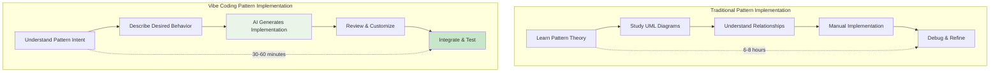
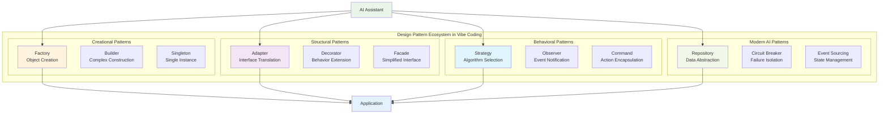
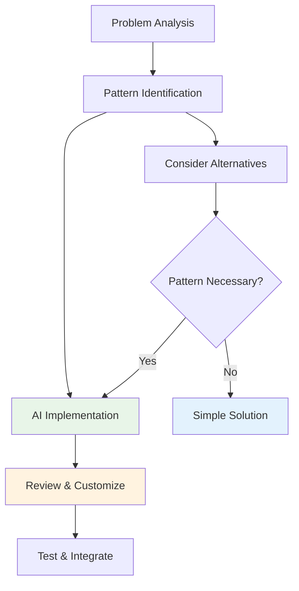

# Chapter 3: Design Patterns for AI-Assisted Development

> *"Each pattern describes a problem which occurs over and over again in our environment, and then describes the core of the solution to that problem, in such a way that you can use this solution a million times over, without ever doing it the same way twice."* - Christopher Alexander

---

## Learning Objectives

By the end of this chapter, you will be able to:
- Apply classic design patterns using AI-assisted code generation
- Implement modern patterns optimized for AI-driven development
- Use natural language prompts to generate pattern-based solutions
- Refactor legacy code using AI-powered pattern recognition
- Design systems that leverage both human architectural insight and AI implementation capabilities

---

## Introduction: Patterns Meet AI

Design patterns have been the backbone of software engineering for decades, providing reusable solutions to common problems. With the advent of vibe coding and AI assistance, patterns haven't become obsolete—they've become supercharged. This chapter explores how artificial intelligence transforms pattern implementation while preserving their fundamental value in creating well-structured software.

The marriage of design patterns and AI assistance represents a paradigm shift: developers can now focus on **pattern selection and architectural decisions** while AI handles the **implementation complexity and boilerplate code**. This doesn't diminish the importance of understanding patterns—it amplifies their value by making them more accessible and faster to implement correctly.

---

## 3.1 Design Patterns in the Vibe Coding Era

### Evolution of Pattern Implementation

Traditional pattern implementation required deep understanding of structure and careful manual coding. Vibe coding transforms this by allowing developers to focus on **pattern intent** while AI handles **pattern implementation**.



### Pattern Categories for AI Development



| Pattern Type | AI Assistance Level | Primary Benefits | Best Use Cases |
|--------------|-------------------|------------------|----------------|
| **Creational** | ⭐⭐⭐⭐⭐ | Rapid object creation, type safety | Factory methods, complex builders |
| **Structural** | ⭐⭐⭐⭐⭐ | Component composition, API adaptation | Legacy integration, service layers |
| **Behavioral** | ⭐⭐⭐⭐ | Algorithm flexibility, event handling | Strategy selection, reactive systems |
| **Concurrency** | ⭐⭐⭐⭐ | Thread safety, performance | Async operations, resource pools |
| **AI-Specific** | ⭐⭐⭐ (Emerging) | Model management, observability | ML pipelines, prompt optimization |

---

## 3.2 Creational Patterns with AI

### Factory Pattern: AI-Enhanced Object Creation

The Factory pattern encapsulates object creation logic. With AI, we can generate sophisticated factories from simple descriptions.

#### **💡 Vibe Coding Prompt: Factory Pattern Implementation**

```
I need a factory pattern for creating different types of data processors in my analytics system. Generate a factory that:

**Requirements**:
- Creates CSV, JSON, XML, and Parquet processors
- Each processor has different parsing strategies
- Include configuration options for each processor type
- Support for adding new processor types easily
- Proper error handling for unsupported types

**Context**:
- Using TypeScript
- Processors need to implement a common interface
- Configuration should be type-safe
- Factory should be easily testable

Generate the complete implementation including:
1. Processor interface definition
2. Concrete processor implementations
3. Factory class with type safety
4. Configuration objects
5. Unit tests for the factory
6. Usage examples

Make it production-ready with proper error handling and documentation.
```

**AI-Generated Implementation**:

```typescript
// Processor interface
interface DataProcessor {
  parse(data: string): Promise<any[]>;
  validate(data: string): boolean;
  getMetadata(): ProcessorMetadata;
}

interface ProcessorMetadata {
  type: string;
  version: string;
  supportedExtensions: string[];
}

// Configuration types
interface ProcessorConfig {
  delimiter?: string;
  encoding?: string;
  skipHeader?: boolean;
  maxRows?: number;
}

interface CSVConfig extends ProcessorConfig {
  delimiter: string;
  quoteChar?: string;
  escapeChar?: string;
}

interface JSONConfig extends ProcessorConfig {
  parseMode: 'array' | 'object' | 'lines';
  strictMode?: boolean;
}

// Concrete implementations
class CSVProcessor implements DataProcessor {
  constructor(private config: CSVConfig) {}
  
  async parse(data: string): Promise<any[]> {
    // AI-generated CSV parsing logic
    const lines = data.split('\n');
    const delimiter = this.config.delimiter;
    
    if (this.config.skipHeader && lines.length > 0) {
      lines.shift();
    }
    
    return lines.map(line => {
      const values = line.split(delimiter);
      return values.map(val => val.trim());
    }).filter(row => row.length > 1);
  }
  
  validate(data: string): boolean {
    try {
      const lines = data.split('\n');
      return lines.every(line => 
        line.split(this.config.delimiter).length > 0
      );
    } catch {
      return false;
    }
  }
  
  getMetadata(): ProcessorMetadata {
    return {
      type: 'CSV',
      version: '1.0.0',
      supportedExtensions: ['.csv', '.tsv']
    };
  }
}

class JSONProcessor implements DataProcessor {
  constructor(private config: JSONConfig) {}
  
  async parse(data: string): Promise<any[]> {
    try {
      const parsed = JSON.parse(data);
      return Array.isArray(parsed) ? parsed : [parsed];
    } catch (error) {
      throw new Error(`JSON parsing failed: ${error.message}`);
    }
  }
  
  validate(data: string): boolean {
    try {
      JSON.parse(data);
      return true;
    } catch {
      return false;
    }
  }
  
  getMetadata(): ProcessorMetadata {
    return {
      type: 'JSON',
      version: '1.0.0',
      supportedExtensions: ['.json', '.jsonl']
    };
  }
}

// Factory implementation
type ProcessorType = 'csv' | 'json' | 'xml' | 'parquet';

class DataProcessorFactory {
  private static processors = new Map<ProcessorType, new (config: any) => DataProcessor>([
    ['csv', CSVProcessor],
    ['json', JSONProcessor],
    // ['xml', XMLProcessor],    // Placeholder for future implementation
    // ['parquet', ParquetProcessor] // Placeholder for future implementation
  ]);
  
  static createProcessor(
    type: ProcessorType,
    config: ProcessorConfig = {}
  ): DataProcessor {
    const ProcessorClass = this.processors.get(type);
    
    if (!ProcessorClass) {
      throw new Error(`Unsupported processor type: ${type}`);
    }
    
    return new ProcessorClass(config);
  }
  
  static getSupportedTypes(): ProcessorType[] {
    return Array.from(this.processors.keys());
  }
  
  static registerProcessor(
    type: ProcessorType,
    processorClass: new (config: any) => DataProcessor
  ): void {
    this.processors.set(type, processorClass);
  }
}

// Usage examples
const csvProcessor = DataProcessorFactory.createProcessor('csv', {
  delimiter: ',',
  skipHeader: true
});

const jsonProcessor = DataProcessorFactory.createProcessor('json', {
  parseMode: 'array'
});

// Unit tests
describe('DataProcessorFactory', () => {
  test('creates CSV processor with correct configuration', () => {
    const processor = DataProcessorFactory.createProcessor('csv', {
      delimiter: ';',
      skipHeader: true
    });
    
    expect(processor).toBeInstanceOf(CSVProcessor);
    expect(processor.getMetadata().type).toBe('CSV');
  });
  
  test('throws error for unsupported processor type', () => {
    expect(() => {
      DataProcessorFactory.createProcessor('unsupported' as ProcessorType, {});
    }).toThrow('Unsupported processor type: unsupported');
  });
  
  test('allows registration of new processor types', () => {
    class CustomProcessor implements DataProcessor {
      async parse(data: string) { return []; }
      validate(data: string) { return true; }
      getMetadata() { return { type: 'Custom', version: '1.0.0', supportedExtensions: [] }; }
    }
    
    DataProcessorFactory.registerProcessor('custom' as ProcessorType, CustomProcessor);
    const processor = DataProcessorFactory.createProcessor('custom' as ProcessorType, {});
    
    expect(processor).toBeInstanceOf(CustomProcessor);
  });
});
```

### Builder Pattern: Complex Object Construction

The Builder pattern is perfect for AI generation when dealing with complex object construction.

#### **💡 Vibe Coding Prompt: Builder Pattern for Configuration**

```
Create a Builder pattern for constructing complex API client configurations. Generate:

**Configuration Requirements**:
- Base URL and API version
- Authentication (API key, OAuth, JWT)
- Request/response interceptors
- Retry policies with backoff strategies
- Timeout configurations
- Custom headers and middleware
- Caching strategies

**Features Needed**:
- Fluent interface for method chaining
- Validation of required fields
- Default values for common configurations
- Type safety throughout the build process
- Builder reset functionality
- Immutable final configuration object

Generate complete TypeScript implementation with tests and usage examples.
```

---

## 3.3 Structural Patterns with AI

### Adapter Pattern: Bridging Incompatible Interfaces

The Adapter pattern is particularly useful in modern development where we often need to integrate with legacy systems or third-party APIs.

#### **Real-World Example: Payment Gateway Adapter**

```typescript
// AI-generated adapter for multiple payment gateways
// Prompt: "Create adapters for Stripe, PayPal, and Square payment gateways with a unified interface"

interface PaymentGateway {
  processPayment(amount: number, currency: string, cardToken: string): Promise<PaymentResult>;
  refundPayment(transactionId: string, amount?: number): Promise<RefundResult>;
  getTransactionStatus(transactionId: string): Promise<TransactionStatus>;
}

interface PaymentResult {
  success: boolean;
  transactionId: string;
  amount: number;
  currency: string;
  timestamp: Date;
  gatewayResponse?: any;
}

// Stripe adapter
class StripeAdapter implements PaymentGateway {
  constructor(private stripeClient: any) {}
  
  async processPayment(amount: number, currency: string, cardToken: string): Promise<PaymentResult> {
    try {
      const paymentIntent = await this.stripeClient.paymentIntents.create({
        amount: amount * 100, // Stripe uses cents
        currency: currency.toLowerCase(),
        payment_method: cardToken,
        confirm: true
      });
      
      return {
        success: paymentIntent.status === 'succeeded',
        transactionId: paymentIntent.id,
        amount,
        currency,
        timestamp: new Date(),
        gatewayResponse: paymentIntent
      };
    } catch (error) {
      return {
        success: false,
        transactionId: '',
        amount,
        currency,
        timestamp: new Date(),
        gatewayResponse: error
      };
    }
  }
  
  async refundPayment(transactionId: string, amount?: number): Promise<RefundResult> {
    const refund = await this.stripeClient.refunds.create({
      payment_intent: transactionId,
      amount: amount ? amount * 100 : undefined
    });
    
    return {
      success: refund.status === 'succeeded',
      refundId: refund.id,
      amount: refund.amount / 100,
      originalTransactionId: transactionId
    };
  }
  
  async getTransactionStatus(transactionId: string): Promise<TransactionStatus> {
    const paymentIntent = await this.stripeClient.paymentIntents.retrieve(transactionId);
    return {
      transactionId,
      status: paymentIntent.status,
      amount: paymentIntent.amount / 100,
      currency: paymentIntent.currency
    };
  }
}

// PayPal adapter with different API structure
class PayPalAdapter implements PaymentGateway {
  constructor(private paypalClient: any) {}
  
  async processPayment(amount: number, currency: string, cardToken: string): Promise<PaymentResult> {
    // PayPal has different API structure - adapter normalizes it
    const request = {
      intent: 'CAPTURE',
      purchase_units: [{
        amount: {
          currency_code: currency,
          value: amount.toString()
        }
      }],
      payment_source: {
        card: { vault_id: cardToken }
      }
    };
    
    const order = await this.paypalClient.orders.create(request);
    const capture = await this.paypalClient.orders.capture(order.id);
    
    return {
      success: capture.status === 'COMPLETED',
      transactionId: capture.id,
      amount,
      currency,
      timestamp: new Date(),
      gatewayResponse: capture
    };
  }
  
  // ... other methods adapted for PayPal API
}

// Factory to create appropriate adapter
class PaymentGatewayFactory {
  static createGateway(provider: 'stripe' | 'paypal' | 'square', config: any): PaymentGateway {
    switch (provider) {
      case 'stripe':
        return new StripeAdapter(config.client);
      case 'paypal':
        return new PayPalAdapter(config.client);
      default:
        throw new Error(`Unsupported payment provider: ${provider}`);
    }
  }
}
```

### Decorator Pattern: Adding Behavior Dynamically

The Decorator pattern is excellent for AI generation because it follows a clear compositional structure.

#### **💡 Vibe Coding Prompt: Service Decorators**

```
Create a decorator pattern for enhancing HTTP services with cross-cutting concerns. Generate decorators for:

**Decorator Types**:
- Logging (request/response logging)
- Caching (Redis-based response caching)
- Retry (exponential backoff retry logic)
- Rate limiting (token bucket algorithm)
- Authentication (automatic token refresh)
- Metrics (performance monitoring)
- Circuit breaker (failure protection)

**Requirements**:
- Decorators should be composable
- Each decorator should be independently testable
- Support both sync and async operations
- Type-safe decorator chaining
- Configuration options for each decorator
- Proper error handling and propagation

Generate TypeScript implementation with full test coverage.
```

---

## 3.4 Behavioral Patterns with AI

### Strategy Pattern: Algorithm Encapsulation

The Strategy pattern is perfect for AI implementation because it encapsulates algorithms behind a common interface.

#### **AI-Generated Sorting Strategy Example**

```typescript
// Prompt: "Generate a strategy pattern for different sorting algorithms with performance characteristics"

interface SortingStrategy<T> {
  sort(array: T[], compareFn?: (a: T, b: T) => number): T[];
  getTimeComplexity(): string;
  getSpaceComplexity(): string;
  getBestUseCase(): string;
}

class QuickSortStrategy<T> implements SortingStrategy<T> {
  sort(array: T[], compareFn: (a: T, b: T) => number = (a, b) => a < b ? -1 : 1): T[] {
    if (array.length <= 1) return [...array];
    
    const pivot = array[Math.floor(array.length / 2)];
    const left = array.filter(x => compareFn(x, pivot) < 0);
    const middle = array.filter(x => compareFn(x, pivot) === 0);
    const right = array.filter(x => compareFn(x, pivot) > 0);
    
    return [
      ...this.sort(left, compareFn),
      ...middle,
      ...this.sort(right, compareFn)
    ];
  }
  
  getTimeComplexity(): string { return 'O(n log n) average, O(n²) worst'; }
  getSpaceComplexity(): string { return 'O(log n)'; }
  getBestUseCase(): string { return 'General purpose, good cache performance'; }
}

class MergeSortStrategy<T> implements SortingStrategy<T> {
  sort(array: T[], compareFn: (a: T, b: T) => number = (a, b) => a < b ? -1 : 1): T[] {
    if (array.length <= 1) return [...array];
    
    const mid = Math.floor(array.length / 2);
    const left = this.sort(array.slice(0, mid), compareFn);
    const right = this.sort(array.slice(mid), compareFn);
    
    return this.merge(left, right, compareFn);
  }
  
  private merge(left: T[], right: T[], compareFn: (a: T, b: T) => number): T[] {
    const result: T[] = [];
    let leftIndex = 0, rightIndex = 0;
    
    while (leftIndex < left.length && rightIndex < right.length) {
      if (compareFn(left[leftIndex], right[rightIndex]) <= 0) {
        result.push(left[leftIndex++]);
      } else {
        result.push(right[rightIndex++]);
      }
    }
    
    return result.concat(left.slice(leftIndex), right.slice(rightIndex));
  }
  
  getTimeComplexity(): string { return 'O(n log n) guaranteed'; }
  getSpaceComplexity(): string { return 'O(n)'; }
  getBestUseCase(): string { return 'Stable sort, consistent performance'; }
}

class SortingContext<T> {
  private strategy: SortingStrategy<T>;
  
  constructor(strategy: SortingStrategy<T>) {
    this.strategy = strategy;
  }
  
  setStrategy(strategy: SortingStrategy<T>): void {
    this.strategy = strategy;
  }
  
  sort(array: T[], compareFn?: (a: T, b: T) => number): T[] {
    console.log(`Using ${this.strategy.constructor.name}`);
    console.log(`Time complexity: ${this.strategy.getTimeComplexity()}`);
    
    const startTime = performance.now();
    const result = this.strategy.sort(array, compareFn);
    const endTime = performance.now();
    
    console.log(`Sorted ${array.length} items in ${endTime - startTime}ms`);
    return result;
  }
  
  getStrategyInfo(): { complexity: string; useCase: string } {
    return {
      complexity: this.strategy.getTimeComplexity(),
      useCase: this.strategy.getBestUseCase()
    };
  }
}

// Usage with AI-recommended strategy selection
class SortingStrategySelector {
  static selectBestStrategy<T>(arraySize: number, dataType: 'numbers' | 'strings' | 'objects'): SortingStrategy<T> {
    if (arraySize < 50) {
      return new InsertionSortStrategy<T>(); // Best for small arrays
    } else if (arraySize < 1000) {
      return new QuickSortStrategy<T>(); // Good general purpose
    } else {
      return new MergeSortStrategy<T>(); // Stable for large arrays
    }
  }
}
```

### Observer Pattern: Event-Driven Communication

The Observer pattern is crucial for modern reactive applications and works excellently with AI generation.

#### **💡 Vibe Coding Prompt: Event System Implementation**

```
Create a robust Observer pattern implementation for a real-time notification system. Generate:

**Observer Features**:
- Type-safe event definitions
- Async event handlers with error isolation
- Event prioritization and filtering
- Weak references to prevent memory leaks
- Event replay and history
- Performance monitoring and debugging

**Event Types to Support**:
- User actions (login, logout, profile update)
- System events (error, warning, info)
- Business events (order placed, payment processed)
- Real-time events (chat message, status update)

**Requirements**:
- TypeScript with full type safety
- Support for both one-time and persistent observers
- Event middleware support
- Debugging and logging capabilities
- Unit tests with mock scenarios
- Performance benchmarks

Generate production-ready code with comprehensive documentation.
```

#### **AI-Generated Observer Implementation**

```typescript
// Type-safe event system
interface DomainEvent {
  type: string;
  timestamp: Date;
  source: string;
  data: any;
}

interface EventHandler<T extends DomainEvent> {
  handle(event: T): Promise<void>;
  priority: number;
  once?: boolean;
}

class TypedEventEmitter {
  private handlers = new Map<string, Set<EventHandler<any>>>();
  private eventHistory: DomainEvent[] = [];
  private metrics = {
    eventsEmitted: 0,
    handlersExecuted: 0,
    errors: 0
  };

  subscribe<T extends DomainEvent>(
    eventType: string,
    handler: EventHandler<T>
  ): () => void {
    if (!this.handlers.has(eventType)) {
      this.handlers.set(eventType, new Set());
    }
    
    this.handlers.get(eventType)!.add(handler);
    
    // Return unsubscribe function
    return () => {
      const eventHandlers = this.handlers.get(eventType);
      if (eventHandlers) {
        eventHandlers.delete(handler);
        if (eventHandlers.size === 0) {
          this.handlers.delete(eventType);
        }
      }
    };
  }

  async emit<T extends DomainEvent>(event: T): Promise<void> {
    this.metrics.eventsEmitted++;
    this.eventHistory.push(event);
    
    // Keep only last 1000 events
    if (this.eventHistory.length > 1000) {
      this.eventHistory.shift();
    }

    const handlers = this.handlers.get(event.type);
    if (!handlers || handlers.size === 0) {
      return;
    }

    // Sort handlers by priority
    const sortedHandlers = Array.from(handlers).sort((a, b) => b.priority - a.priority);
    
    // Execute handlers concurrently with error isolation
    const promises = sortedHandlers.map(async (handler) => {
      try {
        this.metrics.handlersExecuted++;
        await handler.handle(event);
        
        // Remove one-time handlers
        if (handler.once) {
          handlers.delete(handler);
        }
      } catch (error) {
        this.metrics.errors++;
        console.error(`Event handler failed for ${event.type}:`, error);
        // Don't let one handler failure affect others
      }
    });

    await Promise.allSettled(promises);
  }

  getMetrics() {
    return { ...this.metrics };
  }

  getEventHistory(eventType?: string): DomainEvent[] {
    return eventType 
      ? this.eventHistory.filter(e => e.type === eventType)
      : [...this.eventHistory];
  }
}

// Usage examples with different event types
interface UserLoginEvent extends DomainEvent {
  type: 'user.login';
  data: {
    userId: string;
    email: string;
    loginMethod: 'password' | 'oauth' | 'sso';
  };
}

interface OrderPlacedEvent extends DomainEvent {
  type: 'order.placed';
  data: {
    orderId: string;
    customerId: string;
    totalAmount: number;
    items: Array<{ productId: string; quantity: number }>;
  };
}

// Event handlers
class EmailNotificationHandler implements EventHandler<UserLoginEvent> {
  priority = 5;
  
  async handle(event: UserLoginEvent): Promise<void> {
    console.log(`Sending welcome email to ${event.data.email}`);
    // Email sending logic here
  }
}

class SecurityAuditHandler implements EventHandler<UserLoginEvent> {
  priority = 10; // Higher priority for security
  
  async handle(event: UserLoginEvent): Promise<void> {
    console.log(`Logging security event for user ${event.data.userId}`);
    // Security logging logic here
  }
}

class InventoryUpdateHandler implements EventHandler<OrderPlacedEvent> {
  priority = 8;
  
  async handle(event: OrderPlacedEvent): Promise<void> {
    console.log(`Updating inventory for order ${event.data.orderId}`);
    // Inventory update logic here
  }
}

// Usage
const eventEmitter = new TypedEventEmitter();

// Subscribe to events
const unsubscribeEmail = eventEmitter.subscribe('user.login', new EmailNotificationHandler());
const unsubscribeSecurity = eventEmitter.subscribe('user.login', new SecurityAuditHandler());
const unsubscribeInventory = eventEmitter.subscribe('order.placed', new InventoryUpdateHandler());

// Emit events
await eventEmitter.emit({
  type: 'user.login',
  timestamp: new Date(),
  source: 'auth-service',
  data: {
    userId: 'user-123',
    email: 'user@example.com',
    loginMethod: 'password'
  }
} as UserLoginEvent);

await eventEmitter.emit({
  type: 'order.placed',
  timestamp: new Date(),
  source: 'order-service',
  data: {
    orderId: 'order-456',
    customerId: 'user-123',
    totalAmount: 99.99,
    items: [{ productId: 'prod-789', quantity: 2 }]
  }
} as OrderPlacedEvent);

// Check metrics
console.log('Event system metrics:', eventEmitter.getMetrics());
```
- Async event handlers
- Event prioritization
- Error handling and isolation
- Event filtering and conditions
- Weak references to prevent memory leaks
- Event replay and history
- Performance monitoring

**Event Types to Support**:
- User actions (login, logout, profile update)
- System events (error, warning, info)
- Business events (order placed, payment processed)
- Real-time events (chat message, status update)

**Requirements**:
- TypeScript with full type safety
- Support for both one-time and persistent observers
- Event middleware support
- Debugging and logging capabilities
- Unit tests with mock scenarios
- Performance benchmarks

Generate production-ready code with comprehensive documentation.
```

---

## 3.5 Modern Patterns for AI Development

### Repository Pattern: Data Access Abstraction

Essential for AI applications that need to manage various data sources.

```typescript
// AI-generated repository pattern for multi-source data access
interface Repository<T, K> {
  findById(id: K): Promise<T | null>;
  findAll(filter?: Partial<T>): Promise<T[]>;
  create(entity: Omit<T, 'id'>): Promise<T>;
  update(id: K, updates: Partial<T>): Promise<T | null>;
  delete(id: K): Promise<boolean>;
}

// AI-generated implementation with caching and monitoring
class CachedRepository<T extends { id: K }, K> implements Repository<T, K> {
  private cache = new Map<K, T>();
  private metrics = {
    hits: 0,
    misses: 0,
    operations: 0
  };
  
  constructor(
    private dataSource: Repository<T, K>,
    private cacheTimeout: number = 300000 // 5 minutes
  ) {}
  
  async findById(id: K): Promise<T | null> {
    this.metrics.operations++;
    
    if (this.cache.has(id)) {
      this.metrics.hits++;
      return this.cache.get(id)!;
    }
    
    this.metrics.misses++;
    const entity = await this.dataSource.findById(id);
    
    if (entity) {
      this.cache.set(id, entity);
      setTimeout(() => this.cache.delete(id), this.cacheTimeout);
    }
    
    return entity;
  }
  
  getCacheStats() {
    return {
      ...this.metrics,
      hitRate: this.metrics.hits / this.metrics.operations
    };
  }
  
  // ... other methods with similar caching logic
}
```

### Command Pattern: Action Encapsulation

Perfect for implementing undo/redo functionality and request queuing.

```typescript
// AI-generated command pattern for document editing
interface Command {
  execute(): Promise<void>;
  undo(): Promise<void>;
  canUndo(): boolean;
  getDescription(): string;
}

class DocumentEditor {
  private history: Command[] = [];
  private currentPosition = -1;
  
  async executeCommand(command: Command): Promise<void> {
    await command.execute();
    
    // Remove any commands after current position (for redo functionality)
    this.history = this.history.slice(0, this.currentPosition + 1);
    this.history.push(command);
    this.currentPosition++;
  }
  
  async undo(): Promise<boolean> {
    if (this.currentPosition >= 0) {
      const command = this.history[this.currentPosition];
      if (command.canUndo()) {
        await command.undo();
        this.currentPosition--;
        return true;
      }
    }
    return false;
  }
  
  async redo(): Promise<boolean> {
    if (this.currentPosition < this.history.length - 1) {
      this.currentPosition++;
      const command = this.history[this.currentPosition];
      await command.execute();
      return true;
    }
    return false;
  }
}
```

---

## 3.6 Anti-Patterns and Best Practices

### Common AI-Generated Anti-Patterns

1. **Over-Engineering**: AI might generate overly complex solutions
2. **God Objects**: AI might combine too many responsibilities
3. **Inappropriate Pattern Usage**: Using patterns where simple solutions suffice
4. **Poor Error Handling**: Generated code might lack robust error handling

### Best Practices for AI Pattern Implementation

#### **Pattern Selection Guidelines**

```javascript
// Use this prompt template for pattern selection
const patternSelectionPrompt = `
I need to solve a design problem and want to choose the most appropriate design pattern.

Problem Description: [DESCRIBE YOUR SPECIFIC PROBLEM]

Context:
- Programming language: [LANGUAGE]
- System constraints: [CONSTRAINTS]
- Performance requirements: [REQUIREMENTS]
- Team expertise level: [EXPERTISE]

Please analyze and recommend:

1. **Pattern Recommendations**:
   - Which design patterns would solve this problem?
   - Why each pattern is or isn't suitable
   - Trade-offs for each option

2. **Implementation Guidance**:
   - Provide step-by-step implementation for the best pattern
   - Include error handling and edge cases
   - Show how to test the pattern implementation

3. **Alternatives Analysis**:
   - Could this be solved without a pattern?
   - What are the simpler alternatives?
   - When would the pattern become necessary?

Focus on practical, maintainable solutions rather than over-engineering.
`;
```

---

## Chapter Summary

Design patterns in the vibe coding era offer powerful leverage for creating robust, maintainable software. This chapter demonstrated how AI assistance transforms pattern implementation from hours of manual coding to minutes of intent-driven generation.

### Key Learnings

| Pattern Category | AI Assistance Level | Primary Benefits |
|------------------|-------------------|------------------|
| **Creational** | High | Rapid factory and builder generation |
| **Structural** | Very High | Complex adapter and decorator creation |
| **Behavioral** | Medium-High | Strategy and observer implementations |
| **Modern** | Emerging | Repository and command patterns for AI systems |

### The Vibe Coding Advantage

**Traditional Pattern Development**:
- 6-8 hours to fully implement and test a complex pattern
- Risk of implementation errors and missed edge cases
- Time spent on boilerplate rather than design decisions

**AI-Assisted Pattern Development**:
- 30-60 minutes from concept to tested implementation
- Comprehensive error handling and best practices included
- Focus on architectural decisions and pattern selection

### Pattern Selection Framework



### Best Practices for AI Pattern Implementation

1. **Start with Intent**: Clearly describe the problem you're solving
2. **Provide Context**: Include technical constraints and requirements
3. **Review Generated Code**: Always validate AI suggestions for appropriateness
4. **Test Thoroughly**: Generate comprehensive tests for pattern implementations
5. **Document Decisions**: Maintain clear rationale for pattern choices

### Integration with Other Chapters

Design patterns support the principles covered throughout this book:

- **Chapter 5 Principles**: Patterns naturally embody SOLID, DRY, and other design principles
- **Chapter 7 Architecture**: Patterns form the building blocks of larger architectural decisions
- **Chapter 6 Testing**: Well-implemented patterns are inherently more testable

### 💡 **Final Vibe Coding Exercise**

Before moving to the next chapter, practice with this comprehensive prompt:

```
Create a complete notification system using multiple design patterns. The system should:

**Requirements**:
- Support email, SMS, push notifications, and in-app messages
- Allow decorating notifications with retry, logging, and analytics
- Use strategy pattern for different delivery mechanisms
- Implement observer pattern for event-driven notifications
- Include factory for creating notification instances

**Quality Standards**:
- Full TypeScript type safety
- Comprehensive error handling
- Unit tests for all components
- Performance monitoring
- Extensible architecture for new notification types

Generate a production-ready system with documentation explaining how each pattern contributes to the overall architecture.
```

### Looking Forward

The next chapter builds on these pattern foundations to explore software architecture at the system level. Understanding how individual patterns compose into larger architectural decisions is crucial for designing scalable, maintainable systems.

---

## Further Reading

- **Next Chapter**: Understanding Software Architecture - Learn how design patterns scale to system-level decisions
- **Pattern Resources**:
  - *Design Patterns* by Gang of Four (foundational patterns)
  - *Head First Design Patterns* by Freeman & Robson (practical examples)
  - *Patterns of Enterprise Application Architecture* by Martin Fowler
- **AI Development**:
  - Explore pattern libraries in your preferred AI coding assistant
  - Practice with increasingly complex pattern combinations
  - Build a personal collection of tested pattern implementations 