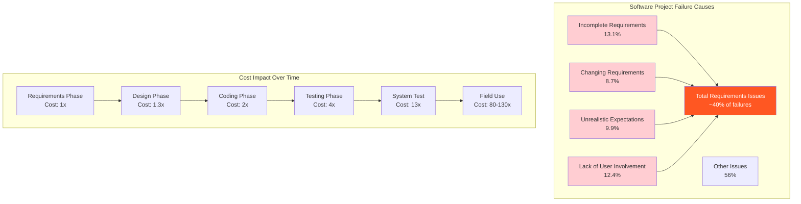
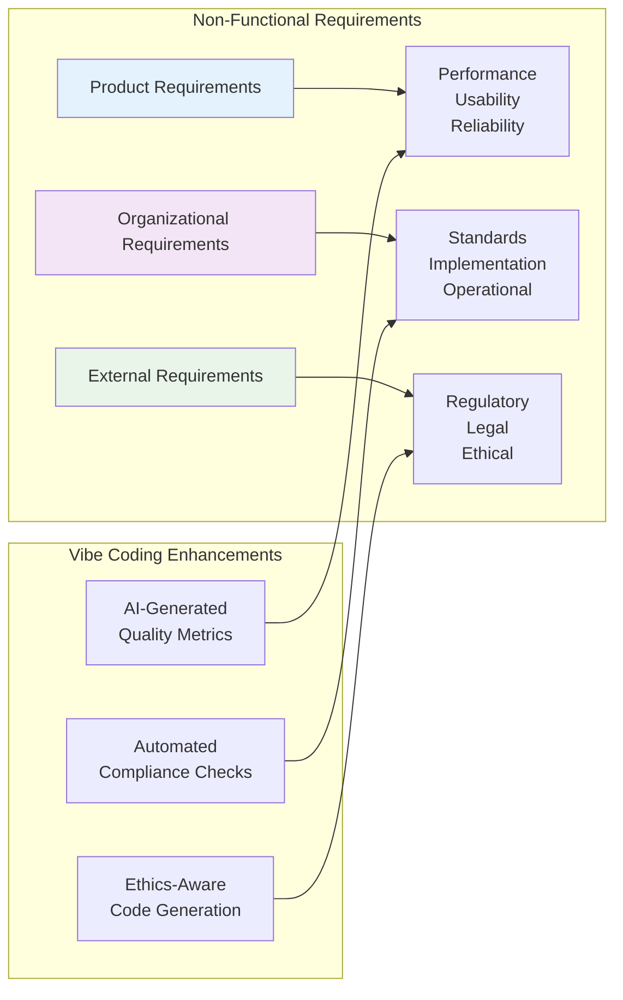
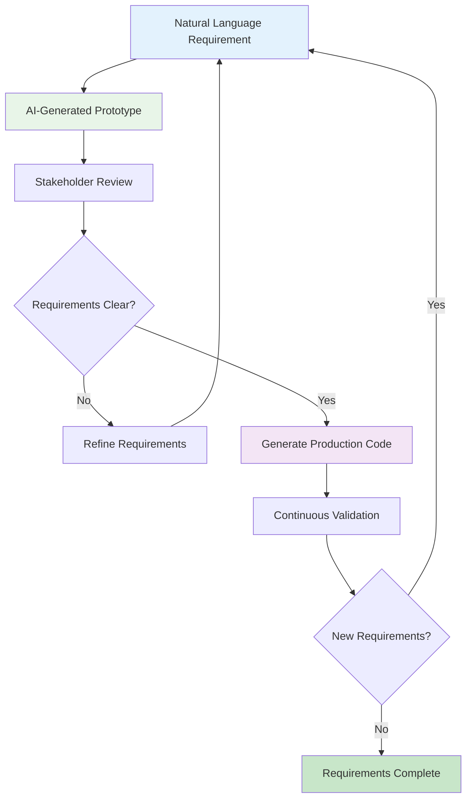
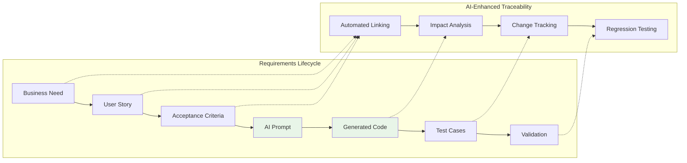

# Chapter 4: Requirements Engineering for Vibe Coding

> *"A requirement is a feature that the system must have or a constraint that it must satisfy to be accepted by the client."* - IEEE Standard 729

---

## Learning Objectives

By the end of this chapter, you will be able to:
- Define and categorize functional and non-functional requirements in the context of AI-assisted development
- Use vibe coding techniques to rapidly prototype and validate requirements
- Apply modern requirements elicitation techniques using natural language prompts
- Create comprehensive requirements documentation that supports both human understanding and AI code generation
- Validate requirements through AI-assisted testing and prototyping
- Manage changing requirements in agile, AI-enhanced development environments

---

## 3.1.1 Requirements Engineering in the Age of AI-Assisted Development

Requirements engineering has evolved significantly with the advent of AI-assisted development tools. Traditional approaches focused on lengthy documentation and formal specification methods. Vibe coding introduces new paradigms where requirements can be expressed more naturally and validated more rapidly.

### The Cost of Poor Requirements

Research consistently shows that requirements-related issues are the leading cause of software project failures:



**Key Insight**: Fixing a requirements defect in production costs 80-130 times more than fixing it during requirements gathering.

### Vibe Coding's Impact on Requirements Engineering

Vibe coding transforms requirements engineering through:

1. **Rapid Prototyping**: Natural language prompts enable quick requirement validation
2. **Living Documentation**: Code generated from natural language serves as executable specifications
3. **Iterative Refinement**: AI assistants help refine requirements through conversation
4. **Immediate Feedback**: Stakeholders can see and interact with working prototypes within hours

---

## 3.1.2 Types of Requirements in Modern Software Development

### Functional Requirements

**Definition**: Statements of services the system should provide, how it should react to particular inputs, and how it should behave in particular situations.

#### **Examples in Vibe Coding Context**:

```
User Story: "As a project manager, I want to view a dashboard showing team productivity metrics so that I can make informed decisions about resource allocation."

Vibe Coding Prompt:
"Create a project management dashboard that displays:
- Team member activity levels (commits, PRs, issues closed)
- Sprint progress with burn-down charts
- Resource allocation visualization
- Predictive analytics for project completion dates

Use React for the frontend, integrate with GitHub API for data, and include responsive design for mobile access."
```

#### **Characteristics of Good Functional Requirements**:
- **Specific**: Clear, unambiguous statements
- **Measurable**: Can be verified through testing
- **Achievable**: Technically feasible with available resources
- **Relevant**: Aligned with business objectives
- **Time-bound**: Have clear delivery expectations

### Non-Functional Requirements

**Definition**: Constraints on the services or functions offered by the system, often applying to the system as a whole.

#### **Categories of Non-Functional Requirements**:



#### **Performance Requirements Example**:
```
Traditional: "The system shall process 10,000 transactions per minute with 99.9% uptime."

Vibe Coding Enhanced: "Build a high-performance transaction processing system that:
- Handles 10,000 TPS with sub-100ms response times
- Includes automatic scaling based on load patterns
- Implements circuit breakers for fault tolerance
- Provides real-time monitoring dashboards
- Uses Redis for caching and PostgreSQL for persistence
- Includes comprehensive logging and alerting"
```

### 💡 **Vibe Coding Prompt: Requirements Discovery Session**

**Scenario**: You're starting a new e-commerce platform project and need to gather comprehensive requirements from stakeholders.

**Your Vibe Coding Prompt**:

```
I'm building an e-commerce platform and need help structuring a requirements discovery session. Generate:

1. **Stakeholder Interview Guide**:
   - Questions for business stakeholders (product managers, marketing)
   - Questions for technical stakeholders (developers, DevOps)
   - Questions for end users (customers, support team)
   - Questions about integration requirements (payment, shipping, analytics)

2. **Requirements Template Structure**:
   - User story format with acceptance criteria
   - Non-functional requirements checklist
   - Technical constraints and assumptions
   - Priority ranking system (MoSCoW method)

3. **Rapid Prototyping Plan**:
   - Key user journeys to prototype first
   - AI prompts for generating proof-of-concept features
   - Validation criteria for each prototype
   - Feedback collection mechanisms

4. **Requirements Validation Framework**:
   - Automated testing strategies for functional requirements
   - Performance benchmarking for non-functional requirements
   - User acceptance testing scenarios
   - Continuous validation during development

Please provide specific examples and templates I can use immediately with my stakeholders.
```

---

## 3.1.3 Modern Requirements Elicitation Techniques

### Traditional vs. AI-Enhanced Elicitation

| Traditional Method | AI-Enhanced Approach | Vibe Coding Benefits |
|-------------------|---------------------|---------------------|
| **Interviews** | AI-facilitated interview analysis | Natural language processing of transcripts |
| **Surveys** | Intelligent survey generation | Dynamic questionnaires based on responses |
| **Workshops** | Virtual collaboration with AI assistants | Real-time requirement synthesis |
| **Prototyping** | Rapid AI-generated prototypes | Immediate stakeholder feedback |
| **Document Analysis** | AI-powered requirement extraction | Automated gap analysis |

### AI-Assisted Requirements Gathering

#### **1. Conversational Requirements Elicitation**

```
Stakeholder: "We need a system to manage our inventory better."

AI Assistant Follow-up Questions:
- What specific inventory challenges are you facing?
- How many SKUs do you currently manage?
- What's your current process for reordering?
- Do you need real-time tracking or batch updates?
- What integrations with existing systems are required?
- What are your compliance requirements (FDA, ISO, etc.)?

Generated Requirements:
"Build an inventory management system that:
- Tracks 50,000+ SKUs with real-time updates
- Automatically generates reorder alerts based on configurable thresholds
- Integrates with existing ERP (SAP) and POS systems
- Provides barcode scanning capabilities for mobile devices
- Includes audit trails for FDA compliance
- Supports multi-location warehouse management"
```

#### **2. Requirement Validation Through Rapid Prototyping**

**The Vibe Coding Requirements Validation Loop**:



---

## 3.1.4 Requirements Documentation for AI-Assisted Development

### Living Requirements Documents

Traditional requirements documents often become outdated quickly. In vibe coding, requirements documents should be:

1. **Executable**: Include working code examples
2. **Interactive**: Allow stakeholders to modify and test
3. **Version-Controlled**: Track changes alongside code
4. **AI-Readable**: Structured for AI code generation

### Requirements Document Structure for Vibe Coding

```markdown
# Project: E-Commerce Platform Requirements

## 1. Executive Summary
**Vision**: Create a modern, scalable e-commerce platform using AI-assisted development

## 2. Stakeholder Personas
### Primary Users
- **Customers**: Browse, search, purchase products
- **Admin Users**: Manage inventory, orders, customer service
- **Developers**: Maintain and extend the platform

## 3. Functional Requirements

### 3.1 User Authentication (Priority: Must Have)
**User Story**: As a customer, I want to create an account and log in securely so that I can track my orders and save my preferences.

**Acceptance Criteria**:
- [ ] Email/password registration with verification
- [ ] Social login (Google, Facebook, Apple)
- [ ] Password reset functionality
- [ ] Two-factor authentication option
- [ ] Account lockout after failed attempts

**Vibe Coding Implementation**:
```javascript
// AI Prompt for implementation
"Create a secure authentication system using NextJS and Auth0 that includes:
- Email/password registration with email verification
- Social login integration (Google, Facebook)
- JWT token management with refresh tokens
- Password reset flow with secure token generation
- Rate limiting for login attempts
- Two-factor authentication using TOTP
Include comprehensive error handling and security best practices."
```

### 3.2 Product Search (Priority: Must Have)
**User Story**: As a customer, I want to search for products quickly and get relevant results so that I can find what I'm looking for efficiently.

**Acceptance Criteria**:
- [ ] Full-text search across product names, descriptions, categories
- [ ] Search suggestions and autocomplete
- [ ] Filters by price, category, brand, ratings
- [ ] Sort by relevance, price, ratings, date
- [ ] Search analytics and tracking

**Performance Requirements**:
- Search results must load within 200ms
- Support minimum 1000 concurrent searches
- 99.9% search availability

## 4. Non-Functional Requirements

### 4.1 Performance Requirements
- **Page Load Time**: < 2 seconds for 95th percentile
- **API Response Time**: < 100ms for product queries
- **Throughput**: Support 10,000 concurrent users
- **Availability**: 99.9% uptime (8.77 hours downtime/year)

### 4.2 Security Requirements
- **Data Encryption**: TLS 1.3 for data in transit, AES-256 for data at rest
- **Authentication**: Multi-factor authentication for admin users
- **Authorization**: Role-based access control (RBAC)
- **Compliance**: PCI DSS Level 1 for payment processing
- **Privacy**: GDPR and CCPA compliant data handling

### 4.3 Scalability Requirements
- **Horizontal Scaling**: Auto-scale based on CPU/memory metrics
- **Database**: Support read replicas and sharding
- **CDN**: Global content delivery for static assets
- **Caching**: Redis for session management and frequent queries

## 5. Technical Constraints
- **Frontend**: React/NextJS, TypeScript
- **Backend**: Node.js, Express, PostgreSQL
- **Cloud**: AWS (EC2, RDS, S3, CloudFront)
- **AI Integration**: OpenAI API for product recommendations
- **Payment**: Stripe for payment processing

## 6. AI-Assisted Development Plan
### Phase 1: Core Features (Weeks 1-4)
- Use vibe coding for authentication system
- AI-generated product catalog management
- Basic search functionality with AI suggestions

### Phase 2: Advanced Features (Weeks 5-8)
- AI-powered recommendation engine
- Intelligent inventory management
- Automated customer service chatbot

## 7. Validation Criteria
- [ ] All user stories have working prototypes
- [ ] Performance benchmarks met in staging
- [ ] Security audit passed
- [ ] Stakeholder acceptance achieved
```

### 💡 **Vibe Coding Prompt: Requirements Review and Gap Analysis**

**Your Vibe Coding Prompt**:

```
I have a requirements document for my e-commerce platform project. Please analyze it and help me improve it:

**Current Requirements**: [Paste your requirements document here]

**Analysis Requested**:

1. **Gap Analysis**:
   - Missing functional requirements
   - Incomplete non-functional requirements
   - Unstated assumptions that should be explicit
   - Integration requirements not covered

2. **Quality Assessment**:
   - Are requirements specific and measurable?
   - Are acceptance criteria complete?
   - Is priority ranking clear and justified?
   - Are dependencies between requirements identified?

3. **AI-Readiness Review**:
   - Can these requirements be easily converted to AI prompts?
   - Are technical specifications detailed enough for code generation?
   - Are there opportunities for AI-assisted validation?

4. **Implementation Roadmap**:
   - Suggested order for implementing requirements
   - Which requirements are good candidates for vibe coding?
   - Risk assessment for each requirement
   - Estimated effort using AI-assisted development

5. **Stakeholder Communication**:
   - Generate executive summary for business stakeholders
   - Create technical specification for development team
   - Prepare user acceptance testing scenarios

Please provide specific, actionable recommendations I can implement immediately.
```

---

## 3.1.5 Requirements Management in Agile, AI-Enhanced Environments

### The Dynamic Nature of AI-Assisted Requirements

In traditional development, changing requirements were often seen as a problem. With vibe coding, requirements can evolve more naturally because:

1. **Rapid Iteration**: Changes can be implemented and validated quickly
2. **Low Change Cost**: AI-generated code is easier to modify than hand-written code
3. **Continuous Stakeholder Feedback**: Working prototypes enable constant validation
4. **Predictive Analytics**: AI can help predict the impact of requirement changes

### Requirements Traceability with AI Tools



### Managing Requirement Changes

**Traditional Approach vs. Vibe Coding Approach**:

| Aspect | Traditional | Vibe Coding |
|--------|------------|-------------|
| **Change Approval** | Formal change control board | Lightweight stakeholder review |
| **Impact Analysis** | Manual documentation review | AI-assisted impact prediction |
| **Implementation** | Extensive manual coding | Natural language prompt modification |
| **Testing** | Manual test case updates | Automated test generation |
| **Documentation** | Manual documentation updates | Living documentation auto-update |

---

## 3.1.6 Requirements Validation and Verification

### Validation: Are We Building the Right Thing?

**AI-Enhanced Validation Techniques**:

1. **Intelligent Prototyping**: AI generates multiple solution approaches for comparison
2. **Stakeholder Simulation**: AI roleplays different user personas to test requirements
3. **Scenario Analysis**: AI generates edge cases and unusual use scenarios
4. **Market Analysis**: AI analyzes similar products to identify missing requirements

### Verification: Are We Building It Right?

**Automated Verification Methods**:

```javascript
// Example: AI-generated verification tests
// Prompt: "Generate comprehensive test cases for user authentication requirements"

describe('User Authentication Requirements Verification', () => {
  test('REQ-AUTH-001: Email registration with verification', async () => {
    // Test email registration flow
    const result = await registerUser('test@example.com', 'password123');
    expect(result.success).toBe(true);
    expect(result.emailVerificationSent).toBe(true);
  });
  
  test('REQ-AUTH-002: Social login integration', async () => {
    // Test Google OAuth flow
    const result = await authenticateWithGoogle(mockGoogleToken);
    expect(result.authenticated).toBe(true);
    expect(result.user.email).toBeDefined();
  });
  
  test('REQ-AUTH-003: Account lockout after failed attempts', async () => {
    // Test account lockout mechanism
    for (let i = 0; i < 5; i++) {
      await attemptLogin('test@example.com', 'wrongpassword');
    }
    const result = await attemptLogin('test@example.com', 'correctpassword');
    expect(result.accountLocked).toBe(true);
  });
});
```

### Continuous Requirements Validation

**The AI-Assisted Validation Pipeline**:

```yaml
# .github/workflows/requirements-validation.yml
name: Requirements Validation

on:
  pull_request:
    paths:
      - 'requirements/**'
      - 'src/**'

jobs:
  validate-requirements:
    runs-on: ubuntu-latest
    steps:
      - name: Requirements Traceability Check
        run: |
          # AI-powered script to ensure all requirements have corresponding tests
          python scripts/validate_requirements_coverage.py
          
      - name: Performance Requirements Validation
        run: |
          # Load test critical paths to verify performance requirements
          k6 run performance-tests/api-performance.js
          
      - name: Security Requirements Check
        run: |
          # Automated security scanning
          docker run --rm -v $(pwd):/app security-scanner:latest
          
      - name: Accessibility Requirements Validation
        run: |
          # Automated accessibility testing
          npm run test:accessibility
```

---

## 3.1.7 Best Practices for Vibe Coding Requirements

### 1. Write AI-Friendly Requirements

**Good Example**:
```
"Create a user dashboard that displays:
- Real-time notification feed with infinite scroll
- Customizable widget layout using drag-and-drop
- Dark/light theme toggle with system preference detection
- Responsive design optimized for mobile and desktop
- Integration with WebSocket for live updates
- Local storage for user preferences
- Loading states and error handling throughout"
```

**Poor Example**:
```
"Users need a dashboard that shows their stuff and lets them change things around."
```

### 2. Include Context and Constraints

**Always Specify**:
- Technology stack preferences
- Performance expectations
- Security requirements
- Integration needs
- User experience guidelines
- Accessibility standards

### 3. Embrace Iterative Refinement

Requirements should evolve through continuous feedback loops between stakeholders, AI assistants, and working prototypes.

---

## Summary

Requirements engineering in the age of AI-assisted development offers unprecedented opportunities for creating better software faster. By combining traditional requirements engineering principles with vibe coding techniques, teams can:

- **Reduce Requirements Defects**: Through rapid prototyping and validation
- **Improve Stakeholder Communication**: With working prototypes instead of abstract documents
- **Accelerate Development**: By generating code directly from natural language requirements
- **Maintain Agility**: Through continuous requirements evolution and validation

The key is to embrace the collaborative nature of AI-assisted development while maintaining the rigor and discipline that makes requirements engineering effective.

### Key Takeaways

1. **Start with Clear, Specific Requirements**: AI tools work best with detailed, unambiguous input
2. **Prototype Early and Often**: Use vibe coding to validate requirements quickly
3. **Maintain Living Documentation**: Keep requirements and code synchronized
4. **Embrace Change**: Use AI's rapid iteration capabilities to evolve requirements naturally
5. **Validate Continuously**: Implement automated validation throughout the development process

### Next Steps

- Practice writing AI-friendly requirements using the templates provided
- Experiment with rapid prototyping for requirements validation
- Implement automated requirements traceability in your projects
- Build a requirements validation pipeline using AI tools

The future of software engineering lies in the effective collaboration between human insight and AI capabilities. Requirements engineering is where this collaboration begins, setting the foundation for successful AI-assisted development projects. 