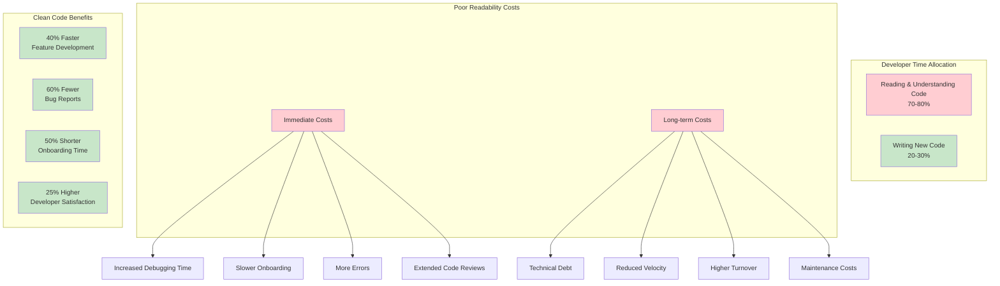
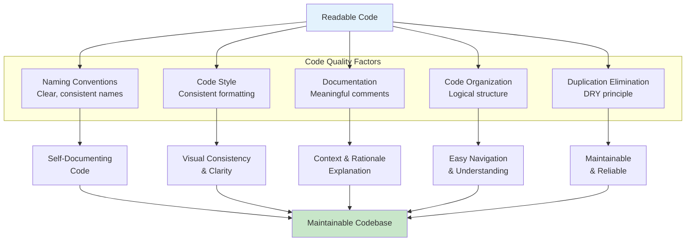
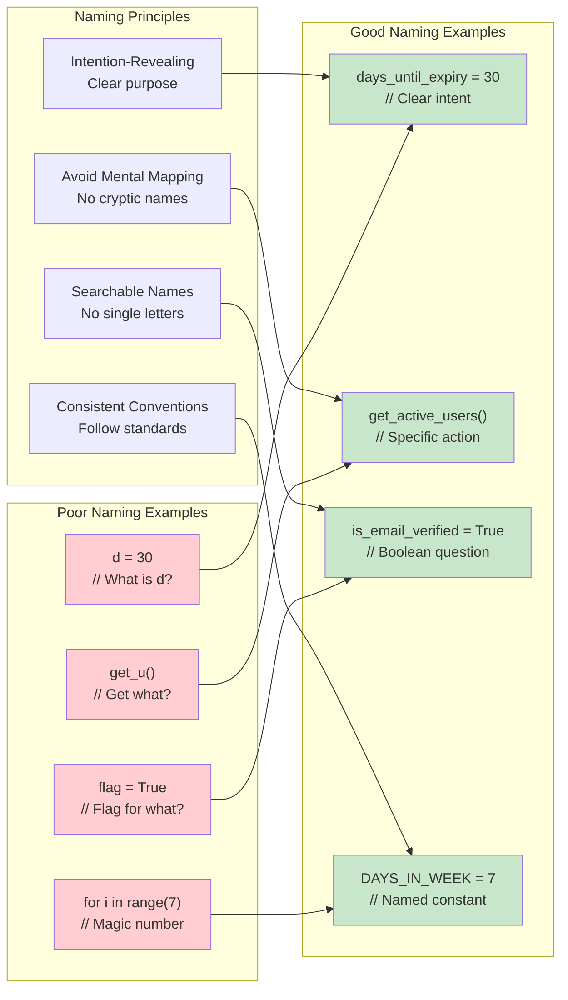

# Chapter 5: Writing Readable and Maintainable Code

> *"Code is read much more often than it is written. Write for the human who will read it next, including your future self."*

---

## Learning Objectives

By the end of this chapter, you will be able to:
- Apply naming conventions that improve code readability and self-documentation
- Implement consistent code style and formatting standards across projects
- Write effective documentation and comments that add genuine value
- Identify and eliminate code duplication using systematic approaches
- Plan and execute refactoring initiatives that improve code quality without breaking functionality

---

## Introduction: The Economics of Readable Code

The readability and maintainability of code are paramount for the long-term success of any software project. Research shows that developers spend 70-80% of their time reading and understanding existing code, while only 20-30% is spent writing new code. Clear, understandable code significantly reduces the effort required for debugging, modifying, and extending functionality, making it a critical investment in project sustainability.

### The Cost of Poor Readability



**Immediate Costs:**
- Increased debugging time due to unclear logic
- Slower onboarding for new team members
- More errors introduced during modifications
- Extended code review cycles

**Long-term Costs:**
- Accumulation of technical debt
- Reduced team velocity over time
- Higher developer turnover due to frustration
- Increased maintenance costs

### The Business Case for Clean Code

Organizations with highly readable codebases experience:
- **40% faster feature development** after the initial investment in code quality
- **60% reduction in bug reports** due to clearer logic and better testing
- **50% shorter onboarding time** for new developers
- **25% increase in developer satisfaction** and retention

---

## 5.1 Meaningful Naming Conventions



### The Psychology of Naming

Choosing meaningful and descriptive names is one of the most critical aspects of writing clean and maintainable code. Our brains process information through pattern recognition, and well-chosen names create mental models that make code intuitive to understand.

### Principles of Effective Naming

#### 1. Intention-Revealing Names

Names should clearly convey what the variable stores, what the function does, or what the class represents:

```python
# Poor naming
d = 30  # days?
users = get_u()  # what kind of users?
flag = True  # flag for what?

# Good naming
days_until_expiry = 30
active_premium_users = get_active_premium_users()
is_email_verified = True
```

#### 2. Avoid Mental Mapping

Don't force readers to mentally translate cryptic names:



```python
# Poor - requires mental mapping
for i in range(len(products)):
    if products[i].s > threshold:
        temp.append(products[i])

# Good - clear intent
for product in products:
    if product.stock_level > minimum_threshold:
        products_needing_restock.append(product)
```

#### 3. Use Searchable Names

Single-letter variables and magic numbers make code unsearchable:

```python
# Poor - unsearchable
for i in range(7):
    schedule[i] = []

# Good - searchable and meaningful
DAYS_IN_WEEK = 7
for day_index in range(DAYS_IN_WEEK):
    weekly_schedule[day_index] = []
```

### Naming Conventions by Language and Context

| Context | Convention | Example | Rationale |
|---------|------------|---------|-----------|
| **Python Variables** | snake_case | `user_account_balance` | PEP 8 standard, highly readable |
| **Python Functions** | snake_case | `calculate_monthly_payment()` | Consistent with variables |
| **Python Classes** | PascalCase | `PaymentProcessor` | Distinguishes classes from functions |
| **Python Constants** | UPPER_SNAKE_CASE | `MAX_RETRY_ATTEMPTS` | Clearly indicates immutable values |
| **JavaScript Variables** | camelCase | `userAccountBalance` | Established convention |
| **JavaScript Functions** | camelCase | `calculateMonthlyPayment()` | Consistent with variables |
| **Database Tables** | snake_case | `user_payment_methods` | SQL standard, case-insensitive |
| **REST API Endpoints** | kebab-case | `/api/user-accounts/` | URL-friendly, widely adopted |

### Domain-Specific Naming Guidelines

**Business Logic:**
- Use domain language that business stakeholders understand
- `customer_lifetime_value` instead of `clv_calc`
- `order_fulfillment_status` instead of `status`

**Technical Implementation:**
- Be specific about data types and structures
- `user_ids_list` instead of `users` for a list of IDs
- `payment_response_json` instead of `response` for JSON data

**Boolean Variables:**
- Use question form: `is_valid`, `has_permission`, `can_edit`
- Avoid negatives: `is_enabled` instead of `is_not_disabled`

### 💡 **Vibe Coding Prompt: Naming Convention Improvement**

**Your Vibe Coding Prompt**:

```
I need to build an automated naming convention analyzer and refactoring tool for our codebase. Our team struggles with inconsistent and unclear naming that hurts code readability.

Current Problems:
- Inconsistent naming conventions across the codebase (camelCase vs snake_case)
- Cryptic abbreviations and single-letter variables
- Functions and classes with unclear purposes
- Domain terminology used inconsistently

Codebase Context:
- Python/Django backend with React frontend
- E-commerce platform with 100+ modules
- Team of 8 developers with varying experience levels
- Legacy code mixed with new development

Please generate:

1. **Automated Naming Analysis Tool**:
   - Script that scans codebase and identifies naming violations
   - Classification of naming issues (abbreviations, inconsistency, unclear purpose)
   - Severity scoring based on code usage frequency
   - Integration with CI/CD to catch violations early

2. **AI-Powered Naming Suggestions**:
   - Tool that suggests better names based on context and usage
   - Domain-aware naming that reflects business terminology
   - Consistency checking across related modules
   - Bulk renaming capabilities with safety checks

3. **Team Naming Standards Generator**:
   - Automated generation of naming convention guidelines
   - Language-specific and framework-specific rules
   - Code review checklist for naming quality
   - IDE plugins/extensions for real-time naming feedback

4. **Safe Refactoring System**:
   - Automated refactoring with comprehensive test coverage
   - Impact analysis before making naming changes
   - Rollback capabilities for problematic changes
   - Documentation updates to reflect new naming

5. **Naming Quality Metrics Dashboard**:
   - Real-time tracking of naming convention compliance
   - Team performance metrics and improvement trends
   - Integration with code review tools
   - Gamification to encourage better naming practices

Include integration with popular IDEs, static analysis tools, and version control systems. Show how to make naming improvement a continuous, automated process rather than a one-time effort.
```
   - Create naming convention guidelines for your team
   - Design a code review checklist for naming quality
   - Propose tooling (linters, IDE plugins) to enforce standards

**Deliverable**: 
- Fully refactored code with improved naming
- Team naming convention guidelines document
- Migration plan with risk assessment

---

## 5.2 Consistent Code Style and Formatting

### The Impact of Formatting on Cognition

Consistent code style and formatting enhance readability by reducing cognitive load. When code follows predictable patterns, developers can focus on logic rather than deciphering structure. Studies show that inconsistently formatted code takes 25% longer to understand and debug.

### Core Formatting Principles

#### 1. Indentation and Visual Hierarchy

Proper indentation creates visual structure that mirrors logical structure:

```python
# Poor indentation
def process_order(order_data):
items = order_data.get('items', [])
if not items:
return None
    total = 0
    for item in items:
        if item['quantity'] > 0:
price = item['unit_price'] * item['quantity']
total += price
return {'total': total, 'processed': True}

# Good indentation
def process_order(order_data):
    items = order_data.get('items', [])
    if not items:
        return None
    
    total = 0
    for item in items:
        if item['quantity'] > 0:
            price = item['unit_price'] * item['quantity']
            total += price
    
    return {
        'total': total, 
        'processed': True
    }
```

#### 2. Whitespace for Logical Grouping

Strategic use of whitespace helps group related statements:

```python
# Poor grouping
def create_user_account(user_data):
    username = user_data['username']
    email = user_data['email']
    password = hash_password(user_data['password'])
    if User.objects.filter(username=username).exists():
        raise ValidationError("Username already exists")
    if User.objects.filter(email=email).exists():
        raise ValidationError("Email already exists")
    user = User.objects.create(username=username, email=email, password=password)
    send_welcome_email(user.email)
    log_user_creation(user.id)
    return user

# Good grouping
def create_user_account(user_data):
    # Extract and prepare user data
    username = user_data['username']
    email = user_data['email']
    password = hash_password(user_data['password'])
    
    # Validate uniqueness constraints
    if User.objects.filter(username=username).exists():
        raise ValidationError("Username already exists")
    if User.objects.filter(email=email).exists():
        raise ValidationError("Email already exists")
    
    # Create user account
    user = User.objects.create(
        username=username, 
        email=email, 
        password=password
    )
    
    # Post-creation actions
    send_welcome_email(user.email)
    log_user_creation(user.id)
    
    return user
```

#### 3. Line Length and Readability

Optimal line length balances screen real estate with readability:

```python
# Too long - hard to read
user_notification = NotificationService.send_email(user.email, generate_welcome_template(user.first_name, user.last_name, user.account_type), priority='high', retry_count=3)

# Well-formatted
user_notification = NotificationService.send_email(
    recipient=user.email,
    template=generate_welcome_template(
        first_name=user.first_name,
        last_name=user.last_name,
        account_type=user.account_type
    ),
    priority='high',
    retry_count=3
)
```

### Automated Formatting Tools

| Language | Recommended Tools | Configuration |
|----------|-------------------|---------------|
| **Python** | Black, isort, flake8 | `pyproject.toml` or `setup.cfg` |
| **JavaScript** | Prettier, ESLint | `.prettierrc`, `.eslintrc` |
| **Java** | Google Java Format, Checkstyle | `checkstyle.xml` |
| **C#** | EditorConfig, StyleCop | `.editorconfig` |
| **Go** | gofmt (built-in) | No configuration needed |

### 💡 **Vibe Coding Prompt: Code Style Standardization**

**Your Vibe Coding Prompt**:

```
I need to build a comprehensive code style standardization system that automatically enforces consistent formatting across our development team and integrates seamlessly with our workflow.

Current Style Challenges:
- 8-person team with different formatting preferences
- Mix of Python, JavaScript, and TypeScript codebases
- Inconsistent indentation, line lengths, and naming conventions
- Code review time wasted on style discussions instead of logic
- New team members struggle with undocumented style expectations

Technology Stack:
- Backend: Python/Django, FastAPI
- Frontend: React/TypeScript, Node.js
- Tools: VS Code, PyCharm, Git, GitHub Actions
- Current linting: Basic ESLint and flake8 setup

Please generate:

1. **Automated Style Enforcement System**:
   - Complete configuration for Black, Prettier, ESLint, and TypeScript
   - Pre-commit hooks that auto-format code before commits
   - CI/CD integration that blocks merges for style violations
   - IDE configuration files for consistent development experience

2. **Team Onboarding Automation**:
   - Setup scripts that configure development environments automatically
   - VS Code workspace settings and recommended extensions
   - Git hooks installation and configuration
   - Documentation generator for style guidelines

3. **Legacy Code Migration Tool**:
   - Scripts to safely apply formatting to existing codebase
   - Batch processing with rollback capabilities
   - Conflict resolution strategies for large-scale changes
   - Progress tracking and reporting for migration status

4. **Style Quality Dashboard**:
   - Real-time monitoring of code style compliance across repositories
   - Team performance metrics and improvement trends
   - Integration with code review tools to track style-related comments
   - Automated reporting for management on code quality improvements

5. **Continuous Style Improvement System**:
   - AI-powered analysis of style patterns and suggestions
   - Automated updates to style configurations based on team consensus
   - Integration with popular style guides (Google, Airbnb, PEP 8)
   - A/B testing framework for style rule changes

Include complete configuration files, setup scripts, and integration with popular development tools. Show how to make style enforcement invisible to developers while maintaining high code quality standards.
```

---

## 5.3 Effective Code Documentation and Comments

### The Art of Meaningful Documentation

Documentation and comments serve different purposes and audiences. The key is knowing when and how to document effectively without creating maintenance overhead or noise.

### Types of Code Documentation

#### 1. Self-Documenting Code

The best documentation is code that explains itself:

```python
# Poor - requires comments to understand
def calc(x, y, z):
    # Calculate the monthly payment
    r = y / 1200  # Convert annual rate to monthly
    n = z * 12    # Convert years to months
    return x * (r * (1 + r)**n) / ((1 + r)**n - 1)

# Good - self-documenting
def calculate_monthly_mortgage_payment(principal_amount, annual_interest_rate, loan_term_years):
    monthly_interest_rate = annual_interest_rate / 1200
    total_monthly_payments = loan_term_years * 12
    
    if monthly_interest_rate == 0:
        return principal_amount / total_monthly_payments
    
    payment_multiplier = (
        monthly_interest_rate * (1 + monthly_interest_rate) ** total_monthly_payments
    ) / ((1 + monthly_interest_rate) ** total_monthly_payments - 1)
    
    return principal_amount * payment_multiplier
```

#### 2. Explanatory Comments

Comments should explain *why*, not *what*:

```python
# Poor - explains what the code does (obvious)
user_count += 1  # Increment user count

# Good - explains why the code exists
user_count += 1  # Include guest users in analytics for conversion tracking

# Poor - restates the code
if payment.amount > account.balance:
    # If payment amount is greater than account balance
    reject_payment(payment)

# Good - explains business rule
if payment.amount > account.balance:
    # Business rule: Never allow overdrafts for basic accounts
    # Premium accounts handle overdrafts in a separate workflow
    reject_payment(payment)
```

#### 3. Documentation Comments (Docstrings)

Formal documentation for functions, classes, and modules:

```python
def calculate_shipping_cost(
    weight_kg: float, 
    distance_km: float, 
    shipping_type: str,
    is_expedited: bool = False
) -> dict:
    """
    Calculate shipping cost based on package weight, distance, and service type.
    
    This function implements the company's standard shipping cost algorithm,
    which includes base rates, distance multipliers, and service type modifiers.
    For international shipments, additional customs processing fees may apply.
    
    Args:
        weight_kg: Package weight in kilograms. Must be positive.
        distance_km: Shipping distance in kilometers. Must be positive.
        shipping_type: Service type ('standard', 'express', 'overnight').
        is_expedited: Whether to apply expedited processing fees.
        
    Returns:
        dict: Shipping cost breakdown with following keys:
            - 'base_cost': Base shipping cost before modifiers
            - 'distance_fee': Additional fee based on distance
            - 'service_fee': Fee for shipping service type
            - 'expedited_fee': Additional fee for expedited processing (if applicable)
            - 'total_cost': Final shipping cost
            
    Raises:
        ValueError: If weight_kg or distance_km is negative or zero.
        UnsupportedShippingTypeError: If shipping_type is not recognized.
        
    Example:
        >>> cost = calculate_shipping_cost(2.5, 100, 'express', True)
        >>> print(f"Total cost: ${cost['total_cost']:.2f}")
        Total cost: $15.75
        
    Note:
        International shipments (distance > 1000km) include customs fees.
        Prices are in USD and exclude applicable taxes.
    """
```

### Documentation Anti-Patterns

#### 1. Redundant Comments
```python
# Bad - comment adds no value
name = "John Doe"  # Set name to John Doe
```

#### 2. Outdated Comments
```python
# Bad - comment doesn't match code
# TODO: Add input validation
def process_user_data(user_data):
    # This function now has extensive validation, but comment wasn't updated
    validate_required_fields(user_data)
    validate_email_format(user_data['email'])
    validate_password_strength(user_data['password'])
    # ... rest of function
```

#### 3. Commented-Out Code
```python
# Bad - dead code creates confusion
def calculate_tax(income):
    # old_calculation = income * 0.25
    # if income > 50000:
    #     old_calculation += (income - 50000) * 0.05
    
    return TaxCalculator.calculate_progressive_tax(income)
```

### 💡 **Vibe Coding Prompt: Documentation Quality Improvement**

**Your Vibe Coding Prompt**:

```
I need to build an intelligent documentation generation and quality assessment system that automatically improves code documentation and keeps it current with code changes.

Current Documentation Problems:
- Inconsistent documentation across 50+ Python modules
- Many functions lack docstrings or have outdated ones
- Complex business logic not explained for new team members
- No automated way to detect documentation quality issues
- Documentation gets out of sync with code changes

Codebase Context:
- Python/Django e-commerce platform
- Complex financial calculations and business rules
- Team of 8 developers with varying documentation habits
- Mix of legacy code and new development

Please generate:

1. **AI-Powered Documentation Generator**:
   - Tool that analyzes code and generates comprehensive docstrings
   - Context-aware documentation that understands business domain
   - Automatic generation of parameter descriptions and return types
   - Integration with type hints and static analysis tools

2. **Documentation Quality Assessment System**:
   - Automated scoring of documentation completeness and quality
   - Detection of outdated documentation that doesn't match code
   - Identification of complex code that needs explanatory comments
   - Integration with CI/CD to enforce documentation standards

3. **Self-Documenting Code Refactoring Tool**:
   - AI suggestions for better variable and function names
   - Automated extraction of complex logic into well-named functions
   - Type hint generation and improvement suggestions
   - Code structure improvements for better readability

4. **Living Documentation Platform**:
   - Automatic generation of module and API documentation
   - Interactive code examples with live execution
   - Business rule documentation extracted from code comments
   - Integration with project management tools for context

5. **Documentation Maintenance Automation**:
   - Automated detection of code changes that require doc updates
   - Git hooks that prompt for documentation when code changes
   - Continuous monitoring of documentation drift
   - Automated testing of code examples in documentation

6. **Team Documentation Workflow**:
   - Templates and guidelines for consistent documentation
   - Code review integration with documentation quality checks
   - Gamification to encourage better documentation practices
   - Training materials and best practice recommendations

Include integration with popular IDEs, static analysis tools, and documentation platforms. Show how to make documentation a natural, automated part of the development process rather than an afterthought.
```

---

## 5.4 Avoiding Code Duplication (DRY in Practice)

### Understanding Knowledge vs. Code Duplication

The DRY principle often gets misinterpreted as "never repeat any code." However, the focus should be on avoiding duplication of *knowledge* rather than mere textual similarity. Sometimes similar-looking code represents different knowledge and should remain separate.

### Types of Duplication

#### 1. True Duplication (Should be eliminated)
```python
# Same knowledge expressed multiple times
def validate_email_registration(email):
    if not email or '@' not in email or '.' not in email.split('@')[1]:
        raise ValidationError("Invalid email format")

def validate_email_update(email):
    if not email or '@' not in email or '.' not in email.split('@')[1]:
        raise ValidationError("Invalid email format")
```

#### 2. Coincidental Duplication (Should remain separate)
```python
# Different knowledge that happens to look similar
def calculate_shipping_weight(items):
    return sum(item.weight for item in items)

def calculate_shipping_cost(items):  
    return sum(item.cost for item in items)  # Different business logic
```

### Refactoring Strategies for Duplication

#### Strategy 1: Extract Method
```python
# Before refactoring
class OrderProcessor:
    def process_online_order(self, order_data):
        # Validate customer
        if not order_data.get('customer_id'):
            raise ValidationError("Customer ID required")
        customer = Customer.get(order_data['customer_id'])
        if not customer.is_active:
            raise ValidationError("Customer account inactive")
            
        # Process payment
        # ... order processing logic
        
    def process_phone_order(self, order_data):
        # Validate customer (duplicate logic)
        if not order_data.get('customer_id'):
            raise ValidationError("Customer ID required")
        customer = Customer.get(order_data['customer_id'])
        if not customer.is_active:
            raise ValidationError("Customer account inactive")
            
        # Process payment
        # ... order processing logic

# After refactoring
class OrderProcessor:
    def _validate_customer(self, customer_id):
        if not customer_id:
            raise ValidationError("Customer ID required")
        customer = Customer.get(customer_id)
        if not customer.is_active:
            raise ValidationError("Customer account inactive")
        return customer
        
    def process_online_order(self, order_data):
        customer = self._validate_customer(order_data.get('customer_id'))
        # ... order processing logic
        
    def process_phone_order(self, order_data):
        customer = self._validate_customer(order_data.get('customer_id'))
        # ... order processing logic
```

#### Strategy 2: Parameter Object
```python
# Before - duplicated parameter passing
def send_marketing_email(user_id, email, first_name, last_name, preferences):
    # ... implementation

def send_notification_email(user_id, email, first_name, last_name, preferences):
    # ... implementation

def send_welcome_email(user_id, email, first_name, last_name, preferences):
    # ... implementation

# After - parameter object eliminates duplication
@dataclass
class UserProfile:
    user_id: int
    email: str
    first_name: str
    last_name: str
    preferences: dict

def send_marketing_email(user_profile: UserProfile):
    # ... implementation

def send_notification_email(user_profile: UserProfile):
    # ... implementation

def send_welcome_email(user_profile: UserProfile):
    # ... implementation
```

### When NOT to Apply DRY

#### 1. Different Domains
```python
# Keep separate - different business domains
class UserValidator:
    def validate_age(self, age):
        return 18 <= age <= 120  # Legal age requirements

class ProductValidator:
    def validate_age(self, age):
        return 0 <= age <= 50  # Product shelf life in years
```

#### 2. Different Rate of Change
```python
# Keep separate - likely to evolve differently
def format_currency_for_display(amount):
    return f"${amount:.2f}"  # UI formatting

def format_currency_for_api(amount):
    return f"${amount:.2f}"  # API response formatting
```

### 💡 **Vibe Coding Prompt: Data Validation Consolidation**

**Your Vibe Coding Prompt**:

```
I need to build a comprehensive validation framework that eliminates duplicated validation logic across our codebase and provides a consistent, reusable validation system.

Current Validation Problems:
- Email validation logic duplicated in 15+ different files
- Inconsistent error messages for the same validation rules
- Password validation differs between registration and password reset
- Phone number validation has 3 different implementations
- No centralized business rule management

Codebase Context:
- Python/Django web application with React frontend
- User management, e-commerce, and financial transaction features
- Validation needed at API, form, and database levels
- Complex business rules that change frequently

Please generate:

1. **Unified Validation Framework**:
   - Centralized validation library with composable validators
   - Support for field-level, object-level, and cross-field validation
   - Consistent error message formatting and internationalization
   - Integration with Django forms, DRF serializers, and Pydantic models

2. **Business Rule Engine**:
   - Configurable validation rules that can be modified without code changes
   - Support for conditional validation based on context
   - Rule versioning and A/B testing capabilities
   - Integration with feature flags for gradual rule rollouts

3. **Validation Migration Tool**:
   - Automated detection of duplicated validation logic across codebase
   - Safe migration scripts that replace duplicated code with framework calls
   - Comprehensive testing to ensure no validation behavior is lost
   - Rollback capabilities for problematic migrations

4. **Multi-Layer Validation System**:
   - Client-side validation for immediate user feedback
   - API-level validation for security and data integrity
   - Database-level constraints for final data protection
   - Consistent validation across all layers

5. **Validation Analytics and Monitoring**:
   - Real-time tracking of validation failures and patterns
   - A/B testing framework for validation rule changes
   - Performance monitoring for validation overhead
   - Business intelligence on user behavior and validation issues

6. **Developer Experience Tools**:
   - IDE plugins for validation rule discovery and usage
   - Automated generation of validation documentation
   - Testing utilities for validation scenarios
   - Code generation for common validation patterns

Include integration with popular Python validation libraries (Cerberus, Marshmallow, Pydantic), frontend validation frameworks, and monitoring tools. Show how to make validation a first-class, reusable concern across the entire application stack.
```

---

## 5.5 Refactoring for Clarity and Efficiency

### The Philosophy of Refactoring

Code refactoring is the process of improving the internal structure of code without altering its external behavior or functionality. It's a disciplined technique for cleaning up code that reduces the risk of introducing bugs while improving readability, maintainability, and efficiency.

### The Refactoring Mindset

Effective refactoring requires a specific mindset:
- **Safety First**: Never refactor without adequate test coverage
- **Small Steps**: Make incremental changes that are easy to verify
- **Behavior Preservation**: External behavior must remain unchanged
- **Continuous Improvement**: Refactoring is ongoing, not a one-time event

### Common Refactoring Patterns

#### 1. Extract Method
**When to use**: Long methods that do multiple things

```python
# Before: Long method with multiple responsibilities
def process_customer_order(order_data):
    # Validate order data
    if not order_data.get('customer_id'):
        raise ValueError("Customer ID required")
    if not order_data.get('items'):
        raise ValueError("Order must contain items")
    for item in order_data['items']:
        if item['quantity'] <= 0:
            raise ValueError("Item quantity must be positive")
        if not item.get('product_id'):
            raise ValueError("Product ID required for each item")
    
    # Calculate totals
    subtotal = 0
    for item in order_data['items']:
        product = Product.get(item['product_id'])
        item_total = product.price * item['quantity']
        subtotal += item_total
    
    tax_rate = 0.08
    tax_amount = subtotal * tax_rate
    total = subtotal + tax_amount
    
    # Create order record
    order = Order()
    order.customer_id = order_data['customer_id']
    order.subtotal = subtotal
    order.tax_amount = tax_amount
    order.total = total
    order.status = 'pending'
    order.save()
    
    return order

# After: Extracted into focused methods
def process_customer_order(order_data):
    validate_order_data(order_data)
    totals = calculate_order_totals(order_data['items'])
    order = create_order_record(order_data['customer_id'], totals)
    return order

def validate_order_data(order_data):
    if not order_data.get('customer_id'):
        raise ValueError("Customer ID required")
    if not order_data.get('items'):
        raise ValueError("Order must contain items")
    
    for item in order_data['items']:
        validate_order_item(item)

def validate_order_item(item):
    if item['quantity'] <= 0:
        raise ValueError("Item quantity must be positive")
    if not item.get('product_id'):
        raise ValueError("Product ID required for each item")

def calculate_order_totals(items):
    subtotal = sum(
        Product.get(item['product_id']).price * item['quantity']
        for item in items
    )
    
    tax_rate = 0.08
    tax_amount = subtotal * tax_rate
    total = subtotal + tax_amount
    
    return {
        'subtotal': subtotal,
        'tax_amount': tax_amount,
        'total': total
    }

def create_order_record(customer_id, totals):
    order = Order()
    order.customer_id = customer_id
    order.subtotal = totals['subtotal']
    order.tax_amount = totals['tax_amount']
    order.total = totals['total']
    order.status = 'pending'
    order.save()
    return order
```

#### 2. Replace Magic Numbers with Named Constants
```python
# Before: Magic numbers scattered throughout code
def calculate_late_fee(days_overdue, principal_amount):
    if days_overdue <= 5:
        return 0
    elif days_overdue <= 30:
        return principal_amount * 0.05
    else:
        return principal_amount * 0.10

# After: Named constants with clear meaning
class LateFeePolicy:
    GRACE_PERIOD_DAYS = 5
    STANDARD_LATE_FEE_RATE = 0.05
    SEVERE_LATE_FEE_RATE = 0.10
    SEVERE_LATE_THRESHOLD_DAYS = 30

def calculate_late_fee(days_overdue, principal_amount):
    if days_overdue <= LateFeePolicy.GRACE_PERIOD_DAYS:
        return 0
    elif days_overdue <= LateFeePolicy.SEVERE_LATE_THRESHOLD_DAYS:
        return principal_amount * LateFeePolicy.STANDARD_LATE_FEE_RATE
    else:
        return principal_amount * LateFeePolicy.SEVERE_LATE_FEE_RATE
```

#### 3. Replace Conditional Logic with Polymorphism
```python
# Before: Complex conditional logic
class PaymentProcessor:
    def process_payment(self, payment_data):
        payment_type = payment_data['type']
        
        if payment_type == 'credit_card':
            # Credit card processing logic
            card_number = payment_data['card_number']
            expiry = payment_data['expiry']
            cvv = payment_data['cvv']
            # ... validate and process credit card
            
        elif payment_type == 'paypal':
            # PayPal processing logic
            email = payment_data['email']
            # ... process PayPal payment
            
        elif payment_type == 'bank_transfer':
            # Bank transfer logic
            account_number = payment_data['account_number']
            routing_number = payment_data['routing_number']
            # ... process bank transfer
            
        else:
            raise ValueError(f"Unsupported payment type: {payment_type}")

# After: Polymorphic design
from abc import ABC, abstractmethod

class PaymentMethod(ABC):
    @abstractmethod
    def process(self, payment_data):
        pass

class CreditCardPayment(PaymentMethod):
    def process(self, payment_data):
        # Credit card specific processing
        pass

class PayPalPayment(PaymentMethod):
    def process(self, payment_data):
        # PayPal specific processing
        pass

class BankTransferPayment(PaymentMethod):
    def process(self, payment_data):
        # Bank transfer specific processing
        pass

class PaymentProcessor:
    def __init__(self):
        self.payment_methods = {
            'credit_card': CreditCardPayment(),
            'paypal': PayPalPayment(),
            'bank_transfer': BankTransferPayment()
        }
    
    def process_payment(self, payment_data):
        payment_type = payment_data['type']
        if payment_type not in self.payment_methods:
            raise ValueError(f"Unsupported payment type: {payment_type}")
        
        return self.payment_methods[payment_type].process(payment_data)
```

### Refactoring Best Practices

#### 1. Red-Green-Refactor Cycle
- **Red**: Ensure you have comprehensive tests that currently pass
- **Green**: Make your refactoring changes
- **Refactor**: Verify all tests still pass

#### 2. Incremental Changes
- Make one small change at a time
- Run tests after each change
- Commit working states frequently

#### 3. Tool-Assisted Refactoring
- Use IDE refactoring tools when available
- Automated refactoring reduces the risk of introducing errors
- Manual verification is still essential

### 💡 **Vibe Coding Prompt: Legacy Code Refactoring**

**Your Vibe Coding Prompt**:

```
I need to build a comprehensive legacy code modernization system that can safely refactor large, complex codebases while maintaining functionality and improving maintainability.

Legacy Code Challenges:
- 10,000+ line monolithic Python application from 2015
- Mixed business logic, data access, and presentation concerns
- No unit tests, making changes risky
- Performance issues and memory leaks
- Difficult to add new features or fix bugs

Current System Context:
- E-commerce order processing system
- Critical business functionality that can't be down
- Multiple integrations with external payment and shipping APIs
- Complex business rules that aren't well documented
- Team needs to add new features while improving code quality

Please generate:

1. **Automated Legacy Code Analysis System**:
   - Static analysis tools that identify code smells and refactoring opportunities
   - Dependency mapping to understand component relationships
   - Complexity metrics and technical debt assessment
   - Risk analysis for different refactoring approaches

2. **Safe Refactoring Framework**:
   - Automated test generation for legacy code without existing tests
   - Incremental refactoring tools with rollback capabilities
   - Behavior preservation verification through automated testing
   - Parallel implementation strategy for high-risk changes

3. **Modular Architecture Migration Tool**:
   - Automated extraction of business logic into separate modules
   - Service layer generation with proper separation of concerns
   - Database access layer abstraction and optimization
   - API design for clean interfaces between components

4. **Continuous Refactoring Pipeline**:
   - CI/CD integration for safe, automated refactoring
   - Performance monitoring to ensure refactoring doesn't degrade performance
   - Automated code quality metrics and improvement tracking
   - Feature flag integration for gradual rollout of refactored components

5. **Legacy Code Documentation Generator**:
   - Automated generation of documentation from existing code
   - Business rule extraction and documentation
   - API documentation for newly created interfaces
   - Migration guides for team members working with refactored code

6. **Modernization Roadmap and Planning Tool**:
   - Prioritization framework for refactoring efforts based on business impact
   - Resource estimation and timeline planning for refactoring projects
   - Risk assessment and mitigation strategies
   - Success metrics and progress tracking

Include integration with modern Python tools (Black, mypy, pytest), monitoring systems (Sentry, DataDog), and development workflows. Show how to make legacy code refactoring a systematic, low-risk process that delivers continuous value.
``` 