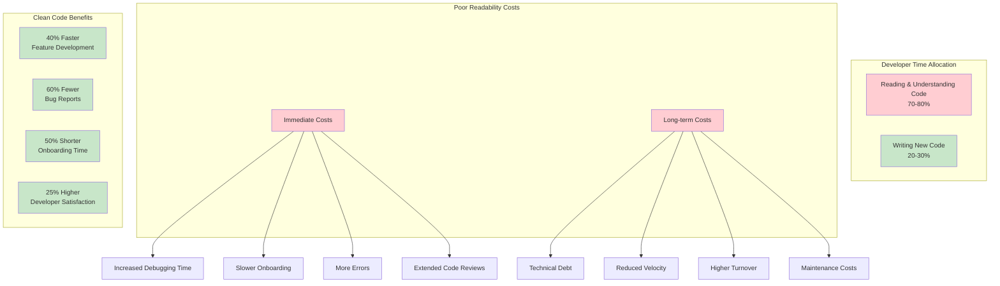
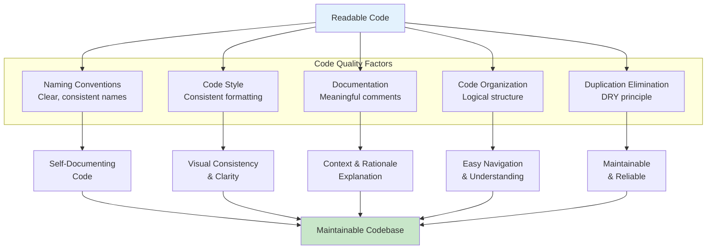
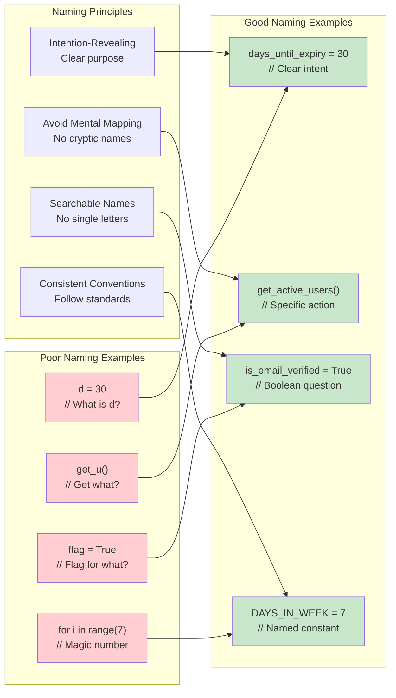

# Chapter 5: Writing Readable and Maintainable Code

> *"Code is read much more often than it is written. Write for the human who will read it next, including your future self."*

---

## Learning Objectives

By the end of this chapter, you will be able to:
- Apply naming conventions that improve code readability and self-documentation
- Implement consistent code style and formatting standards across projects
- Write effective documentation and comments that add genuine value
- Identify and eliminate code duplication using systematic approaches
- Plan and execute refactoring initiatives that improve code quality without breaking functionality

---

## Introduction: The Economics of Readable Code

The readability and maintainability of code are paramount for the long-term success of any software project. Research shows that developers spend 70-80% of their time reading and understanding existing code, while only 20-30% is spent writing new code. Clear, understandable code significantly reduces the effort required for debugging, modifying, and extending functionality, making it a critical investment in project sustainability.

### The Cost of Poor Readability



**Immediate Costs:**
- Increased debugging time due to unclear logic
- Slower onboarding for new team members
- More errors introduced during modifications
- Extended code review cycles

**Long-term Costs:**
- Accumulation of technical debt
- Reduced team velocity over time
- Higher developer turnover due to frustration
- Increased maintenance costs

### The Business Case for Clean Code

Organizations with highly readable codebases experience:
- **40% faster feature development** after the initial investment in code quality
- **60% reduction in bug reports** due to clearer logic and better testing
- **50% shorter onboarding time** for new developers
- **25% increase in developer satisfaction** and retention

---

## 5.1 Meaningful Naming Conventions



### The Psychology of Naming

Choosing meaningful and descriptive names is one of the most critical aspects of writing clean and maintainable code. Our brains process information through pattern recognition, and well-chosen names create mental models that make code intuitive to understand.

### Principles of Effective Naming

#### 1. Intention-Revealing Names

Names should clearly convey what the variable stores, what the function does, or what the class represents:

```python
# Poor naming
d = 30  # days?
users = get_u()  # what kind of users?
flag = True  # flag for what?

# Good naming
days_until_expiry = 30
active_premium_users = get_active_premium_users()
is_email_verified = True
```

#### 2. Avoid Mental Mapping

Don't force readers to mentally translate cryptic names:



```python
# Poor - requires mental mapping
for i in range(len(products)):
    if products[i].s > threshold:
        temp.append(products[i])

# Good - clear intent
for product in products:
    if product.stock_level > minimum_threshold:
        products_needing_restock.append(product)
```

#### 3. Use Searchable Names

Single-letter variables and magic numbers make code unsearchable:

```python
# Poor - unsearchable
for i in range(7):
    schedule[i] = []

# Good - searchable and meaningful
DAYS_IN_WEEK = 7
for day_index in range(DAYS_IN_WEEK):
    weekly_schedule[day_index] = []
```

### Naming Conventions by Language and Context

| Context | Convention | Example | Rationale |
|---------|------------|---------|-----------|
| **Python Variables** | snake_case | `user_account_balance` | PEP 8 standard, highly readable |
| **Python Functions** | snake_case | `calculate_monthly_payment()` | Consistent with variables |
| **Python Classes** | PascalCase | `PaymentProcessor` | Distinguishes classes from functions |
| **Python Constants** | UPPER_SNAKE_CASE | `MAX_RETRY_ATTEMPTS` | Clearly indicates immutable values |
| **JavaScript Variables** | camelCase | `userAccountBalance` | Established convention |
| **JavaScript Functions** | camelCase | `calculateMonthlyPayment()` | Consistent with variables |
| **Database Tables** | snake_case | `user_payment_methods` | SQL standard, case-insensitive |
| **REST API Endpoints** | kebab-case | `/api/user-accounts/` | URL-friendly, widely adopted |

### Domain-Specific Naming Guidelines

**Business Logic:**
- Use domain language that business stakeholders understand
- `customer_lifetime_value` instead of `clv_calc`
- `order_fulfillment_status` instead of `status`

**Technical Implementation:**
- Be specific about data types and structures
- `user_ids_list` instead of `users` for a list of IDs
- `payment_response_json` instead of `response` for JSON data

**Boolean Variables:**
- Use question form: `is_valid`, `has_permission`, `can_edit`
- Avoid negatives: `is_enabled` instead of `is_not_disabled`

### 💡 **Vibe Coding Prompt: Naming Convention Improvement**

**Scenario**: You need to improve the naming conventions in your codebase to make it more readable and maintainable.

**Your Task - Use this prompt with your actual code**:

```
I have code with poor naming conventions that make it hard to understand and maintain. Here's a sample of the problematic code: [PASTE YOUR CODE WITH POOR NAMING HERE]

The context of this code is: [DESCRIBE WHAT THE CODE DOES]

Please help me:

1. **Naming Audit**:
   - Identify all problematic names in my code
   - Categorize the issues: abbreviations, unclear purpose, missing context, inconsistent conventions
   - Explain why each name is problematic and how it hurts readability

2. **Improvement Strategy**:
   - Suggest better names for each problematic identifier
   - Explain the reasoning behind each suggested name
   - Ensure names follow consistent conventions for the language/framework

3. **Refactoring Plan**:
   - Create a prioritized list of naming changes based on impact and frequency of use
   - Suggest a step-by-step approach to implement the changes safely
   - Recommend tools or techniques for automated renaming where possible

4. **Context and Domain Alignment**:
   - Ensure names reflect the business domain and are meaningful to stakeholders
   - Suggest names that make the code self-documenting
   - Recommend how to handle domain-specific terminology consistently

5. **Team Guidelines**:
   - Create naming convention guidelines for my team
   - Suggest code review checklist items for naming quality
   - Recommend how to maintain consistency across the codebase

6. **Testing Strategy**:
   - Suggest how to ensure refactoring doesn't break functionality
   - Recommend testing approaches for large-scale naming changes
   - Identify potential risks and mitigation strategies

Please provide specific, actionable advice that will make my code more readable and self-documenting.
```

**How to Use**: Replace the placeholders with your actual code and context to get specific guidance on improving naming conventions.
   - Create naming convention guidelines for your team
   - Design a code review checklist for naming quality
   - Propose tooling (linters, IDE plugins) to enforce standards

**Deliverable**: 
- Fully refactored code with improved naming
- Team naming convention guidelines document
- Migration plan with risk assessment

---

## 5.2 Consistent Code Style and Formatting

### The Impact of Formatting on Cognition

Consistent code style and formatting enhance readability by reducing cognitive load. When code follows predictable patterns, developers can focus on logic rather than deciphering structure. Studies show that inconsistently formatted code takes 25% longer to understand and debug.

### Core Formatting Principles

#### 1. Indentation and Visual Hierarchy

Proper indentation creates visual structure that mirrors logical structure:

```python
# Poor indentation
def process_order(order_data):
items = order_data.get('items', [])
if not items:
return None
    total = 0
    for item in items:
        if item['quantity'] > 0:
price = item['unit_price'] * item['quantity']
total += price
return {'total': total, 'processed': True}

# Good indentation
def process_order(order_data):
    items = order_data.get('items', [])
    if not items:
        return None
    
    total = 0
    for item in items:
        if item['quantity'] > 0:
            price = item['unit_price'] * item['quantity']
            total += price
    
    return {
        'total': total, 
        'processed': True
    }
```

#### 2. Whitespace for Logical Grouping

Strategic use of whitespace helps group related statements:

```python
# Poor grouping
def create_user_account(user_data):
    username = user_data['username']
    email = user_data['email']
    password = hash_password(user_data['password'])
    if User.objects.filter(username=username).exists():
        raise ValidationError("Username already exists")
    if User.objects.filter(email=email).exists():
        raise ValidationError("Email already exists")
    user = User.objects.create(username=username, email=email, password=password)
    send_welcome_email(user.email)
    log_user_creation(user.id)
    return user

# Good grouping
def create_user_account(user_data):
    # Extract and prepare user data
    username = user_data['username']
    email = user_data['email']
    password = hash_password(user_data['password'])
    
    # Validate uniqueness constraints
    if User.objects.filter(username=username).exists():
        raise ValidationError("Username already exists")
    if User.objects.filter(email=email).exists():
        raise ValidationError("Email already exists")
    
    # Create user account
    user = User.objects.create(
        username=username, 
        email=email, 
        password=password
    )
    
    # Post-creation actions
    send_welcome_email(user.email)
    log_user_creation(user.id)
    
    return user
```

#### 3. Line Length and Readability

Optimal line length balances screen real estate with readability:

```python
# Too long - hard to read
user_notification = NotificationService.send_email(user.email, generate_welcome_template(user.first_name, user.last_name, user.account_type), priority='high', retry_count=3)

# Well-formatted
user_notification = NotificationService.send_email(
    recipient=user.email,
    template=generate_welcome_template(
        first_name=user.first_name,
        last_name=user.last_name,
        account_type=user.account_type
    ),
    priority='high',
    retry_count=3
)
```

### Automated Formatting Tools

| Language | Recommended Tools | Configuration |
|----------|-------------------|---------------|
| **Python** | Black, isort, flake8 | `pyproject.toml` or `setup.cfg` |
| **JavaScript** | Prettier, ESLint | `.prettierrc`, `.eslintrc` |
| **Java** | Google Java Format, Checkstyle | `checkstyle.xml` |
| **C#** | EditorConfig, StyleCop | `.editorconfig` |
| **Go** | gofmt (built-in) | No configuration needed |

### 💡 **Vibe Coding Prompt: Code Style Standardization**

**Scenario**: Your team has inconsistent code formatting that's causing friction in development and code reviews.

**Your Task - Use this prompt with your actual situation**:

```
My development team has inconsistent code formatting and style that's causing problems. Here's my situation:

Team context: [DESCRIBE YOUR TEAM - size, experience levels, current tools and practices]

Current style problems: [LIST SPECIFIC ISSUES - inconsistent formatting, style debates in reviews, etc.]

Technology stack: [LIST YOUR LANGUAGES, FRAMEWORKS, AND TOOLS]

Sample of inconsistent code: [PASTE EXAMPLES OF DIFFERENT STYLES FROM YOUR CODEBASE]

Please help me:

1. **Style Analysis and Standards**:
   - Analyze the style inconsistencies in my code examples
   - Recommend industry-standard formatting conventions for my technology stack
   - Suggest which style decisions are most important to standardize
   - Help me balance team preferences with established best practices

2. **Tool Selection and Configuration**:
   - Recommend appropriate formatting and linting tools for my tech stack
   - Help me create configuration files that enforce consistent style
   - Suggest IDE/editor plugins and settings for team members
   - Recommend automated formatting tools that integrate with my workflow

3. **Implementation Strategy**:
   - Create a plan for applying formatting standards to existing code
   - Suggest how to handle potential merge conflicts during the transition
   - Recommend a phased rollout approach that minimizes disruption
   - Design processes for maintaining consistency going forward

4. **Team Adoption and Training**:
   - Create setup guides for team members' development environments
   - Suggest how to communicate the changes and get team buy-in
   - Recommend training approaches for new standards
   - Design code review guidelines that focus on logic over style

5. **Automation and Enforcement**:
   - Set up pre-commit hooks and CI/CD integration for style enforcement
   - Recommend how to handle style violations in the development workflow
   - Suggest monitoring approaches to ensure continued compliance
   - Create processes for updating standards as the team evolves

6. **Change Management**:
   - Help me communicate the benefits of standardization to stakeholders
   - Suggest how to handle resistance to style changes
   - Recommend metrics to measure the success of standardization efforts
   - Create processes for proposing future style changes

Please provide specific, actionable recommendations that will result in consistent, maintainable code style across my team.
```

**How to Use**: Replace the placeholders with your specific team context and style issues to get customized guidance on code standardization.

---

## 5.3 Effective Code Documentation and Comments

### The Art of Meaningful Documentation

Documentation and comments serve different purposes and audiences. The key is knowing when and how to document effectively without creating maintenance overhead or noise.

### Types of Code Documentation

#### 1. Self-Documenting Code

The best documentation is code that explains itself:

```python
# Poor - requires comments to understand
def calc(x, y, z):
    # Calculate the monthly payment
    r = y / 1200  # Convert annual rate to monthly
    n = z * 12    # Convert years to months
    return x * (r * (1 + r)**n) / ((1 + r)**n - 1)

# Good - self-documenting
def calculate_monthly_mortgage_payment(principal_amount, annual_interest_rate, loan_term_years):
    monthly_interest_rate = annual_interest_rate / 1200
    total_monthly_payments = loan_term_years * 12
    
    if monthly_interest_rate == 0:
        return principal_amount / total_monthly_payments
    
    payment_multiplier = (
        monthly_interest_rate * (1 + monthly_interest_rate) ** total_monthly_payments
    ) / ((1 + monthly_interest_rate) ** total_monthly_payments - 1)
    
    return principal_amount * payment_multiplier
```

#### 2. Explanatory Comments

Comments should explain *why*, not *what*:

```python
# Poor - explains what the code does (obvious)
user_count += 1  # Increment user count

# Good - explains why the code exists
user_count += 1  # Include guest users in analytics for conversion tracking

# Poor - restates the code
if payment.amount > account.balance:
    # If payment amount is greater than account balance
    reject_payment(payment)

# Good - explains business rule
if payment.amount > account.balance:
    # Business rule: Never allow overdrafts for basic accounts
    # Premium accounts handle overdrafts in a separate workflow
    reject_payment(payment)
```

#### 3. Documentation Comments (Docstrings)

Formal documentation for functions, classes, and modules:

```python
def calculate_shipping_cost(
    weight_kg: float, 
    distance_km: float, 
    shipping_type: str,
    is_expedited: bool = False
) -> dict:
    """
    Calculate shipping cost based on package weight, distance, and service type.
    
    This function implements the company's standard shipping cost algorithm,
    which includes base rates, distance multipliers, and service type modifiers.
    For international shipments, additional customs processing fees may apply.
    
    Args:
        weight_kg: Package weight in kilograms. Must be positive.
        distance_km: Shipping distance in kilometers. Must be positive.
        shipping_type: Service type ('standard', 'express', 'overnight').
        is_expedited: Whether to apply expedited processing fees.
        
    Returns:
        dict: Shipping cost breakdown with following keys:
            - 'base_cost': Base shipping cost before modifiers
            - 'distance_fee': Additional fee based on distance
            - 'service_fee': Fee for shipping service type
            - 'expedited_fee': Additional fee for expedited processing (if applicable)
            - 'total_cost': Final shipping cost
            
    Raises:
        ValueError: If weight_kg or distance_km is negative or zero.
        UnsupportedShippingTypeError: If shipping_type is not recognized.
        
    Example:
        >>> cost = calculate_shipping_cost(2.5, 100, 'express', True)
        >>> print(f"Total cost: ${cost['total_cost']:.2f}")
        Total cost: $15.75
        
    Note:
        International shipments (distance > 1000km) include customs fees.
        Prices are in USD and exclude applicable taxes.
    """
```

### Documentation Anti-Patterns

#### 1. Redundant Comments
```python
# Bad - comment adds no value
name = "John Doe"  # Set name to John Doe
```

#### 2. Outdated Comments
```python
# Bad - comment doesn't match code
# TODO: Add input validation
def process_user_data(user_data):
    # This function now has extensive validation, but comment wasn't updated
    validate_required_fields(user_data)
    validate_email_format(user_data['email'])
    validate_password_strength(user_data['password'])
    # ... rest of function
```

#### 3. Commented-Out Code
```python
# Bad - dead code creates confusion
def calculate_tax(income):
    # old_calculation = income * 0.25
    # if income > 50000:
    #     old_calculation += (income - 50000) * 0.05
    
    return TaxCalculator.calculate_progressive_tax(income)
```

### 💡 **Vibe Coding Prompt: Documentation Quality Improvement**

**Scenario**: You need to improve the documentation of code that's poorly documented and hard to understand.

**Your Task - Use this prompt with your actual code**:

```
I have code that's poorly documented and needs better documentation before it can be maintained by others. Here's my situation:

Code that needs documentation: [PASTE YOUR UNDER-DOCUMENTED CODE HERE]

Context and purpose: [DESCRIBE WHAT THE CODE DOES AND WHY IT EXISTS]

Target audience: [DESCRIBE WHO WILL MAINTAIN THIS CODE - their experience level, domain knowledge, etc.]

Current documentation problems: [LIST SPECIFIC ISSUES - missing comments, unclear variable names, no docstrings, etc.]

Please help me:

1. **Documentation Audit and Strategy**:
   - Analyze my code and identify where documentation would add the most value
   - Distinguish between areas that need comments vs. areas that need better self-documenting code
   - Suggest what types of documentation are most important for my specific context
   - Recommend the right balance between comments, docstrings, and external documentation

2. **Self-Documenting Code Improvements**:
   - Suggest better names for variables, functions, and classes that make the code more self-explanatory
   - Recommend how to break down complex logic into well-named intermediate steps
   - Suggest type hints and parameter improvements that clarify intent
   - Identify opportunities to make the code structure more intuitive

3. **Strategic Comments and Explanations**:
   - Identify where comments would genuinely help future maintainers
   - Suggest what business rules, algorithms, or domain knowledge should be documented
   - Recommend how to explain complex formulas, calculations, or logic
   - Help me avoid redundant comments that just restate the code

4. **Comprehensive Docstrings**:
   - Create detailed function and class documentation with clear examples
   - Include parameter descriptions, return value formats, and usage examples
   - Document any assumptions, preconditions, or side effects
   - Suggest how to make docstrings useful for both developers and tools

5. **External Documentation Planning**:
   - Recommend what higher-level documentation is needed (module overview, architecture, etc.)
   - Suggest how to document complex domain concepts or mathematical formulas
   - Create usage examples and common scenarios
   - Design documentation that stays current as code evolves

6. **Documentation Maintenance**:
   - Suggest processes to keep documentation current as code changes
   - Recommend tools or practices that help maintain documentation quality
   - Create guidelines for future documentation standards
   - Design review processes that ensure documentation quality

Please provide specific, actionable recommendations that will make my code understandable and maintainable by others.
```

**How to Use**: Replace the placeholders with your actual under-documented code and context to get specific guidance on improving documentation quality.

---

## 5.4 Avoiding Code Duplication (DRY in Practice)

### Understanding Knowledge vs. Code Duplication

The DRY principle often gets misinterpreted as "never repeat any code." However, the focus should be on avoiding duplication of *knowledge* rather than mere textual similarity. Sometimes similar-looking code represents different knowledge and should remain separate.

### Types of Duplication

#### 1. True Duplication (Should be eliminated)
```python
# Same knowledge expressed multiple times
def validate_email_registration(email):
    if not email or '@' not in email or '.' not in email.split('@')[1]:
        raise ValidationError("Invalid email format")

def validate_email_update(email):
    if not email or '@' not in email or '.' not in email.split('@')[1]:
        raise ValidationError("Invalid email format")
```

#### 2. Coincidental Duplication (Should remain separate)
```python
# Different knowledge that happens to look similar
def calculate_shipping_weight(items):
    return sum(item.weight for item in items)

def calculate_shipping_cost(items):  
    return sum(item.cost for item in items)  # Different business logic
```

### Refactoring Strategies for Duplication

#### Strategy 1: Extract Method
```python
# Before refactoring
class OrderProcessor:
    def process_online_order(self, order_data):
        # Validate customer
        if not order_data.get('customer_id'):
            raise ValidationError("Customer ID required")
        customer = Customer.get(order_data['customer_id'])
        if not customer.is_active:
            raise ValidationError("Customer account inactive")
            
        # Process payment
        # ... order processing logic
        
    def process_phone_order(self, order_data):
        # Validate customer (duplicate logic)
        if not order_data.get('customer_id'):
            raise ValidationError("Customer ID required")
        customer = Customer.get(order_data['customer_id'])
        if not customer.is_active:
            raise ValidationError("Customer account inactive")
            
        # Process payment
        # ... order processing logic

# After refactoring
class OrderProcessor:
    def _validate_customer(self, customer_id):
        if not customer_id:
            raise ValidationError("Customer ID required")
        customer = Customer.get(customer_id)
        if not customer.is_active:
            raise ValidationError("Customer account inactive")
        return customer
        
    def process_online_order(self, order_data):
        customer = self._validate_customer(order_data.get('customer_id'))
        # ... order processing logic
        
    def process_phone_order(self, order_data):
        customer = self._validate_customer(order_data.get('customer_id'))
        # ... order processing logic
```

#### Strategy 2: Parameter Object
```python
# Before - duplicated parameter passing
def send_marketing_email(user_id, email, first_name, last_name, preferences):
    # ... implementation

def send_notification_email(user_id, email, first_name, last_name, preferences):
    # ... implementation

def send_welcome_email(user_id, email, first_name, last_name, preferences):
    # ... implementation

# After - parameter object eliminates duplication
@dataclass
class UserProfile:
    user_id: int
    email: str
    first_name: str
    last_name: str
    preferences: dict

def send_marketing_email(user_profile: UserProfile):
    # ... implementation

def send_notification_email(user_profile: UserProfile):
    # ... implementation

def send_welcome_email(user_profile: UserProfile):
    # ... implementation
```

### When NOT to Apply DRY

#### 1. Different Domains
```python
# Keep separate - different business domains
class UserValidator:
    def validate_age(self, age):
        return 18 <= age <= 120  # Legal age requirements

class ProductValidator:
    def validate_age(self, age):
        return 0 <= age <= 50  # Product shelf life in years
```

#### 2. Different Rate of Change
```python
# Keep separate - likely to evolve differently
def format_currency_for_display(amount):
    return f"${amount:.2f}"  # UI formatting

def format_currency_for_api(amount):
    return f"${amount:.2f}"  # API response formatting
```

### 💡 **Vibe Coding Prompt: Data Validation Consolidation**

**Scenario**: You have validation logic scattered across your codebase that needs to be consolidated to eliminate duplication and inconsistencies.

**Your Task - Use this prompt with your actual code**:

```
I have validation logic duplicated across multiple parts of my codebase, leading to inconsistencies and maintenance problems. Here's my situation:

Duplicated validation code: [PASTE YOUR DUPLICATED VALIDATION CODE HERE]

Where the duplication occurs: [LIST THE DIFFERENT LOCATIONS - controllers, services, forms, etc.]

Variations in validation rules: [DESCRIBE ANY DIFFERENCES IN THE VALIDATION LOGIC ACROSS LOCATIONS]

Context and requirements: [DESCRIBE THE BUSINESS RULES AND VALIDATION REQUIREMENTS]

Please help me:

1. **Duplication Analysis**:
   - Analyze my validation code and identify all instances of duplicated logic
   - Distinguish between true duplication and legitimate variations in requirements
   - Map out the differences in validation rules and error handling
   - Identify which validations represent the same business knowledge

2. **Validation Framework Design**:
   - Design a flexible validation system that eliminates duplication while handling variations
   - Suggest how to create reusable validators that can be composed for different use cases
   - Recommend approaches for handling different error message formats and contexts
   - Design a system that supports both simple and complex validation scenarios

3. **Migration Strategy**:
   - Create a step-by-step plan to replace duplicated validation code
   - Suggest how to maintain backward compatibility during the transition
   - Recommend testing strategies to ensure no validation behavior is lost
   - Design a gradual migration approach that minimizes risk

4. **Flexibility and Extensibility**:
   - Handle context-specific validation requirements (different rules for different scenarios)
   - Design the system to support conditional validation and business rule variations
   - Plan for future validation requirements and rule changes
   - Suggest how to make the validation system configurable and extensible

5. **Integration and Usage**:
   - Show how each part of my codebase would use the new validation system
   - Recommend patterns for integrating validation into different layers (controllers, services, etc.)
   - Suggest how to handle validation errors consistently across the application
   - Design clear APIs that make validation easy to use correctly

6. **Testing and Quality Assurance**:
   - Create comprehensive tests that verify all original validation behavior is preserved
   - Suggest testing strategies for the validation framework itself
   - Recommend how to test edge cases and error conditions
   - Design validation for the validation system (meta-validation)

Please provide specific, implementable solutions that eliminate validation duplication while maintaining all necessary business rules.
```

**How to Use**: Replace the placeholders with your actual duplicated validation code and context to get specific guidance on consolidating validation logic.

---

## 5.5 Refactoring for Clarity and Efficiency

### The Philosophy of Refactoring

Code refactoring is the process of improving the internal structure of code without altering its external behavior or functionality. It's a disciplined technique for cleaning up code that reduces the risk of introducing bugs while improving readability, maintainability, and efficiency.

### The Refactoring Mindset

Effective refactoring requires a specific mindset:
- **Safety First**: Never refactor without adequate test coverage
- **Small Steps**: Make incremental changes that are easy to verify
- **Behavior Preservation**: External behavior must remain unchanged
- **Continuous Improvement**: Refactoring is ongoing, not a one-time event

### Common Refactoring Patterns

#### 1. Extract Method
**When to use**: Long methods that do multiple things

```python
# Before: Long method with multiple responsibilities
def process_customer_order(order_data):
    # Validate order data
    if not order_data.get('customer_id'):
        raise ValueError("Customer ID required")
    if not order_data.get('items'):
        raise ValueError("Order must contain items")
    for item in order_data['items']:
        if item['quantity'] <= 0:
            raise ValueError("Item quantity must be positive")
        if not item.get('product_id'):
            raise ValueError("Product ID required for each item")
    
    # Calculate totals
    subtotal = 0
    for item in order_data['items']:
        product = Product.get(item['product_id'])
        item_total = product.price * item['quantity']
        subtotal += item_total
    
    tax_rate = 0.08
    tax_amount = subtotal * tax_rate
    total = subtotal + tax_amount
    
    # Create order record
    order = Order()
    order.customer_id = order_data['customer_id']
    order.subtotal = subtotal
    order.tax_amount = tax_amount
    order.total = total
    order.status = 'pending'
    order.save()
    
    return order

# After: Extracted into focused methods
def process_customer_order(order_data):
    validate_order_data(order_data)
    totals = calculate_order_totals(order_data['items'])
    order = create_order_record(order_data['customer_id'], totals)
    return order

def validate_order_data(order_data):
    if not order_data.get('customer_id'):
        raise ValueError("Customer ID required")
    if not order_data.get('items'):
        raise ValueError("Order must contain items")
    
    for item in order_data['items']:
        validate_order_item(item)

def validate_order_item(item):
    if item['quantity'] <= 0:
        raise ValueError("Item quantity must be positive")
    if not item.get('product_id'):
        raise ValueError("Product ID required for each item")

def calculate_order_totals(items):
    subtotal = sum(
        Product.get(item['product_id']).price * item['quantity']
        for item in items
    )
    
    tax_rate = 0.08
    tax_amount = subtotal * tax_rate
    total = subtotal + tax_amount
    
    return {
        'subtotal': subtotal,
        'tax_amount': tax_amount,
        'total': total
    }

def create_order_record(customer_id, totals):
    order = Order()
    order.customer_id = customer_id
    order.subtotal = totals['subtotal']
    order.tax_amount = totals['tax_amount']
    order.total = totals['total']
    order.status = 'pending'
    order.save()
    return order
```

#### 2. Replace Magic Numbers with Named Constants
```python
# Before: Magic numbers scattered throughout code
def calculate_late_fee(days_overdue, principal_amount):
    if days_overdue <= 5:
        return 0
    elif days_overdue <= 30:
        return principal_amount * 0.05
    else:
        return principal_amount * 0.10

# After: Named constants with clear meaning
class LateFeePolicy:
    GRACE_PERIOD_DAYS = 5
    STANDARD_LATE_FEE_RATE = 0.05
    SEVERE_LATE_FEE_RATE = 0.10
    SEVERE_LATE_THRESHOLD_DAYS = 30

def calculate_late_fee(days_overdue, principal_amount):
    if days_overdue <= LateFeePolicy.GRACE_PERIOD_DAYS:
        return 0
    elif days_overdue <= LateFeePolicy.SEVERE_LATE_THRESHOLD_DAYS:
        return principal_amount * LateFeePolicy.STANDARD_LATE_FEE_RATE
    else:
        return principal_amount * LateFeePolicy.SEVERE_LATE_FEE_RATE
```

#### 3. Replace Conditional Logic with Polymorphism
```python
# Before: Complex conditional logic
class PaymentProcessor:
    def process_payment(self, payment_data):
        payment_type = payment_data['type']
        
        if payment_type == 'credit_card':
            # Credit card processing logic
            card_number = payment_data['card_number']
            expiry = payment_data['expiry']
            cvv = payment_data['cvv']
            # ... validate and process credit card
            
        elif payment_type == 'paypal':
            # PayPal processing logic
            email = payment_data['email']
            # ... process PayPal payment
            
        elif payment_type == 'bank_transfer':
            # Bank transfer logic
            account_number = payment_data['account_number']
            routing_number = payment_data['routing_number']
            # ... process bank transfer
            
        else:
            raise ValueError(f"Unsupported payment type: {payment_type}")

# After: Polymorphic design
from abc import ABC, abstractmethod

class PaymentMethod(ABC):
    @abstractmethod
    def process(self, payment_data):
        pass

class CreditCardPayment(PaymentMethod):
    def process(self, payment_data):
        # Credit card specific processing
        pass

class PayPalPayment(PaymentMethod):
    def process(self, payment_data):
        # PayPal specific processing
        pass

class BankTransferPayment(PaymentMethod):
    def process(self, payment_data):
        # Bank transfer specific processing
        pass

class PaymentProcessor:
    def __init__(self):
        self.payment_methods = {
            'credit_card': CreditCardPayment(),
            'paypal': PayPalPayment(),
            'bank_transfer': BankTransferPayment()
        }
    
    def process_payment(self, payment_data):
        payment_type = payment_data['type']
        if payment_type not in self.payment_methods:
            raise ValueError(f"Unsupported payment type: {payment_type}")
        
        return self.payment_methods[payment_type].process(payment_data)
```

### Refactoring Best Practices

#### 1. Red-Green-Refactor Cycle
- **Red**: Ensure you have comprehensive tests that currently pass
- **Green**: Make your refactoring changes
- **Refactor**: Verify all tests still pass

#### 2. Incremental Changes
- Make one small change at a time
- Run tests after each change
- Commit working states frequently

#### 3. Tool-Assisted Refactoring
- Use IDE refactoring tools when available
- Automated refactoring reduces the risk of introducing errors
- Manual verification is still essential

### 💡 **Vibe Coding Prompt: Legacy Code Refactoring**

**Scenario**: You have legacy code that works but is difficult to maintain, extend, and test.

**Your Task - Use this prompt with your actual code**:

```
I have legacy code that's becoming increasingly difficult to maintain and extend. Here's my situation:

Legacy code that needs refactoring: [PASTE YOUR LEGACY CODE HERE]

Current problems with the code: [LIST SPECIFIC ISSUES - long methods, mixed responsibilities, hard to test, etc.]

Requirements for the refactored code: [DESCRIBE WHAT THE REFACTORED CODE NEEDS TO SUPPORT]

Constraints I need to work within: [LIST CONSTRAINTS - backward compatibility, performance, timeline, etc.]

Please help me:

1. **Refactoring Analysis**:
   - Analyze my legacy code and identify all the different responsibilities it handles
   - Explain why the current structure makes the code difficult to maintain and extend
   - Prioritize which refactoring patterns would provide the most benefit for my specific situation
   - Identify the biggest risks and pain points in the current code

2. **Architecture Design**:
   - Design a new modular architecture that separates concerns properly
   - Suggest appropriate abstractions and design patterns for my use case
   - Show how the new design would make adding new features easier
   - Recommend how to structure the code for better testability

3. **Incremental Refactoring Strategy**:
   - Break down the refactoring into small, safe steps that minimize risk
   - Suggest the order of refactoring operations to maintain functionality
   - Recommend how to maintain backward compatibility during the transition
   - Design a rollback strategy in case problems arise

4. **Implementation Guidance**:
   - Show how to extract the first few methods/classes from the legacy code
   - Suggest comprehensive testing strategies for the refactored components
   - Recommend how to verify that refactored code maintains the same behavior
   - Design interfaces that support existing functionality while enabling new features

5. **Testing and Validation**:
   - Create a testing strategy that ensures no functionality is lost during refactoring
   - Suggest how to test the legacy code before refactoring to establish a baseline
   - Recommend approaches for testing refactored components in isolation
   - Design integration tests that verify the entire system still works

6. **Future Extensibility**:
   - Show how the refactored design makes adding new features easier
   - Demonstrate how to extend the system with examples relevant to my use case
   - Design the architecture to support future requirements and changes
   - Create guidelines for maintaining code quality as the system evolves

Please provide specific, actionable guidance that will result in cleaner, more maintainable code while preserving all existing functionality.
```

**How to Use**: Replace the placeholders with your actual legacy code and specific situation to get customized refactoring guidance. 