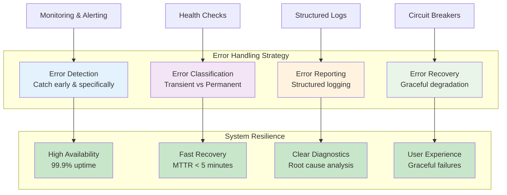

# Chapter 6: Robust Error Handling and Logging

> *"Errors are not failures; they are opportunities to build more resilient systems."*

---

## Learning Objectives

By the end of this chapter, you will be able to:
- Implement comprehensive error handling strategies that never fail silently
- Design structured logging systems for effective debugging and monitoring
- Apply error recovery patterns that maintain system stability
- Create error handling architectures that support both development and production needs

---

## Introduction: Building Resilient Systems

Effective error handling and comprehensive logging are critical components of resilient software, enabling systems to gracefully manage unexpected situations and providing essential information for debugging and monitoring.



## 6.1 Principles of Effective Error Handling

Robust error handling adheres to several key principles designed to ensure transparency, rapid diagnosis, and system stability:

- **Do not fail silently:** Software should always report failures. Silent failures lead to user confusion, make it difficult for customer support to diagnose problems, and obscure the root cause of issues, eroding trust in the system. It is imperative to anticipate user mistakes and plan error messages during the software design phase.

- **Follow programming language guides:** Adhering to the error handling guidelines established by the specific programming language or framework being used ensures consistency and leverages best practices within that ecosystem.

- **Implement the full error model:** Systems should return canonical error codes and status messages, providing structured and consistent information about errors. This facilitates automated processing of errors and clearer communication across different system components.

- **Avoid swallowing the root cause:** Generic error messages, such as "Server error," are unhelpful because they hide the underlying problem. API implementations should provide specific context about the failure, especially if server logs contain identifiable user and operation information.

- **Log error codes:** Numeric error codes, alongside textual messages, are invaluable for customer support and engineering teams to monitor and diagnose errors efficiently. All error codes, whether for internal or external errors, should be properly documented.

- **Raise errors immediately:** Errors should be identified and reported as early as possible in the execution flow. Delaying the reporting of errors significantly increases debugging costs and complexity, as the context of the error may be lost.

**Vibe Coding Prompt:**
```
I have an API endpoint that currently fails silently with a generic 500 error when the database is unavailable. Help me implement proper error handling that never fails silently.

Current Problem:
- Generic 500 errors with no context
- Database connection failures are swallowed
- No structured error responses
- Difficult for support team to diagnose issues

Please generate:
1. Proper exception handling for database connectivity issues
2. Structured error response format with specific error codes
3. HTTP status code mapping (503 for service unavailable, etc.)
4. Error logging with sufficient context for debugging
5. User-friendly error messages that don't expose internal details
6. Error documentation for the API

Example desired response:
{
  "error_code": "DB_UNAVAILABLE",
  "message": "The service is temporarily unavailable. Please try again later.",
  "timestamp": "2024-01-15T10:30:00Z",
  "request_id": "req_123456"
}

Use Python/FastAPI and include proper exception middleware.
```

## 6.2 Strategies for Error Catching and Recovery

Beyond the core principles, specific strategies enhance error catching and recovery:

- **Be very thorough with error checking:** Programmers should assume that everything in their program that can fail, will fail, and even things they haven't considered may fail. This necessitates comprehensive error checking to minimize issues.

- **Check for errors first:** As a stylistic convention and best practice, error checking should precede normal program execution. In methods that might throw exceptions, the exception should be thrown as early as possible.

- **Handle errors at the earliest appropriate place:** Errors should be handled at the point in the call stack where there is sufficient context to decide on the appropriate recovery action. While exceptions may need to propagate up, they should not propagate higher than necessary.

- **Put the minimum code in try blocks:** When using exceptions, it is best practice to encapsulate as little code as possible within try blocks. This improves clarity by making it easier to identify which code segments might raise specific exceptions.

- **Restore state and resources:** After recovering from an error, the program's state must be restored to a correct and consistent condition. This includes fixing or reverting any partial changes and closing any side effects or resources that were initiated by the erroring code.

**Vibe Coding Prompt:**
```
I need to implement robust error handling for a file processing job that currently has poor error recovery. Help me build a comprehensive error handling system.

Current Issues:
- Large try blocks that make it hard to identify error sources
- File handles not properly closed on errors
- No state restoration after partial failures
- Errors not caught early enough in the process

Requirements:
- Process large CSV files with user data
- Validate each row before processing
- Handle I/O errors, validation errors, and network timeouts
- Ensure file handles are always closed
- Restore system state if processing fails midway

Please generate:
1. Granular try-catch blocks with specific error handling
2. Resource management with proper cleanup (context managers)
3. State restoration mechanisms for partial failures
4. Early validation and error detection
5. Retry logic for transient failures
6. Comprehensive error logging with context
7. Progress tracking and rollback capabilities

Use Python with proper exception hierarchy and include unit tests for error scenarios.
```

## 6.3 Structured Logging for Debugging and Monitoring

Logging is an indispensable practice for documenting failures, exceptions, and errors within a software system. Log data, often voluminous, is a rich source of information for developers to understand potential issues, identify behaviors indicating performance bottlenecks (such as frequent error messages or increased latency), and resolve them promptly.

Structured logging, where log entries are formatted consistently (e.g., JSON), makes it easier to analyze and query log data programmatically. Integrating logging with automated monitoring and alerting systems allows for real-time tracking of key metrics and proactive notification of abnormalities, preventing major downtime and ensuring the software system remains robust and scalable.

**Vibe Coding Prompt:**
```
I need to convert our payment service from unstructured logging to a comprehensive structured logging system. Help me implement this transformation.

Current Problems:
- Inconsistent log formats across the service
- Difficult to trace transactions across multiple log entries
- No correlation IDs for debugging
- Logs not suitable for automated analysis
- Missing important context in error logs

Requirements:
- JSON-formatted log entries
- Correlation IDs for transaction tracing
- Consistent log levels and structure
- Integration with monitoring tools (ELK stack)
- Performance metrics logging
- Security-aware logging (no sensitive data)

Please generate:
1. Structured logging configuration and setup
2. Log entry schema with required fields
3. Correlation ID generation and propagation
4. Context managers for automatic log enrichment
5. Performance and business metrics logging
6. Error logging with stack traces and context
7. Log aggregation and monitoring integration
8. Security filters to prevent sensitive data logging

Use Python with structlog library and include examples for payment processing, user authentication, and error scenarios. Show how to query and analyze the structured logs.
``` 