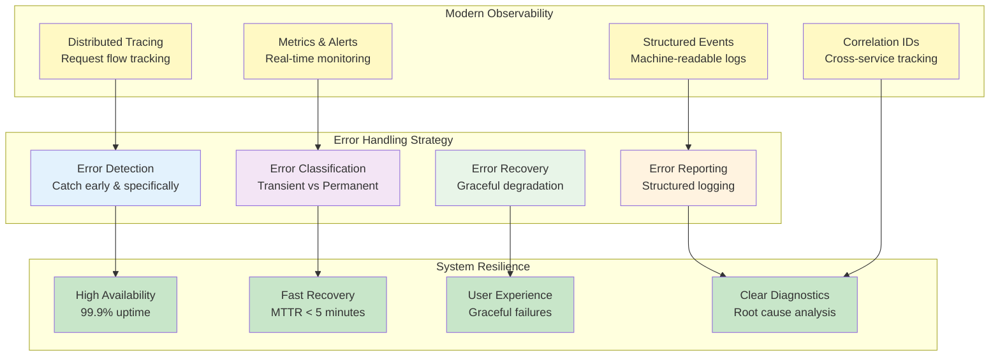
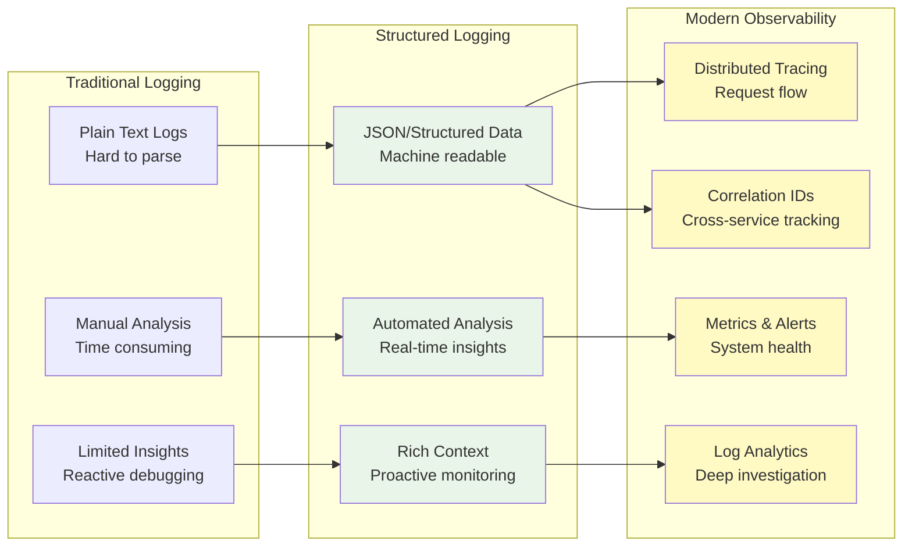

# Chapter 6: Robust Error Handling and Logging

> *"Errors are not failures; they are opportunities to build more resilient systems."*

---

## Learning Objectives

By the end of this chapter, you will be able to:
- Implement comprehensive error handling strategies that never fail silently
- Design structured logging systems for effective debugging and monitoring
- Apply error recovery patterns that maintain system stability
- Create error handling architectures that support both development and production needs
- Build resilient systems that gracefully handle failures and provide actionable insights
- Implement modern observability practices for production systems

---

## Introduction: Building Resilient Systems

In today's complex software landscape, failures are not a possibility—they're a certainty. Your database might go down, a service might become unresponsive, a network call might time out, or an external API might return unexpected data. The question is not *if* these things will happen, but *when* and *how well* your system will handle them.

Effective error handling and comprehensive logging are the twin pillars of resilient software systems. They enable applications to gracefully manage unexpected situations while providing essential information for debugging, monitoring, and continuous improvement. Modern systems must be designed with failure in mind, implementing patterns that allow for graceful degradation rather than catastrophic failure.

The cost of poor error handling extends far beyond technical issues. According to industry studies, system downtime can cost organizations thousands of dollars per minute, damage customer trust, and create security vulnerabilities. Conversely, well-implemented error handling and logging systems can reduce mean time to recovery (MTTR) by 60-80% and significantly improve overall system reliability.



## 6.1 Principles of Effective Error Handling

Robust error handling is built on fundamental principles that ensure systems remain stable, debuggable, and maintainable. These principles have evolved from decades of software engineering experience and are essential for building resilient systems.

### Core Error Handling Principles

#### **1. Never Fail Silently**
Silent failures are among the most dangerous types of errors because they hide problems until they become critical. Every error condition must be explicitly handled and reported.

**Why this matters:**
- Silent failures lead to data corruption and inconsistent system state
- They make debugging nearly impossible when issues surface later
- Users lose trust when systems behave unpredictably
- Support teams cannot help customers without error information

**Implementation strategies:**
```python
# Bad: Silent failure
def process_payment(amount, card_token):
    try:
        result = payment_gateway.charge(amount, card_token)
        return result
    except:
        return None  # Silent failure - caller doesn't know what happened

# Good: Explicit error handling
def process_payment(amount, card_token):
    try:
        result = payment_gateway.charge(amount, card_token)
        logger.info("Payment processed successfully", 
                   extra={"amount": amount, "transaction_id": result.id})
        return result
    except PaymentGatewayError as e:
        logger.error("Payment gateway error", 
                    extra={"error_code": e.code, "amount": amount, "message": str(e)})
        raise PaymentProcessingError(f"Payment failed: {e.message}", error_code=e.code)
    except NetworkError as e:
        logger.error("Network error during payment", 
                    extra={"amount": amount, "retry_count": e.retry_count})
        raise PaymentNetworkError("Payment service unavailable", should_retry=True)
```

#### **2. Implement Comprehensive Error Classification**
Not all errors are created equal. A robust error handling system categorizes errors to enable appropriate responses.

**Error Categories:**

| Category | Description | Response Strategy | Examples |
|----------|-------------|-------------------|----------|
| **Transient** | Temporary issues that may resolve themselves | Retry with backoff | Network timeouts, rate limits |
| **Permanent** | Issues requiring intervention | Fail fast, alert | Invalid input, missing resources |
| **Systemic** | Infrastructure or configuration problems | Circuit breaker, fallback | Database down, service unavailable |
| **Business** | Domain-specific validation failures | User feedback, logging | Insufficient funds, expired tokens |

```python
from enum import Enum
from dataclasses import dataclass
from typing import Optional

class ErrorCategory(Enum):
    TRANSIENT = "transient"
    PERMANENT = "permanent"
    SYSTEMIC = "systemic"
    BUSINESS = "business"

@dataclass
class ErrorContext:
    category: ErrorCategory
    error_code: str
    message: str
    should_retry: bool
    retry_after: Optional[int] = None
    correlation_id: Optional[str] = None
    
class PaymentError(Exception):
    def __init__(self, context: ErrorContext):
        self.context = context
        super().__init__(context.message)

# Usage example
def handle_payment_error(error):
    if error.context.category == ErrorCategory.TRANSIENT:
        schedule_retry(error.context.retry_after or 30)
    elif error.context.category == ErrorCategory.BUSINESS:
        notify_user(error.context.message)
    elif error.context.category == ErrorCategory.SYSTEMIC:
        trigger_circuit_breaker()
        alert_operations_team(error.context)
```

#### **3. Provide Rich Error Context**
Effective error messages include sufficient context for both humans and machines to understand and act upon the error.

**Essential context elements:**
- **What happened**: Clear description of the error
- **When it happened**: Precise timestamp and duration
- **Where it happened**: Service, method, and line of code
- **Why it happened**: Root cause when determinable
- **What to do**: Next steps for resolution

```python
import traceback
from datetime import datetime
from typing import Dict, Any

class ContextualError(Exception):
    def __init__(self, message: str, error_code: str, context: Dict[str, Any] = None):
        self.message = message
        self.error_code = error_code
        self.context = context or {}
        self.timestamp = datetime.utcnow().isoformat()
        self.stack_trace = traceback.format_exc()
        super().__init__(message)
    
    def to_dict(self):
        return {
            "error_code": self.error_code,
            "message": self.message,
            "timestamp": self.timestamp,
            "context": self.context,
            "stack_trace": self.stack_trace
        }

# Usage
try:
    user = get_user(user_id)
    if not user.is_active:
        raise ContextualError(
            message="Cannot process payment for inactive user",
            error_code="USER_INACTIVE",
            context={
                "user_id": user_id,
                "user_status": user.status,
                "last_login": user.last_login.isoformat(),
                "account_type": user.account_type
            }
        )
except ContextualError as e:
    logger.error("Payment processing failed", extra=e.to_dict())
    raise
```

#### **4. Implement Fail-Fast Principles**
Detect and report errors as early as possible in the execution flow to minimize the blast radius and preserve system state.

```python
def process_order(order_data: dict):
    # Validate early - fail fast
    if not order_data:
        raise ValueError("Order data cannot be empty")
    
    required_fields = ['customer_id', 'items', 'payment_method']
    missing_fields = [field for field in required_fields if field not in order_data]
    if missing_fields:
        raise ValueError(f"Missing required fields: {missing_fields}")
    
    # Validate business rules early
    customer = get_customer(order_data['customer_id'])
    if not customer.can_place_orders():
        raise BusinessRuleError(
            f"Customer {customer.id} is not eligible to place orders",
            error_code="CUSTOMER_INELIGIBLE"
        )
    
    # Continue with processing only after validation
    return create_order(order_data)
```

#### **5. Design for Graceful Degradation**
When errors occur, systems should degrade functionality gracefully rather than failing completely.

```python
class RecommendationService:
    def __init__(self):
        self.ml_service = MLRecommendationService()
        self.fallback_service = PopularItemsService()
        self.cache = RedisCache()
    
    def get_recommendations(self, user_id: str, count: int = 10):
        try:
            # Try primary recommendation engine
            recommendations = self.ml_service.get_recommendations(user_id, count)
            logger.info("ML recommendations served", 
                       extra={"user_id": user_id, "count": len(recommendations)})
            return recommendations
            
        except MLServiceUnavailableError:
            logger.warning("ML service unavailable, using fallback", 
                          extra={"user_id": user_id})
            
            # Try cached recommendations
            cached = self.cache.get(f"recommendations:{user_id}")
            if cached:
                logger.info("Served cached recommendations", 
                           extra={"user_id": user_id, "source": "cache"})
                return cached[:count]
            
            # Fall back to popular items
            popular_items = self.fallback_service.get_popular_items(count)
            logger.info("Served popular items as fallback", 
                       extra={"user_id": user_id, "source": "popular"})
            return popular_items
            
        except Exception as e:
            logger.error("Recommendation service error", 
                        extra={"user_id": user_id, "error": str(e)})
            # Return empty list rather than failing
            return []
```

### 💡 **Vibe Coding Prompt: Comprehensive Error Handling System**

**Your Vibe Coding Challenge:**

```
I need to transform our e-commerce payment service from a fragile system with poor error handling into a resilient, production-ready service that never fails silently and provides actionable insights for debugging.

Current Pain Points:
- Generic 500 errors with no context or correlation IDs
- Database connection failures cause silent data corruption
- Payment gateway timeouts crash the entire checkout process
- No structured error responses for frontend consumption
- Support team spends hours debugging issues without proper logs
- No graceful degradation when external services fail

System Context:
- Python/FastAPI microservice handling 10,000+ payments/day
- Integrates with Stripe, PayPal, and internal fraud detection
- PostgreSQL database with Redis caching layer
- Deployed on Kubernetes with multiple replicas

Please generate a comprehensive solution that includes:

1. **Robust Exception Hierarchy**:
   - Custom exception classes for different error categories
   - Structured error context with correlation IDs
   - Automatic error classification (transient vs permanent)
   - Rich error metadata for debugging and monitoring

2. **Intelligent Error Recovery Patterns**:
   - Circuit breaker implementation for external services
   - Exponential backoff retry logic with jitter
   - Graceful degradation strategies (cached data, fallback services)
   - Database connection pooling with health checks

3. **Production-Ready Error Responses**:
   - Structured JSON error format with error codes
   - HTTP status code mapping based on error types
   - User-friendly messages that don't expose internals
   - Developer-friendly error details in logs only

4. **Comprehensive Logging Integration**:
   - Structured logging with correlation IDs
   - Error context preservation across service boundaries
   - Performance metrics and error rate tracking
   - Integration with monitoring and alerting systems

5. **Error Handling Middleware**:
   - Global exception handler for FastAPI
   - Request/response correlation ID injection
   - Automatic error categorization and logging
   - Rate limiting for error-prone endpoints

6. **Testing and Validation Framework**:
   - Unit tests for all error scenarios
   - Integration tests with fault injection
   - Chaos engineering test cases
   - Error handling documentation and runbooks

Include real-world examples of payment processing errors, database failures, and external service timeouts. Show how the system maintains data consistency and provides clear feedback to users while giving operations teams the information they need for rapid incident resolution.

Bonus: Include monitoring dashboards and alerting rules that leverage the structured error data.
```

## 6.2 Advanced Error Recovery Strategies

Modern distributed systems require sophisticated error recovery strategies that go beyond simple try-catch blocks. These strategies enable systems to maintain availability and consistency even when components fail.

### Timeout and Retry Patterns

#### **Intelligent Timeout Configuration**
Every network call should have a timeout, but the timeout value should be based on the service's actual performance characteristics, not arbitrary values.

```python
import asyncio
import time
from typing import Optional, Callable, Any
from dataclasses import dataclass

@dataclass
class TimeoutConfig:
    connect_timeout: float = 5.0
    read_timeout: float = 30.0
    total_timeout: float = 60.0
    
class TimeoutManager:
    def __init__(self, config: TimeoutConfig):
        self.config = config
        
    async def with_timeout(self, operation: Callable, operation_name: str) -> Any:
        start_time = time.time()
        try:
            return await asyncio.wait_for(
                operation(), 
                timeout=self.config.total_timeout
            )
        except asyncio.TimeoutError:
            duration = time.time() - start_time
            logger.error("Operation timeout", extra={
                "operation": operation_name,
                "timeout_seconds": self.config.total_timeout,
                "actual_duration": duration,
                "timeout_type": "total"
            })
            raise OperationTimeoutError(
                f"{operation_name} timed out after {duration:.2f}s",
                timeout_duration=duration
            )

# Usage
timeout_manager = TimeoutManager(TimeoutConfig(
    connect_timeout=2.0,
    read_timeout=10.0,
    total_timeout=15.0
))

async def call_external_service():
    return await timeout_manager.with_timeout(
        lambda: external_api.get_user_data(user_id),
        "external_user_lookup"
    )
```

#### **Exponential Backoff with Jitter**
Implement intelligent retry logic that prevents thundering herd problems while maximizing success rates.

```python
import random
import asyncio
from typing import List, Type, Union

class RetryConfig:
    def __init__(
        self,
        max_attempts: int = 3,
        base_delay: float = 1.0,
        max_delay: float = 60.0,
        exponential_base: float = 2.0,
        jitter: bool = True,
        retryable_exceptions: List[Type[Exception]] = None
    ):
        self.max_attempts = max_attempts
        self.base_delay = base_delay
        self.max_delay = max_delay
        self.exponential_base = exponential_base
        self.jitter = jitter
        self.retryable_exceptions = retryable_exceptions or [
            ConnectionError, TimeoutError, TemporaryServiceError
        ]

class RetryManager:
    def __init__(self, config: RetryConfig):
        self.config = config
    
    def calculate_delay(self, attempt: int) -> float:
        """Calculate delay with exponential backoff and optional jitter"""
        delay = min(
            self.config.base_delay * (self.config.exponential_base ** attempt),
            self.config.max_delay
        )
        
        if self.config.jitter:
            # Add jitter to prevent thundering herd
            delay = delay * (0.5 + random.random() * 0.5)
        
        return delay
    
    async def retry_async(self, operation: Callable, operation_name: str) -> Any:
        last_exception = None
        
        for attempt in range(self.config.max_attempts):
            try:
                result = await operation()
                if attempt > 0:
                    logger.info("Operation succeeded after retry", extra={
                        "operation": operation_name,
                        "attempt": attempt + 1,
                        "total_attempts": self.config.max_attempts
                    })
                return result
                
            except Exception as e:
                last_exception = e
                
                # Check if exception is retryable
                if not any(isinstance(e, exc_type) for exc_type in self.config.retryable_exceptions):
                    logger.error("Non-retryable error encountered", extra={
                        "operation": operation_name,
                        "error_type": type(e).__name__,
                        "error_message": str(e),
                        "attempt": attempt + 1
                    })
                    raise
                
                # Don't delay on the last attempt
                if attempt < self.config.max_attempts - 1:
                    delay = self.calculate_delay(attempt)
                    logger.warning("Operation failed, retrying", extra={
                        "operation": operation_name,
                        "attempt": attempt + 1,
                        "max_attempts": self.config.max_attempts,
                        "retry_delay": delay,
                        "error_type": type(e).__name__,
                        "error_message": str(e)
                    })
                    await asyncio.sleep(delay)
        
        # All retries exhausted
        logger.error("Operation failed after all retries", extra={
            "operation": operation_name,
            "total_attempts": self.config.max_attempts,
            "final_error": str(last_exception)
        })
        raise MaxRetriesExceededError(
            f"{operation_name} failed after {self.config.max_attempts} attempts",
            original_error=last_exception
        )
```

### Circuit Breaker Pattern

Circuit breakers prevent cascading failures by temporarily stopping requests to failing services.

```python
import time
from enum import Enum
from typing import Callable, Any
from dataclasses import dataclass, field

class CircuitState(Enum):
    CLOSED = "closed"      # Normal operation
    OPEN = "open"          # Failing, rejecting requests
    HALF_OPEN = "half_open"  # Testing if service recovered

@dataclass
class CircuitBreakerConfig:
    failure_threshold: int = 5
    recovery_timeout: float = 60.0
    expected_exception: Type[Exception] = Exception
    success_threshold: int = 3  # For half-open state

class CircuitBreaker:
    def __init__(self, name: str, config: CircuitBreakerConfig):
        self.name = name
        self.config = config
        self.state = CircuitState.CLOSED
        self.failure_count = 0
        self.success_count = 0
        self.last_failure_time = None
        
    def _should_attempt_reset(self) -> bool:
        """Check if enough time has passed to attempt recovery"""
        return (
            self.state == CircuitState.OPEN and
            self.last_failure_time and
            time.time() - self.last_failure_time >= self.config.recovery_timeout
        )
    
    def _record_success(self):
        """Record successful operation"""
        self.failure_count = 0
        
        if self.state == CircuitState.HALF_OPEN:
            self.success_count += 1
            if self.success_count >= self.config.success_threshold:
                self.state = CircuitState.CLOSED
                self.success_count = 0
                logger.info("Circuit breaker closed", extra={
                    "circuit_name": self.name,
                    "state": self.state.value
                })
    
    def _record_failure(self):
        """Record failed operation"""
        self.failure_count += 1
        self.last_failure_time = time.time()
        self.success_count = 0
        
        if self.failure_count >= self.config.failure_threshold:
            self.state = CircuitState.OPEN
            logger.warning("Circuit breaker opened", extra={
                "circuit_name": self.name,
                "failure_count": self.failure_count,
                "state": self.state.value
            })
    
    async def call(self, operation: Callable, *args, **kwargs) -> Any:
        """Execute operation with circuit breaker protection"""
        
        # Check if we should attempt reset
        if self._should_attempt_reset():
            self.state = CircuitState.HALF_OPEN
            logger.info("Circuit breaker half-open", extra={
                "circuit_name": self.name,
                "state": self.state.value
            })
        
        # Reject requests if circuit is open
        if self.state == CircuitState.OPEN:
            raise CircuitBreakerOpenError(
                f"Circuit breaker {self.name} is open",
                circuit_name=self.name
            )
        
        try:
            result = await operation(*args, **kwargs)
            self._record_success()
            return result
            
        except self.config.expected_exception as e:
            self._record_failure()
            raise
        except Exception as e:
            # Unexpected exceptions don't count as circuit breaker failures
            logger.error("Unexpected error in circuit breaker", extra={
                "circuit_name": self.name,
                "error_type": type(e).__name__,
                "error_message": str(e)
            })
            raise

# Usage example
payment_circuit = CircuitBreaker(
    name="payment_gateway",
    config=CircuitBreakerConfig(
        failure_threshold=3,
        recovery_timeout=30.0,
        expected_exception=PaymentGatewayError
    )
)

async def process_payment_with_circuit_breaker(amount, card_token):
    try:
        return await payment_circuit.call(
            payment_gateway.charge,
            amount,
            card_token
        )
    except CircuitBreakerOpenError:
        # Use fallback payment method or queue for later
        return await fallback_payment_processor.charge(amount, card_token)
```

### Bulkhead Pattern

Isolate critical resources to prevent failures from spreading across the system.

```python
import asyncio
from typing import Dict, Any
from dataclasses import dataclass

@dataclass
class BulkheadConfig:
    max_concurrent_requests: int = 10
    queue_size: int = 100
    timeout: float = 30.0

class Bulkhead:
    def __init__(self, name: str, config: BulkheadConfig):
        self.name = name
        self.config = config
        self.semaphore = asyncio.Semaphore(config.max_concurrent_requests)
        self.queue = asyncio.Queue(maxsize=config.queue_size)
        self.active_requests = 0
        
    async def execute(self, operation: Callable, operation_name: str) -> Any:
        """Execute operation within bulkhead constraints"""
        
        # Check if we can accept more requests
        if self.queue.full():
            raise BulkheadCapacityExceededError(
                f"Bulkhead {self.name} queue is full",
                bulkhead_name=self.name,
                queue_size=self.config.queue_size
            )
        
        async with self.semaphore:
            self.active_requests += 1
            try:
                logger.debug("Executing operation in bulkhead", extra={
                    "bulkhead_name": self.name,
                    "operation": operation_name,
                    "active_requests": self.active_requests,
                    "max_concurrent": self.config.max_concurrent_requests
                })
                
                return await asyncio.wait_for(
                    operation(),
                    timeout=self.config.timeout
                )
            finally:
                self.active_requests -= 1

# Usage: Separate bulkheads for different types of operations
database_bulkhead = Bulkhead("database", BulkheadConfig(max_concurrent_requests=20))
external_api_bulkhead = Bulkhead("external_api", BulkheadConfig(max_concurrent_requests=5))
file_processing_bulkhead = Bulkhead("file_processing", BulkheadConfig(max_concurrent_requests=3))

async def get_user_data(user_id: str):
    return await database_bulkhead.execute(
        lambda: db.get_user(user_id),
        "get_user"
    )

async def call_external_service(request_data):
    return await external_api_bulkhead.execute(
        lambda: external_api.call(request_data),
        "external_api_call"
    )
```

### 💡 **Vibe Coding Prompt: Resilient Distributed System Architecture**

**Your Vibe Coding Challenge:**

```
I need to architect a resilient microservices system for a high-traffic e-commerce platform that can handle failures gracefully and maintain business continuity even when multiple components fail simultaneously.

Current Architecture Pain Points:
- Order processing fails completely when payment service is down
- Inventory service timeouts cause entire checkout to hang
- No circuit breakers - failures cascade across all services
- Database connection pool exhaustion brings down multiple services
- No graceful degradation - it's either 100% working or completely broken
- Retry storms during outages make recovery impossible

System Requirements:
- Handle 50,000+ orders per hour during peak traffic
- 99.9% availability SLA with sub-200ms response times
- Integration with 5+ external payment providers
- Real-time inventory management across 3 warehouses
- Fraud detection service with ML model inference
- Email/SMS notification system

Please design and implement:

1. **Comprehensive Resilience Patterns**:
   - Circuit breakers for all external service calls
   - Bulkhead isolation for different operation types
   - Intelligent retry with exponential backoff and jitter
   - Timeout management with service-specific configurations
   - Health checks and service discovery integration

2. **Graceful Degradation Strategies**:
   - Fallback payment processing when primary providers fail
   - Cached inventory data when real-time service is unavailable
   - Simplified fraud detection when ML service is down
   - Asynchronous notification queuing with dead letter handling
   - Read-only mode when database writes are failing

3. **Resource Management and Isolation**:
   - Database connection pooling with circuit breakers
   - Rate limiting per client and operation type
   - Memory and CPU resource constraints
   - Separate thread pools for different operation categories
   - Queue management with backpressure handling

4. **Comprehensive Error Recovery**:
   - Saga pattern for distributed transaction management
   - Compensating actions for partial failures
   - Event sourcing for audit trails and replay capability
   - Idempotent operations with deduplication
   - State machine for order processing with recovery points

5. **Monitoring and Observability**:
   - Real-time metrics for all resilience patterns
   - Distributed tracing across service boundaries
   - Custom dashboards for circuit breaker states
   - Automated alerting for degraded service modes
   - Chaos engineering test scenarios

Include practical examples of:
- Order processing with payment failures and inventory conflicts
- Service mesh configuration for traffic management
- Kubernetes deployment with health checks and resource limits
- Load testing scenarios that validate resilience patterns
- Incident response playbooks for common failure modes

Bonus: Show how the system maintains data consistency and provides clear user feedback during various failure scenarios, including partial outages and network partitions.
```

## 6.3 Structured Logging for Modern Observability

Traditional logging approaches, where developers write plain text messages to files, are inadequate for modern distributed systems. Structured logging transforms logs from human-readable text into machine-parsable data, enabling powerful analysis, correlation, and automated processing.

### The Evolution from Logs to Observability

Modern systems require more than just logs—they need comprehensive observability that combines logs, metrics, and traces to provide a complete picture of system behavior.



### Structured Logging Fundamentals

#### **What Makes Logging "Structured"**

Structured logging organizes log data into consistent, machine-readable formats with key-value pairs rather than free-form text.

```python
# Traditional unstructured logging
logger.info(f"User {user_id} logged in from {ip_address} at {timestamp}")

# Structured logging
logger.info("User login successful", extra={
    "event_type": "user_login",
    "user_id": user_id,
    "ip_address": ip_address,
    "timestamp": timestamp,
    "session_id": session_id,
    "user_agent": request.headers.get("User-Agent"),
    "login_method": "password",
    "account_type": user.account_type
})
```

#### **Benefits of Structured Logging**

| Capability | Unstructured Logs | Structured Logs |
|------------|-------------------|-----------------|
| **Search by field** | Impossible | Easy |
| **Aggregate metrics** | Manual/regex | Automatic |
| **Filter by criteria** | Complex regex | Simple queries |
| **Correlation analysis** | Nearly impossible | Built-in |
| **Real-time alerting** | Limited | Comprehensive |
| **Performance analysis** | Manual | Automated |

### Implementing Production-Ready Structured Logging

#### **Comprehensive Logging Configuration**

```python
import logging
import json
import uuid
import time
from datetime import datetime
from typing import Dict, Any, Optional
from contextvars import ContextVar
from dataclasses import dataclass, asdict

# Context variables for request tracking
correlation_id_var: ContextVar[Optional[str]] = ContextVar('correlation_id', default=None)
user_id_var: ContextVar[Optional[str]] = ContextVar('user_id', default=None)

@dataclass
class LogContext:
    service_name: str
    version: str
    environment: str
    correlation_id: Optional[str] = None
    user_id: Optional[str] = None
    session_id: Optional[str] = None
    request_id: Optional[str] = None

class StructuredFormatter(logging.Formatter):
    def __init__(self, service_context: LogContext):
        super().__init__()
        self.service_context = service_context
    
    def format(self, record: logging.LogRecord) -> str:
        # Base log structure
        log_entry = {
            "timestamp": datetime.utcnow().isoformat() + "Z",
            "level": record.levelname,
            "message": record.getMessage(),
            "logger": record.name,
            "module": record.module,
            "function": record.funcName,
            "line": record.lineno,
            
            # Service context
            "service": {
                "name": self.service_context.service_name,
                "version": self.service_context.version,
                "environment": self.service_context.environment
            },
            
            # Request context from context variables
            "correlation_id": correlation_id_var.get(),
            "user_id": user_id_var.get(),
            
            # Performance metrics
            "duration_ms": getattr(record, 'duration_ms', None),
            "memory_usage_mb": getattr(record, 'memory_usage_mb', None),
        }
        
        # Add exception information if present
        if record.exc_info:
            log_entry["exception"] = {
                "type": record.exc_info[0].__name__,
                "message": str(record.exc_info[1]),
                "stack_trace": self.formatException(record.exc_info)
            }
        
        # Add custom fields from extra parameter
        if hasattr(record, 'extra_fields'):
            log_entry.update(record.extra_fields)
        
        # Remove None values to keep logs clean
        log_entry = {k: v for k, v in log_entry.items() if v is not None}
        
        return json.dumps(log_entry, default=str, ensure_ascii=False)

class StructuredLogger:
    def __init__(self, name: str, context: LogContext):
        self.logger = logging.getLogger(name)
        self.context = context
        
        # Configure handler with structured formatter
        handler = logging.StreamHandler()
        handler.setFormatter(StructuredFormatter(context))
        self.logger.addHandler(handler)
        self.logger.setLevel(logging.INFO)
    
    def _log(self, level: int, message: str, **kwargs):
        """Internal logging method that adds context"""
        extra_fields = kwargs.copy()
        
        # Add timing information if available
        if 'start_time' in kwargs:
            duration_ms = (time.time() - kwargs.pop('start_time')) * 1000
            extra_fields['duration_ms'] = round(duration_ms, 2)
        
        # Create log record with extra fields
        self.logger.log(level, message, extra={'extra_fields': extra_fields})
    
    def info(self, message: str, **kwargs):
        self._log(logging.INFO, message, **kwargs)
    
    def warning(self, message: str, **kwargs):
        self._log(logging.WARNING, message, **kwargs)
    
    def error(self, message: str, **kwargs):
        self._log(logging.ERROR, message, **kwargs)
    
    def debug(self, message: str, **kwargs):
        self._log(logging.DEBUG, message, **kwargs)

# Initialize structured logger
service_context = LogContext(
    service_name="payment-service",
    version="1.2.3",
    environment="production"
)

logger = StructuredLogger("payment_service", service_context)
```

#### **Request Correlation and Context Management**

```python
import asyncio
from fastapi import FastAPI, Request, Response
from fastapi.middleware.base import BaseHTTPMiddleware

class CorrelationMiddleware(BaseHTTPMiddleware):
    async def dispatch(self, request: Request, call_next):
        # Generate or extract correlation ID
        correlation_id = (
            request.headers.get("X-Correlation-ID") or 
            str(uuid.uuid4())
        )
        
        # Set context variables
        correlation_id_var.set(correlation_id)
        
        # Extract user ID from JWT token or session
        user_id = self.extract_user_id(request)
        if user_id:
            user_id_var.set(user_id)
        
        start_time = time.time()
        
        # Log request start
        logger.info("Request started", 
            method=request.method,
            path=request.url.path,
            query_params=dict(request.query_params),
            user_agent=request.headers.get("User-Agent"),
            ip_address=request.client.host,
            correlation_id=correlation_id
        )
        
        try:
            response = await call_next(request)
            
            # Log successful request completion
            logger.info("Request completed",
                method=request.method,
                path=request.url.path,
                status_code=response.status_code,
                start_time=start_time,
                correlation_id=correlation_id
            )
            
            # Add correlation ID to response headers
            response.headers["X-Correlation-ID"] = correlation_id
            return response
            
        except Exception as e:
            # Log request failure
            logger.error("Request failed",
                method=request.method,
                path=request.url.path,
                error_type=type(e).__name__,
                error_message=str(e),
                start_time=start_time,
                correlation_id=correlation_id,
                exc_info=True
            )
            raise
    
    def extract_user_id(self, request: Request) -> Optional[str]:
        # Implementation depends on your authentication system
        auth_header = request.headers.get("Authorization")
        if auth_header and auth_header.startswith("Bearer "):
            # Decode JWT token and extract user ID
            # This is a simplified example
            return "user_123"  # Replace with actual JWT decoding
        return None

# FastAPI application setup
app = FastAPI()
app.add_middleware(CorrelationMiddleware)
```

#### **Business Event Logging**

```python
from enum import Enum
from typing import Union, Dict, Any

class EventType(Enum):
    USER_ACTION = "user_action"
    SYSTEM_EVENT = "system_event"
    BUSINESS_EVENT = "business_event"
    SECURITY_EVENT = "security_event"
    PERFORMANCE_EVENT = "performance_event"

class BusinessEventLogger:
    def __init__(self, structured_logger: StructuredLogger):
        self.logger = structured_logger
    
    def log_payment_processed(self, payment_data: Dict[str, Any]):
        """Log successful payment processing"""
        self.logger.info("Payment processed successfully",
            event_type=EventType.BUSINESS_EVENT.value,
            event_name="payment_processed",
            payment_id=payment_data["payment_id"],
            amount=payment_data["amount"],
            currency=payment_data["currency"],
            payment_method=payment_data["method"],
            merchant_id=payment_data["merchant_id"],
            processing_time_ms=payment_data.get("processing_time_ms"),
            gateway_response_code=payment_data.get("gateway_response_code")
        )
    
    def log_payment_failed(self, payment_data: Dict[str, Any], error: Exception):
        """Log payment processing failure"""
        self.logger.error("Payment processing failed",
            event_type=EventType.BUSINESS_EVENT.value,
            event_name="payment_failed",
            payment_id=payment_data["payment_id"],
            amount=payment_data["amount"],
            currency=payment_data["currency"],
            payment_method=payment_data["method"],
            error_code=getattr(error, 'error_code', 'UNKNOWN'),
            error_category=getattr(error, 'category', 'UNKNOWN'),
            gateway_error_code=getattr(error, 'gateway_error_code', None),
            retry_count=payment_data.get("retry_count", 0)
        )
    
    def log_user_login(self, user_id: str, login_method: str, success: bool, **kwargs):
        """Log user authentication events"""
        event_name = "user_login_success" if success else "user_login_failed"
        log_level = "info" if success else "warning"
        
        getattr(self.logger, log_level)(f"User login {('successful' if success else 'failed')}",
            event_type=EventType.SECURITY_EVENT.value,
            event_name=event_name,
            user_id=user_id,
            login_method=login_method,
            ip_address=kwargs.get("ip_address"),
            user_agent=kwargs.get("user_agent"),
            failure_reason=kwargs.get("failure_reason") if not success else None,
            attempt_count=kwargs.get("attempt_count", 1)
        )
    
    def log_performance_metric(self, operation: str, duration_ms: float, **kwargs):
        """Log performance metrics"""
        self.logger.info("Performance metric recorded",
            event_type=EventType.PERFORMANCE_EVENT.value,
            event_name="performance_metric",
            operation=operation,
            duration_ms=duration_ms,
            **kwargs
        )

# Usage example
business_logger = BusinessEventLogger(logger)

# In your payment processing code
try:
    payment_result = process_payment(payment_data)
    business_logger.log_payment_processed(payment_result)
except PaymentError as e:
    business_logger.log_payment_failed(payment_data, e)
    raise
```

### Log Sampling and Performance Optimization

For high-volume systems, logging every event can impact performance and storage costs. Implement intelligent sampling strategies.

```python
import random
from typing import Callable, Any

class LogSampler:
    def __init__(self, sample_rate: float = 1.0):
        self.sample_rate = sample_rate
    
    def should_log(self, log_level: str = "INFO") -> bool:
        """Determine if a log entry should be recorded"""
        # Always log errors and warnings
        if log_level in ["ERROR", "WARNING"]:
            return True
        
        # Sample other log levels
        return random.random() < self.sample_rate

class SampledStructuredLogger(StructuredLogger):
    def __init__(self, name: str, context: LogContext, sampler: LogSampler):
        super().__init__(name, context)
        self.sampler = sampler
    
    def _log(self, level: int, message: str, **kwargs):
        level_name = logging.getLevelName(level)
        
        # Check if we should log this entry
        if not self.sampler.should_log(level_name):
            return
        
        super()._log(level, message, **kwargs)

# Usage: Sample 10% of INFO logs, but keep all errors
sampler = LogSampler(sample_rate=0.1)
sampled_logger = SampledStructuredLogger("payment_service", service_context, sampler)
```

### 💡 **Vibe Coding Prompt: Advanced Observability Platform**

**Your Vibe Coding Challenge:**

```
I need to build a comprehensive observability platform for our microservices architecture that goes beyond basic logging to provide deep insights into system behavior, performance, and business metrics.

Current Observability Gaps:
- Scattered logs across 15+ microservices with inconsistent formats
- No correlation between logs, metrics, and traces
- Manual debugging takes hours for cross-service issues
- No business intelligence from operational data
- Alert fatigue from too many false positives
- No proactive issue detection or anomaly identification

System Context:
- 15 microservices handling 1M+ requests/day
- Multi-cloud deployment (AWS, GCP) with Kubernetes
- Real-time data processing with Kafka and Redis
- Machine learning models for recommendations and fraud detection
- Global user base with strict latency requirements

Please design and implement a comprehensive solution that includes:

1. **Unified Structured Logging Framework**:
   - OpenTelemetry integration for logs, metrics, and traces
   - Consistent log schema across all services
   - Automatic correlation ID propagation
   - Context-aware logging with user journey tracking
   - Performance metrics embedded in log events

2. **Intelligent Log Processing Pipeline**:
   - Real-time log ingestion with Kafka/Kinesis
   - Automatic log parsing and enrichment
   - Sensitive data detection and masking
   - Log sampling strategies for high-volume services
   - Dead letter queue handling for processing failures

3. **Advanced Analytics and Correlation**:
   - Cross-service request tracing and visualization
   - Automatic error pattern detection and clustering
   - Business metrics extraction from operational logs
   - Anomaly detection using machine learning
   - Root cause analysis with dependency mapping

4. **Proactive Monitoring and Alerting**:
   - Dynamic threshold adjustment based on historical patterns
   - Multi-dimensional alerting (error rate, latency, business KPIs)
   - Alert correlation to reduce noise
   - Automated incident response workflows
   - Predictive alerting for capacity and performance issues

5. **Developer Experience and Debugging Tools**:
   - Interactive log exploration with natural language queries
   - Distributed trace visualization with performance insights
   - Code-level error tracking with stack trace analysis
   - A/B test impact analysis through log correlation
   - Custom dashboards for different team needs

6. **Business Intelligence Integration**:
   - Real-time business metrics from operational data
   - Customer journey analysis across services
   - Feature usage analytics and performance correlation
   - Revenue impact analysis for system issues
   - Compliance and audit trail generation

Include practical implementations for:
- Multi-language SDK for consistent logging (Python, Java, Node.js, Go)
- Kubernetes deployment with auto-scaling based on log volume
- Integration with existing tools (Prometheus, Grafana, PagerDuty)
- Cost optimization strategies for log storage and processing
- Security and compliance considerations for sensitive data

Bonus: Show how the platform enables data-driven decision making by surfacing insights that were previously hidden in operational noise, and demonstrate how it reduces MTTR from hours to minutes.
```

## 6.4 Security and Compliance in Error Handling

Error handling systems can inadvertently become security vulnerabilities if not properly designed. This section covers essential security practices for robust error handling and logging systems.

### Information Disclosure Prevention

#### **Sanitizing Error Messages**

Error messages should provide enough information for debugging without exposing sensitive system details to potential attackers.

```python
from typing import Dict, Any, Optional
import re
from enum import Enum

class ErrorSeverity(Enum):
    LOW = "low"
    MEDIUM = "medium"
    HIGH = "high"
    CRITICAL = "critical"

class SecureErrorHandler:
    def __init__(self, environment: str = "production"):
        self.environment = environment
        self.sensitive_patterns = [
            r'password[=:]\s*\S+',
            r'token[=:]\s*\S+',
            r'key[=:]\s*\S+',
            r'secret[=:]\s*\S+',
            r'\b\d{4}[-\s]?\d{4}[-\s]?\d{4}[-\s]?\d{4}\b',  # Credit card
            r'\b\d{3}-\d{2}-\d{4}\b',  # SSN
        ]
    
    def sanitize_error_message(self, error_message: str) -> str:
        """Remove sensitive information from error messages"""
        sanitized = error_message
        
        for pattern in self.sensitive_patterns:
            sanitized = re.sub(pattern, '[REDACTED]', sanitized, flags=re.IGNORECASE)
        
        return sanitized
    
    def create_user_safe_error(self, internal_error: Exception, error_code: str) -> Dict[str, Any]:
        """Create error response safe for external consumption"""
        
        # Internal error details for logging
        internal_details = {
            "error_type": type(internal_error).__name__,
            "error_message": str(internal_error),
            "stack_trace": traceback.format_exc() if self.environment != "production" else None,
            "error_code": error_code,
            "timestamp": datetime.utcnow().isoformat(),
            "severity": self._determine_severity(internal_error)
        }
        
        # Log internal details
        logger.error("Internal error occurred", extra=internal_details)
        
        # User-safe error response
        user_response = {
            "error_code": error_code,
            "message": self._get_user_friendly_message(error_code),
            "timestamp": internal_details["timestamp"],
            "request_id": correlation_id_var.get()
        }
        
        # Add debug info only in development
        if self.environment == "development":
            user_response["debug_info"] = {
                "error_type": internal_details["error_type"],
                "sanitized_message": self.sanitize_error_message(internal_details["error_message"])
            }
        
        return user_response
    
    def _determine_severity(self, error: Exception) -> str:
        """Determine error severity for alerting and prioritization"""
        if isinstance(error, (SecurityError, DataCorruptionError)):
            return ErrorSeverity.CRITICAL.value
        elif isinstance(error, (DatabaseError, ExternalServiceError)):
            return ErrorSeverity.HIGH.value
        elif isinstance(error, (ValidationError, BusinessRuleError)):
            return ErrorSeverity.MEDIUM.value
        else:
            return ErrorSeverity.LOW.value
    
    def _get_user_friendly_message(self, error_code: str) -> str:
        """Return user-friendly error messages"""
        messages = {
            "PAYMENT_FAILED": "We're unable to process your payment at this time. Please try again or use a different payment method.",
            "USER_NOT_FOUND": "The requested user account could not be found.",
            "INSUFFICIENT_FUNDS": "The payment could not be completed due to insufficient funds.",
            "SERVICE_UNAVAILABLE": "Our service is temporarily unavailable. Please try again in a few minutes.",
            "VALIDATION_ERROR": "The provided information is invalid. Please check your input and try again.",
            "RATE_LIMIT_EXCEEDED": "Too many requests. Please wait a moment before trying again.",
            "UNAUTHORIZED": "You don't have permission to perform this action.",
            "INTERNAL_ERROR": "An unexpected error occurred. Our team has been notified."
        }
        
        return messages.get(error_code, "An error occurred while processing your request.")

# Usage example
secure_handler = SecureErrorHandler(environment="production")

try:
    process_payment(payment_data)
except PaymentGatewayError as e:
    error_response = secure_handler.create_user_safe_error(e, "PAYMENT_FAILED")
    return JSONResponse(
        status_code=400,
        content=error_response
    )
```

### Audit Logging and Compliance

#### **Comprehensive Audit Trail Implementation**

```python
from dataclasses import dataclass
from typing import List, Optional
import hashlib

@dataclass
class AuditEvent:
    event_type: str
    actor_id: str
    resource_type: str
    resource_id: str
    action: str
    outcome: str  # SUCCESS, FAILURE, PARTIAL
    timestamp: datetime
    ip_address: Optional[str] = None
    user_agent: Optional[str] = None
    additional_data: Optional[Dict[str, Any]] = None

class AuditLogger:
    def __init__(self, structured_logger: StructuredLogger):
        self.logger = structured_logger
    
    def log_audit_event(self, event: AuditEvent):
        """Log audit events for compliance and security monitoring"""
        
        # Create audit log entry
        audit_entry = {
            "event_category": "audit",
            "event_type": event.event_type,
            "actor": {
                "id": event.actor_id,
                "ip_address": event.ip_address,
                "user_agent": event.user_agent
            },
            "resource": {
                "type": event.resource_type,
                "id": event.resource_id
            },
            "action": event.action,
            "outcome": event.outcome,
            "timestamp": event.timestamp.isoformat(),
            "correlation_id": correlation_id_var.get(),
            "session_id": self._get_session_id(),
            "checksum": self._calculate_checksum(event)
        }
        
        # Add additional data if present
        if event.additional_data:
            audit_entry["additional_data"] = event.additional_data
        
        self.logger.info("Audit event recorded", **audit_entry)
    
    def _calculate_checksum(self, event: AuditEvent) -> str:
        """Calculate checksum for audit log integrity"""
        data = f"{event.event_type}{event.actor_id}{event.resource_id}{event.action}{event.outcome}{event.timestamp.isoformat()}"
        return hashlib.sha256(data.encode()).hexdigest()[:16]
    
    def _get_session_id(self) -> Optional[str]:
        # Implementation depends on your session management
        return "session_123"  # Replace with actual session ID extraction

# Usage examples
audit_logger = AuditLogger(logger)

# Log user authentication
audit_logger.log_audit_event(AuditEvent(
    event_type="authentication",
    actor_id="user_123",
    resource_type="user_account",
    resource_id="user_123",
    action="login",
    outcome="SUCCESS",
    timestamp=datetime.utcnow(),
    ip_address="192.168.1.1",
    additional_data={"login_method": "password", "mfa_used": True}
))

# Log data access
audit_logger.log_audit_event(AuditEvent(
    event_type="data_access",
    actor_id="user_456",
    resource_type="customer_data",
    resource_id="customer_789",
    action="read",
    outcome="SUCCESS",
    timestamp=datetime.utcnow(),
    additional_data={"fields_accessed": ["name", "email", "phone"]}
))

# Log administrative actions
audit_logger.log_audit_event(AuditEvent(
    event_type="administration",
    actor_id="admin_001",
    resource_type="user_account",
    resource_id="user_123",
    action="disable_account",
    outcome="SUCCESS",
    timestamp=datetime.utcnow(),
    additional_data={"reason": "policy_violation", "ticket_id": "TICKET-456"}
))
```

## 6.5 Monitoring, Alerting, and Incident Response

Effective error handling extends beyond logging to include proactive monitoring, intelligent alerting, and rapid incident response capabilities.

### Real-Time Error Monitoring

#### **Intelligent Alert System**

```python
from typing import Callable, List
from dataclasses import dataclass
from collections import defaultdict, deque
import time

@dataclass
class AlertRule:
    name: str
    condition: Callable[[Dict[str, Any]], bool]
    threshold: int
    time_window: int  # seconds
    severity: str
    cooldown: int = 300  # 5 minutes default cooldown

class ErrorMonitor:
    def __init__(self):
        self.error_counts = defaultdict(lambda: deque())
        self.alert_rules: List[AlertRule] = []
        self.last_alert_time = defaultdict(float)
        
    def add_alert_rule(self, rule: AlertRule):
        """Add a new alert rule to the monitor"""
        self.alert_rules.append(rule)
    
    def record_error(self, error_data: Dict[str, Any]):
        """Record an error and check alert conditions"""
        current_time = time.time()
        error_key = f"{error_data.get('error_code', 'UNKNOWN')}:{error_data.get('service', 'unknown')}"
        
        # Add error to time-windowed counter
        self.error_counts[error_key].append(current_time)
        
        # Clean old entries outside time window
        self._cleanup_old_entries(error_key, current_time)
        
        # Check alert rules
        for rule in self.alert_rules:
            if self._should_trigger_alert(rule, error_data, current_time):
                self._trigger_alert(rule, error_data, len(self.error_counts[error_key]))
    
    def _cleanup_old_entries(self, error_key: str, current_time: float):
        """Remove entries older than the maximum time window"""
        max_window = max(rule.time_window for rule in self.alert_rules) if self.alert_rules else 300
        
        while (self.error_counts[error_key] and 
               current_time - self.error_counts[error_key][0] > max_window):
            self.error_counts[error_key].popleft()
    
    def _should_trigger_alert(self, rule: AlertRule, error_data: Dict[str, Any], current_time: float) -> bool:
        """Check if an alert rule should be triggered"""
        
        # Check if rule condition matches
        if not rule.condition(error_data):
            return False
        
        # Check cooldown period
        last_alert = self.last_alert_time.get(rule.name, 0)
        if current_time - last_alert < rule.cooldown:
            return False
        
        # Check if threshold is exceeded within time window
        error_key = f"{error_data.get('error_code', 'UNKNOWN')}:{error_data.get('service', 'unknown')}"
        recent_errors = [
            t for t in self.error_counts[error_key]
            if current_time - t <= rule.time_window
        ]
        
        return len(recent_errors) >= rule.threshold
    
    def _trigger_alert(self, rule: AlertRule, error_data: Dict[str, Any], error_count: int):
        """Trigger an alert"""
        self.last_alert_time[rule.name] = time.time()
        
        alert_data = {
            "alert_name": rule.name,
            "severity": rule.severity,
            "error_count": error_count,
            "time_window": rule.time_window,
            "threshold": rule.threshold,
            "error_data": error_data,
            "timestamp": datetime.utcnow().isoformat()
        }
        
        logger.error("Alert triggered", **alert_data)
        
        # Send to alerting system (PagerDuty, Slack, etc.)
        self._send_alert(alert_data)
    
    def _send_alert(self, alert_data: Dict[str, Any]):
        """Send alert to external systems"""
        # Implementation depends on your alerting infrastructure
        # Examples: PagerDuty, Slack, email, SMS
        pass

# Configure alert rules
monitor = ErrorMonitor()

# High error rate alert
monitor.add_alert_rule(AlertRule(
    name="high_payment_error_rate",
    condition=lambda data: data.get('error_code') == 'PAYMENT_FAILED',
    threshold=10,
    time_window=300,  # 5 minutes
    severity="high",
    cooldown=600  # 10 minutes
))

# Critical system errors
monitor.add_alert_rule(AlertRule(
    name="critical_system_errors",
    condition=lambda data: data.get('severity') == 'CRITICAL',
    threshold=1,
    time_window=60,  # 1 minute
    severity="critical",
    cooldown=300  # 5 minutes
))

# Database connection issues
monitor.add_alert_rule(AlertRule(
    name="database_connection_failures",
    condition=lambda data: 'database' in data.get('error_message', '').lower(),
    threshold=5,
    time_window=120,  # 2 minutes
    severity="high",
    cooldown=300
))
```

### Incident Response Automation

#### **Automated Incident Response System**

```python
from enum import Enum
from typing import Dict, List, Callable

class IncidentSeverity(Enum):
    LOW = "low"
    MEDIUM = "medium"
    HIGH = "high"
    CRITICAL = "critical"

class ResponseAction(Enum):
    LOG_ONLY = "log_only"
    ALERT_TEAM = "alert_team"
    SCALE_SERVICE = "scale_service"
    CIRCUIT_BREAKER = "circuit_breaker"
    FAILOVER = "failover"
    EMERGENCY_STOP = "emergency_stop"

@dataclass
class IncidentResponse:
    severity: IncidentSeverity
    actions: List[ResponseAction]
    escalation_time: int  # seconds
    auto_resolve: bool = False

class IncidentManager:
    def __init__(self):
        self.active_incidents: Dict[str, Dict] = {}
        self.response_rules: Dict[str, IncidentResponse] = {}
        self.action_handlers: Dict[ResponseAction, Callable] = {}
        
    def register_response_rule(self, error_pattern: str, response: IncidentResponse):
        """Register incident response rule"""
        self.response_rules[error_pattern] = response
    
    def register_action_handler(self, action: ResponseAction, handler: Callable):
        """Register handler for response actions"""
        self.action_handlers[action] = handler
    
    def handle_error(self, error_data: Dict[str, Any]):
        """Handle error and trigger appropriate incident response"""
        
        # Determine if this is a new incident or part of existing one
        incident_key = self._generate_incident_key(error_data)
        
        if incident_key not in self.active_incidents:
            # New incident
            response = self._determine_response(error_data)
            if response:
                self._create_incident(incident_key, error_data, response)
        else:
            # Update existing incident
            self._update_incident(incident_key, error_data)
    
    def _generate_incident_key(self, error_data: Dict[str, Any]) -> str:
        """Generate unique key for incident grouping"""
        service = error_data.get('service', 'unknown')
        error_code = error_data.get('error_code', 'UNKNOWN')
        return f"{service}:{error_code}"
    
    def _determine_response(self, error_data: Dict[str, Any]) -> Optional[IncidentResponse]:
        """Determine appropriate response based on error data"""
        
        for pattern, response in self.response_rules.items():
            if self._matches_pattern(error_data, pattern):
                return response
        
        return None
    
    def _matches_pattern(self, error_data: Dict[str, Any], pattern: str) -> bool:
        """Check if error data matches response pattern"""
        # Simplified pattern matching - in practice, use more sophisticated rules
        return pattern in str(error_data)
    
    def _create_incident(self, incident_key: str, error_data: Dict[str, Any], response: IncidentResponse):
        """Create new incident and execute response actions"""
        
        incident = {
            "id": str(uuid.uuid4()),
            "key": incident_key,
            "severity": response.severity,
            "created_at": datetime.utcnow(),
            "error_count": 1,
            "first_error": error_data,
            "last_error": error_data,
            "status": "active",
            "actions_taken": []
        }
        
        self.active_incidents[incident_key] = incident
        
        # Log incident creation
        logger.error("Incident created", extra={
            "incident_id": incident["id"],
            "incident_key": incident_key,
            "severity": response.severity.value,
            "error_data": error_data
        })
        
        # Execute response actions
        for action in response.actions:
            self._execute_action(action, incident, error_data)
    
    def _execute_action(self, action: ResponseAction, incident: Dict, error_data: Dict[str, Any]):
        """Execute incident response action"""
        
        if action in self.action_handlers:
            try:
                result = self.action_handlers[action](incident, error_data)
                incident["actions_taken"].append({
                    "action": action.value,
                    "timestamp": datetime.utcnow().isoformat(),
                    "result": result
                })
                
                logger.info("Incident response action executed", extra={
                    "incident_id": incident["id"],
                    "action": action.value,
                    "result": result
                })
                
            except Exception as e:
                logger.error("Failed to execute incident response action", extra={
                    "incident_id": incident["id"],
                    "action": action.value,
                    "error": str(e)
                })

# Example action handlers
def alert_team_handler(incident: Dict, error_data: Dict[str, Any]) -> str:
    """Send alert to on-call team"""
    # Implementation: send to PagerDuty, Slack, etc.
    return "Team alerted via PagerDuty"

def scale_service_handler(incident: Dict, error_data: Dict[str, Any]) -> str:
    """Auto-scale service to handle increased load"""
    # Implementation: trigger Kubernetes HPA or AWS Auto Scaling
    return "Service scaled up by 2 replicas"

def circuit_breaker_handler(incident: Dict, error_data: Dict[str, Any]) -> str:
    """Trigger circuit breaker for failing service"""
    # Implementation: open circuit breaker
    return "Circuit breaker opened for external service"

# Configure incident manager
incident_manager = IncidentManager()

# Register action handlers
incident_manager.register_action_handler(ResponseAction.ALERT_TEAM, alert_team_handler)
incident_manager.register_action_handler(ResponseAction.SCALE_SERVICE, scale_service_handler)
incident_manager.register_action_handler(ResponseAction.CIRCUIT_BREAKER, circuit_breaker_handler)

# Register response rules
incident_manager.register_response_rule(
    "PAYMENT_FAILED",
    IncidentResponse(
        severity=IncidentSeverity.HIGH,
        actions=[ResponseAction.ALERT_TEAM, ResponseAction.CIRCUIT_BREAKER],
        escalation_time=300
    )
)

incident_manager.register_response_rule(
    "DATABASE_CONNECTION",
    IncidentResponse(
        severity=IncidentSeverity.CRITICAL,
        actions=[ResponseAction.ALERT_TEAM, ResponseAction.SCALE_SERVICE, ResponseAction.FAILOVER],
        escalation_time=120
    )
)
```

---

## Summary

Chapter 6 has provided a comprehensive foundation for building robust error handling and logging systems that are essential for modern, resilient software applications. We've covered the critical aspects that transform fragile systems into production-ready, observable, and maintainable applications.

### Key Takeaways

**🔧 Error Handling Fundamentals:**
- **Never fail silently** - Every error must be explicitly handled and reported with sufficient context
- **Implement comprehensive error classification** - Distinguish between transient, permanent, systemic, and business errors for appropriate responses
- **Provide rich contextual information** - Include correlation IDs, user context, and system state for effective debugging
- **Design for graceful degradation** - Maintain partial functionality rather than complete system failure

**🔄 Advanced Recovery Patterns:**
- **Circuit breakers** prevent cascading failures by temporarily isolating failing services
- **Intelligent retry logic** with exponential backoff and jitter prevents thundering herd problems
- **Bulkhead patterns** isolate critical resources to prevent failures from spreading
- **Timeout management** based on actual service characteristics rather than arbitrary values

**📝 Structured Logging Excellence:**
- **Transform logs from text to structured data** enabling machine analysis and correlation
- **Implement correlation IDs** for cross-service request tracking and distributed debugging
- **Use consistent schemas** following OpenTelemetry standards for interoperability
- **Balance log volume with performance** through intelligent sampling and async processing

**🔒 Security and Compliance:**
- **Sanitize error messages** to prevent information disclosure while maintaining debuggability
- **Implement comprehensive audit trails** for compliance and security monitoring
- **Protect sensitive data** while maintaining system observability
- **Design secure error responses** that are safe for external consumption

**📈 Monitoring and Observability:**
- **Real-time error monitoring** with intelligent alerting to reduce false positives
- **Automated incident response** to minimize MTTR and human intervention
- **Performance optimization** through async processing and efficient log buffering
- **Comprehensive testing** including chaos engineering and fault injection

### Implementation Roadmap

When implementing these practices in your systems, follow this priority order:

1. **Foundation (Week 1-2)**: Implement structured logging and eliminate silent failures
2. **Correlation (Week 3)**: Add request correlation IDs across all services
3. **Recovery Patterns (Week 4-6)**: Implement circuit breakers and intelligent retry logic
4. **Performance (Week 7-8)**: Add async error processing and log buffering
5. **Advanced Patterns (Week 9-12)**: Implement chaos testing and automated incident response

### Success Metrics

Track these key indicators to validate your improvements:

| Metric | Target Improvement | Measurement Method |
|--------|-------------------|-------------------|
| **Mean Time to Recovery (MTTR)** | 60-80% reduction | Incident tracking system |
| **Error Detection Time** | Sub-minute detection | Monitoring alerts |
| **False Alert Rate** | <5% of total alerts | Alert analysis |
| **System Availability** | 99.9%+ uptime | SLO monitoring |
| **Developer Productivity** | 50% faster debugging | Developer surveys |

### Real-World Impact

Organizations implementing these practices typically see:

- **Reduced incident response time** from hours to minutes
- **Improved customer satisfaction** through better system reliability
- **Lower operational costs** through automated incident response
- **Faster feature delivery** due to increased confidence in system stability
- **Better compliance posture** through comprehensive audit trails

### Continuous Improvement

Remember that error handling and logging are evolving disciplines. Stay current with:

- **OpenTelemetry standards** and emerging observability patterns
- **Cloud-native tools** for distributed system monitoring
- **Machine learning applications** in anomaly detection and root cause analysis
- **Industry best practices** from high-scale organizations

### Final Thoughts

The practices covered in this chapter represent the difference between systems that merely function and systems that thrive under pressure. By implementing comprehensive error handling and structured logging, you're not just preventing failures—you're building systems that learn from failures and become more resilient over time.

The investment in robust error handling pays immediate dividends in reduced downtime and faster incident resolution, while the long-term benefits include improved user trust, increased developer productivity, and the confidence to innovate without fear of catastrophic failures.

Start with the fundamentals, measure your progress, and gradually add more sophisticated patterns as your system's complexity grows. Remember: **the best error handling is the kind that turns failures into learning opportunities and system improvements.**

---

*"In the world of distributed systems, it's not about preventing all failures—it's about failing gracefully, recovering quickly, and learning continuously."*