# Chapter 6: Testing in the Vibe Coding Era

> *"Testing is not about finding bugs; it's about providing information that enables stakeholders to make informed decisions about risk."* - Modern Testing Philosophy

---

## Learning Objectives

By the end of this chapter, you will be able to:
- Apply white-box and black-box testing strategies in AI-assisted development
- Generate comprehensive test cases using natural language prompts
- Implement automated testing pipelines that validate AI-generated code
- Design test strategies that balance speed with thorough coverage
- Use AI tools to enhance test case generation, execution, and analysis
- Integrate testing seamlessly into the vibe coding workflow

---

## 5.1.1 Testing Philosophy in the AI-Assisted Era

### The Reality of Testing

Traditional testing wisdom remains true even with AI assistance:

- **Testing cannot show the absence of software errors**: It can only show that software errors are present
- **Complete testing is impossible**: For any non-trivial system, exhaustive testing is not feasible
- **Testing is a destructive activity**: We intentionally try to make software fail
- **Testing requires expertise**: Good testing requires different skills than good development

### Vibe Coding's Impact on Testing

AI-assisted development transforms testing in several ways:


**Key Benefits**:
1. **Faster Test Creation**: AI generates test cases from natural language requirements
2. **Better Coverage**: AI can identify edge cases humans might miss
3. **Continuous Validation**: Tests run automatically as code is generated
4. **Adaptive Testing**: Tests evolve with the codebase

---

## 5.1.2 Testing Phases and Levels

### The Testing Pyramid in Vibe Coding

```mermaid
graph TD
    subgraph "Testing Pyramid"
        A["UI/E2E Tests<br/>🔍 Slow, Expensive<br/>Few Tests"] --> B["Integration Tests<br/>⚖️ Medium Speed<br/>Moderate Coverage"]
        B --> C["Unit Tests<br/>⚡ Fast, Cheap<br/>High Coverage"]
    end
    
    subgraph "AI Enhancement at Each Level"
        D["AI-Generated<br/>User Scenarios"] --> A
        E["AI-Powered<br/>Contract Testing"] --> B
        F["AI-Created<br/>Unit Test Suites"] --> C
    end
    
    style C fill:#c8e6c9
    style B fill:#fff3e0
    style A fill:#ffcdd2
```



### Unit Testing with AI Assistance

**Traditional Approach**:
```javascript
// Manual test creation - time-intensive
function calculateTax(income, deductions) {
  // Implementation...
}

test('should calculate tax correctly', () => {
  expect(calculateTax(50000, 5000)).toBe(expectedValue);
});
```

**Vibe Coding Approach**:
```javascript
// AI-generated comprehensive test suite
// Prompt: "Generate comprehensive unit tests for a tax calculation function that handles various income levels, deductions, and edge cases"

describe('Tax Calculator', () => {
  describe('Standard Tax Calculations', () => {
    test.each([
      [50000, 5000, 6750], // Standard case
      [100000, 10000, 18000], // Higher income
      [25000, 2500, 2812.5], // Lower income
    ])('calculates tax for income %d with deductions %d', (income, deductions, expected) => {
      expect(calculateTax(income, deductions)).toBe(expected);
    });
  });

  describe('Edge Cases', () => {
    test('handles zero income', () => {
      expect(calculateTax(0, 0)).toBe(0);
    });

    test('handles deductions exceeding income', () => {
      expect(calculateTax(30000, 40000)).toBe(0);
    });

    test('handles negative values gracefully', () => {
      expect(() => calculateTax(-1000, 500)).toThrow('Income cannot be negative');
    });

    test('handles very large numbers', () => {
      const result = calculateTax(Number.MAX_SAFE_INTEGER, 0);
      expect(result).toBeGreaterThan(0);
      expect(Number.isFinite(result)).toBe(true);
    });
  });

  describe('Input Validation', () => {
    test('rejects non-numeric income', () => {
      expect(() => calculateTax('abc', 1000)).toThrow('Income must be a number');
    });

    test('rejects null or undefined inputs', () => {
      expect(() => calculateTax(null, 1000)).toThrow();
      expect(() => calculateTax(50000, undefined)).toThrow();
    });
  });
});
```

### Integration Testing

**AI-Enhanced Integration Testing**:
```javascript
// Prompt: "Generate integration tests for an e-commerce checkout flow involving user service, inventory service, and payment service"

describe('E-commerce Checkout Integration', () => {
  let userService, inventoryService, paymentService, checkoutService;

  beforeEach(() => {
    // AI-generated test setup with proper mocking
    userService = new MockUserService();
    inventoryService = new MockInventoryService();
    paymentService = new MockPaymentService();
    checkoutService = new CheckoutService(userService, inventoryService, paymentService);
  });

  test('successful checkout flow', async () => {
    // Setup test data
    const user = await userService.createUser({ id: 1, email: 'test@example.com' });
    const product = await inventoryService.addProduct({ id: 1, stock: 10, price: 99.99 });
    
    // Execute checkout
    const result = await checkoutService.processCheckout({
      userId: user.id,
      items: [{ productId: product.id, quantity: 2 }],
      paymentMethod: 'credit_card'
    });

    // Verify all services were called correctly
    expect(result.success).toBe(true);
    expect(inventoryService.getStock(product.id)).toBe(8); // Stock reduced
    expect(paymentService.lastTransaction.amount).toBe(199.98);
    expect(userService.getOrderHistory(user.id)).toHaveLength(1);
  });

  test('handles insufficient inventory', async () => {
    const user = await userService.createUser({ id: 1 });
    const product = await inventoryService.addProduct({ id: 1, stock: 1 });
    
    const result = await checkoutService.processCheckout({
      userId: user.id,
      items: [{ productId: product.id, quantity: 5 }],
      paymentMethod: 'credit_card'
    });

    expect(result.success).toBe(false);
    expect(result.error).toContain('Insufficient inventory');
    expect(paymentService.lastTransaction).toBeNull(); // Payment not attempted
  });
});
```

---

## 5.1.3 White-Box Testing Strategies

### Basis Path Testing with AI

White-box testing focuses on the internal structure of code. AI can help generate comprehensive test cases that achieve high code coverage.

**Traditional Flow Graph Analysis**:
```
Procedure: processRecords
1. Do while records remain
2.   read record
3.   If record field 1 = 0
4.     store in buffer
5.     increment counter
6.   Else
7.     If record field 2 = 0
8.       reset counter
9.     Else
10.      store in file
11.    Endif
12.  Endif
13. Enddo
14. End
```

**AI-Generated Test Cases for Complete Path Coverage**:
```javascript
// Prompt: "Generate test cases that achieve 100% branch coverage for the processRecords function based on the flow graph provided"

describe('processRecords - Path Coverage Tests', () => {
  let mockRecords, buffer, fileStorage, counter;

  beforeEach(() => {
    buffer = [];
    fileStorage = [];
    counter = 0;
    mockRecords = [];
  });

  test('Path 1: No records to process', () => {
    // Tests path: 1 -> 14 (empty loop)
    mockRecords = [];
    const result = processRecords(mockRecords);
    expect(result.processed).toBe(0);
  });

  test('Path 2: Record with field1 = 0', () => {
    // Tests path: 1 -> 2 -> 3 -> 4 -> 5 -> 13 -> 1 -> 14
    mockRecords = [{ field1: 0, field2: 5, data: 'test' }];
    processRecords(mockRecords);
    expect(buffer).toHaveLength(1);
    expect(counter).toBe(1);
  });

  test('Path 3: Record with field1 != 0 and field2 = 0', () => {
    // Tests path: 1 -> 2 -> 3 -> 6 -> 7 -> 8 -> 11 -> 12 -> 13 -> 1 -> 14
    mockRecords = [{ field1: 1, field2: 0, data: 'test' }];
    processRecords(mockRecords);
    expect(counter).toBe(0); // Counter reset
  });

  test('Path 4: Record with field1 != 0 and field2 != 0', () => {
    // Tests path: 1 -> 2 -> 3 -> 6 -> 7 -> 9 -> 10 -> 11 -> 12 -> 13 -> 1 -> 14
    mockRecords = [{ field1: 1, field2: 1, data: 'test' }];
    processRecords(mockRecords);
    expect(fileStorage).toHaveLength(1);
  });

  test('Complex path: Multiple records exercising all branches', () => {
    mockRecords = [
      { field1: 0, field2: 5, data: 'buffer1' },  // Buffer path
      { field1: 1, field2: 0, data: 'reset' },    // Reset counter path
      { field1: 2, field2: 3, data: 'file1' },    // File storage path
      { field1: 0, field2: 7, data: 'buffer2' }   // Buffer path again
    ];
    
    processRecords(mockRecords);
    
    expect(buffer).toHaveLength(2);
    expect(fileStorage).toHaveLength(1);
    expect(counter).toBe(1); // Reset then incremented once
  });
});
```

### Condition Testing

AI can generate tests that exercise all logical conditions:

```javascript
// Prompt: "Generate condition coverage tests for a complex boolean expression"

function eligibleForDiscount(user) {
  return (user.age >= 65 || user.isStudent) && 
         user.membershipYears >= 2 && 
         !user.hasActivePromotion;
}

describe('Discount Eligibility - Condition Coverage', () => {
  test.each([
    // Age >= 65 (True), isStudent (False), membershipYears >= 2 (True), hasActivePromotion (False)
    [{ age: 70, isStudent: false, membershipYears: 3, hasActivePromotion: false }, true],
    
    // Age >= 65 (False), isStudent (True), membershipYears >= 2 (True), hasActivePromotion (False)
    [{ age: 25, isStudent: true, membershipYears: 5, hasActivePromotion: false }, true],
    
    // Age >= 65 (True), isStudent (True), membershipYears >= 2 (False), hasActivePromotion (False)
    [{ age: 70, isStudent: true, membershipYears: 1, hasActivePromotion: false }, false],
    
    // Age >= 65 (False), isStudent (False), membershipYears >= 2 (True), hasActivePromotion (False)
    [{ age: 30, isStudent: false, membershipYears: 3, hasActivePromotion: false }, false],
    
    // All conditions true except hasActivePromotion
    [{ age: 70, isStudent: true, membershipYears: 5, hasActivePromotion: true }, false],
  ])('evaluates eligibility correctly for user %j', (user, expected) => {
    expect(eligibleForDiscount(user)).toBe(expected);
  });
});
```

---

## 5.1.4 Black-Box Testing Strategies

### Equivalence Partitioning with AI

Black-box testing focuses on input-output behavior without considering internal implementation.

**AI-Generated Equivalence Classes**:
```javascript
// Prompt: "Generate black-box test cases using equivalence partitioning for a password validation function"

describe('Password Validation - Equivalence Partitioning', () => {
  describe('Valid Equivalence Classes', () => {
    test.each([
      'StrongPass123!',     // Contains all required character types
      'MySecure#Pass99',    // Different valid combination
      'Complex$Pass2024'    // Another valid combination
    ])('accepts valid password: %s', (password) => {
      expect(validatePassword(password)).toEqual({
        valid: true,
        strength: expect.stringMatching(/medium|strong/i)
      });
    });
  });

  describe('Invalid Equivalence Classes', () => {
    describe('Length violations', () => {
      test.each([
        'Short1!',           // Too short (< 8 characters)
        'A'.repeat(129)      // Too long (> 128 characters)
      ])('rejects password with invalid length: %s', (password) => {
        const result = validatePassword(password);
        expect(result.valid).toBe(false);
        expect(result.errors).toContain('Invalid length');
      });
    });

    describe('Character requirement violations', () => {
      test.each([
        'alllowercase123!',   // No uppercase
        'ALLUPPERCASE123!',   // No lowercase
        'NoNumbers!',         // No digits
        'NoSpecialChars123'   // No special characters
      ])('rejects password missing required characters: %s', (password) => {
        const result = validatePassword(password);
        expect(result.valid).toBe(false);
        expect(result.errors.length).toBeGreaterThan(0);
      });
    });
  });

  describe('Boundary Value Analysis', () => {
    test.each([
      'Pass123!',          // Exactly 8 characters (minimum)
      'P'.repeat(64) + '1!' // Exactly 64 characters (recommended max)
    ])('handles boundary values correctly: %s', (password) => {
      const result = validatePassword(password);
      expect(result.valid).toBe(true);
    });
  });
});
```

### Decision Table Testing

AI can generate comprehensive decision tables and corresponding test cases:

```javascript
// Prompt: "Generate decision table tests for insurance premium calculation based on age, driving record, and vehicle type"

describe('Insurance Premium Calculation - Decision Table', () => {
  // Decision Table:
  // Age: Young (<25), Middle (25-65), Senior (>65)
  // Driving Record: Clean, Minor Violations, Major Violations
  // Vehicle Type: Economy, Luxury, Sports

  const testCases = [
    // Young drivers
    { age: 20, record: 'clean', vehicle: 'economy', expected: { premium: 2400, risk: 'medium' }},
    { age: 22, record: 'minor', vehicle: 'luxury', expected: { premium: 4200, risk: 'high' }},
    { age: 24, record: 'major', vehicle: 'sports', expected: { premium: 8500, risk: 'very_high' }},
    
    // Middle-aged drivers
    { age: 35, record: 'clean', vehicle: 'economy', expected: { premium: 1200, risk: 'low' }},
    { age: 45, record: 'minor', vehicle: 'luxury', expected: { premium: 2100, risk: 'medium' }},
    { age: 55, record: 'major', vehicle: 'sports', expected: { premium: 4800, risk: 'high' }},
    
    // Senior drivers
    { age: 70, record: 'clean', vehicle: 'economy', expected: { premium: 1800, risk: 'medium' }},
    { age: 75, record: 'minor', vehicle: 'luxury', expected: { premium: 3200, risk: 'high' }},
    { age: 68, record: 'major', vehicle: 'sports', expected: { premium: 6200, risk: 'very_high' }},
  ];

  test.each(testCases)(
    'calculates premium for age $age, $record record, $vehicle vehicle',
    ({ age, record, vehicle, expected }) => {
      const result = calculateInsurancePremium({ age, drivingRecord: record, vehicleType: vehicle });
      expect(result.premium).toBe(expected.premium);
      expect(result.riskLevel).toBe(expected.risk);
    }
  );
});
```

---

## 5.1.5 💡 Vibe Coding Prompt: Comprehensive Test Suite Generation

**Scenario**: You have a complex user authentication and authorization system that needs thorough testing.

**Your Vibe Coding Prompt**:

```
I need a comprehensive test suite for a user authentication and authorization system. Generate tests that cover:

**System Under Test**:
- User registration with email verification
- Login with username/password and social OAuth
- Password reset functionality
- Role-based access control (Admin, Manager, User)
- Session management with JWT tokens
- Multi-factor authentication
- Account lockout after failed attempts

**Test Requirements**:

1. **Unit Tests**:
   - Test each function in isolation
   - Mock all external dependencies
   - Cover all branches and edge cases
   - Include boundary value analysis

2. **Integration Tests**:
   - Test component interactions
   - Verify database operations
   - Test API endpoints
   - Validate email sending functionality

3. **Security Tests**:
   - SQL injection attempts
   - XSS prevention
   - CSRF protection
   - Rate limiting validation
   - Token expiration and refresh

4. **Performance Tests**:
   - Concurrent login attempts
   - Database query optimization
   - Memory usage under load
   - Response time requirements

5. **End-to-End Tests**:
   - Complete user journeys
   - Cross-browser compatibility
   - Mobile responsiveness
   - Error handling scenarios

**Technical Context**:
- Node.js/Express backend
- React frontend
- PostgreSQL database
- Redis for session storage
- Jest for testing framework
- Supertest for API testing

Please generate working, executable test code with proper setup, teardown, and assertions. Include comments explaining the testing strategy for each test case.
```

### Automated Test Generation Pipeline

Create an AI-assisted test generation workflow:

```yaml
# .github/workflows/ai-test-generation.yml
name: AI-Enhanced Test Generation

on:
  pull_request:
    paths:
      - 'src/**'
  workflow_dispatch:

jobs:
  generate-tests:
    runs-on: ubuntu-latest
    steps:
      - uses: actions/checkout@v3
      
      - name: Analyze Code Changes
        id: analyze
        run: |
          # Use AI to analyze changed files and identify testing needs
          python scripts/analyze-code-changes.py > analysis.json
          
      - name: Generate Missing Tests
        run: |
          # AI-powered test generation based on analysis
          python scripts/generate-tests.py --input analysis.json --output tests/generated/
          
      - name: Validate Generated Tests
        run: |
          # Run generated tests to ensure they work
          npm test -- tests/generated/
          
      - name: Create PR Comment
        uses: actions/github-script@v6
        with:
          script: |
            const fs = require('fs');
            const analysis = JSON.parse(fs.readFileSync('analysis.json', 'utf8'));
            
            const comment = `
            ## 🤖 AI Test Generation Report
            
            **Files Analyzed**: ${analysis.filesAnalyzed.length}
            **Tests Generated**: ${analysis.testsGenerated}
            **Coverage Improvement**: +${analysis.coverageIncrease}%
            
            ### Generated Test Files:
            ${analysis.generatedFiles.map(f => `- \`${f}\``).join('\n')}
            
            ### Recommendations:
            ${analysis.recommendations.map(r => `- ${r}`).join('\n')}
            `;
            
            github.rest.issues.createComment({
              issue_number: context.issue.number,
              owner: context.repo.owner,
              repo: context.repo.repo,
              body: comment
            });
```

---

## 5.1.6 Best Practices for Vibe Coding Testing

### Clear Test Intent and Structure

```javascript
// 1. Clear Test Intent
describe('UserService.createUser', () => {
  test('should create user with valid data and send welcome email', async () => {
    // Arrange
    const userData = { email: 'test@example.com', name: 'Test User' };
    const mockEmailService = jest.fn().mockResolvedValue(true);
    
    // Act
    const result = await userService.createUser(userData, mockEmailService);
    
    // Assert
    expect(result.success).toBe(true);
    expect(result.user.email).toBe(userData.email);
    expect(mockEmailService).toHaveBeenCalledWith({
      to: userData.email,
      template: 'welcome',
      data: expect.objectContaining({ name: userData.name })
    });
  });
});

// 2. Comprehensive Error Testing
describe('Error Scenarios', () => {
  test('should handle duplicate email gracefully', async () => {
    const userData = { email: 'existing@example.com', name: 'Test' };
    
    await expect(userService.createUser(userData))
      .rejects
      .toThrow('Email already exists');
  });
});

// 3. Performance Testing Integration
describe('Performance Requirements', () => {
  test('should create user within 100ms', async () => {
    const startTime = Date.now();
    await userService.createUser(validUserData);
    const endTime = Date.now();
    
    expect(endTime - startTime).toBeLessThan(100);
  });
});
```

### AI-Driven Test Automation

```yaml
# .github/workflows/ai-test-generation.yml
name: AI-Enhanced Test Generation

on:
  pull_request:
    paths:
      - 'src/**'

jobs:
  generate-tests:
    runs-on: ubuntu-latest
    steps:
      - uses: actions/checkout@v3
      
      - name: Analyze Code Changes
        run: |
          # Use AI to analyze changed files and identify testing needs
          python scripts/analyze-code-changes.py > analysis.json
          
      - name: Generate Missing Tests
        run: |
          # AI-powered test generation based on analysis
          python scripts/generate-tests.py --input analysis.json --output tests/generated/
          
      - name: Run Generated Tests
        run: |
          npm test -- tests/generated/
```

---

## Summary

Testing in the vibe coding era represents a fundamental shift toward AI-assisted quality assurance. By combining traditional testing principles with AI-powered test generation, selection, and execution, teams can achieve:

- **Higher Test Coverage**: AI identifies edge cases and scenarios humans might miss
- **Faster Test Creation**: Natural language prompts generate comprehensive test suites
- **Intelligent Test Execution**: AI optimizes which tests to run and when
- **Continuous Quality Assurance**: Automated testing pipelines provide instant feedback

### Key Takeaways

1. **Embrace AI for Test Generation**: Use natural language prompts to create comprehensive test suites quickly
2. **Maintain Testing Discipline**: AI assistance doesn't replace good testing practices
3. **Focus on Test Quality**: Review and validate AI-generated tests for accuracy and relevance
4. **Integrate Testing into Development Flow**: Make testing a seamless part of the vibe coding process
5. **Leverage AI for Test Optimization**: Use AI to select, prioritize, and parallelize test execution

### Action Items

- Implement AI-assisted test generation in your current projects
- Create natural language prompts for common testing scenarios
- Set up automated test selection based on code changes
- Establish performance and quality metrics for your test suites
- Build a library of reusable testing patterns and prompts

The future of software testing lies in the intelligent collaboration between human expertise and AI capabilities, ensuring that the rapid development enabled by vibe coding is matched by equally rapid and thorough quality assurance. 