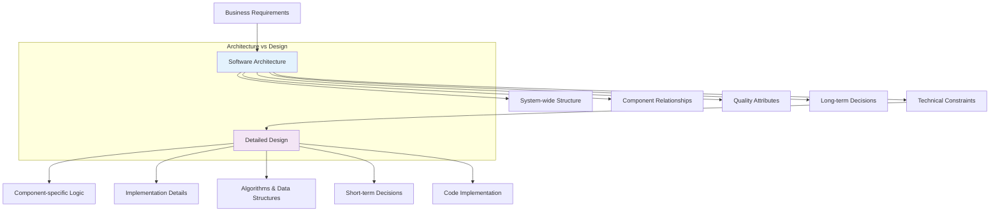
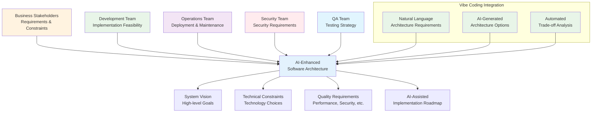
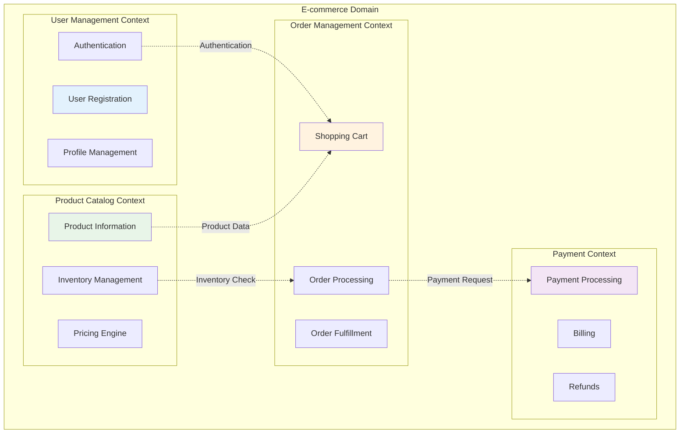

# Chapter 7: Understanding Software Architecture

> *"Architecture is about the important stuff. Whatever that is."* - Ralph Johnson

---

## Learning Objectives

By the end of this chapter, you will be able to:
- Define software architecture and distinguish it from design and implementation
- Analyze the relationship between architecture and system quality attributes
- Apply architectural thinking to solve complex system design problems
- Evaluate architectural decisions using systematic approaches
- Design architectures that balance competing requirements and constraints
- Document and communicate architectural decisions effectively

---

## Introduction: The Architect's Perspective

Software architecture represents the fundamental organization of a system, embodying the decisions that are hard to change once implemented. It's the bridge between abstract requirements and concrete code, defining how a system's components interact to achieve business objectives while satisfying quality requirements.

### What Makes Architecture Different

Architecture differs from detailed design in several key ways:



| Aspect | Architecture | Detailed Design |
|--------|-------------|-----------------|
| **Scope** | System-wide structure | Component-specific structure |
| **Focus** | Component relationships | Internal component logic |
| **Stakeholders** | Business + Technical | Primarily technical |
| **Timeframe** | Long-term stability | Short-term implementation |
| **Change Cost** | High cost to change | Lower cost to change |
| **Abstraction Level** | High-level concepts | Low-level implementation |

### The Economics of Architectural Decisions

Poor architectural decisions compound over time, creating technical debt that becomes increasingly expensive to address:

- **Initial Cost**: Architectural decisions may seem expensive upfront
- **Compounding Benefits**: Good architecture pays dividends through reduced maintenance and faster feature development
- **Change Amplification**: Architectural changes affect multiple components simultaneously
- **Opportunity Cost**: Poor architecture limits future options and capabilities

---

## 3.1 The Role of Architecture in Software Engineering

Software architecture serves as the blueprint for both the system and the project developing it. It defines the structure, behavior, and interaction of system components while providing the foundation for achieving quality attributes.

### Architecture as a Communication Tool

#### **Stakeholder Communication**
Architecture serves as a common language between different stakeholders:



#### **Decision Documentation**
Architecture captures and communicates critical decisions through Architectural Decision Records (ADRs):

**ADR Template Structure:**
- **Title**: Clear, descriptive name for the decision
- **Status**: Proposed, Accepted, Deprecated, or Superseded
- **Context**: The situation that led to the decision
- **Decision**: What was decided and why
- **Consequences**: Expected positive and negative outcomes
- **Alternatives**: Other options that were considered

### Architecture as a Risk Management Tool

#### **Technical Risk Mitigation**
Architecture helps identify and mitigate technical risks early:

**Common Technical Risks:**
- **Single Points of Failure**: Components whose failure brings down the entire system
- **Scalability Bottlenecks**: Components that cannot handle increased load
- **Security Vulnerabilities**: Weak points that could be exploited
- **Technology Lock-in**: Dependencies that limit future flexibility
- **Integration Complexity**: Difficult connections between components

**Risk Mitigation Strategies:**
- **Redundancy**: Multiple instances of critical components
- **Circuit Breakers**: Automatic failure detection and isolation
- **Graceful Degradation**: Reduced functionality rather than complete failure
- **Monitoring and Alerting**: Early detection of problems
- **Fallback Mechanisms**: Alternative paths when primary systems fail

#### **Business Risk Mitigation**
Architecture supports business continuity and compliance:

**Business Continuity Considerations:**
- **Disaster Recovery**: Plans for recovering from catastrophic failures
- **Data Backup and Restoration**: Protecting against data loss
- **Geographic Distribution**: Reducing risk from localized disasters
- **Compliance Requirements**: Meeting regulatory and legal obligations
- **Vendor Risk Management**: Reducing dependence on single suppliers

### Architecture as a Quality Attribute Enabler

#### **Quality Attribute Scenarios**
Architecture enables specific quality attributes through design decisions:

**Performance Scenarios:**
- Normal load: System handles expected traffic with acceptable response times
- Peak load: System maintains functionality during traffic spikes
- Stress conditions: System degrades gracefully under extreme load

**Security Scenarios:**
- Authentication: Users are properly identified and verified
- Authorization: Access is controlled based on user permissions
- Data protection: Sensitive information is encrypted and secured

**Availability Scenarios:**
- Component failure: System continues operating when parts fail
- Maintenance: System remains available during updates
- Disaster recovery: System can be restored after major incidents

### 💡 **Vibe Coding Prompt: Architecture Assessment Framework**

**Your Vibe Coding Prompt**:

```
I need to create an automated architecture assessment system that can analyze my codebase and generate comprehensive architectural insights. Help me build this system.

Current System Context:
- E-commerce platform with microservices architecture
- Python/FastAPI services with PostgreSQL databases
- Kubernetes deployment on AWS
- 50+ services with complex interdependencies
- Performance and maintainability challenges

Please generate:

1. **Automated Architecture Analysis Tools**:
   - Code analysis scripts that map service dependencies
   - Automated detection of architectural patterns and anti-patterns
   - Metrics collection for coupling, cohesion, and complexity
   - Integration with static analysis tools (SonarQube, CodeClimate)

2. **Quality Attribute Measurement System**:
   - Performance monitoring and alerting for architectural bottlenecks
   - Scalability testing framework for load and stress testing
   - Maintainability metrics tracking (cyclomatic complexity, technical debt)
   - Security vulnerability scanning integrated with architecture review

3. **Architectural Visualization and Documentation**:
   - Automated generation of architecture diagrams from code
   - Service dependency mapping with real-time updates
   - Interactive architecture documentation with drill-down capabilities
   - Architectural decision record (ADR) templates and automation

4. **Continuous Architecture Governance**:
   - CI/CD integration for architectural compliance checking
   - Automated alerts for architectural violations
   - Fitness functions to ensure architectural characteristics
   - Architecture evolution tracking and trend analysis

5. **AI-Powered Architecture Recommendations**:
   - Machine learning models to suggest architectural improvements
   - Pattern recognition for identifying optimization opportunities
   - Automated refactoring suggestions for architectural smells
   - Predictive analysis for architectural technical debt

Include integration with development tools, automated reporting dashboards, and actionable improvement recommendations. Show how to make architecture assessment a continuous, data-driven process.
```

---

## 3.2 Architectural Thinking and Design Process

Architectural thinking is a systematic approach to understanding and solving complex system design problems. It involves analyzing requirements, identifying constraints, making trade-offs, and designing solutions that balance competing concerns.

### The Architectural Design Process

#### **1. Requirements Analysis and Stakeholder Identification**

**Understanding Stakeholder Needs:**
- **Business Stakeholders**: Focus on features, time-to-market, and cost
- **End Users**: Care about performance, usability, and reliability
- **Developers**: Need maintainable, testable, and understandable code
- **Operations**: Require deployable, monitorable, and scalable systems
- **Security Teams**: Demand secure, compliant, and auditable systems

**Quality Attribute Scenarios:**
Quality attributes should be specified as concrete, measurable scenarios:

**Performance Example:**
- **Source**: 1000 concurrent users
- **Stimulus**: Submit order requests
- **Environment**: Normal operating conditions
- **Artifact**: Order processing system
- **Response**: Process orders successfully
- **Measure**: 95% of requests complete within 2 seconds

#### **2. Architectural Constraint Analysis**

**Types of Constraints:**

**Technical Constraints:**
- Existing systems that must be integrated
- Technology standards and approved platforms
- Performance and scalability requirements
- Security and compliance mandates

**Business Constraints:**
- Budget limitations for development and operations
- Timeline constraints for delivery
- Skill availability within the team
- Organizational policies and procedures

**Regulatory Constraints:**
- Data privacy regulations (GDPR, CCPA)
- Industry-specific compliance (HIPAA, SOX)
- Geographic restrictions on data storage
- Audit and reporting requirements

#### **3. Architecture Option Generation and Evaluation**

**Generating Architectural Options:**

**Monolithic Architecture:**
- **Benefits**: Simple deployment, easier debugging, better performance for small systems
- **Drawbacks**: Difficult to scale, technology lock-in, large team coordination challenges
- **Best for**: Small teams, simple applications, rapid prototyping

**Microservices Architecture:**
- **Benefits**: Independent scaling, technology diversity, team autonomy
- **Drawbacks**: Operational complexity, network latency, distributed system challenges
- **Best for**: Large teams, complex domains, high scalability requirements

**Serverless Architecture:**
- **Benefits**: No server management, automatic scaling, pay-per-use pricing
- **Drawbacks**: Vendor lock-in, cold start latency, limited execution time
- **Best for**: Event-driven workloads, variable traffic, cost optimization

**Hybrid Architecture:**
- **Benefits**: Combines advantages of different approaches
- **Drawbacks**: Increased complexity, multiple operational models
- **Best for**: Large systems with diverse requirements

### Architectural Trade-off Analysis

#### **Quality Attribute Trade-offs**

**Common Trade-offs:**

**Performance vs. Security:**
- Security measures (encryption, authentication) add processing overhead
- Mitigation: Hardware acceleration, efficient algorithms, caching strategies

**Maintainability vs. Performance:**
- Clean, readable code may not be the most optimized
- Mitigation: Profile-guided optimization, performance testing in CI/CD

**Availability vs. Consistency:**
- Distributed systems must choose between immediate consistency and high availability
- Mitigation: Eventual consistency models, conflict resolution strategies

**Cost vs. Performance:**
- Higher performance often requires more expensive infrastructure
- Mitigation: Auto-scaling, performance monitoring, cost optimization

#### **Trade-off Analysis Framework**

**Multi-Criteria Decision Analysis (MCDA):**

1. **Identify Criteria**: List all important quality attributes
2. **Weight Criteria**: Assign importance weights based on stakeholder priorities
3. **Score Options**: Rate each architectural option against each criterion
4. **Calculate Weighted Scores**: Multiply scores by weights and sum
5. **Sensitivity Analysis**: Test how changes in weights affect the ranking

### 💡 **Vibe Coding Prompt: Architectural Trade-off Decision Framework**

**Your Vibe Coding Prompt**:

```
I need to build an AI-powered architectural decision support system that helps teams make informed trade-off decisions. Help me create this comprehensive decision-making platform.

Current Challenge:
- E-commerce platform needs to balance performance vs cost vs security
- Multiple stakeholders with conflicting priorities (business, engineering, operations)
- Complex trade-offs between microservices complexity and monolith simplicity
- Need data-driven decision making with quantifiable trade-offs

Please generate:

1. **AI-Powered Trade-off Analysis Engine**:
   - Machine learning models that predict impact of architectural decisions
   - Automated analysis of performance vs cost vs security trade-offs
   - Historical decision outcome analysis and learning system
   - Real-time impact simulation for different architectural choices

2. **Stakeholder Alignment and Communication Platform**:
   - Interactive dashboards showing trade-offs in business terms
   - Automated translation of technical decisions to business impact
   - Collaborative decision-making workflows with voting and consensus building
   - Stakeholder impact visualization and communication tools

3. **Multi-Criteria Decision Analysis (MCDA) System**:
   - Automated generation of architectural alternatives
   - Weighted scoring models for different quality attributes
   - Sensitivity analysis for critical decision parameters
   - Risk assessment and mitigation strategy recommendations

4. **Decision Documentation and Traceability System**:
   - Automated ADR (Architectural Decision Record) generation
   - Decision impact tracking and outcome measurement
   - Traceability from business requirements to technical decisions
   - Version control and evolution tracking for architectural decisions

5. **Validation and Experimentation Framework**:
   - A/B testing framework for architectural decisions
   - Automated performance and cost monitoring
   - Chaos engineering integration for resilience testing
   - Continuous validation of architectural assumptions

6. **Predictive Risk Management System**:
   - Early warning system for architectural technical debt
   - Automated risk assessment based on decision patterns
   - Contingency planning and rollback strategy automation
   - Integration with monitoring and alerting systems

Include integration with cloud cost management, performance monitoring, security scanning, and business metrics. Show how to make architectural decisions data-driven and continuously validated.
```

---

## 3.3 Architectural Views and Documentation

Effective architectural documentation communicates the architecture to different stakeholders through multiple views, each highlighting different aspects of the system. The key is to provide just enough documentation to support decision-making and system understanding without creating a maintenance burden.

### The 4+1 Architectural View Model

The 4+1 view model, developed by Philippe Kruchten, provides a comprehensive framework for documenting software architecture through five interconnected views.

#### **1. Logical View - The Functionality**

**Purpose**: Describes the system's functionality and structure from the end-user's perspective.

**Key Elements:**
- **Business Components**: Major functional areas of the system
- **Component Responsibilities**: What each component does
- **Component Relationships**: How components interact
- **Business Rules**: Constraints and policies that govern behavior

**Example - E-commerce System Logical View:**
- **User Management**: Registration, authentication, profile management
- **Catalog Management**: Product information, categories, search
- **Order Management**: Shopping cart, checkout, order processing
- **Payment Processing**: Payment methods, billing, refunds
- **Inventory Management**: Stock tracking, availability, reservations

**Component Interactions:**
- User Management provides authentication for all other components
- Catalog Management supplies product information to Order Management
- Order Management triggers Payment Processing and Inventory updates

#### **2. Development View - The Software Management**

**Purpose**: Describes the system's organization from the developer's perspective.

**Key Elements:**
- **Module Organization**: How code is structured and packaged
- **Team Ownership**: Which teams are responsible for which components
- **Build Dependencies**: How modules depend on each other
- **Development Tools**: Technologies and frameworks used

**Typical Module Structure:**
- **Presentation Layer**: User interfaces (web, mobile, admin)
- **Business Logic Layer**: Core application services
- **Data Access Layer**: Database and external service integration
- **Infrastructure Layer**: Cross-cutting concerns (logging, security)

**Team Organization Patterns:**
- **Feature Teams**: Cross-functional teams owning complete features
- **Component Teams**: Specialized teams owning specific technical components
- **Platform Teams**: Teams providing shared infrastructure and tools

#### **3. Process View - The Dynamic Behavior**

**Purpose**: Shows how the system behaves at runtime, including processes, threads, and interactions.

**Key Elements:**
- **Process Structure**: How the system is divided into processes
- **Thread Management**: Concurrency and synchronization
- **Communication Patterns**: How processes interact
- **Performance Characteristics**: Response times and throughput

**Common Process Patterns:**
- **Synchronous Processing**: Request-response interactions with immediate results
- **Asynchronous Processing**: Fire-and-forget operations with eventual completion
- **Event-Driven Processing**: Reactive systems responding to events
- **Batch Processing**: Scheduled operations on large data sets

**Concurrency Considerations:**
- **Thread Safety**: Ensuring correct behavior with multiple threads
- **Deadlock Prevention**: Avoiding circular dependencies in resource locking
- **Load Balancing**: Distributing work across multiple processes
- **Fault Tolerance**: Handling process failures gracefully

#### **4. Physical View - The Deployment**

**Purpose**: Shows how software components are deployed to hardware infrastructure.

**Key Elements:**
- **Hardware Architecture**: Servers, networks, and infrastructure
- **Software Deployment**: How applications are installed and configured
- **Network Topology**: Communication paths and protocols
- **Operational Concerns**: Monitoring, backup, and maintenance

**Deployment Patterns:**
- **Single Server**: All components on one machine (simple but not scalable)
- **Multi-Tier**: Separate tiers for presentation, application, and data
- **Microservices**: Independent deployment of small services
- **Cloud-Native**: Containerized applications in cloud environments

**Infrastructure Considerations:**
- **Scalability**: Ability to handle increased load
- **Availability**: Redundancy and failover mechanisms
- **Security**: Network isolation and access controls
- **Monitoring**: Observability and alerting systems

#### **5. Scenario View - The Use Cases**

**Purpose**: Validates the other views through specific scenarios and use cases.

**Key Elements:**
- **Use Case Scenarios**: Specific user interactions with the system
- **Quality Attribute Scenarios**: Specific quality requirements
- **Failure Scenarios**: How the system handles errors and failures
- **Performance Scenarios**: Load and stress testing scenarios

**Scenario Types:**

**Functional Scenarios:**
- User registration and login
- Product search and purchase
- Order fulfillment and tracking
- Customer support interactions

**Quality Attribute Scenarios:**
- **Performance**: System handles 10,000 concurrent users
- **Security**: Unauthorized access attempts are blocked
- **Availability**: System recovers from database failure in 30 seconds
- **Usability**: New users can complete purchase in under 5 minutes

### Documentation Best Practices

#### **Living Documentation Principles**

**Automation Over Manual Effort:**
- Generate diagrams from code when possible
- Extract documentation from source code comments
- Integrate documentation updates with code changes
- Use tools that maintain consistency automatically

**Audience-Specific Content:**
- **Developers**: Focus on implementation details and APIs
- **Architects**: Emphasize design decisions and trade-offs
- **Operations**: Highlight deployment and monitoring aspects
- **Business**: Translate technical concepts to business value

**Minimal but Sufficient:**
- Document decisions, not obvious facts
- Focus on "why" rather than "what"
- Keep documentation close to the code
- Remove outdated information promptly

#### **Documentation Tools and Techniques**

**Diagramming Tools:**
- **Mermaid**: Text-based diagrams that can be version controlled
- **PlantUML**: Code-generated UML diagrams
- **Draw.io**: Visual diagramming with collaboration features
- **Lucidchart**: Professional diagramming with templates

**Documentation Platforms:**
- **GitBook**: Documentation with Git integration
- **Confluence**: Wiki-style collaborative documentation
- **Notion**: All-in-one workspace for documentation
- **GitHub Pages**: Documentation hosted with source code

### 💡 **Vibe Coding Prompt: Architecture Documentation Strategy**

**Your Vibe Coding Prompt**:

```
I need to build an intelligent, self-updating architecture documentation system that automatically stays current with our codebase and provides interactive, useful documentation. Help me create this comprehensive documentation platform.

Current Documentation Challenges:
- 50+ microservices with complex interdependencies
- Documentation becomes outdated within weeks
- Different teams use different documentation formats
- Stakeholders can't find relevant information quickly
- No integration between code and documentation

Please generate:

1. **Automated Documentation Generation System**:
   - Code analysis tools that extract architectural information automatically
   - Integration with CI/CD to update docs on every deployment
   - Automatic generation of service dependency maps and API documentation
   - Real-time synchronization between code changes and documentation

2. **Interactive Architecture Visualization Platform**:
   - Dynamic, explorable architecture diagrams with drill-down capabilities
   - Real-time service health and performance overlays
   - Interactive dependency graphs with impact analysis
   - Multi-view architecture browser (logical, physical, deployment views)

3. **AI-Powered Documentation Assistant**:
   - Natural language querying of architecture information
   - Automated generation of architecture decision records (ADRs)
   - Smart suggestions for missing or outdated documentation
   - Context-aware documentation recommendations based on user role

4. **Stakeholder-Specific Documentation Views**:
   - Role-based dashboards (developer, architect, operations, business)
   - Automated translation of technical details to business impact
   - Customizable views and filtering based on stakeholder needs
   - Integration with project management and business tools

5. **Documentation Quality and Governance System**:
   - Automated quality checks for documentation completeness
   - Version control and change tracking for architectural decisions
   - Compliance checking against documentation standards
   - Metrics and analytics on documentation usage and effectiveness

6. **Collaborative Documentation Workflow**:
   - Real-time collaborative editing with conflict resolution
   - Review and approval workflows for architectural changes
   - Integration with code review processes
   - Automated notifications for stakeholders on relevant changes

Include integration with development tools (GitHub, Jira, Slack), monitoring systems (Prometheus, Grafana), and cloud platforms. Show how to make documentation a living, valuable asset that teams actually use and maintain.
```

---

## Chapter Summary

Understanding software architecture is fundamental to building systems that meet both current requirements and future needs. Architecture serves as the foundation for system quality, team communication, and long-term maintainability.

### Key Architectural Concepts

1. **Architecture as Foundation**: Architecture provides the structural foundation that determines system capabilities and constraints
2. **Stakeholder Communication**: Architecture serves as a common language for communicating complex technical concepts to diverse stakeholders
3. **Quality Attribute Enablement**: Architectural decisions directly impact system quality attributes like performance, security, and maintainability
4. **Trade-off Management**: Architecture is fundamentally about making informed trade-offs between competing requirements and constraints
5. **Multiple Perspectives**: Effective architecture requires considering multiple views and perspectives of the system

### The Architectural Design Process

| Phase | Key Activities | Deliverables |
|-------|---------------|-------------|
| **Requirements Analysis** | Stakeholder identification, quality attribute scenarios | Requirements specification, stakeholder analysis |
| **Constraint Analysis** | Technical, business, and organizational constraints | Constraint documentation, impact analysis |
| **Option Generation** | Multiple architectural approaches | Architectural options, trade-off analysis |
| **Evaluation and Selection** | Systematic evaluation against criteria | Architecture decision, rationale documentation |
| **Documentation** | Multiple views, scenario validation | Architecture documentation, decision records |

### Architectural Views and Documentation

The 4+1 view model provides a comprehensive framework for documenting architecture:
- **Logical View**: System functionality and structure
- **Development View**: Software organization and team structure
- **Process View**: Runtime behavior and dynamic aspects
- **Physical View**: Deployment and infrastructure
- **Scenario View**: Use cases that validate other views

### Best Practices for Architectural Work

#### **Decision Making**
- Make decisions based on explicit trade-off analysis
- Document decisions with clear rationale
- Validate decisions through prototyping and testing
- Review and revise decisions as new information emerges

#### **Communication**
- Use multiple views to address different stakeholder concerns
- Keep documentation focused and actionable
- Automate documentation generation where possible
- Maintain documentation as a living artifact

#### **Quality Focus**
- Design for quality attributes from the beginning
- Use architectural patterns and styles appropriately
- Validate architecture against quality scenarios
- Monitor and measure quality attributes in production

---

## 3.7 Architecture Decision Records (ADRs) for AI-Assisted Development

Architecture Decision Records (ADRs) capture important architectural decisions along with their context and consequences. In the vibe coding era, ADRs become even more critical as AI can help generate comprehensive decision records and analyze their long-term impacts.

### ADR Structure for Vibe Coding

```markdown
# ADR-001: Microservices Communication Pattern

## Status
Accepted

## Context
Our e-commerce platform needs to handle 100K+ concurrent users with 99.9% uptime. 
Current monolithic architecture is creating deployment bottlenecks and scaling challenges.

## Decision
Implement event-driven microservices architecture using Apache Kafka for asynchronous 
communication and REST APIs for synchronous operations.

## Alternatives Considered
1. **Synchronous HTTP-only**: Simple but creates tight coupling and cascade failures
2. **Message queues (RabbitMQ)**: Good reliability but limited scalability compared to Kafka
3. **GraphQL Federation**: Excellent for client experience but adds complexity to service boundaries
4. **gRPC with service mesh**: High performance but requires significant infrastructure investment

## Consequences

### Positive
- Independent service deployment and scaling
- Fault isolation prevents cascade failures  
- Technology diversity allows best-tool-for-the-job approach
- Improved team autonomy and development velocity

### Negative
- Increased operational complexity
- Distributed system challenges (eventual consistency, partial failures)
- Need for sophisticated monitoring and observability
- Higher initial development overhead

## Implementation Strategy
- Phase 1: Extract user management and inventory services
- Phase 2: Implement event-driven order processing
- Phase 3: Complete decomposition of remaining monolith

## Success Metrics
- Deployment frequency: From weekly to daily
- Mean time to recovery: < 15 minutes
- System availability: 99.9%
- Service independence: 95% of changes affect only one service

## Review Date
2024-06-01 (6 months from implementation)
```

### 💡 **Vibe Coding Prompt: AI-Powered ADR Generation**

```
I need to create an ADR for a critical architectural decision. Help me generate a comprehensive, well-structured Architecture Decision Record.

**Decision Context**:
Current situation: [DESCRIBE YOUR CURRENT ARCHITECTURE AND CHALLENGES]

Proposed change: [DESCRIBE THE ARCHITECTURAL CHANGE YOU'RE CONSIDERING]  

Business constraints: [LIST BUDGET, TIMELINE, COMPLIANCE REQUIREMENTS]

Technical constraints: [LIST TECHNOLOGY LIMITATIONS, TEAM SKILLS, EXISTING SYSTEMS]

Please generate a complete ADR that includes:

1. **Context Analysis**:
   - Clear problem statement with business impact
   - Current architecture limitations and pain points
   - Stakeholder requirements and success criteria
   - Technical and business constraints

2. **Solution Options**:
   - 3-5 alternative architectural approaches
   - Detailed analysis of each option with pros/cons
   - Cost-benefit analysis for each alternative
   - Technical feasibility assessment

3. **Decision Rationale**:
   - Why the chosen option is best for this context
   - How it addresses the core problems
   - Alignment with business and technical goals
   - Risk mitigation strategies

4. **Implementation Plan**:
   - Phased rollout strategy with milestones
   - Resource requirements and timeline
   - Dependencies and prerequisites
   - Rollback plan if implementation fails

5. **Success Metrics**:
   - Quantifiable measures of success
   - Monitoring and measurement strategy
   - Regular review schedule
   - Exit criteria if the decision proves wrong

6. **Stakeholder Impact**:
   - How this affects different teams and roles
   - Communication plan for the change
   - Training and skill development needs
   - Change management considerations

Make it comprehensive, actionable, and suitable for review by both technical and business stakeholders.
```

### ADR Templates for Common Scenarios

#### **Technology Selection ADR Template**

```markdown
# ADR-XXX: [Technology Selection Title]

## Status
[Proposed | Accepted | Deprecated | Superseded]

## Context
**Business Need**: [What business problem are we solving?]
**Current State**: [What's the current technology landscape?]
**Requirements**: [What are the functional and non-functional requirements?]

## Evaluation Criteria
| Criterion | Weight | [Option 1] | [Option 2] | [Option 3] |
|-----------|--------|------------|------------|------------|
| Performance | 25% | [Score/10] | [Score/10] | [Score/10] |
| Scalability | 20% | [Score/10] | [Score/10] | [Score/10] |
| Team Expertise | 15% | [Score/10] | [Score/10] | [Score/10] |
| Community Support | 15% | [Score/10] | [Score/10] | [Score/10] |
| Cost | 15% | [Score/10] | [Score/10] | [Score/10] |
| Vendor Lock-in Risk | 10% | [Score/10] | [Score/10] | [Score/10] |
| **Total** | 100% | [Weighted Score] | [Weighted Score] | [Weighted Score] |

## Decision
[Chosen technology] based on [primary reasons]

## Consequences
**Positive**: [List positive outcomes]
**Negative**: [List negative outcomes]
**Mitigation Strategies**: [How to address negative consequences]
```

#### **Architecture Pattern ADR Template**

```markdown
# ADR-XXX: [Architecture Pattern Title]

## Status
[Proposed | Accepted | Deprecated | Superseded]

## Context
**System Challenge**: [What architectural challenge are we addressing?]
**Scale Requirements**: [What are the scale and performance needs?]
**Team Structure**: [How is the team organized?]
**Technical Constraints**: [What are the technical limitations?]

## Pattern Analysis
**Pattern**: [Name of the architectural pattern]
**Intent**: [What problem does this pattern solve?]
**Structure**: [Key components and their relationships]
**Collaborations**: [How components interact]

## Implementation Approach
**Phase 1**: [Initial implementation steps]
**Phase 2**: [Expansion and optimization]
**Phase 3**: [Full implementation and monitoring]

## Quality Attribute Impact
| Quality Attribute | Current State | Expected State | Measurement Method |
|-------------------|---------------|----------------|-------------------|
| Performance | [Current] | [Target] | [How to measure] |
| Scalability | [Current] | [Target] | [How to measure] |
| Maintainability | [Current] | [Target] | [How to measure] |
| Reliability | [Current] | [Target] | [How to measure] |
```

---

## 3.8 Microservices Architecture for AI-Assisted Development

Microservices architecture has become a dominant pattern for building scalable, maintainable systems. With AI assistance, the complexity of designing, implementing, and managing microservices can be significantly reduced.

### Microservices Design Principles

#### **Service Boundaries and Domain Modeling**

Effective microservices design starts with proper domain modeling and service boundary identification:



#### **💡 Vibe Coding Prompt: Service Boundary Analysis**

```
I need to decompose my monolithic application into microservices. Help me identify optimal service boundaries and design a microservices architecture.

**Current Monolithic Application**:
Application type: [DESCRIBE YOUR APPLICATION DOMAIN]
Main functionalities: [LIST CORE FEATURES AND MODULES]
Current architecture: [DESCRIBE CURRENT STRUCTURE]
Data model: [DESCRIBE MAIN ENTITIES AND RELATIONSHIPS]
Team structure: [DESCRIBE DEVELOPMENT TEAM ORGANIZATION]

**Business Context**:
User scale: [NUMBER OF USERS AND GROWTH EXPECTATIONS]
Performance requirements: [RESPONSE TIME, THROUGHPUT, AVAILABILITY]
Compliance requirements: [SECURITY, REGULATORY, PRIVACY REQUIREMENTS]
Deployment constraints: [INFRASTRUCTURE, BUDGET, TIMELINE]

Please help me:

1. **Domain Analysis and Service Identification**:
   - Analyze my application domain and identify bounded contexts
   - Suggest optimal service boundaries based on business capabilities
   - Identify shared services and common functionalities
   - Recommend service granularity (size and responsibility scope)

2. **Service Dependency Analysis**:
   - Map dependencies between identified services
   - Identify potential circular dependencies and suggest resolutions
   - Recommend communication patterns (sync vs async)
   - Design data consistency strategies across services

3. **Data Architecture Strategy**:
   - Suggest database-per-service implementation
   - Identify shared data and recommend management strategies
   - Design data synchronization and consistency patterns
   - Recommend event sourcing and CQRS where appropriate

4. **API Design and Integration**:
   - Design RESTful APIs for each service
   - Recommend GraphQL federation if applicable
   - Design event schemas for asynchronous communication
   - Suggest API versioning and backward compatibility strategies

5. **Implementation Roadmap**:
   - Provide step-by-step decomposition strategy
   - Recommend which services to extract first
   - Suggest migration patterns (Strangler Fig, Branch by Abstraction)
   - Design rollback strategies for each phase

6. **Operational Considerations**:
   - Recommend monitoring and observability strategies
   - Design service discovery and load balancing
   - Suggest deployment and CI/CD pipeline changes
   - Recommend security and authentication patterns

Generate concrete, actionable recommendations with code examples and architectural diagrams.
```

### Service Communication Patterns

#### **Synchronous Communication**

```typescript
// AI-generated API client with circuit breaker pattern
interface ServiceClient {
  makeRequest<T>(endpoint: string, options?: RequestOptions): Promise<T>;
  getHealth(): Promise<HealthStatus>;
}

class ResilientServiceClient implements ServiceClient {
  private circuitBreaker: CircuitBreaker;
  
  constructor(
    private baseUrl: string,
    private config: ClientConfig = {}
  ) {
    this.circuitBreaker = new CircuitBreaker({
      timeout: config.timeout || 5000,
      errorThreshold: config.errorThreshold || 5,
      resetTimeout: config.resetTimeout || 30000
    });
  }
  
  async makeRequest<T>(endpoint: string, options: RequestOptions = {}): Promise<T> {
    return this.circuitBreaker.execute(async () => {
      const response = await fetch(`${this.baseUrl}${endpoint}`, {
        timeout: this.config.timeout,
        retry: this.config.retryCount || 3,
        ...options
      });
      
      if (!response.ok) {
        throw new ServiceError(
          `Service request failed: ${response.status}`,
          response.status,
          await response.text()
        );
      }
      
      return response.json();
    });
  }
  
  async getHealth(): Promise<HealthStatus> {
    try {
      return await this.makeRequest<HealthStatus>('/health');
    } catch (error) {
      return {
        status: 'unhealthy',
        timestamp: new Date().toISOString(),
        error: error.message
      };
    }
  }
}

// Service registry for dynamic service discovery
class ServiceRegistry {
  private services = new Map<string, ServiceInfo>();
  
  register(name: string, info: ServiceInfo): void {
    this.services.set(name, {
      ...info,
      lastHeartbeat: new Date(),
      status: 'healthy'
    });
  }
  
  discover(serviceName: string): ServiceInfo | null {
    return this.services.get(serviceName) || null;
  }
  
  async getHealthyInstance(serviceName: string): Promise<ServiceClient | null> {
    const service = this.discover(serviceName);
    if (!service || service.status !== 'healthy') {
      return null;
    }
    
    return new ResilientServiceClient(service.baseUrl, service.clientConfig);
  }
}
```

#### **Asynchronous Communication**

```typescript
// AI-generated event-driven communication system
interface EventBus {
  publish(event: DomainEvent): Promise<void>;
  subscribe<T extends DomainEvent>(
    eventType: string, 
    handler: EventHandler<T>
  ): Promise<void>;
}

class DomainEvent {
  constructor(
    public readonly type: string,
    public readonly aggregateId: string,
    public readonly payload: any,
    public readonly timestamp: Date = new Date(),
    public readonly version: number = 1
  ) {}
}

// Event handler with retry and dead letter queue
class EventProcessor {
  constructor(
    private eventBus: EventBus,
    private retryConfig: RetryConfig = { maxAttempts: 3, backoffMs: 1000 }
  ) {}
  
  async processEvent<T extends DomainEvent>(
    event: T,
    handler: EventHandler<T>
  ): Promise<void> {
    let attempt = 0;
    
    while (attempt < this.retryConfig.maxAttempts) {
      try {
        await handler.handle(event);
        return;
      } catch (error) {
        attempt++;
        
        if (attempt >= this.retryConfig.maxAttempts) {
          await this.sendToDeadLetterQueue(event, error);
          throw error;
        }
        
        await this.delay(this.retryConfig.backoffMs * Math.pow(2, attempt - 1));
      }
    }
  }
  
  private async sendToDeadLetterQueue(event: DomainEvent, error: Error): Promise<void> {
    const deadLetterEvent = {
      originalEvent: event,
      error: error.message,
      timestamp: new Date(),
      attempts: this.retryConfig.maxAttempts
    };
    
    await this.eventBus.publish(
      new DomainEvent('event.processing.failed', event.aggregateId, deadLetterEvent)
    );
  }
  
  private delay(ms: number): Promise<void> {
    return new Promise(resolve => setTimeout(resolve, ms));
  }
}

// Event sourcing implementation
class EventStore {
  private events: DomainEvent[] = [];
  
  async saveEvents(aggregateId: string, events: DomainEvent[]): Promise<void> {
    // Validate event sequence
    const lastVersion = await this.getLastVersion(aggregateId);
    
    events.forEach((event, index) => {
      if (event.version !== lastVersion + index + 1) {
        throw new Error(`Invalid event version sequence for aggregate ${aggregateId}`);
      }
    });
    
    this.events.push(...events);
    
    // Publish events to event bus
    for (const event of events) {
      await this.eventBus.publish(event);
    }
  }
  
  async getEvents(aggregateId: string, fromVersion?: number): Promise<DomainEvent[]> {
    return this.events
      .filter(event => event.aggregateId === aggregateId)
      .filter(event => !fromVersion || event.version >= fromVersion)
      .sort((a, b) => a.version - b.version);
  }
  
  private async getLastVersion(aggregateId: string): Promise<number> {
    const events = await this.getEvents(aggregateId);
    return events.length > 0 ? events[events.length - 1].version : 0;
  }
}
```

### Service Mesh and Infrastructure

#### **Service Mesh Configuration**

Service mesh provides infrastructure-level capabilities for microservices communication:

```yaml
# AI-generated Istio service mesh configuration
apiVersion: networking.istio.io/v1beta1
kind: VirtualService
metadata:
  name: user-service-vs
spec:
  http:
  - match:
    - uri:
        prefix: /api/v1/users
    route:
    - destination:
        host: user-service
        subset: v1
      weight: 90
    - destination:
        host: user-service
        subset: v2
      weight: 10
    retries:
      attempts: 3
      perTryTimeout: 2s
      retryOn: 5xx,reset,connect-failure,refused-stream
    timeout: 10s

---
apiVersion: networking.istio.io/v1beta1
kind: DestinationRule
metadata:
  name: user-service-dr
spec:
  host: user-service
  trafficPolicy:
    circuitBreaker:
      consecutive5xxErrors: 5
      interval: 30s
      baseEjectionTime: 30s
      maxEjectionPercent: 50
  subsets:
  - name: v1
    labels:
      version: v1
  - name: v2
    labels:
      version: v2
```

### 💡 **Vibe Coding Prompt: Complete Microservices Implementation**

```
I need to build a complete microservices-based system with all the necessary infrastructure components. Generate a production-ready microservices architecture.

**System Requirements**:
Domain: [YOUR APPLICATION DOMAIN]
Expected load: [USERS, REQUESTS/SECOND, DATA VOLUME]
Services needed: [LIST OF BUSINESS CAPABILITIES]
Technology preferences: [PROGRAMMING LANGUAGES, DATABASES, CLOUD PROVIDER]

**Infrastructure Requirements**:
- Container orchestration (Kubernetes)
- Service mesh (Istio or Linkerd)
- API gateway
- Message broker
- Monitoring and observability
- CI/CD pipeline
- Security and authentication

Please generate:

1. **Service Architecture**:
   - Complete service definitions with APIs
   - Database design for each service
   - Inter-service communication patterns
   - Event schemas and message formats

2. **Infrastructure as Code**:
   - Kubernetes deployment manifests
   - Service mesh configuration
   - API gateway setup
   - Database deployment scripts

3. **Monitoring and Observability**:
   - Prometheus metrics configuration
   - Grafana dashboards
   - Jaeger tracing setup
   - Log aggregation with ELK stack

4. **CI/CD Pipeline**:
   - Multi-service build pipeline
   - Automated testing strategy
   - Deployment automation
   - Rollback mechanisms

5. **Security Implementation**:
   - Service-to-service authentication
   - API security and rate limiting
   - Secret management
   - Network policies

Provide complete, deployable code with documentation and best practices.
```

### Looking Forward

Software architecture continues to evolve with new technologies and practices:
- **Cloud-Native Architecture**: Microservices, containers, and serverless computing
- **Event-Driven Architecture**: Asynchronous communication and event streaming
- **AI/ML Integration**: Incorporating artificial intelligence and machine learning capabilities
- **Security by Design**: Building security into architectural foundations
- **Sustainability**: Designing for energy efficiency and environmental impact

The principles and practices covered in this chapter provide a foundation for understanding these evolving architectural approaches and making informed decisions about system design.

---

## Further Reading

- **Next Chapter**: Common Architectural Patterns and Styles - Explore proven patterns for structuring software systems
- **Recommended Books**:
  - *Software Architecture in Practice* by Len Bass, Paul Clements, and Rick Kazman
  - *Clean Architecture* by Robert C. Martin
  - *Building Microservices* by Sam Newman
  - *Fundamentals of Software Architecture* by Mark Richards and Neal Ford
- **Online Resources**:
  - Software Architecture Guide (Martin Fowler)
  - Architecture Decision Records (ADR) templates
  - Cloud architecture frameworks (AWS Well-Architected, Azure Architecture Framework)
  - Open Group Architecture Framework (TOGAF) 