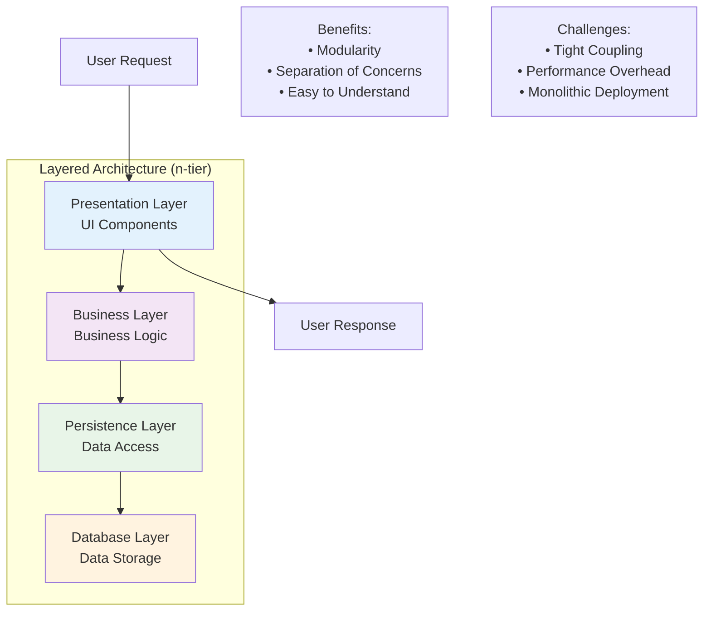
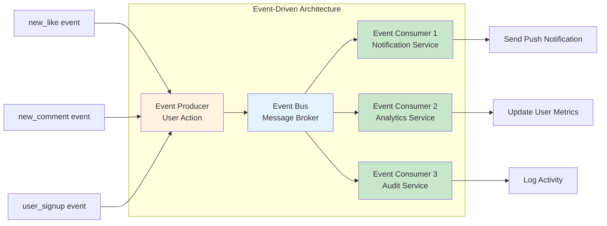
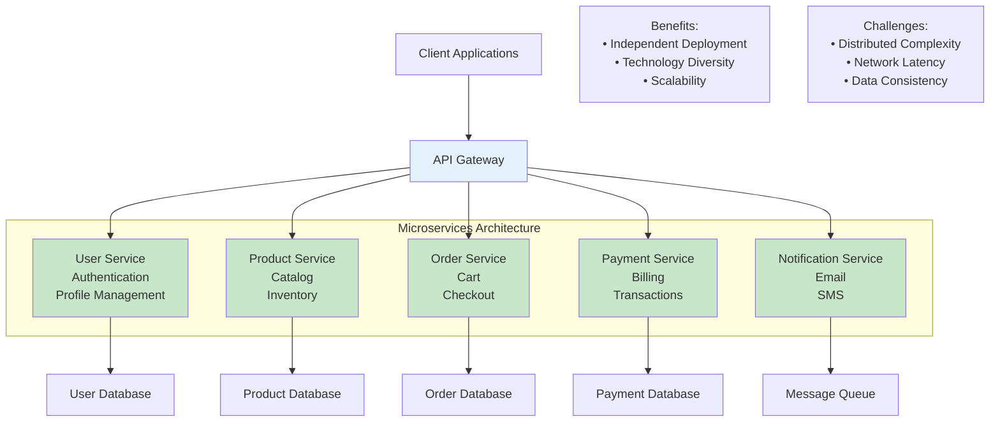

# Chapter 8: Common Architectural Patterns and Styles

Software architectural patterns offer reusable design solutions for common problems encountered in software development. Understanding these patterns is crucial for making informed decisions about system structure.

## 4.1 Layered Architecture Pattern (n-tier architecture)



The Layered Architecture Pattern, also known as n-tier architecture, is a widely adopted pattern due to its alignment with a traditional IT communication structure. It typically comprises four distinct layers: presentation, business, persistence, and database, though it can be adapted to include other layers such as application or service layers. Each layer has a specific role and is "closed," meaning a request must pass through the layer directly below it to reach the next. This "layers of isolation" concept allows modifications within one layer without affecting others, promoting modularity.

For example, in an e-commerce application, an application tier might integrate data and presentation layers for processing shopping cart activities. This pattern is suitable for applications requiring quick builds, enterprise applications with traditional IT departments, teams with inexperienced developers, and those needing strict maintainability and testability standards. However, its shortcomings include potential for unorganized source code if not managed carefully, tight coupling if layers are skipped, and the requirement for complete redeployment even for minor modifications.

**Vibe Coding Prompt:**
```
I need to build a university course registration system using a 3-tier layered architecture. Can you help me generate the code structure?

Requirements:
- Presentation Layer: Web interface for students to browse and register for courses
- Business Layer: Course enrollment logic, prerequisite checking, capacity management
- Data Access Layer: Database operations for courses, students, and enrollments

Please generate:
1. The basic project structure with clear separation of layers
2. Sample classes/modules for each layer showing their responsibilities
3. Interface definitions between layers
4. A simple example of how a "register for course" request flows through all layers

Use Python/Flask for the web layer, but keep business logic framework-independent.
```

## 4.2 Event-Driven Architecture Pattern



The Event-Driven Architecture Pattern is recognized for its agility and high performance, composed of decoupled, single-purpose event processing components that receive and process events asynchronously. This pattern orchestrates system behavior around the production, detection, and consumption of events and their subsequent responses. It typically features two main topologies: mediator, which orchestrates multiple steps through a central event bus, and broker, which chains events without a central mediator.

An e-commerce site serves as a prime example, reacting to various sources during peak demand without crashing or over-provisioning resources. This pattern is ideal for applications where individual data blocks interact with only a few modules and for user interfaces. Challenges include difficulty in testing individual modules if they are not truly independent, complex error handling with multiple modules processing the same events, the arduous task of developing a system-wide data structure for events, and maintaining transaction-based consistency due to decoupled modules.

**Vibe Coding Prompt:**
```
I'm building a real-time notification system for a social media app using event-driven architecture. Help me design and implement this system.

Requirements:
- Events: user_liked_post, user_commented, user_followed, post_shared
- Consumers: notification_service, analytics_service, audit_service
- Need real-time push notifications to mobile apps
- Should handle high volume (10k+ events per second)

Please generate:
1. Event schema definitions for each event type
2. Event producer code that publishes events when actions occur
3. Event consumer services that process these events
4. Message broker configuration (using Redis or RabbitMQ)
5. Sample code showing how a "like" action triggers notifications

Focus on loose coupling and scalability. Use Python with async/await patterns.
```

## 4.3 Microkernel Architecture Pattern

The Microkernel Architecture Pattern, also known as a plug-in architecture, consists of two main components: a minimal core system and several independent plug-in modules. The core system provides only the essential functionality required to keep the system operational, while plug-in modules offer specialized processing capabilities. In a business application, the microkernel might handle general business logic, with plug-ins enhancing it with additional business capabilities.

A task scheduler application exemplifies this, where the microkernel manages scheduling logic and plug-ins contain specific tasks triggered by the microkernel, provided they adhere to a predefined API. This pattern is well-suited for applications with clear segmentation between basic routines and higher-order rules, and those with a fixed set of core routines but dynamic rules requiring frequent updates. However, it necessitates robust "handshaking" code for plugins, and changing the microkernel can be difficult if multiple plugins depend on it. Choosing the right granularity for the kernel function also presents a significant challenge.

**Vibe Coding Prompt:**
```
I want to create a code editor similar to VS Code using the Microkernel pattern. Help me design and implement the plugin architecture.

Core Requirements:
- Microkernel: Basic file editing, syntax highlighting, file management
- Plugins: Git integration, debugger, linter, theme manager, language servers

Please generate:
1. The microkernel core system with plugin loading/unloading capabilities
2. Plugin interface/contract that all plugins must implement
3. Plugin discovery and registration system
4. Sample plugins: Git integration and Python linter
5. Event system for communication between core and plugins
6. Configuration management for plugins

Use TypeScript/Node.js and ensure plugins can be loaded dynamically at runtime. Show how plugins can extend the editor's functionality without modifying the core.
```

## 4.4 Microservices Architecture Pattern



The Microservices Architecture Pattern is a widely adopted alternative to monolithic and service-oriented architectures. In this pattern, components are deployed as separate, independently deployable units through a streamlined delivery pipeline. Its primary benefits include enhanced scalability and a high degree of decoupling, allowing components to be developed, deployed, and tested independently. These components typically interact via remote access protocols.

Netflix, an early adopter, famously uses microservices to enable small engineering teams to develop hundreds of services for digital entertainment streaming. This pattern is ideal for businesses and web applications requiring rapid development, websites with small components, data centers with well-defined boundaries, and global remote teams. Challenges include designing the right level of granularity for service components, the fact that not all applications can be easily split into independent units, and potential performance impacts when tasks are spread across numerous microservices.

**Vibe Coding Prompt:**
```
I need to decompose our monolithic e-commerce application into microservices. Help me design and implement the microservices architecture.

Current Monolith Handles:
- User authentication and profiles
- Product catalog and inventory
- Shopping cart and checkout
- Payment processing
- Order management
- Email notifications

Please generate:
1. Service decomposition strategy with clear boundaries
2. API Gateway configuration and routing
3. Inter-service communication patterns (REST APIs, events)
4. Database per service design
5. Sample implementation of User Service and Product Service
6. Docker containerization for each service
7. Service discovery and load balancing setup

Use Python/FastAPI for services, PostgreSQL for databases, and include proper error handling and circuit breaker patterns.
```

## 4.5 Client-Server Architecture Pattern

The Client-Server Architecture Pattern is a fundamental distributed application structure composed of two primary components: a client and a server. These components may or may not reside on the same network. The client initiates requests for resources such as data, content, services, or files, and the server responds by providing the requested resources. A single server can serve multiple clients, and conversely, a single client can utilize multiple servers.

Email systems are a prominent example, where the client requests an email, and the server retrieves and sends it back. This pattern is widely used for applications like online banking, the World Wide Web, network printing, file sharing, gaming applications, and real-time telecommunication apps, especially those requiring controlled access and multiple services for distributed clients. However, potential shortcomings include performance bottlenecks if server capacity is incompatible with demand, the server acting as a single point of failure, the complexity and expense of changing the pattern, and demanding server maintenance.

**Vibe Coding Prompt:**
```
I'm building a mobile banking app with a secure client-server architecture. Help me design and implement both the mobile client and backend server.

Requirements:
- Mobile Client: Account balance, transaction history, money transfers, bill payments
- Backend Server: Authentication, account management, transaction processing, security
- Security: JWT tokens, encryption, rate limiting, fraud detection
- Real-time: Push notifications for transactions

Please generate:
1. REST API specification with all endpoints
2. Mobile client code (React Native) with API integration
3. Backend server implementation (Node.js/Express)
4. Authentication and authorization system
5. Database schema for accounts and transactions
6. Security middleware and validation
7. Real-time notification system

Include proper error handling, input validation, and security best practices. Show how sensitive operations like transfers are secured.
```

## 4.6 Other Relevant Patterns

Beyond the commonly discussed patterns, several other architectural styles offer distinct advantages for specific use cases:

- **Pipe-Filter Architecture Pattern:** This pattern processes a stream of data in a unidirectional flow. Components, called filters, are connected by pipes, where the output of one filter becomes the input for the next. This breaks down large processes into independent, simultaneously processable components. It is well-suited for applications that process data in a stream, such as compilers.

**Vibe Coding Prompt:**
```
I need to build a data processing pipeline that processes server log files using the Pipe-Filter pattern. Help me implement this system.

Pipeline Steps:
1. Read raw log files from directory
2. Parse log entries and extract structured data
3. Filter for error messages and warnings
4. Standardize timestamp formats
5. Enrich with geolocation data
6. Load results into database

Please generate:
1. Filter interface that all processing steps implement
2. Individual filter implementations for each step
3. Pipeline orchestrator that connects filters
4. Input/output data models
5. Error handling and monitoring
6. Configuration system for pipeline setup

Use Python with async processing for performance. Make filters reusable and configurable. Include unit tests for each filter.
```

- **Broker Architecture Pattern:** Used for structuring distributed systems with decoupled components, this pattern allows components to interact by invoking remote services through a central broker. The broker manages coordination and communication, redirecting clients to suitable services. It is commonly found in message broker software.

**Vibe Coding Prompt:**
```
I need to implement a broker pattern where multiple services communicate without knowing about each other directly. Help me build this system.

Services:
- Payment Service: Processes payments
- Inventory Service: Manages stock levels
- Shipping Service: Handles order fulfillment
- Notification Service: Sends customer updates
- Analytics Service: Tracks business metrics

Please generate:
1. Message broker implementation (using RabbitMQ or Apache Kafka)
2. Service registration and discovery mechanism
3. Message routing and transformation logic
4. Sample service implementations showing broker communication
5. Error handling and dead letter queues
6. Monitoring and health checks
7. Load balancing for high availability

Use Java/Spring Boot for services and include proper message serialization, retry logic, and circuit breaker patterns.
```

## 4.7 Clean Architecture: A Holistic Approach to Design

Clean Architecture represents a philosophy and a set of design principles that organize software components into distinct, concentric "onion ring" layers. The fundamental idea is that code dependencies should consistently flow from the outer layers to the inner ones, ensuring a clear separation of concerns. Its core goal is to achieve independence from various external factors, including frameworks, user interfaces, and databases, thereby promoting testability and long-term maintainability.

### 4.7.1 Independence from Frameworks, UI, and Databases

A key tenet of Clean Architecture is ensuring that core business logic and entities remain independent of specific external tools, user interfaces, or data storage mechanisms. This means that the inner layers, containing the most critical business rules, should not be dictated by the choices made in the outer layers concerning frameworks, UI technologies, or database systems.

**Vibe Coding Prompt:**
```
I have an OrderService that's tightly coupled to Django framework. Help me refactor it to follow Clean Architecture principles.

Current Issues:
- Business logic mixed with Django models and views
- Direct database queries in business methods
- Framework-specific code throughout
- Difficult to unit test without Django setup

Please generate:
1. Clean Architecture layer structure (Entities, Use Cases, Interface Adapters, Frameworks)
2. Pure business entities without framework dependencies
3. Use case implementations with dependency injection
4. Repository interfaces and implementations
5. Framework adapters for Django integration
6. Unit tests for business logic without framework dependencies

Show how the core business logic becomes framework-independent and easily testable. Use Python with proper dependency injection patterns.
```

### 4.7.2 Testability and Maintainability

Clean Architecture inherently promotes high testability and maintainability through its layered structure and strict dependency rules. By keeping business rules isolated from external concerns, unit tests can be written against the core logic without needing to mock or interact with databases, UIs, or frameworks. This makes testing faster, more reliable, and more comprehensive.

**Vibe Coding Prompt:**
```
My PaymentProcessor module is difficult to test because it's intertwined with UI and database code. Help me apply Clean Architecture to make it testable.

Current Problems:
- Payment logic mixed with web controllers
- Direct database calls in payment methods
- External API calls without proper abstraction
- Tests require running database and web server

Please generate:
1. Clean separation of payment business logic
2. Payment entities and value objects
3. Payment use cases with clear interfaces
4. Repository pattern for payment data
5. External service abstractions (payment gateways)
6. Comprehensive unit tests for payment logic
7. Integration tests for external dependencies

Show how to test payment scenarios without external dependencies. Include test doubles, mocks, and proper test organization. Use C# or Java with dependency injection framework.
``` 