# Chapter 9: Test-Driven Development (TDD)

> *"The act of writing tests first forces you to think about the interface before the implementation, leading to better design and more maintainable code."*

---

## Learning Objectives

By the end of this chapter, you will be able to:
- Implement the Red-Green-Refactor cycle effectively in your daily development workflow
- Write meaningful tests that drive better software design
- Integrate TDD practices with Agile and DevOps methodologies
- Evaluate when TDD is appropriate and when alternative approaches might be better
- Design testable code architecture that supports long-term maintainability

---

## Introduction: The TDD Paradigm Shift

Test-Driven Development (TDD) represents a fundamental shift in how we approach software development. Rather than treating testing as a verification step that happens after implementation, TDD integrates testing into the development cycle from its very inception. This methodology fundamentally changes the development paradigm by encouraging developers to write automated tests before writing the actual code implementation.

### The Psychology of TDD

TDD isn't just a technical practice—it's a mindset that changes how developers think about problem-solving:

- **Specification-First Thinking**: Tests become executable specifications that clarify requirements
- **Incremental Progress**: Small, verifiable steps build confidence and momentum
- **Immediate Feedback**: Fast feedback loops catch issues before they compound
- **Design Pressure**: Writing tests first naturally leads to better API design

### TDD vs. Traditional Development


| Traditional Approach | TDD Approach |
|---------------------|--------------|
| Write code → Write tests → Debug | Write test → Write code → Refactor |
| Tests verify existing behavior | Tests define desired behavior |
| Testing is a separate phase | Testing is integrated throughout |
| Design emerges from implementation | Design emerges from test requirements |
| Debugging is reactive | Issues are prevented proactively |

---

## 9.1 The Red-Green-Refactor Cycle

The Red-Green-Refactor cycle is the heartbeat of TDD, providing a structured approach to incremental development that ensures both functionality and code quality.

### The Three Phases Explained

```mermaid
graph TD
    A["🔴 RED PHASE<br/>Write a Failing Test"] --> B["🟢 GREEN PHASE<br/>Make the Test Pass"]
    B --> C["🔵 REFACTOR PHASE<br/>Improve the Code"]
    C --> D["All Tests Pass?"]
    D -->|Yes| E["Next Feature"]
    D -->|No| F["Fix Issues"]
    F --> C
    E --> A
    
    subgraph "Red Phase Principles"
        G["Start Small"]
        H["Be Specific"]
        I["Fail for Right Reason"]
        J["Think Like User"]
    end
    
    subgraph "Green Phase Principles"
        K["Simplest Solution"]
        L["Avoid Over-Engineering"]
        M["Focus on Behavior"]
        N["Embrace Imperfection"]
    end
    
    subgraph "Refactor Phase Principles"
        O["Preserve Behavior"]
        P["Improve Design"]
        Q["Small Steps"]
        R["Stop When Done"]
    end
    
    A --> G
    B --> K
    C --> O
    
    style A fill:#ffcdd2
    style B fill:#c8e6c9
    style C fill:#bbdefb
```



#### 🔴 **Red Phase: Write a Failing Test**

The Red phase begins by writing a new automated test case for a small piece of new functionality or a bug fix. This test is expected to fail because the corresponding code has not yet been written.

**Key Principles of the Red Phase:**
- **Start Small**: Focus on the simplest possible piece of functionality
- **Be Specific**: Tests should be precise about expected behavior
- **Fail for the Right Reason**: Ensure the test fails because functionality doesn't exist, not due to syntax errors
- **Think Like a User**: Write tests from the perspective of how the code will be used

**Example Red Phase:**
```python
# Test for a shopping cart discount feature
def test_apply_percentage_discount():
    cart = ShoppingCart()
    cart.add_item("laptop", 1000.00)
    cart.add_item("mouse", 50.00)
    
    cart.apply_percentage_discount(10)  # 10% discount
    
    assert cart.total == 945.00  # 1050 - 10% = 945
    assert cart.discount_amount == 105.00
```

#### 🟢 **Green Phase: Make the Test Pass**

The Green phase involves writing the minimal amount of production code necessary to make the previously failing test pass. The sole focus at this stage is to get the test to pass, without concern for optimization or perfect design.

**Key Principles of the Green Phase:**
- **Simplest Solution**: Implement only what's needed to pass the test
- **Avoid Over-Engineering**: Don't build for future requirements
- **Focus on Behavior**: Ensure the test passes for the right reasons
- **Embrace Imperfection**: Clean code comes in the next phase

**Example Green Phase:**
```python
class ShoppingCart:
    def __init__(self):
        self.items = []
        self.discount_amount = 0
    
    def add_item(self, name, price):
        self.items.append({"name": name, "price": price})
    
    def apply_percentage_discount(self, percentage):
        subtotal = sum(item["price"] for item in self.items)
        self.discount_amount = subtotal * (percentage / 100)
    
    @property
    def total(self):
        subtotal = sum(item["price"] for item in self.items)
        return subtotal - self.discount_amount
```

#### 🔵 **Refactor Phase: Improve the Code**

Once the test passes, the Refactor phase focuses on optimizing and restructuring the code while ensuring that all existing tests continue to pass. This step ensures that code improvements don't introduce new defects and that the software remains robust and flexible.

**Key Principles of the Refactor Phase:**
- **Preserve Behavior**: All tests must continue to pass
- **Improve Design**: Eliminate duplication, improve naming, enhance structure
- **Small Steps**: Make incremental improvements, testing after each change
- **Stop When Done**: Don't over-refactor; move to the next feature

**Example Refactor Phase:**
```python
from typing import List, Dict
from dataclasses import dataclass

@dataclass
class CartItem:
    name: str
    price: float

class ShoppingCart:
    def __init__(self):
        self._items: List[CartItem] = []
        self._discount_amount: float = 0
    
    def add_item(self, name: str, price: float) -> None:
        self._items.append(CartItem(name, price))
    
    def apply_percentage_discount(self, percentage: float) -> None:
        if not 0 <= percentage <= 100:
            raise ValueError("Discount percentage must be between 0 and 100")
        
        subtotal = self._calculate_subtotal()
        self._discount_amount = subtotal * (percentage / 100)
    
    def _calculate_subtotal(self) -> float:
        return sum(item.price for item in self._items)
    
    @property
    def total(self) -> float:
        return max(0, self._calculate_subtotal() - self._discount_amount)
    
    @property
    def discount_amount(self) -> float:
        return self._discount_amount
```

### The Iterative Nature of TDD

Each Red-Green-Refactor cycle builds upon the previous ones, creating a foundation of tested functionality that supports future development. This iterative approach allows each chunk of code to be tested as soon as possible, making it significantly easier to diagnose bugs and preventing the accumulation of technical debt.

### 💡 **Vive Coding Prompt: TDD Implementation Practice**

**Scenario**: You want to implement a feature using Test-Driven Development (TDD) methodology.

**Your Task - Use this prompt with your actual feature**:

```
I want to implement a new feature using TDD methodology. Here's what I need to build:

Feature requirements: [DESCRIBE THE FEATURE YOU NEED TO IMPLEMENT]

Business rules and constraints: [LIST THE SPECIFIC BUSINESS RULES AND VALIDATION REQUIREMENTS]

Expected inputs and outputs: [DESCRIBE WHAT THE FEATURE SHOULD ACCEPT AND RETURN]

Integration points: [LIST ANY EXTERNAL SYSTEMS, DATABASES, OR SERVICES THE FEATURE NEEDS TO INTERACT WITH]

Please help me:

1. **TDD Planning and Breakdown**:
   - Help me break down the feature requirements into small, testable units
   - Suggest the order in which I should implement different parts of the feature
   - Recommend how to structure my tests to express business requirements clearly
   - Identify the simplest possible starting point for my first test

2. **Red-Green-Refactor Strategy**:
   - Guide me through the TDD cycle for my specific feature
   - Suggest how to write failing tests that drive the implementation
   - Recommend how to make tests pass with the simplest possible implementation
   - Show me when and how to refactor for better design

3. **Test Design Guidance**:
   - Help me write tests that are independent and can run in any order
   - Suggest how to test both positive cases (happy path) and negative cases (error conditions)
   - Recommend how to handle edge cases and boundary conditions
   - Show me how to test interactions with external dependencies

4. **Implementation Approach**:
   - Guide me on writing just enough code to make each test pass
   - Suggest how to avoid over-engineering during the implementation phase
   - Recommend when to introduce abstractions and design patterns
   - Show me how to maintain focus on the current test without getting ahead of myself

5. **Refactoring and Design Evolution**:
   - Help me identify when refactoring is needed during the TDD process
   - Suggest how to improve the design while keeping all tests passing
   - Recommend how to extract methods, classes, or modules as the code grows
   - Show me how TDD naturally leads to better API design

6. **Testing Best Practices**:
   - Suggest naming conventions for tests that clearly express intent
   - Recommend how to organize test code for maintainability
   - Show me how to use mocks and stubs for external dependencies
   - Guide me on writing assertions that provide clear failure messages

Please provide specific, step-by-step guidance that helps me successfully implement my feature using strict TDD methodology.
```

**How to Use**: Replace the placeholders with your specific feature requirements to get customized TDD implementation guidance.

---

## 9.2 Benefits of TDD: Quality, Design, Confidence

TDD offers numerous advantages throughout the software development process that extend far beyond simple bug prevention. Understanding these benefits helps teams make informed decisions about when and how to apply TDD practices.

### 🎯 **Improved Code Quality**

#### Comprehensive Test Coverage
TDD naturally achieves high test coverage because every line of production code is written to satisfy a test. This comprehensive coverage provides several benefits:

- **Bug Prevention**: Issues are caught early in the development cycle
- **Regression Protection**: Changes that break existing functionality are immediately detected
- **Documentation**: Tests serve as living documentation of system behavior

#### Better Error Handling
When you write tests first, you naturally think about edge cases and error conditions:

```python
# TDD naturally leads to considering error cases
def test_apply_discount_with_invalid_percentage():
    cart = ShoppingCart()
    cart.add_item("item", 100.00)
    
    with pytest.raises(ValueError, match="Discount percentage must be between 0 and 100"):
        cart.apply_percentage_discount(-5)
    
    with pytest.raises(ValueError, match="Discount percentage must be between 0 and 100"):
        cart.apply_percentage_discount(150)
```

### 🏗️ **Superior Software Design**

#### Interface-First Design
Writing tests before implementation forces you to think about how your code will be used before you think about how it will work internally:

```python
# Test drives a clean, user-friendly API
def test_payment_processor_integration():
    processor = PaymentProcessor()
    
    # Clean, intuitive interface emerges from test requirements
    result = processor.process_payment(
        amount=100.00,
        payment_method="credit_card",
        card_details={
            "number": "4111111111111111",
            "expiry": "12/25",
            "cvv": "123"
        }
    )
    
    assert result.success == True
    assert result.transaction_id is not None
    assert result.amount == 100.00
```

#### Loose Coupling and High Cohesion
TDD encourages modular design because tightly coupled code is difficult to test:

```python
# TDD naturally leads to dependency injection
class OrderService:
    def __init__(self, inventory_service, payment_service, notification_service):
        self.inventory = inventory_service
        self.payment = payment_service
        self.notification = notification_service
    
    def process_order(self, order_data):
        # Implementation uses injected dependencies
        pass

# Test becomes easy with mock dependencies
def test_order_processing():
    mock_inventory = Mock()
    mock_payment = Mock()
    mock_notification = Mock()
    
    order_service = OrderService(mock_inventory, mock_payment, mock_notification)
    
    # Test focuses on OrderService logic, not dependencies
    result = order_service.process_order(sample_order_data)
    
    assert result.success == True
    mock_inventory.reserve_items.assert_called_once()
    mock_payment.process.assert_called_once()
    mock_notification.send_confirmation.assert_called_once()
```

### 🔍 **Faster Debugging and Development**

#### Immediate Feedback
TDD provides rapid feedback cycles that catch issues before they compound:

```python
# Test failure pinpoints exact issue
def test_inventory_deduction():
    inventory = InventoryManager()
    inventory.add_stock("laptop", 10)
    
    # This test will fail if inventory logic is wrong
    inventory.reserve_items([{"product": "laptop", "quantity": 3}])
    
    assert inventory.available_stock("laptop") == 7
    assert inventory.reserved_stock("laptop") == 3
```

#### Reduced Debugging Time
When tests are comprehensive and focused, failures point directly to the problematic code:

- **Specific Failures**: Tests that focus on single behaviors make failures easy to diagnose
- **Isolated Problems**: Good test isolation prevents cascading failures
- **Historical Context**: Version control history shows exactly what changed when tests started failing

### 🛡️ **Increased Developer Confidence**

#### Fearless Refactoring
A comprehensive test suite provides a safety net that empowers developers to refactor and improve code without fear of breaking existing functionality:

```python
# Comprehensive tests enable confident refactoring
class TestOrderCalculations:
    def test_order_total_calculation(self):
        order = Order()
        order.add_item("laptop", 1000.00, 1)
        order.add_item("mouse", 50.00, 2)
        order.apply_tax_rate(0.08)
        
        assert order.subtotal == 1100.00
        assert order.tax_amount == 88.00
        assert order.total == 1188.00
    
    def test_order_with_discount(self):
        order = Order()
        order.add_item("laptop", 1000.00, 1)
        order.apply_percentage_discount(10)
        order.apply_tax_rate(0.08)
        
        # Tax calculated after discount
        assert order.subtotal == 1000.00
        assert order.discount_amount == 100.00
        assert order.taxable_amount == 900.00
        assert order.tax_amount == 72.00
        assert order.total == 972.00
```

#### Reduced Cognitive Load
When tests handle verification, developers can focus on implementation:

- **Clear Requirements**: Tests document exactly what behavior is expected
- **Incremental Progress**: Small, verified steps build confidence
- **Objective Success Criteria**: Tests provide clear pass/fail indicators

### 💡 **Vive Coding Prompt: TDD Benefits Analysis**

**Scenario**: Your team is debating whether to adopt TDD for a new project. Some developers are concerned about the initial time investment, while others advocate for the long-term benefits.

**Project Context**:
- 6-month project building a customer relationship management (CRM) system
- Team of 5 developers with varying TDD experience
- High-stakes project with strict quality requirements
- Client expects regular demos and iterations

**Your Task**:

1. **Cost-Benefit Analysis**:
   - Estimate the initial time investment for TDD adoption
   - Project the long-term benefits in terms of debugging time, feature velocity, and maintainability
   - Create a compelling business case for TDD adoption

2. **Proof of Concept**:
   - Implement a small CRM feature (e.g., contact management) using TDD
   - Implement the same feature using traditional development
   - Compare the results in terms of:
     - Development time
     - Code quality
     - Test coverage
     - Ease of modifications

3. **Team Readiness Assessment**:
   - Evaluate current team TDD skills
   - Design a training plan for team members
   - Identify potential challenges and mitigation strategies

4. **Gradual Adoption Strategy**:
   - Plan how to introduce TDD incrementally
   - Design metrics to measure the success of TDD adoption
   - Create checkpoints for evaluating and adjusting the approach

**Deliverable**: 
- Comprehensive TDD adoption proposal with evidence-based arguments
- Side-by-side comparison of TDD vs. traditional development
- Team training and transition plan
- Success metrics and evaluation criteria

---

## 9.3 Integrating TDD into Agile and DevOps Workflows

TDD seamlessly integrates with and complements modern Agile development and DevOps methodologies. Understanding these integrations helps teams maximize the benefits of each practice.

### TDD in Agile Development

#### Sprint Planning and Story Breakdown
TDD changes how teams approach user story refinement and sprint planning:

**Traditional Approach**:
- Stories are estimated based on perceived complexity
- Acceptance criteria are often vague or incomplete
- Testing is planned as a separate phase

**TDD-Enhanced Approach**:
- Stories are broken down into testable scenarios
- Acceptance criteria become executable tests
- Testing effort is included in development estimates

```gherkin
# User Story: As a customer, I want to apply discount codes to my order

# Traditional acceptance criteria:
# - Customer can enter discount code
# - Valid codes reduce order total
# - Invalid codes show error message

# TDD-enhanced acceptance criteria (executable tests):
Scenario: Apply valid percentage discount code
  Given I have items worth $100 in my cart
  When I apply discount code "SAVE10"
  Then my order total should be $90
  And the discount amount should be $10

Scenario: Apply invalid discount code
  Given I have items in my cart
  When I apply discount code "INVALID"
  Then I should see error message "Invalid discount code"
  And my order total should remain unchanged
```

#### Daily Standups and Progress Tracking
TDD provides concrete, measurable progress indicators:

- **Yesterday**: "Completed the user authentication feature - all 12 tests passing"
- **Today**: "Working on password reset functionality - writing tests for email validation"
- **Blockers**: "Need clarification on password complexity requirements for edge case tests"

#### Sprint Reviews and Demos
TDD naturally supports demo-driven development:

```python
# Test-driven features are demo-ready by definition
class TestUserRegistrationFlow:
    def test_complete_registration_flow(self):
        # This test doubles as a demo script
        user_data = {
            "email": "demo@example.com",
            "password": "SecurePassword123",
            "first_name": "Demo",
            "last_name": "User"
        }
        
        # Registration process
        response = registration_service.register_user(user_data)
        assert response.success == True
        
        # Confirmation email sent
        assert email_service.last_sent_email.recipient == "demo@example.com"
        assert "welcome" in email_service.last_sent_email.subject.lower()
        
        # User can login
        login_response = auth_service.login("demo@example.com", "SecurePassword123")
        assert login_response.authenticated == True
```

### TDD in DevOps Pipelines

#### Continuous Integration (CI)
TDD tests become the foundation of CI/CD pipelines:

```yaml
# .github/workflows/ci.yml
name: Continuous Integration

on: [push, pull_request]

jobs:
  test:
    runs-on: ubuntu-latest
    steps:
      - uses: actions/checkout@v2
      
      - name: Set up Python
        uses: actions/setup-python@v2
        with:
          python-version: 3.9
      
      - name: Install dependencies
        run: |
          pip install -r requirements.txt
          pip install pytest pytest-cov
      
      - name: Run TDD tests
        run: |
          pytest --cov=src --cov-report=xml --cov-fail-under=90
      
      - name: Upload coverage reports
        uses: codecov/codecov-action@v2
```

#### Deployment Gates
TDD tests serve as quality gates in deployment pipelines:

```python
# Integration tests that must pass before deployment
class TestDeploymentReadiness:
    def test_database_connectivity(self):
        """Verify database connection in target environment"""
        assert db_service.health_check() == True
    
    def test_external_api_integration(self):
        """Verify external service integration"""
        response = payment_service.ping()
        assert response.status == "healthy"
    
    def test_critical_user_flows(self):
        """Verify critical functionality works end-to-end"""
        # Test complete order processing flow
        order_result = process_test_order()
        assert order_result.success == True
```

#### Monitoring and Alerting
TDD tests can be adapted for production monitoring:

```python
# Production health checks based on TDD tests
class ProductionHealthChecks:
    def test_order_processing_performance(self):
        """Verify order processing meets SLA"""
        start_time = time.time()
        
        result = order_service.process_order(sample_order)
        
        processing_time = time.time() - start_time
        assert processing_time < 2.0  # 2-second SLA
        assert result.success == True
    
    def test_payment_system_integration(self):
        """Verify payment system is responsive"""
        response = payment_service.health_check()
        assert response.status == "operational"
        assert response.response_time < 500  # 500ms SLA
```

### TDD and Continuous Deployment

#### Feature Flags and A/B Testing
TDD supports feature flag implementations:

```python
class TestFeatureFlaggedCheckout:
    def test_new_checkout_flow_enabled(self):
        """Test new checkout flow when feature flag is enabled"""
        feature_flags.enable("new_checkout_flow")
        
        checkout_result = checkout_service.process_checkout(sample_cart)
        
        assert checkout_result.flow_version == "v2"
        assert checkout_result.success == True
    
    def test_old_checkout_flow_fallback(self):
        """Test fallback to old checkout flow when feature flag is disabled"""
        feature_flags.disable("new_checkout_flow")
        
        checkout_result = checkout_service.process_checkout(sample_cart)
        
        assert checkout_result.flow_version == "v1"
        assert checkout_result.success == True
```

#### Canary Deployments
TDD tests validate canary deployments:

```python
class TestCanaryDeployment:
    def test_canary_traffic_routing(self):
        """Verify canary deployment receives appropriate traffic"""
        # Simulate 100 requests
        results = []
        for _ in range(100):
            response = load_balancer.route_request(sample_request)
            results.append(response.version)
        
        # Verify 10% traffic goes to canary (v2)
        v2_traffic = results.count("v2")
        assert 8 <= v2_traffic <= 12  # Allow for variance
    
    def test_canary_functionality_parity(self):
        """Verify canary version provides same functionality"""
        v1_result = api_v1.process_request(sample_request)
        v2_result = api_v2.process_request(sample_request)
        
        assert v1_result.output == v2_result.output
        assert v2_result.performance_metrics.response_time < v1_result.performance_metrics.response_time
```

### 💡 **Vive Coding Prompt: TDD-Driven CI/CD Pipeline Design**

**Scenario**: You want to set up a CI/CD pipeline that integrates TDD practices effectively.

**Your Task - Use this prompt with your actual project**:

```
I need to design a CI/CD pipeline that integrates Test-Driven Development (TDD) practices for my project. Here's my current setup:

Project type: [DESCRIBE YOUR PROJECT TYPE - web app, microservices, mobile app, etc.]

Technology stack: [LIST YOUR PROGRAMMING LANGUAGES, FRAMEWORKS, AND TOOLS]

Current architecture: [DESCRIBE YOUR SYSTEM ARCHITECTURE AND COMPONENTS]

Testing requirements: [DESCRIBE WHAT TYPES OF TESTING YOU NEED - unit, integration, e2e, performance, etc.]

Deployment environments: [LIST YOUR ENVIRONMENTS - dev, staging, production, etc.]

Team size and workflow: [DESCRIBE YOUR TEAM SIZE AND CURRENT DEVELOPMENT WORKFLOW]

Please help me:

1. **TDD Test Strategy for CI/CD**:
   - Design a comprehensive test pyramid that supports my CI/CD pipeline
   - Recommend how to structure unit tests, integration tests, and end-to-end tests following TDD principles
   - Suggest how to organize tests for optimal CI/CD performance and feedback
   - Show me how to balance test coverage with pipeline speed

2. **CI Pipeline Design with TDD**:
   - Help me create a multi-stage CI pipeline that effectively runs TDD tests
   - Suggest how to implement parallel test execution for faster feedback
   - Recommend test result reporting and coverage analysis tools
   - Show me how to set up automatic notifications for test failures

3. **CD Pipeline Integration**:
   - Design deployment gates based on TDD test results
   - Suggest how to implement automated rollback triggers when tests fail
   - Recommend health checks that align with TDD test patterns
   - Show me how to set up progressive deployment (canary/blue-green) with TDD validation

4. **Test Environment Management**:
   - Help me design consistent test environments using containers or other tools
   - Suggest how to handle database migrations and test data management
   - Recommend configuration management for different environments
   - Show me how to manage secrets and sensitive data in testing

5. **Team Workflow Integration**:
   - Suggest how TDD should fit into pull request and code review workflows
   - Recommend processes for handling test failures and debugging
   - Show me how to create developer productivity metrics based on TDD practices
   - Help me design team processes that encourage TDD adoption

6. **Monitoring and Observability**:
   - Suggest how to adapt TDD tests for production monitoring
   - Recommend alerting strategies based on test patterns
   - Show me how to create dashboards that display test-driven metrics
   - Help me implement synthetic transaction monitoring using test patterns

7. **Performance and Scalability**:
   - Recommend how to include performance testing in the TDD workflow
   - Suggest load testing strategies that integrate with CI/CD
   - Show me how to handle test execution time as the test suite grows
   - Help me design test parallelization and optimization strategies

Please provide specific recommendations and configuration examples that fit my project's needs and help me successfully integrate TDD with modern CI/CD practices.
```

**How to Use**: Replace the placeholders with your specific project details to get customized CI/CD pipeline design guidance that integrates TDD effectively.

---

## 9.4 When to Use TDD (and When Not To)

While TDD provides significant benefits, it's not always the optimal approach for every situation. Understanding when to apply TDD and when alternative approaches might be more effective is crucial for teams seeking to maximize their development effectiveness.

### Ideal Scenarios for TDD

#### 1. Complex Business Logic
TDD excels when implementing complex business rules that need to be precisely defined and thoroughly tested:

```python
# Complex tax calculation logic benefits from TDD
class TestTaxCalculation:
    def test_progressive_tax_calculation(self):
        """Test progressive tax brackets"""
        calculator = TaxCalculator()
        
        # Test various income levels
        assert calculator.calculate_tax(30000) == 3000  # 10% bracket
        assert calculator.calculate_tax(50000) == 6000  # Mixed brackets
        assert calculator.calculate_tax(100000) == 18000  # Multiple brackets
    
    def test_tax_deductions(self):
        """Test standard and itemized deductions"""
        calculator = TaxCalculator()
        
        # Standard deduction
        tax_with_standard = calculator.calculate_tax(50000, deduction_type="standard")
        
        # Itemized deductions
        itemized_deductions = {"mortgage_interest": 5000, "charitable": 2000}
        tax_with_itemized = calculator.calculate_tax(50000, itemized_deductions=itemized_deductions)
        
        assert tax_with_itemized < tax_with_standard
```

#### 2. High-Stakes, Mission-Critical Systems
Systems where bugs have serious consequences benefit from TDD's comprehensive testing:

- **Financial Systems**: Payment processing, trading systems, accounting
- **Healthcare Systems**: Patient data management, medical device software
- **Safety Systems**: Automotive software, aviation systems, industrial control

#### 3. Long-Term Maintenance Projects
Projects with long lifecycles benefit from TDD's maintainability advantages:

```python
# TDD provides documentation and safety for long-term projects
class TestUserPermissionSystem:
    def test_role_based_access_control(self):
        """Test RBAC implementation - serves as living documentation"""
        user = User("john@example.com")
        user.assign_role("editor")
        
        # Clear documentation of permission system
        assert user.can_read("articles") == True
        assert user.can_write("articles") == True
        assert user.can_delete("articles") == False
        
    def test_permission_inheritance(self):
        """Test complex permission inheritance rules"""
        user = User("admin@example.com")
        user.assign_role("admin")
        
        # Complex business rules captured in tests
        assert user.can_manage_users() == True
        assert user.can_access_financial_reports() == True
        assert user.inherits_permissions_from("editor") == True
```

#### 4. API Development
TDD naturally fits API development by defining contracts before implementation:

```python
# API contract testing with TDD
class TestUserAPI:
    def test_create_user_endpoint(self):
        """Test POST /users endpoint"""
        user_data = {
            "email": "test@example.com",
            "password": "SecurePassword123",
            "first_name": "Test",
            "last_name": "User"
        }
        
        response = api_client.post("/users", json=user_data)
        
        assert response.status_code == 201
        assert response.json["user"]["email"] == "test@example.com"
        assert "password" not in response.json["user"]  # Password not returned
        assert response.json["user"]["id"] is not None
```

### When TDD May Not Be Optimal

#### 1. Exploratory Development and Prototyping
When you're not sure what you're building, TDD can slow down exploration:

```python
# Exploratory development - TDD might be premature
def explore_data_visualization():
    """Exploring different ways to visualize customer data"""
    # Trying different chart types, layouts, color schemes
    # Requirements are unclear, rapid iteration needed
    # Better to explore first, then apply TDD to final solution
    pass
```

**Alternative Approaches**:
- **Spike Solutions**: Build throwaway prototypes to explore possibilities
- **Evolutionary Prototyping**: Start with basic functionality, add tests as requirements stabilize
- **Defer TDD**: Begin with exploration, then rewrite with TDD when requirements are clear

#### 2. Simple CRUD Operations
Basic Create, Read, Update, Delete operations may not justify TDD overhead:

```python
# Simple CRUD - TDD might be overkill
class UserRepository:
    def create_user(self, user_data):
        return self.db.insert("users", user_data)
    
    def get_user(self, user_id):
        return self.db.select("users", {"id": user_id})
    
    def update_user(self, user_id, user_data):
        return self.db.update("users", {"id": user_id}, user_data)
    
    def delete_user(self, user_id):
        return self.db.delete("users", {"id": user_id})
```

**Alternative Approaches**:
- **Integration Testing**: Test the complete CRUD workflow
- **Framework Testing**: Rely on framework-level testing for basic operations
- **Acceptance Testing**: Focus on user-facing functionality rather than individual CRUD operations

#### 3. UI and Visual Components
Visual components are often better tested through other means:

```python
# UI components - TDD challenges
class TestButtonComponent:
    def test_button_click_handler(self):
        """Testing behavior is possible"""
        button = Button("Click me", onclick=lambda: print("clicked"))
        button.click()
        # How do we test visual appearance, layout, animations?
```

**Alternative Approaches**:
- **Visual Regression Testing**: Tools like Percy, Chromatic for visual comparisons
- **Snapshot Testing**: Capture component output for regression detection
- **Manual Testing**: Some visual aspects require human judgment
- **Behavior-Driven Development**: Focus on user interactions rather than implementation

#### 4. Performance-Critical Code
Code that needs extreme optimization might not benefit from TDD's incremental approach:

```python
# Performance-critical algorithms
def optimize_image_processing(image_data):
    """Highly optimized image processing algorithm"""
    # TDD might lead to suboptimal performance
    # Better to profile and optimize, then add tests
    pass
```

**Alternative Approaches**:
- **Performance Testing**: Focus on benchmarks and performance characteristics
- **Property-Based Testing**: Test algorithm properties rather than specific implementations
- **Profiling-Driven Development**: Optimize first, then add regression tests

### Hybrid Approaches

#### TDD with Spikes
Combine exploration with disciplined development:

1. **Spike Phase**: Explore the problem space without tests
2. **Learning Phase**: Understand requirements and constraints
3. **TDD Phase**: Reimplement using TDD with knowledge gained

#### Selective TDD
Apply TDD strategically to high-value areas:

- **Core Business Logic**: Use TDD for complex, critical functionality
- **Simple Operations**: Use conventional testing for straightforward code
- **UI Layer**: Use visual and manual testing approaches
- **Integration Points**: Use TDD for service boundaries and APIs

### 💡 **Vive Coding Prompt: TDD Decision Framework**

**Scenario**: You're the technical lead for a team building a comprehensive project management application. The application includes various components with different characteristics, and you need to decide where to apply TDD and where to use alternative approaches.

**Application Components**:

1. **User Authentication System**
   - Complex security requirements
   - Multiple authentication methods (email/password, OAuth, SSO)
   - Password policies and security rules
   - Session management and token handling

2. **Project Dashboard UI**
   - Interactive charts and graphs
   - Drag-and-drop functionality
   - Real-time updates
   - Responsive design for mobile/desktop

3. **Task Management Engine**
   - Complex business rules for task dependencies
   - Automatic scheduling algorithms
   - Resource allocation logic
   - Progress tracking and reporting

4. **Basic CRUD Operations**
   - User profile management
   - Project creation and editing
   - Simple data entry forms
   - Standard database operations

5. **Reporting System**
   - Data aggregation and calculations
   - Multiple export formats (PDF, Excel, CSV)
   - Complex queries and filters
   - Performance requirements for large datasets

6. **Notification System**
   - Email and SMS notifications
   - Real-time browser notifications
   - Notification preferences and rules
   - Template management

**Your Task**:

1. **TDD Decision Matrix**:
   - For each component, evaluate factors like:
     - Complexity of business logic
     - Criticality to system success
     - Likelihood of change
     - Testing difficulty
     - Performance requirements
   - Create a matrix showing TDD suitability for each component

2. **Testing Strategy Design**:
   - For high-TDD components: Design comprehensive TDD approach
   - For low-TDD components: Recommend alternative testing strategies
   - For mixed components: Design hybrid approaches

3. **Implementation Plan**:
   - Prioritize components based on TDD value and project timeline
   - Plan team training for TDD adoption
   - Design metrics to measure TDD effectiveness

4. **Risk Assessment**:
   - Identify risks of applying TDD inappropriately
   - Plan mitigation strategies for each approach
   - Design fallback options if strategies don't work

5. **Team Guidelines**:
   - Create decision criteria for future TDD adoption
   - Design code review processes for mixed testing strategies
   - Plan for evolving testing approaches as project matures

**Deliverable**: 
- Comprehensive testing strategy document
- TDD decision framework for future use
- Implementation timeline with milestones
- Team training and process documentation
- Success metrics and evaluation criteria

---

## Chapter Summary

Test-Driven Development represents a fundamental shift in how we approach software development, moving from verification-focused testing to specification-driven development. The Red-Green-Refactor cycle provides a structured approach to building robust, well-designed software through incremental, tested improvements.

### Key TDD Principles

1. **Tests as Specifications**: Tests define desired behavior before implementation
2. **Incremental Development**: Small, verifiable steps build confidence and quality
3. **Design Pressure**: Writing tests first naturally leads to better API design
4. **Comprehensive Coverage**: Every line of code exists to satisfy a test
5. **Refactoring Safety**: Comprehensive tests enable fearless code improvement

### TDD Benefits

| Benefit Category | Specific Advantages |
|------------------|-------------------|
| **Code Quality** | Higher test coverage, better error handling, fewer bugs |
| **Design Quality** | Loose coupling, high cohesion, clean interfaces |
| **Development Speed** | Faster debugging, reduced rework, confident refactoring |
| **Team Confidence** | Clear success criteria, objective progress measures |
| **Maintainability** | Living documentation, regression protection, easier changes |

### Integration with Modern Practices

TDD seamlessly integrates with:
- **Agile Development**: User stories become executable tests
- **Continuous Integration**: Tests provide deployment gates
- **DevOps Practices**: Production monitoring based on test patterns
- **Team Collaboration**: Tests communicate requirements clearly

### Practical Application Guidelines

1. **Start Small**: Begin with simple tests and gradually increase complexity
2. **Follow the Cycle**: Maintain discipline in Red-Green-Refactor progression
3. **Focus on Behavior**: Test what the code should do, not how it does it
4. **Refactor Regularly**: Continuously improve design while maintaining functionality
5. **Choose Wisely**: Apply TDD where it provides the most value

### When to Use TDD

**Ideal for**:
- Complex business logic requiring precise specification
- High-stakes systems where bugs have serious consequences
- Long-term projects benefiting from maintainability
- API development and service boundaries

**Consider Alternatives for**:
- Exploratory development and prototyping
- Simple CRUD operations
- Visual UI components
- Performance-critical algorithms requiring optimization

---

## Further Reading

- **Next Chapter**: Continuous Integration and Continuous Delivery (CI/CD) - Learn how TDD integrates with automated deployment pipelines
- **Recommended Books**:
  - *Test Driven Development: By Example* by Kent Beck
  - *Growing Object-Oriented Software, Guided by Tests* by Steve Freeman and Nat Pryce
  - *The Art of Unit Testing* by Roy Osherove
  - *Refactoring* by Martin Fowler
- **Online Resources**:
  - TDD Kata exercises for practice
  - Mock object libraries for your programming language
  - Continuous integration tools and tutorials 