# Chapter 16: Leveraging Vibe Coding Components

## Learning Objectives
- Understand how to effectively leverage existing components and services in vibe coding
- Identify various service categories including document processing, information extraction, and AI coding tools
- Learn methods to improve development productivity through component integration
- Master practical vibe coding prompt techniques

## 12.1 Vibe Coding Component Philosophy

### Don't Build, Compose

One of the core philosophies of vibe coding is "Don't build everything from scratch." Instead, we combine existing proven services and components to build solutions quickly and efficiently.

#### Advantages of Component-First Thinking
```
Traditional Development    vs    Vibe Coding Approach
─────────────────────           ────────────────────
Build PDF parser        →       Use Upstage Document Parse API
Build vector database   →       Use Pinecone/Weaviate service
Train AI models         →       Use OpenAI/Claude API
Build search engine     →       Use Tavily/Exa Search API
```



```mermaid
graph TD
    A["Traditional Development"] --> B["Build PDF Parser<br/>📄 Custom OCR Engine"]
    A --> C["Build Vector DB<br/>🗄️ Custom Database"]
    A --> D["Train AI Models<br/>🤖 Custom ML Pipeline"]
    A --> E["Build Search Engine<br/>🔍 Custom Indexing"]
    
    F["Vibe Coding Approach"] --> G["Upstage Document Parse<br/>📄 API Integration"]
    F --> H["Pinecone/Weaviate<br/>🗄️ Managed Service"]
    F --> I["OpenAI/Claude API<br/>🤖 Pre-trained Models"]
    F --> J["Tavily/Exa Search<br/>🔍 Search API"]
    
    B -.->|"Weeks of Development"| B1["❌ High Complexity"]
    C -.->|"Database Expertise"| C1["❌ Infrastructure Overhead"]
    D -.->|"ML Expertise Required"| D1["❌ Training Costs"]
    E -.->|"Search Algorithms"| E1["❌ Maintenance Burden"]
    
    G -.->|"Hours to Integrate"| G1["✅ Simple API Calls"]
    H -.->|"Managed Scaling"| H1["✅ Zero Maintenance"]
    I -.->|"Instant Access"| I1["✅ State-of-the-art"]
    J -.->|"Ready to Use"| J1["✅ Global Coverage"]
```

### LEGO Block Approach

Think of vibe coding components as LEGO blocks. Each component has:
- **Clear interfaces** (APIs, SDKs)
- **Specific functionality** (document parsing, information extraction)
- **Easy integration** (REST APIs, webhooks)
- **Scalable architecture** (cloud-based services)

## 12.2 Essential Component Categories

```mermaid
graph TD
    subgraph "Component Categories"
        A[Document Processing<br/>📄]
        B[Information Extraction<br/>🔍]
        C[Vector Databases<br/>🗄️]
        D[AI Coding Assistants<br/>🤖]
        E[Authentication<br/>🔐]
        F[Real-time Communication<br/>💬]
        G[Workflow Automation<br/>⚙️]
        H[MCP Servers<br/>🔌]
    end
    
    subgraph "Services"
        A1[Upstage Document Parse<br/>Azure Document AI<br/>Google Document AI]
        B1[Upstage Agentic IE<br/>spaCy NER<br/>OpenAI GPT-4]
        C1[Pinecone<br/>Weaviate<br/>Chroma]
        D1[GitHub Copilot<br/>Codeium<br/>Tabnine]
        E1[Auth0<br/>Firebase Auth<br/>Supabase Auth]
        F1[Pusher<br/>Socket.IO<br/>Firebase Realtime]
        G1[Zapier<br/>Make.com<br/>n8n]
        H1[Database MCP<br/>Search MCP<br/>File System MCP]
    end
    
    A --> A1
    B --> B1
    C --> C1
    D --> D1
    E --> E1
    F --> F1
    G --> G1
    H --> H1
    
    style A fill:#e8f5e8
    style B fill:#e8f5e8
    style C fill:#e8f5e8
    style D fill:#e8f5e8
    style E fill:#ffe8e8
    style F fill:#ffe8e8
    style G fill:#fff8e1
    style H fill:#f3e5f5
```



### 12.2.1 Document Processing & OCR

#### Upstage Document Parse
**Service**: https://www.upstage.ai/products/document-parse

**What it does**: Advanced document parsing with OCR capabilities
- Extracts text from PDFs, images, and scanned documents
- Maintains document structure and formatting
- Supports multiple languages and complex layouts

**Vibe Coding Prompt**:
```
"Create a Python script that uses Upstage Document Parse API to:
1. Upload a PDF document
2. Extract all text content while preserving structure
3. Save the extracted text to a structured JSON format
4. Handle API errors gracefully with retry logic
5. Include progress tracking for large documents"
```

#### Alternative Document Processing Services
- **Azure Document Intelligence**: Microsoft's OCR and document analysis
- **Google Document AI**: Google Cloud's document processing
- **Amazon Textract**: AWS document analysis service
- **Tesseract OCR**: Open-source OCR engine

### 12.2.2 Information Extraction

#### Upstage Agentic IE (Information Extraction)
**Service**: https://www.upstage.ai/products/information-extract

**What it does**: AI-powered information extraction from documents
- Identifies key entities, relationships, and structured data
- Supports custom extraction schemas
- Provides confidence scores for extracted information

**Vibe Coding Prompt**:
```
"Build a document analysis pipeline using Upstage Agentic IE that:
1. Defines custom extraction schema for invoice processing
2. Extracts vendor names, amounts, dates, and line items
3. Validates extracted data against business rules
4. Exports results to both JSON and CSV formats
5. Includes data quality metrics and confidence scores"
```

#### Other Information Extraction Tools
- **spaCy NER**: Named entity recognition
- **Stanford CoreNLP**: Natural language processing suite
- **OpenAI GPT-4**: For custom extraction tasks
- **Hugging Face Transformers**: Pre-trained extraction models

### 12.2.3 Model Context Protocol (MCP) Servers

#### What are MCP Servers?
Model Context Protocol servers provide standardized interfaces for AI models to access external tools and data sources.

**Key MCP Servers from Awesome MCP List**:
- **Database MCP**: PostgreSQL, MySQL, SQLite connections
- **Web Search MCP**: Tavily, Exa, Google Search integration
- **File System MCP**: Local and cloud file operations
- **API Integration MCP**: REST API connectors
- **Browser MCP**: Web scraping and automation

**Vibe Coding Prompt for MCP Integration**:
```
"Set up a comprehensive MCP server configuration that:
1. Connects to a PostgreSQL database for data storage
2. Integrates Tavily search for web information retrieval
3. Includes file system access for document management
4. Provides secure API authentication
5. Implements proper error handling and logging
6. Create a sample workflow that demonstrates all integrations"
```

**MCP Integration Architecture**:

```mermaid
graph LR
    subgraph "AI Model"
        A[Claude/GPT<br/>🤖]
    end
    
    subgraph "MCP Protocol Layer"
        B[MCP Client<br/>🔌]
    end
    
    subgraph "MCP Servers"
        C[Database MCP<br/>🗄️ PostgreSQL]
        D[Search MCP<br/>🔍 Tavily API]
        E[File System MCP<br/>📁 Local/Cloud]
        F[Browser MCP<br/>🌐 Web Scraping]
        G[API MCP<br/>🔗 REST Connectors]
    end
    
    subgraph "External Services"
        H[Database<br/>PostgreSQL]
        I[Search Engine<br/>Tavily]
        J[File Storage<br/>S3/Local]
        K[Web Pages<br/>Internet]
        L[Third-party APIs<br/>Various Services]
    end
    
    A <--> B
    B <--> C
    B <--> D
    B <--> E
    B <--> F
    B <--> G
    
    C <--> H
    D <--> I
    E <--> J
    F <--> K
    G <--> L
    
    style A fill:#e3f2fd
    style B fill:#f1f8e9
    style C fill:#fff3e0
    style D fill:#fff3e0
    style E fill:#fff3e0
    style F fill:#fff3e0
    style G fill:#fff3e0
```


### 12.2.4 AI Coding Assistants

#### GitHub Copilot & Alternatives
- **GitHub Copilot**: AI pair programmer
- **Amazon CodeWhisperer**: AWS-integrated coding assistant
- **Tabnine**: AI code completion
- **Codeium**: Free AI coding assistant
- **Sourcegraph Cody**: Code intelligence platform

**Vibe Coding Prompt for AI Assistant Integration**:
```
"Create a development workflow that maximizes AI coding assistant effectiveness:
1. Set up multiple AI assistants (Copilot, Codeium)
2. Configure custom prompts for different coding tasks
3. Implement code quality checks and validation
4. Create templates for common development patterns
5. Set up automated testing with AI-generated test cases"
```

### 12.2.5 Vector Databases & Embeddings

#### Popular Vector Database Services
- **Pinecone**: Managed vector database
- **Weaviate**: Open-source vector search engine
- **Chroma**: Open-source embedding database
- **Qdrant**: Vector similarity search engine
- **Milvus**: Open-source vector database

**Vibe Coding Prompt for Vector Database Setup**:
```
"Build a semantic search system using Pinecone that:
1. Integrates with OpenAI embeddings API
2. Implements document chunking strategies
3. Provides similarity search with metadata filtering
4. Includes batch processing for large document sets
5. Implements caching for frequently accessed vectors
6. Creates a REST API for search functionality"
```

### 12.2.6 API Integration & Workflow Automation

#### Zapier & Make.com
- **Zapier**: No-code automation platform
- **Make.com**: Visual automation builder
- **n8n**: Open-source workflow automation
- **Pipedream**: Serverless integration platform

**Vibe Coding Prompt for Workflow Automation**:
```
"Design an automated workflow using Make.com that:
1. Monitors email attachments for new documents
2. Processes documents using Upstage Document Parse
3. Extracts key information using Agentic IE
4. Stores results in a Notion database
5. Sends Slack notifications for important documents
6. Includes error handling and retry mechanisms"
```

### 12.2.7 Real-time Communication

#### WebSocket & Real-time Services
- **Pusher**: Real-time messaging service
- **Socket.IO**: Real-time bidirectional communication
- **Firebase Realtime Database**: Google's real-time sync
- **Supabase Realtime**: Open-source Firebase alternative

**Vibe Coding Prompt for Real-time Integration**:
```
"Build a real-time collaboration system using Pusher that:
1. Enables live document editing and commenting
2. Broadcasts AI processing status updates
3. Implements user presence indicators
4. Includes message history and replay functionality
5. Provides offline synchronization capabilities"
```

### 12.2.8 Authentication & Security

#### Auth0 & Firebase Auth
- **Auth0**: Identity platform
- **Firebase Authentication**: Google's auth service
- **Supabase Auth**: Open-source authentication
- **Clerk**: Developer-first authentication

**Vibe Coding Prompt for Secure Integration**:
```
"Implement a secure authentication system using Auth0 that:
1. Supports multiple social login providers
2. Implements role-based access control (RBAC)
3. Provides JWT token management
4. Includes API route protection
5. Implements secure session management
6. Adds audit logging for security events"
```

## 12.3 Component Integration Strategies

### 12.3.1 API-First Architecture

**Design Principles**:
- **Loose Coupling**: Components interact through well-defined APIs
- **Fault Tolerance**: Handle service failures gracefully
- **Async Processing**: Use queues for long-running operations
- **Caching Strategy**: Implement intelligent caching layers

### 12.3.2 Error Handling & Resilience

**Vibe Coding Prompt for Resilient Integration**:
```
"Create a resilient API integration framework that:
1. Implements exponential backoff for retries
2. Provides circuit breaker patterns for failing services
3. Includes comprehensive logging and monitoring
4. Implements fallback mechanisms for critical services
5. Provides health checks for all integrated components
6. Creates alerting for service degradation"
```

**Error Handling & Resilience Flow**:


### 12.3.3 Cost Optimization

**Strategies**:
- **Usage Monitoring**: Track API calls and costs
- **Caching**: Reduce redundant API calls
- **Batch Processing**: Combine multiple operations
- **Tier Management**: Use appropriate service tiers

## 12.4 Practical Integration Examples

### 12.4.1 Document Processing Pipeline

**Vibe Coding Prompt**:
```
"Build a complete document processing pipeline that:
1. Accepts documents via drag-and-drop interface
2. Uses Upstage Document Parse for text extraction
3. Applies Upstage Agentic IE for information extraction
4. Stores results in Pinecone vector database
5. Provides semantic search capabilities
6. Includes progress tracking and error handling
7. Implements user authentication and document ownership
8. Creates a responsive web interface using React/Next.js"
```

**Complete Document Processing Architecture**:


### 12.4.2 AI-Powered Knowledge Base

**Vibe Coding Prompt**:
```
"Create an AI-powered knowledge base system that:
1. Integrates multiple MCP servers for data sources
2. Uses vector embeddings for semantic search
3. Implements RAG (Retrieval-Augmented Generation) with Claude/GPT
4. Provides real-time collaboration features
5. Includes document version control
6. Implements smart categorization and tagging
7. Creates analytics dashboard for usage insights
8. Supports multiple file formats and data sources"
```

### 12.4.3 Automated Content Analysis

**Vibe Coding Prompt**:
```
"Develop an automated content analysis platform that:
1. Monitors multiple content sources (RSS, APIs, uploads)
2. Processes content using document parsing services
3. Extracts entities and relationships using AI
4. Performs sentiment analysis and topic modeling
5. Generates automated summaries and insights
6. Implements content similarity detection
7. Provides customizable dashboards and reports
8. Includes automated alerting for important content"
```

## 12.5 Best Practices for Component Integration

### 12.5.1 Configuration Management

**Environment Variables**:
```bash
# API Keys and Secrets
UPSTAGE_API_KEY=your_api_key
PINECONE_API_KEY=your_pinecone_key
OPENAI_API_KEY=your_openai_key

# Service Endpoints
UPSTAGE_DOCUMENT_PARSE_URL=https://api.upstage.ai/v1/document-parse
AGENTIC_IE_URL=https://api.upstage.ai/v1/information-extract

# Configuration
MAX_RETRIES=3
TIMEOUT_SECONDS=30
CACHE_TTL=3600
```

### 12.5.2 Monitoring & Observability

**Key Metrics to Track**:
- API response times and success rates
- Component availability and health
- Cost per operation and usage trends
- Error rates and failure patterns
- User engagement and satisfaction metrics

### 12.5.3 Documentation & Testing

**Vibe Coding Prompt for Documentation**:
```
"Create comprehensive documentation for the component integration that:
1. Includes API reference with examples
2. Provides step-by-step integration guides
3. Documents error codes and troubleshooting
4. Includes performance benchmarks and limits
5. Provides code examples in multiple languages
6. Creates interactive API documentation
7. Includes video tutorials for complex workflows"
```

## 12.6 Advanced Integration Patterns

### 12.6.1 Event-Driven Architecture

**Implementing Event Streams**:
- **Kafka**: Distributed event streaming
- **AWS EventBridge**: Serverless event bus
- **Google Pub/Sub**: Message queuing service
- **Redis Streams**: Lightweight event streaming

### 12.6.2 Microservices with Components

**Service Mesh Integration**:
- **Istio**: Service mesh for microservices
- **Consul Connect**: Service discovery and configuration
- **Envoy Proxy**: Edge and service proxy

### 12.6.3 Serverless Integration

**Serverless Platforms**:
- **AWS Lambda**: Function-as-a-Service
- **Vercel Functions**: Edge computing
- **Netlify Functions**: JAMstack functions
- **Google Cloud Functions**: Event-driven compute

## 12.7 Future-Proofing Your Integration

### 12.7.1 Version Management

**API Versioning Strategies**:
- Semantic versioning for breaking changes
- Backward compatibility considerations
- Migration paths for deprecated features
- Feature flags for gradual rollouts

### 12.7.2 Scaling Considerations

**Horizontal Scaling**:
- Load balancing across multiple instances
- Database sharding and replication
- CDN integration for global distribution
- Auto-scaling based on demand

## 12.8 Summary

Vibe coding components transform the development process by:

1. **Accelerating Development**: Leverage existing services instead of building from scratch
2. **Improving Reliability**: Use battle-tested components and services
3. **Reducing Costs**: Pay only for what you use with cloud services
4. **Enhancing Scalability**: Built-in scaling with managed services
5. **Focusing on Value**: Spend time on unique business logic, not infrastructure

### Key Takeaways

- **Composition over Creation**: Combine existing components rather than building everything
- **API-First Design**: Design for integration from the beginning
- **Resilience Planning**: Implement proper error handling and fallback mechanisms
- **Cost Awareness**: Monitor usage and optimize for cost-effectiveness
- **Documentation First**: Maintain comprehensive documentation for all integrations

### Next Steps

1. Identify components relevant to your project
2. Create proof-of-concept integrations
3. Implement proper error handling and monitoring
4. Scale gradually based on usage patterns
5. Continuously optimize for performance and cost

The future of development lies in intelligent composition of existing services and components. By mastering these integration patterns, you'll be well-equipped to build powerful, scalable applications with minimal effort and maximum impact. 