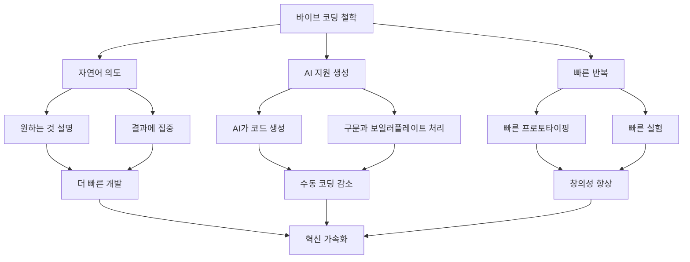
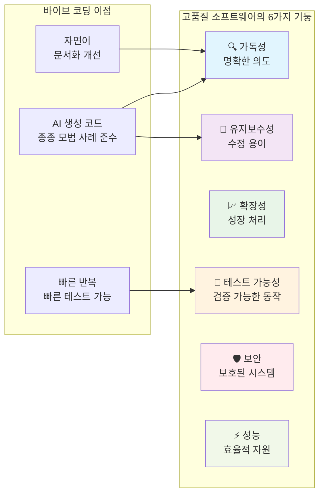

# 1장: 바이브 소프트웨어 엔지니어링 소개

> *"소프트웨어는 단순히 문제를 해결하는 것이 아니라, 성장하고 진화하며 함께 작업하는 개발자들에게 영감을 주는 솔루션을 만드는 것입니다."*

---

## 학습 목표

이 장을 마치면 다음을 할 수 있게 됩니다:
- "바이브 코딩"을 정의하고 AI 지원 프로그래밍 접근법을 이해할 수 있습니다
- 고품질 소프트웨어의 6가지 기둥과 그들의 상호 의존성을 식별할 수 있습니다
- 바이브 코딩이 품질을 유지하면서 개발을 가속화하는 방법을 이해할 수 있습니다
- AI 어시스턴트와 함께 자연어 프롬프트를 사용하는 바이브 코딩 기법을 적용할 수 있습니다

---

## 1.1 "바이브 코딩"이란 무엇이며 왜 중요한가

### 정의와 철학

"바이브 코딩"은 개발자가 자연어로 구축하고자 하는 것을 설명하면, AI 도구(특히 대규모 언어 모델)가 해당 코드를 생성하는 AI 지원 프로그래밍 접근법입니다. 2025년 초 안드레이 카르파시(Andrej Karpathy)가 만든 이 용어는 개발자가 수동으로 구문을 작성하기보다는 의도와 원하는 결과를 표현하는 데 집중하는 패러다임 전환을 나타냅니다.

"바이브"라는 용어는 이 접근법의 직관적이고 대화적인 특성을 포착합니다. 소프트웨어가 해야 할 일의 "바이브"나 느낌을 설명하면, AI가 이를 기능적인 코드로 번역합니다. 이 방법론은 빠른 프로토타이핑, 실험, 그리고 AI를 코딩 파트너로 활용하는 것을 강조합니다.

### 바이브 코딩의 핵심 원칙



1. **의도 중심 개발**: 구현 방법보다는 원하는 것을 설명하는 데 집중
2. **AI를 코딩 파트너로**: AI를 활용하여 일상적인 코딩 작업과 보일러플레이트 처리
3. **자연어 인터페이스**: 대화형 프롬프트를 사용하여 개발 안내
4. **빠른 프로토타이핑**: 아이디어를 빠르게 테스트하고 솔루션을 반복
5. **인간-AI 협업**: 인간의 창의성과 AI의 코드 생성 능력 결합

### 바이브 코딩의 인간적 차원

바이브 코딩은 다음과 같이 개발자 경험을 변화시킵니다:

- **진입 장벽 낮추기**: 새로운 기술과 프레임워크에 더 빠르게 진입 가능
- **학습 가속화**: AI 설명이 생성된 코드 패턴 이해에 도움
- **창의성 향상**: 고수준 문제 해결을 위한 정신적 에너지 확보
- **생산성 향상**: 구문과 보일러플레이트 코드에 소요되는 시간 감소
- **실험 활성화**: 다양한 접근법을 빠르게 시도하기 쉬워짐

### 바이브 코딩이 뛰어난 경우

바이브 코딩은 특히 다음과 같은 경우에 효과적입니다:
- **빠른 프로토타이핑**: MVP와 개념 증명을 빠르게 구축
- **새로운 기술 학습**: AI 가이드와 함께 익숙하지 않은 프레임워크 탐색
- **보일러플레이트 생성**: 표준 코드 구조와 패턴 생성
- **빠른 스크립트**: 유틸리티 도구와 자동화 스크립트 구축
- **실험**: 다양한 접근법과 솔루션 테스트

### 💡 **바이브 코딩 프롬프트: 프로젝트 킥스타트**

**시나리오**: 비즈니스 아이디어를 검증하기 위해 작업 관리 웹 애플리케이션을 빠르게 프로토타입해야 합니다.

**바이브 코딩 프롬프트**:
```
다음 기능을 가진 간단한 작업 관리 웹 앱을 만들고 싶습니다:

1. **핵심 기능**:
   - 작업 추가, 편집, 삭제
   - 작업을 완료/미완료로 표시
   - 우선순위별로 작업 정리 (높음, 보통, 낮음)
   - 상태와 우선순위별로 작업 필터링

2. **기술 요구사항**:
   - 프론트엔드에 React 사용
   - 깔끔하고 현대적인 UI와 반응형 디자인 포함
   - 현재는 localStorage에 데이터 저장 (백엔드 불필요)
   - 기본 폼 검증 추가

3. **사용자 경험**:
   - 부드럽고 반응적인 직관적 인터페이스
   - 사용자 액션에 대한 시각적 피드백
   - 쾌적한 색상 구성과 타이포그래피

다음을 포함한 완전한 애플리케이션 구조를 생성해 주세요:
- 컴포넌트 아키텍처
- 상태 관리 접근법
- 스타일링 권장사항
- 기본 오류 처리

나중에 이해하고 수정할 수 있도록 코드 구조도 설명해 주세요.
```

**사용법**: 이 프롬프트를 AI 코딩 어시스턴트(Cursor, GitHub Copilot, ChatGPT 등)에 복사하여 초기 애플리케이션 구조를 생성하게 하세요. 그 다음 후속 프롬프트로 특정 기능을 개선하세요.

---

## 1.2 고품질 소프트웨어의 6가지 기둥

바이브 코딩 기법을 사용할 때도 소프트웨어 품질 유지는 여전히 중요합니다. 고품질 소프트웨어는 견고하고 유지보수 가능한 시스템을 만들기 위해 함께 작동하는 6가지 기본 기둥 위에 세워집니다.

### 6가지 기둥

1. **🔍 가독성**: 인간 독자에게 의도를 명확히 전달하는 코드
2. **🔧 유지보수성**: 시스템을 수정, 수정, 확장하는 용이성
3. **📈 확장성**: 증가하는 부하와 복잡성을 처리하는 능력
4. **🧪 테스트 가능성**: 자동화된 수동 테스트를 통해 동작을 검증하는 능력
5. **🛡️ 보안**: 취약점과 악의적인 공격으로부터의 보호
6. **⚡ 성능**: 시스템 자원의 효율적 사용과 반응적 동작

### 바이브 코딩과 품질 기둥



바이브 코딩은 신중하게 사용할 때 실제로 이러한 기둥들을 향상시킬 수 있습니다:
- **AI 생성 코드**는 종종 확립된 패턴과 모범 사례를 따릅니다
- **자연어 프롬프트**는 의도의 살아있는 문서 역할을 합니다
- **빠른 반복**은 다양한 접근법의 빠른 테스트와 검증을 가능하게 합니다

### 💡 **바이브 코딩 프롬프트: 품질 중심 코드 생성**

**시나리오**: 6가지 품질 기둥을 모두 준수하는 사용자 인증 시스템을 만들어야 합니다.

**바이브 코딩 프롬프트**:
```
웹 애플리케이션용 보안 사용자 인증 시스템을 구축해야 합니다. 6가지 품질 기둥을 모두 우선시하는 코드를 생성해 주세요:

**요구사항**:
1. **가독성**: 명확한 변수명, 적절한 주석, 논리적 구조 사용
2. **유지보수성**: 관심사 분리를 통한 모듈식 설계
3. **확장성**: 증가하는 사용자 기반을 처리할 수 있는 설계
4. **테스트 가능성**: 단위 테스트 포함 및 쉽게 테스트 가능한 컴포넌트
5. **보안**: 적절한 비밀번호 해싱, 입력 검증, 보안 헤더 구현
6. **성능**: 효율적인 데이터베이스 쿼리와 적절한 캐싱

**기술 사양**:
- Node.js/Express 백엔드
- 세션 관리를 위한 JWT
- 비밀번호 해싱을 위한 bcrypt
- 입력 검증 및 정화
- 로그인 시도 제한
- 포괄적인 오류 처리

**결과물**:
- 인증 미들웨어
- 사용자 등록 및 로그인 엔드포인트
- 비밀번호 재설정 기능
- 모든 컴포넌트에 대한 단위 테스트
- 보안 모범 사례 문서

생성된 코드의 각 부분이 6가지 품질 기둥을 어떻게 다루는지 설명하고, 이 시스템을 안전하게 확장하는 방법에 대한 가이드를 제공해 주세요.
```

**반복을 위한 후속 프롬프트**:
- "이 시스템에 2단계 인증 추가"
- "더 나은 성능을 위해 데이터베이스 쿼리 최적화"
- "보안 모니터링을 위한 포괄적인 로깅 추가"
- "인증 플로우를 위한 통합 테스트 생성"

---

## 1.3 실제 바이브 코딩: 도구와 기법

### 필수 바이브 코딩 도구

**AI 코딩 어시스턴트**:
- **Cursor**: 자연어 인터페이스를 가진 AI 기반 코드 에디터
- **GitHub Copilot**: 인기 있는 에디터와 통합된 AI 페어 프로그래머
- **ChatGPT/Claude**: 코드 생성과 설명을 위한 범용 AI
- **Replit**: 내장 AI 지원을 가진 온라인 IDE

**음성-텍스트 도구** (핸즈프리 바이브 코딩용):
- **SuperWhisper**: 코딩을 위한 고품질 음성-텍스트
- **Dragon NaturallySpeaking**: 전문 받아쓰기 소프트웨어
- **내장 OS 도구**: macOS 받아쓰기, Windows 음성 인식

### 효과적인 바이브 코딩 기법

1. **명확한 의도로 시작**: 구현 방법이 아닌 달성하고자 하는 것을 설명
2. **맥락 제공**: 관련 기술적 제약과 요구사항 포함
3. **점진적 반복**: 여러 프롬프트를 통해 복잡성 구축
4. **설명 요청**: 생성된 솔루션을 이해하기 위한 코드 설명 요청
5. **품질 요구사항 명시**: 테스트 가능하고 안전하며 성능이 좋은 코드를 명시적으로 요청

### 💡 **바이브 코딩 프롬프트: 새로운 기술 학습**

**시나리오**: 익숙하지 않은 기술을 사용하여 기능을 빠르게 학습하고 구현해야 합니다.

**바이브 코딩 프롬프트**:
```
GraphQL을 처음 접하는데 블로그 애플리케이션용 API를 만들어야 합니다. 구현과 개념을 모두 이해하고 싶습니다.

**필요한 것**:
1. **GraphQL 스키마**:
   - 블로그 포스트 (제목, 내용, 작성자, 게시일, 태그)
   - 작성자 (이름, 이메일, 소개)
   - 댓글 (내용, 작성자, 포스트ID, 생성일)

2. **리졸버**:
   - 페이지네이션으로 포스트 가져오기
   - 태그와 작성자별 필터링 허용
   - 중첩 쿼리 처리 (포스트와 댓글, 작성자)

3. **학습 지원**:
   - 구현하면서 GraphQL 개념 설명
   - REST API와의 차이점 보여주기
   - 테스트할 수 있는 쿼리 예제 포함

4 **모범 사례**:
   - 오류 처리 패턴
   - 성능 최적화 (N+1 문제 해결)
   - 보안 고려사항

**기술 스택**: Node.js, Apollo Server, 현재는 간단한 인메모리 데이터 저장소.

GraphQL의 "무엇"과 "왜"를 모두 이해할 수 있도록 단계별로 구축하면서 각 개념을 설명해 주세요.
```

**점진적 학습 프롬프트**:
- "이제 포스트 생성 및 업데이트를 위한 뮤테이션 추가"
- "이 리졸버에 인증 추가하는 방법 보여주기"
- "데이터베이스 통합으로 프로덕션용 최적화"
- "새 댓글을 위한 실시간 구독 추가"

---

## 1.4 이 교재의 접근법 개요

이 교재는 전통적인 소프트웨어 엔지니어링 원칙과 현대적인 바이브 코딩 기법을 결합합니다. 각 장은 다음을 포함합니다:

### 전통적 기초
- **핵심 설계 원칙**: SOLID, DRY, KISS, YAGNI
- **아키텍처 패턴**: 계층형, 마이크로서비스, 이벤트 기반
- **품질 실무**: 테스팅, CI/CD, 코드 리뷰

### 바이브 코딩 통합
- **AI 지원 구현**: 자연어를 사용한 코드 생성
- **빠른 프로토타이핑**: 아키텍처 결정의 빠른 검증
- **학습 가속화**: 복잡한 개념의 AI 설명

### 1부: 효과적인 소프트웨어 설계의 기초
바이브 코딩으로 향상된 **핵심 설계 원칙**:
- AI를 사용하여 SOLID 원칙의 실제 예제 생성
- 다양한 아키텍처 접근법의 빠른 프로토타이핑
- AI 지원 레거시 코드 리팩토링

### 2부: 아키텍처와 시스템 설계
AI로 가속화된 **아키텍처 사고**:
- 여러 아키텍처 옵션을 빠르게 생성
- 다양한 패턴을 프로토타입하여 트레이드오프 비교
- AI 지원 문서화 및 다이어그래밍

### 3부: 코드 품질과 유지보수성
AI로 지원되는 **품질 실무**:
- AI 생성 테스트와 테스트 케이스
- 자동화된 코드 리뷰와 개선 제안
- 자연어 문서 생성

### 4부: 테스팅과 지속적 통합
AI로 향상된 **현대 개발 실무**:
- AI 지원 테스트 생성과 TDD
- 자동화된 CI/CD 파이프라인 생성
- 지능적 모니터링과 알림 설정

### 💡 **바이브 코딩 프롬프트: 개인 학습 경로**

**시나리오**: 전통적인 소프트웨어 엔지니어링과 바이브 코딩 기법을 결합한 개인화된 학습 계획을 만들고 싶습니다.

**바이브 코딩 프롬프트**:
```
전통적인 소프트웨어 엔지니어링 원칙과 현대적인 바이브 코딩 기법을 결합한 개인화된 학습 계획을 만들어 주세요.

**현재 상황**:
- 3년의 Python/Django 개발 경험
- 주로 웹 애플리케이션과 REST API 작업
- 백엔드 개발에 강하지만 프론트엔드와 DevOps 기술 향상 원함
- 기본 테스팅에 익숙하지만 TDD와 고급 테스팅 전략 마스터하고 싶음

**학습 목표**:
1. 핵심 소프트웨어 엔지니어링 원칙 마스터
2. AI 지원 개발에 능숙해지기
3. 고품질 프로젝트 포트폴리오 구축
4. 업계 모범 사례와 최신 동향 유지

**제약사항**:
- 주당 10-15시간 학습 가능
- 실습 프로젝트를 통한 핸즈온 학습 선호
- 18개월 내 시니어 개발자가 되는 것이 목표
- 결국 테크 리드 역할로 전환하고 싶음

**원하는 결과물**:
1. **주간 학습 일정**: 이론과 실습의 균형
2. **프로젝트 아이디어**: 바이브 코딩 기법을 사용한 점진적 복잡성
3. **기술 평가 프레임워크**: 진행 상황 측정 방법
4. **자원 추천**: 책, 강의, 도구, 커뮤니티
5. **연습 문제**: 각 주제별 구체적인 바이브 코딩 프롬프트

전통적인 소프트웨어 엔지니어링과 현대적인 AI 지원 개발 기법 모두에 능숙하게 만들어줄 포괄적인 6개월 학습 계획을 만들어 주세요.
```

**맞춤화 프롬프트**:
- "[X년] 경험을 가진 사람을 위해 이 계획 조정"
- "[특정 기술이나 도메인]에 더 집중"
- "이론적 개념보다 실습 프로젝트 더 추가"
- "[특정 자격증이나 역할] 준비 포함"

---

## 요약

바이브 코딩은 인간의 창의성과 AI 능력을 결합하는 혁신적인 소프트웨어 개발 접근법을 나타냅니다. 자연어로 의도를 표현하고 AI가 구현 세부사항을 처리하게 함으로써 개발자는 다음을 할 수 있습니다:

- **개발 가속화**: 프로토타입과 MVP를 더 빠르게 구축
- **학습 곡선 낮추기**: AI 가이드와 함께 새로운 기술 탐색
- **창의성 향상**: 구문보다는 문제 해결에 집중
- **품질 유지**: AI를 사용하여 모범 사례를 일관되게 구현

성공적인 바이브 코딩의 핵심은 좋은 소프트웨어 엔지니어링의 기본 원칙을 유지하면서 언제 어떻게 효과적으로 사용할지 이해하는 것입니다. 이 교재는 전통적인 실무와 현대적인 AI 지원 기법을 모두 안내하여 더 효과적이고 생산적인 개발자가 되도록 도와줍니다.

기억하세요: 바이브 코딩은 소프트웨어 엔지니어링 지식을 대체하는 것이 아니라, 높은 품질과 장인정신의 기준을 유지하면서 능력을 증강하고 개발 프로세스를 가속화하는 것입니다. 