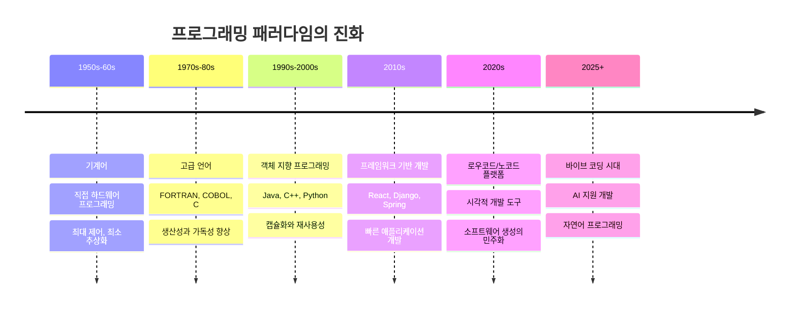
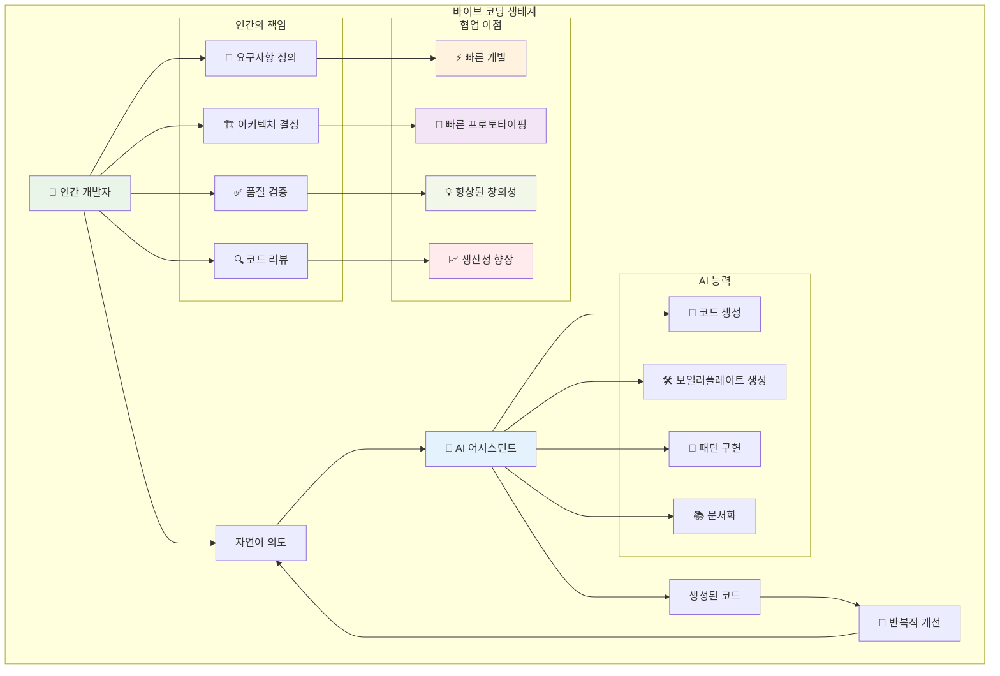
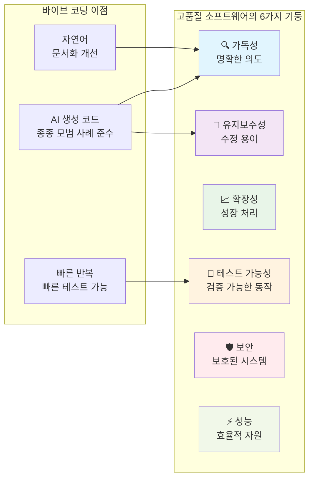
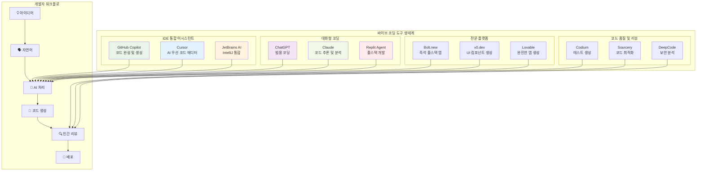

# 1장: 바이브 소프트웨어 엔지니어링 소개

> **"가장 핫한 새로운 프로그래밍 언어는 영어입니다."** - 안드레이 카르파시(Andrej Karpathy), 2025

---

## 학습 목표

이 장을 마치면 다음을 할 수 있게 됩니다:
- "바이브 코딩"을 정의하고 AI 지원 프로그래밍 접근법을 이해할 수 있습니다
- 고품질 소프트웨어의 6가지 기둥과 그들의 상호 의존성을 식별할 수 있습니다
- 바이브 코딩이 품질을 유지하면서 개발을 가속화하는 방법을 이해할 수 있습니다
- AI 어시스턴트와 함께 자연어 프롬프트를 사용하는 바이브 코딩 기법을 적용할 수 있습니다
- 바이브 코딩이 가장 효과적인 때와 전통적인 접근법이 선호되는 때를 인식할 수 있습니다

---

## 1.1 "바이브 코딩"이란 무엇이며 왜 중요한가

### 정의와 철학

**바이브 코딩**은 2025년 2월 안드레이 카르파시가 만든 AI 지원 프로그래밍 패러다임으로, 개발자가 자연어로 소프트웨어 요구사항을 설명하면 AI 도구가 해당 코드를 생성하는 방식입니다. 한 줄씩 코드를 작성하는 대신, 개발자는 **의도**와 **원하는 결과**를 표현하는 데 집중하고, 대규모 언어 모델(LLM)이 구현 세부사항을 처리합니다.

"바이브"라는 용어는 이 접근법의 직관적이고 대화적인 특성을 포착합니다. 소프트웨어가 달성해야 할 "바이브"나 본질을 설명하면, AI가 그 비전을 기능적인 코드로 번역합니다. 이는 인간이 명시적 지시를 작성하던 전통적인 프로그래밍에서 인간이 고수준 가이드를 제공하고 AI가 저수준 구현을 처리하는 새로운 패러다임으로의 근본적인 변화를 나타냅니다.

**핵심 통찰**: 바이브 코딩은 프로그래밍 지식을 대체하지 않고, 일상적인 작업을 자동화하고 개발자가 구문과 보일러플레이트 코드보다는 아키텍처, 설계, 문제 해결에 집중할 수 있게 함으로써 인간의 창의성을 증폭시킵니다.

### 역사적 맥락과 진화



### 바이브 코딩의 핵심 원칙



**바이브 코딩 철학은 4가지 기본 원칙에 기반합니다:**

1. **의도 중심 개발**: 구현 방법보다는 원하는 것을 설명하는 데 집중
2. **AI를 코딩 파트너로**: AI를 활용하여 일상적인 코딩 작업을 처리하고 인간은 창의성과 아키텍처에 집중
3. **자연어 인터페이스**: 대화형 프롬프트를 사용하여 개발을 안내하고 프로그래밍을 더 접근 가능하게 만듦
4. **빠른 반복 주기**: 아이디어를 빠르게 테스트하고 피드백을 받으며 지속적인 협업을 통해 솔루션을 개선

### 인간-AI 협업 모델

바이브 코딩은 명확한 책임 분담을 통해 개발자 경험을 변화시킵니다:

**👨‍💻 인간의 강점:**
- 창의적 문제 해결과 아키텍처적 사고
- 비즈니스 요구사항과 사용자 필요 이해
- 전략적 기술 결정 내리기
- 코드 품질과 보안 표준 보장
- 컨텍스트와 도메인 전문성 제공

**🤖 AI의 강점:**
- 빠른 코드 생성과 패턴 구현
- 반복적 작업과 보일러플레이트 코드 처리
- 일관된 코딩 표준 유지
- 포괄적인 문서 생성
- 최적화와 모범 사례 제안

**🤝 협업 이점:**
- **가속화된 학습**: AI 설명이 개발자의 새로운 개념 이해 도움
- **인지 부하 감소**: 구문 세부사항보다는 고수준 설계에 집중
- **향상된 실험**: 다양한 접근법과 솔루션을 쉽게 시도
- **코드 품질 향상**: AI가 종종 확립된 패턴과 관행을 따름

### 바이브 코딩이 뛰어난 경우

바이브 코딩은 특히 다음과 같은 경우에 효과적입니다:

**🎯 이상적인 사용 사례:**
- **빠른 프로토타이핑**: MVP와 개념 증명을 빠르게 구축
- **새로운 기술 학습**: AI 가이드와 함께 익숙하지 않은 프레임워크 탐색
- **보일러플레이트 생성**: 표준 코드 구조와 패턴 생성
- **유틸리티 개발**: 도구와 자동화 스크립트 구축
- **창의적 실험**: 다양한 접근법과 솔루션 테스트
- **문서화**: 포괄적인 프로젝트 문서 생성

**⚠️ 주의해서 진행:**
- **중요 시스템**: 실패가 심각한 결과를 초래하는 경우
- **고보안 애플리케이션**: 철저한 보안 검토가 필요한 경우
- **성능 중요 코드**: 최적화가 최우선인 경우
- **규정 준수**: 상세한 감사 기록이 필요한 경우
- **장기 유지보수**: 수십 년간 지원이 필요한 시스템

### 💡 **바이브 코딩 프롬프트: 프로젝트 킥스타트**

**시나리오**: 비즈니스 아이디어를 검증하기 위해 작업 관리 웹 애플리케이션을 빠르게 프로토타입해야 합니다.

**컨텍스트**: 이 프롬프트는 명확한 요구사항, 기술적 제약사항, 성공 기준을 제공하면서 AI가 구현 세부사항을 처리할 수 있도록 함으로써 효과적인 바이브 코딩을 보여줍니다.

**바이브 코딩 프롬프트**:
```
빠른 비즈니스 검증을 위한 현대적인 작업 관리 웹 애플리케이션을 만들고 싶습니다. 다음은 제 요구사항입니다:

**🎯 핵심 기능**:
- 작업 추가, 편집, 삭제 및 정리
- 시각적 피드백과 함께 작업을 완료/미완료로 표시
- 색상 코딩을 통한 우선순위별 작업 정리 (높음, 보통, 낮음)
- 상태, 우선순위, 키워드별 작업 필터링 및 검색
- 지연 표시기를 포함한 마감일 관리
- 간단한 드래그 앤 드롭 작업 재정렬

**⚙️ 기술 요구사항**:
- 타입 안전성을 위해 TypeScript와 함께 React 18+ 사용
- 모바일과 데스크톱에서 작동하는 반응형 디자인 구현
- MVP를 위해 localStorage에 데이터 저장 (백엔드 복잡성 없음)
- 도움이 되는 오류 메시지와 함께 폼 검증 포함
- 깔끔하고 전문적인 디자인을 위한 현대적 CSS (Flexbox/Grid) 사용
- 더 나은 UX를 위한 로딩 상태와 부드러운 애니메이션 추가

**🎨 사용자 경험 목표**:
- 부드럽고 반응적인 직관적 인터페이스
- 현대적 디자인 원칙을 따르는 쾌적한 색상 구성
- 접근 가능한 디자인 (적절한 ARIA 라벨, 키보드 내비게이션)
- 모든 사용자 액션에 대한 시각적 피드백
- 사용자 친화적 메시지를 통한 오류 처리

**📚 필요한 결과물**:
1. 관심사의 명확한 분리를 통한 완전한 컴포넌트 아키텍처
2. 타입 안전성을 위한 TypeScript 인터페이스
3. 상태 관리 전략 (React hooks 또는 Context API)
4. CSS 모듈 또는 styled-components 설정
5. 핵심 기능에 대한 기본 단위 테스트
6. 설정 및 사용 지침이 포함된 README

**🎯 성공 기준**:
- 사용자가 30초 이내에 전체 작업 라이프사이클을 완료할 수 있음
- 앱이 모바일에서 2초 이내에 로드됨  
- 코드가 유지보수 가능하고 잘 문서화됨
- 새로운 기능으로 쉽게 확장 가능

다음을 포함한 프로덕션 준비 애플리케이션 구조를 생성해 주세요:
- 아키텍처 결정에 대한 명확한 설명
- 복잡한 로직을 설명하는 코드 주석
- 향후 개선을 위한 제안
- 확장성을 위한 모범 사례

잠재적 고객이나 투자자에게 현실적으로 보여줄 수 있는 것을 만드는 데 집중해 주세요.
```

**🎓 학습 목표:**
이 프롬프트는 다음을 가르칩니다:
- 구현 유연성을 남기면서 명확하고 구체적인 요구사항 제공
- 기술적 제약사항과 비즈니스 목표의 균형
- 프로덕션 준비 코드를 위한 요청 구조화
- 품질 게이트와 성공 기준 포함
- 코드 생성과 함께 교육적 설명 요청

**⚡ 효과적인 바이브 코딩을 위한 프로 팁:**
1. **제약사항을 구체적으로**: 프레임워크 버전, 브라우저 지원, 성능 요구사항 언급
2. **성공 지표 정의**: 생성된 코드가 요구사항을 충족하는지 어떻게 알 수 있을까요?
3. **설명 요청**: 학습을 위해 AI에게 아키텍처 결정을 설명하도록 요청
4. **품질 요구사항 포함**: 단순히 작동하는 코드가 아닌 유지보수 가능한 코드 요청
5. **장기적 사고**: 생성된 코드가 어떻게 진화하고 확장될지 고려

---

## 1.2 고품질 소프트웨어의 6가지 기둥

바이브 코딩 기법을 사용할 때도 소프트웨어 품질 유지는 여전히 중요합니다. 고품질 소프트웨어는 견고하고 유지보수 가능한 시스템을 만들기 위해 함께 작동하는 6가지 기본 기둥 위에 세워집니다.

### 6가지 기둥

1. **🔍 가독성**: 인간 독자에게 의도를 명확히 전달하는 코드
2. **🔧 유지보수성**: 시스템을 수정, 수정, 확장하는 용이성
3. **📈 확장성**: 증가하는 부하와 복잡성을 처리하는 능력
4. **🧪 테스트 가능성**: 자동화된 수동 테스트를 통해 동작을 검증하는 능력
5. **🛡️ 보안**: 취약점과 악의적인 공격으로부터의 보호
6. **⚡ 성능**: 시스템 자원의 효율적 사용과 반응적 동작

### 바이브 코딩과 품질 기둥



바이브 코딩은 신중하게 사용할 때 실제로 이러한 기둥들을 향상시킬 수 있습니다:
- **AI 생성 코드**는 종종 확립된 패턴과 모범 사례를 따릅니다
- **자연어 프롬프트**는 의도의 살아있는 문서 역할을 합니다
- **빠른 반복**은 다양한 접근법의 빠른 테스트와 검증을 가능하게 합니다

### 💡 **바이브 코딩 프롬프트: 품질 중심 코드 생성**

**시나리오**: 6가지 품질 기둥을 모두 준수하는 사용자 인증 시스템을 만들어야 합니다.

**바이브 코딩 프롬프트**:
```
웹 애플리케이션용 보안 사용자 인증 시스템을 구축해야 합니다. 6가지 품질 기둥을 모두 우선시하는 코드를 생성해 주세요:

**요구사항**:
1. **가독성**: 명확한 변수명, 적절한 주석, 논리적 구조 사용
2. **유지보수성**: 관심사 분리를 통한 모듈식 설계
3. **확장성**: 증가하는 사용자 기반을 처리할 수 있는 설계
4. **테스트 가능성**: 단위 테스트 포함 및 쉽게 테스트 가능한 컴포넌트
5. **보안**: 적절한 비밀번호 해싱, 입력 검증, 보안 헤더 구현
6. **성능**: 효율적인 데이터베이스 쿼리와 적절한 캐싱

**기술 사양**:
- Node.js/Express 백엔드
- 세션 관리를 위한 JWT
- 비밀번호 해싱을 위한 bcrypt
- 입력 검증 및 정화
- 로그인 시도 제한
- 포괄적인 오류 처리

**결과물**:
- 인증 미들웨어
- 사용자 등록 및 로그인 엔드포인트
- 비밀번호 재설정 기능
- 모든 컴포넌트에 대한 단위 테스트
- 보안 모범 사례 문서

생성된 코드의 각 부분이 6가지 품질 기둥을 어떻게 다루는지 설명하고, 이 시스템을 안전하게 확장하는 방법에 대한 가이드를 제공해 주세요.
```

---

## 1.3 바이브 코딩 학습 경로

### 개별 학습자를 위한 경로

바이브 코딩 마스터는 여정입니다. 다음은 구조화된 학습 접근법입니다:

**🎯 초급 단계 (1-2주)**:
- 기본 바이브 코딩 개념 이해
- 간단한 프롬프트 작성 연습
- AI 도구와 친숙해지기 (ChatGPT, GitHub Copilot)
- 작은 유틸리티 스크립트 생성

**🚀 중급 단계 (3-6주)**:
- 복잡한 프롬프트 작성 기술 개발
- 다양한 AI 코딩 도구 탐색
- 전체 기능과 컴포넌트 구축
- 코드 품질과 리팩토링에 집중

**🏆 고급 단계 (2-3개월)**:
- 전체 애플리케이션 아키텍처 설계
- AI 지원과 수동 코딩의 균형
- 팀 환경에서 바이브 코딩 구현
- 멘토링과 모범 사례 공유

### 💡 **바이브 코딩 프롬프트: 학습 새로운 기술**

**시나리오**: GraphQL을 처음 배우고 있으며 실제 예제를 통해 빠르게 시작하고 싶습니다.

**바이브 코딩 프롬프트**:
```
GraphQL을 처음 배우고 있으며 도서 도서관 관리 시스템을 통해 실습하고 싶습니다. 다음을 포함하여 도움을 주세요:

**학습 목표**:
- GraphQL 스키마 설계의 기본 이해
- 쿼리와 뮤테이션 작성법 학습
- 모범 사례와 일반적인 패턴 파악
- 실제 예제를 통한 실습

**시스템 요구사항**:
- 도서, 저자, 사용자를 위한 기본 스키마
- 도서 검색, 추가, 업데이트를 위한 쿼리
- 새 도서와 저자 생성을 위한 뮤테이션
- 관계 및 중첩 쿼리 시연

**학습 중심 요청**:
1. 각 부분에 대한 자세한 설명과 함께 완전한 GraphQL 스키마 생성
2. 일반적인 사용 사례를 보여주는 예제 쿼리와 뮤테이션 제공
3. 코드의 각 섹션이 무엇을 하는지와 GraphQL 개념과 어떻게 관련되는지 설명
4. 추가 탐색을 위한 다음 단계 제안
5. 실험해 볼 수 있는 고급 기능 하이라이트

Node.js와 Apollo Server 사용을 선호하며, 실제 사용할 수 있는 것보다는 학습에 최적화된 예제를 원합니다.
```

### 💡 **바이브 코딩 프롬프트: 개인 학습 경로**

**시나리오**: 바이브 코딩 기술을 개선하기 위한 개인화된 학습 계획이 필요합니다.

**바이브 코딩 프롬프트**:
```
바이브 코딩 기술을 개선하기 위한 개인화된 학습 계획을 만들어 주세요. 다음은 제 현재 상황입니다:

**현재 기술 수준**:
- 프로그래밍 경험: [초급/중급/고급]
- AI 도구 사용 경험: [없음/기본/중급]
- 선호하는 프로그래밍 언어: [언어들]
- 현재 역할/목표: [학생/개발자/커리어 전환/등]

**학습 선호도**:
- 사용 가능한 시간: 주당 [시간]
- 학습 스타일: [실습 위주/이론 먼저/프로젝트 기반]
- 관심 있는 도메인: [웹 개발/모바일/데이터 과학/등]

**구체적인 목표**:
- [목표 1: 예: 새로운 프레임워크 배우기]
- [목표 2: 예: 개발 속도 향상]
- [목표 3: 예: 코드 품질 개선]

**요청사항**:
1. 제 수준에 맞는 주간 학습 계획
2. 각 주차별 실습 프로젝트 제안
3. 진행 상황을 추적할 수 있는 마일스톤
4. 추천 도구와 리소스
5. 일반적인 도전 과제와 극복 방법

실용적이고 달성 가능한 계획을 만들어 주세요. 또한 동기를 유지하고 지속적으로 개선할 수 있는 팁도 포함해 주세요.
```

---

## 1.4 바이브 코딩 생태계: 도구와 플랫폼

### 현대적 AI 코딩 어시스턴트

바이브 코딩 혁명은 2024-2025년에 등장한 정교한 AI 도구들에 의해 추진되고 있습니다. 이러한 도구를 이해하면 학생들이 자신의 프로젝트에 적합한 접근법을 선택하는 데 도움이 됩니다.



### 필요에 맞는 올바른 도구 선택

| 도구 카테고리 | 최적 용도 | 강점 | 고려사항 |
|---------------|----------|------|----------|
| **IDE 통합** | 일상적인 코딩 워크플로 | 원활한 통합, 컨텍스트 인식 | 기존 IDE 지식 필요 |
| **대화형** | 학습, 탐색 | 자세한 설명, 유연함 | 복사-붙여넣기 워크플로 필요할 수 있음 |
| **전문 플랫폼** | 빠른 프로토타이핑 | 엔드투엔드 솔루션 | 커스터마이징 제어 제한 |
| **품질 중심** | 프로덕션 코드 | 자동화된 테스트, 보안 | 코드 리뷰 기술 필요 |

### 바이브 코딩 모범 사례 (2025년 판)

**🎯 효과적인 프롬프팅 전략:**

1. **CLEAR 프레임워크:**
   - **C**ontext(컨텍스트): 관련 배경 정보 제공
   - **L**imitations(제한사항): 제약사항과 요구사항 명시
   - **E**xamples(예시): 원하는 패턴이나 스타일 보여주기
   - **A**ctions(액션): AI가 수행해야 할 작업 정의
   - **R**esults(결과): 예상 결과 설명

2. **반복적 개선:**
   - 기본 기능부터 시작
   - 점진적으로 복잡성 추가
   - 각 반복을 테스트하고 검증
   - 결과에 기반하여 개선

3. **품질 게이트:**
   - 생성된 코드를 항상 리뷰
   - 배포 전 철저한 테스트
   - 보안과 성능 검증
   - 유지보수성 보장

**⚠️ 피해야 할 일반적인 함정:**

- **과도한 의존**: 모든 제안을 맹목적으로 수용하지 마세요
- **불충분한 컨텍스트**: 정확한 생성을 위해 충분한 정보 제공
- **엣지 케이스 무시**: AI가 비정상적인 시나리오를 놓칠 수 있음
- **보안 소홀**: 항상 보안 영향 검증
- **문서화 격차**: 코드가 적절히 문서화되었는지 확인

### 바이브 코딩의 미래

2025년으로 더 깊이 들어가면서, 바이브 코딩의 미래를 형성하는 여러 트렌드들이 있습니다:

**🔮 신흥 트렌드:**

1. **멀티모달 개발**: 음성, 시각, 텍스트 입력 결합
2. **AI 페어 프로그래밍**: AI 파트너와의 실시간 협업
3. **지능형 코드 진화**: 코딩 패턴에서 학습하는 AI
4. **도메인별 모델**: 특정 산업이나 프레임워크에 훈련된 AI
5. **자동화된 테스트**: 포괄적인 테스트 스위트를 생성하는 AI

**🌟 소프트웨어 개발에 미치는 영향:**

- **민주화**: 비기술 사용자도 프로그래밍에 접근 가능
- **가속화**: 아이디어에서 작동하는 프로토타입까지의 시간 단축
- **품질 개선**: AI가 강제하는 모범 사례와 패턴
- **학습 향상**: 대화형 튜터링과 설명
- **혁신 촉진**: 빠른 실험과 창의성 활성화

### 💡 **바이브 코딩 프롬프트: 도구 선택 가이드**

**시나리오**: 새로운 프로젝트를 시작하며 팀에 적합한 바이브 코딩 도구를 선택해야 합니다.

**바이브 코딩 프롬프트**:
```
소프트웨어 개발 프로젝트를 계획 중이며 최고의 바이브 코딩 도구 선택에 대한 가이드가 필요합니다. 다음은 제 상황입니다:

**프로젝트 컨텍스트**:
- 구축 중인 것: [프로젝트 유형 설명: 웹 앱, 모바일 앱, 데스크톱 소프트웨어 등]
- 팀 규모: [경험 수준을 가진] [인원수] 개발자
- 타임라인: [기간]
- 예산 제약: [예산 수준]

**기술 요구사항**:
- 주요 프로그래밍 언어: [언어들]
- 대상 플랫폼: [웹, 모바일, 데스크톱]
- 통합 필요사항: [기존 시스템, API, 데이터베이스]
- 성능 요구사항: [구체적인 필요사항]

**팀 선호도**:
- 현재 개발 도구: [IDE, 프레임워크]
- AI 경험 수준: [초급, 중급, 고급]
- 학습 vs 생산성 중점: [선호도]

다음을 추천해 주세요:
1. 저희의 구체적인 필요에 가장 적합한 바이브 코딩 도구
2. 단계별 도입 전략
3. 저희 팀의 기술 수준에 맞는 모범 사례
4. 잠재적 도전 과제와 완화 전략
5. 진행 상황을 추적할 성공 지표

또한 이러한 도구들이 저희 개발 워크플로와 생산성을 어떻게 개선할지에 대한 구체적인 예시도 제공해 주세요.
```

이 프레임워크는 학생들이 특정 컨텍스트와 필요에 기반하여 도구 선택에 대한 정보에 입각한 결정을 내리는 데 도움이 됩니다.

--- 