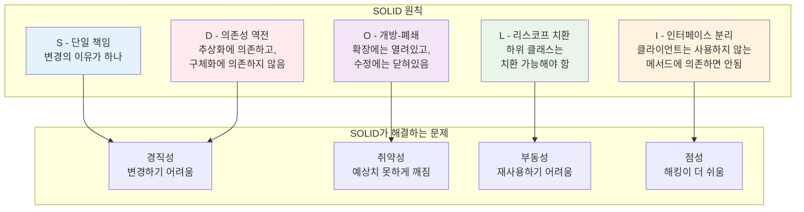
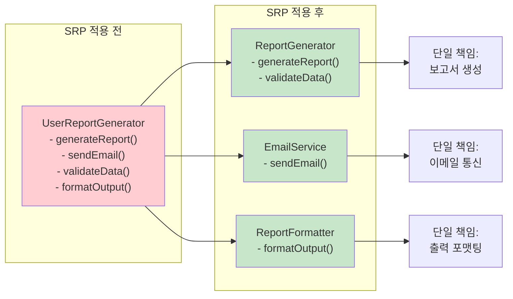

# 2장: 핵심 설계 원칙

> *"좋은 설계는 규칙을 맹목적으로 따르는 것이 아니라, 언제 어떻게 적용할지 알 수 있을 만큼 원칙을 깊이 이해하는 것입니다."*

---

## 학습 목표

이 장을 마치면 다음을 할 수 있게 됩니다:
- 5가지 SOLID 원칙을 모두 적용하여 코드 설계와 유지보수성을 개선할 수 있습니다
- DRY, KISS, YAGNI 원칙을 일상 개발 실무에 구현할 수 있습니다
- 적절한 관심사 분리를 통해 시스템을 설계할 수 있습니다
- 소프트웨어 모듈의 결합도와 응집도를 평가하고 최적화할 수 있습니다
- 서로 다른 설계 원칙 간의 정보에 입각한 트레이드오프를 만들 수 있습니다

---

## 2.1 SOLID 원칙: 견고하고 유지보수 가능한 시스템 구축

SOLID 원칙은 체계적으로 적용할 때 더 견고하고 유지보수 가능하며 확장 가능한 소프트웨어 시스템으로 이어지는 5가지 기본 설계 지침을 나타냅니다. 로버트 C. 마틴이 원래 공식화한 이 원칙들은 객체지향 프로그래밍에서 널리 인정받지만 다양한 패러다임과 현대 개발 접근법에서도 관련성을 가집니다.

### SOLID가 중요한 이유

각 원칙을 살펴보기 전에 SOLID 원칙이 해결하는 문제들을 이해하는 것이 중요합니다:



- **경직성**: 모든 변경이 너무 많은 다른 부분에 영향을 미쳐 변경하기 어려운 시스템
- **취약성**: 변경할 때 예상치 못한 곳에서 깨지는 시스템
- **부동성**: 다른 애플리케이션에서 컴포넌트를 쉽게 재사용할 수 없는 시스템
- **점성**: 설계 무결성을 유지하는 것보다 해킹하는 것이 더 쉬운 경우

---

### 2.1.1 단일 책임 원칙 (SRP)

> *"클래스는 하나의, 그리고 오직 하나의 변경 이유만을 가져야 한다."* - 로버트 C. 마틴

#### 원칙 설명

단일 책임 원칙은 소프트웨어 시스템 내의 모든 클래스나 모듈이 단일하고 잘 정의된 기능 조각에 대해서만 책임져야 한다고 규정합니다. 이 원칙은 종종 "클래스는 한 가지만 해야 한다"로 오해되지만, 더 정확하게는 "클래스는 변경의 이유가 하나만 있어야 한다"로 설명됩니다.

#### 책임 식별하기

클래스가 SRP를 위반하는지 식별하려면 다음 질문들을 하세요:
1. **이해관계자는 누구인가?** 서로 다른 이해관계자는 서로 다른 변경 이유를 나타냅니다
2. **이 클래스가 변경되는 원인은 무엇인가?** 여러 이유는 여러 책임을 나타냅니다
3. **"그리고"나 "또는"을 사용하지 않고 한 문장으로 클래스를 설명할 수 있는가?**

#### SRP의 이점

- **쉬운 테스팅**: 더 작고 집중된 클래스는 포괄적으로 테스트하기 더 간단합니다
- **결합도 감소**: 단일 책임을 가진 클래스는 더 적은 의존성을 가집니다
- **유지보수성 향상**: 변경이 더 작고 격리된 코드 섹션에 영향을 미칩니다
- **재사용성 향상**: 집중된 클래스는 다른 맥락에서 유용할 가능성이 높습니다

#### 일반적인 SRP 위반



### 💡 **바이브 코딩 프롬프트: SRP 리팩토링 챌린지**

**시나리오**: 단일 책임 원칙을 위반하는 클래스를 식별했고 AI를 사용하여 적절히 리팩토링하고 싶습니다.

**바이브 코딩 프롬프트**:
```
단일 책임 원칙을 위반하는 클래스가 있어서 SRP 모범 사례를 사용하여 리팩토링하고 싶습니다.

**현재 문제가 있는 클래스**:
```python
class UserReportGenerator:
    def __init__(self, database_connection):
        self.db = database_connection
        
    def generate_user_report(self, user_id, report_type):
        # 사용자 데이터 가져오기
        user = self.db.query(f"SELECT * FROM users WHERE id = {user_id}")
        
        # 보고서 내용 생성
        if report_type == "summary":
            content = f"사용자: {user['name']}, 이메일: {user['email']}"
        elif report_type == "detailed":
            content = f"사용자: {user['name']}, 이메일: {user['email']}, 생성일: {user['created_at']}"
        
        # HTML로 포맷팅
        html_content = f"<html><body><h1>보고서</h1><p>{content}</p></body></html>"
        
        # 이메일 전송
        import smtplib
        server = smtplib.SMTP('smtp.gmail.com', 587)
        server.starttls()
        server.login("admin@company.com", "password123")
        server.sendmail("admin@company.com", user['email'], html_content)
        server.quit()
        
        return html_content
```

**필요한 작업**:

1. **SRP를 따르는 리팩토링된 버전 생성**:
   - 책임을 별도의 집중된 클래스로 분할
   - 새 클래스들 간의 명확한 인터페이스 생성
   - 기존 코드가 깨지지 않도록 동일한 외부 API 유지

2. **완전한 리팩토링된 코드 제공**:
   - 단일 책임을 가진 모든 새 클래스
   - 필요한 곳에 적절한 의존성 주입
   - 명확하고 설명적인 클래스 및 메서드 이름
   - 기본 오류 처리

3. **각 새 클래스에 대한 단위 테스트 포함**:
   - 각 클래스를 독립적으로 테스트하는 방법
   - 의존성을 위한 모의 객체
   - 엣지 케이스와 오류 조건

4. **문서 추가**:
   - 각 클래스가 무엇을 담당하는지
   - 클래스들이 어떻게 함께 작동하는지
   - 기존 설계에서 마이그레이션 단계

5. **향후 코드 리뷰에서 SRP 위반을 조기에 발견할 수 있는 체크리스트 생성**

이론적 설명보다는 실용적 구현에 집중하여 프로젝트에서 즉시 사용할 수 있는 작동하는 프로덕션 준비 코드를 생성해 주세요.
```

---

### 2.1.2 개방-폐쇄 원칙 (OCP)

> *"소프트웨어 엔티티는 확장에는 열려있고 수정에는 닫혀있어야 한다."* - 베르트랑 마이어

#### 원칙 설명

개방-폐쇄 원칙은 기존 코드를 수정하지 않고도 클래스의 동작을 확장할 수 있어야 한다고 명시합니다. 이는 모순적으로 보일 수 있지만, 상속, 인터페이스, 컴포지션과 같은 추상화 메커니즘을 통해 달성할 수 있습니다.

#### 추상화를 통한 OCP 달성

**전략 1: 인터페이스 기반 확장**
```python
# 수정에는 닫혀있고, 확장에는 열려있음
class ReportExporter:
    def export(self, data: ReportData) -> str:
        raise NotImplementedError
    
class XMLExporter(ReportExporter):
    def export(self, data: ReportData) -> str:
        # XML 특화 구현
        pass

class JSONExporter(ReportExporter):
    def export(self, data: ReportData) -> str:
        # JSON 특화 구현
        pass
```

### 💡 **바이브 코딩 프롬프트: 개방-폐쇄 원칙 구현**

**시나리오**: 기존 코드를 수정하지 않고 시스템에 새로운 기능을 추가하여 개방-폐쇄 원칙을 따라야 합니다.

**바이브 코딩 프롬프트**:
```
개방-폐쇄 원칙(확장에는 열려있고, 수정에는 닫혀있음)을 따르면서 새로운 기능으로 시스템을 확장해야 합니다.

**현재 코드**:
```python
class ReportGenerator:
    def generate_pdf_report(self, data):
        # PDF 보고서 생성
        pdf_content = self.create_pdf(data)
        return pdf_content
    
    def create_pdf(self, data):
        # PDF 생성 로직
        return f"PDF: {data}"
```

**필요한 새 기능**: 기존 PDF 기능을 수정하지 않고 Excel과 CSV 내보내기 기능 추가

**생성해 주세요**:

1. **확장 가능한 아키텍처로 리팩토링**:
   - 확장 지점을 위한 적절한 추상화/인터페이스 생성
   - if-else 체인이나 switch 문을 다형성 설계로 변환
   - 적절한 디자인 패턴 사용 (Strategy, Template Method, Factory 등)
   - 기존 코드와의 하위 호환성 유지

2. **완전한 작동 구현**:
   - 추상 기본 클래스 또는 인터페이스
   - 새 패턴으로 변환된 기존 기능
   - 확장으로 구현된 새 기능
   - 적절한 의존성 주입과 구성

3. **확장 템플릿**:
   - 향후 구현을 쉽게 추가하는 방법
   - 코드 구조와 명명 규칙
   - 필수 메서드와 계약
   - 다른 확장 추가 예제

4. **포괄적인 테스트**:
   - 모든 기존 기능이 여전히 작동함
   - 새 기능이 올바르게 작동함
   - 여러 확장이 공존할 수 있음
   - 엣지 케이스와 오류 처리

5. **구성 시스템**:
   - 런타임에 구현 선택 허용
   - 여러 활성 확장 지원
   - 잘못된 구성에 대한 명확한 오류 메시지

프로젝트에서 즉시 사용할 수 있는 완전하고 실행 가능한 코드를 제공해 주세요. 이 설계의 OCP 이점을 설명하는 명확한 주석을 포함해 주세요.
```

---

### 2.1.3 리스코프 치환 원칙 (LSP)

> *"상위 클래스의 객체는 애플리케이션을 깨뜨리지 않고 하위 클래스의 객체로 교체할 수 있어야 한다."* - 바바라 리스코프

#### 원칙 설명

LSP는 종종 이해하고 올바르게 적용하기 가장 어려운 SOLID 원칙입니다. 파생 클래스가 프로그램의 정확성을 변경하지 않고 기본 클래스를 대체할 수 있어야 한다고 요구합니다. 이는 단순한 상속을 넘어서 행동적 호환성에 관한 것입니다.

#### LSP 요구사항

하위 클래스가 부모 클래스를 적절히 대체하려면 다음을 유지해야 합니다:

1. **전제조건을 강화할 수 없음**: 하위 클래스는 부모보다 더 엄격한 요구를 할 수 없습니다
2. **후제조건을 약화할 수 없음**: 하위 클래스는 부모의 보장을 충족하거나 초과해야 합니다
3. **불변조건을 보존해야 함**: 클래스 수준 제약이 유효하게 유지되어야 합니다
4. **히스토리 제약**: 하위 클래스는 부모가 허용하지 않을 상태 변경을 허용해서는 안 됩니다

#### 일반적인 LSP 위반

**직사각형-정사각형 문제**:
```python
class Rectangle:
    def set_width(self, width):
        self._width = width
    
    def set_height(self, height):
        self._height = height
    
    def area(self):
        return self._width * self._height

class Square(Rectangle):  # LSP 위반!
    def set_width(self, width):
        self._width = width
        self._height = width  # 예상치 못한 동작
    
    def set_height(self, height):
        self._width = height  # 예상치 못한 동작
        self._height = height
```

### 💡 **바이브 코딩 프롬프트: LSP 준수 설계**

**시나리오**: LSP를 위반하는 상속 계층구조를 식별했고 이를 수정하고 싶습니다.

**바이브 코딩 프롬프트**:
```
리스코프 치환 원칙을 위반하는 상속 계층구조가 있어서 LSP를 준수하도록 재설계하고 싶습니다.

**문제가 있는 현재 설계**:
```python
class Bird:
    def fly(self):
        return "날고 있습니다"
    
    def make_sound(self):
        return "새 소리"

class Penguin(Bird):  # LSP 위반!
    def fly(self):
        raise Exception("펭귄은 날 수 없습니다")  # 예상치 못한 동작
    
    def make_sound(self):
        return "꽥꽥"

class Eagle(Bird):
    def fly(self):
        return "높이 날고 있습니다"
    
    def make_sound(self):
        return "끼룩"

# 클라이언트 코드가 깨집니다
def make_birds_fly(birds):
    for bird in birds:
        print(bird.fly())  # 펭귄에서 예외 발생!
```

**필요한 작업**:

1. **LSP 준수 설계 생성**:
   - 적절한 추상화와 인터페이스 분리
   - 모든 하위 클래스가 부모를 완전히 대체할 수 있도록 보장
   - 예상치 못한 예외나 동작 제거
   - 행동적 호환성 유지

2. **완전한 재설계된 클래스 계층구조**:
   - 적절한 추상 기본 클래스/인터페이스
   - 올바른 메서드 시그니처와 계약
   - 모든 구현에서 일관된 동작
   - 명확한 문서화된 전제조건과 후제조건

3. **클라이언트 코드 호환성**:
   - 기존 클라이언트 코드가 수정 없이 작동
   - 다형성이 예상대로 작동
   - 런타임 타입 검사 불필요

4. **포괄적인 테스트 스위트**:
   - 모든 하위 클래스가 부모 계약을 준수함을 증명
   - 치환 가능성 테스트
   - 엣지 케이스와 경계 조건
   - 행동적 호환성 검증

5. **LSP 검증 가이드라인**:
   - 향후 확장을 위한 체크리스트
   - 일반적인 LSP 위반 패턴
   - 새 하위 클래스 검증 방법

프로젝트에서 즉시 사용할 수 있는 완전하고 테스트된 솔루션을 제공해 주세요. LSP 준수가 코드 품질을 어떻게 개선하는지 설명해 주세요.
```

---

### 2.1.4 인터페이스 분리 원칙 (ISP)

> *"클라이언트는 사용하지 않는 인터페이스에 의존하도록 강요받아서는 안 된다."* - 로버트 C. 마틴

#### 원칙 설명

인터페이스 분리 원칙은 큰 인터페이스를 더 작고 구체적인 인터페이스로 분할하여 클라이언트가 관심 있는 메서드에만 의존하도록 해야 한다고 명시합니다. 이는 불필요한 의존성을 줄이고 시스템을 더 유연하게 만듭니다.

### 💡 **바이브 코딩 프롬프트: 인터페이스 분리**

**바이브 코딩 프롬프트**:
```
너무 많은 책임을 가진 큰 인터페이스가 있어서 인터페이스 분리 원칙을 적용하여 분할하고 싶습니다.

**문제가 있는 현재 인터페이스**:
```python
class MultiFunctionDevice:
    def print_document(self, document):
        pass
    
    def scan_document(self):
        pass
    
    def fax_document(self, document, number):
        pass
    
    def copy_document(self, document):
        pass

class SimplePrinter(MultiFunctionDevice):  # ISP 위반!
    def print_document(self, document):
        return f"인쇄 중: {document}"
    
    def scan_document(self):
        raise NotImplementedError("스캔 기능 없음")  # 사용하지 않는 메서드
    
    def fax_document(self, document, number):
        raise NotImplementedError("팩스 기능 없음")  # 사용하지 않는 메서드
    
    def copy_document(self, document):
        raise NotImplementedError("복사 기능 없음")  # 사용하지 않는 메서드
```

**필요한 작업**:

1. **ISP 준수 인터페이스 설계**:
   - 기능별로 분리된 작은 인터페이스
   - 각 클라이언트가 필요한 메서드에만 의존
   - 불필요한 의존성 제거
   - 명확한 책임 분리

2. **완전한 리팩토링된 구조**:
   - 분리된 인터페이스들
   - 각 인터페이스의 구체적 구현
   - 컴포지션을 통한 다중 기능 지원
   - 깔끔한 클라이언트 코드

3. **유연한 구성 시스템**:
   - 필요한 기능만 조합 가능
   - 런타임에 기능 추가/제거
   - 의존성 주입 지원

프로젝트에서 즉시 사용할 수 있는 완전한 솔루션을 제공해 주세요.
```

---

### 2.1.5 의존성 역전 원칙 (DIP)

> *"고수준 모듈은 저수준 모듈에 의존해서는 안 된다. 둘 다 추상화에 의존해야 한다."* - 로버트 C. 마틴

#### 원칙 설명

의존성 역전 원칙은 두 가지 핵심 개념을 포함합니다:
1. 고수준 모듈은 저수준 모듈에 의존해서는 안 되며, 둘 다 추상화에 의존해야 합니다
2. 추상화는 세부사항에 의존해서는 안 되며, 세부사항이 추상화에 의존해야 합니다

### 💡 **바이브 코딩 프롬프트: 의존성 역전 적용**

**바이브 코딩 프롬프트**:
```
고수준 모듈이 저수준 모듈에 직접 의존하는 코드가 있어서 의존성 역전 원칙을 적용하고 싶습니다.

**문제가 있는 현재 코드**:
```python
class EmailService:  # 저수준 모듈
    def send_email(self, to, subject, body):
        print(f"이메일 전송: {to}, {subject}")

class UserRegistration:  # 고수준 모듈
    def __init__(self):
        self.email_service = EmailService()  # DIP 위반! 구체 클래스에 의존
    
    def register_user(self, user_data):
        # 사용자 등록 로직
        user = self.create_user(user_data)
        # 직접 의존성
        self.email_service.send_email(user.email, "환영합니다", "가입을 환영합니다")
        return user
```

**필요한 작업**:

1. **DIP 준수 설계**:
   - 적절한 추상화 인터페이스 생성
   - 의존성 주입 구현
   - 고수준과 저수준 모듈 분리
   - 테스트 가능한 설계

2. **완전한 리팩토링된 코드**:
   - 추상 인터페이스
   - 구체적 구현들
   - 의존성 주입 컨테이너
   - 구성 관리

3. **테스트 가능성 향상**:
   - 모의 객체 사용 가능
   - 단위 테스트 예제
   - 통합 테스트 전략

완전하고 테스트 가능한 솔루션을 제공해 주세요.
```

---

## 2.2 기타 핵심 설계 원칙

### 2.2.1 DRY (Don't Repeat Yourself)

> *"모든 지식은 시스템 내에서 단일하고 명확하며 권위 있는 표현을 가져야 한다."*

### 💡 **바이브 코딩 프롬프트: DRY 원칙 적용**

**바이브 코딩 프롬프트**:
```
코드베이스에 중복이 많아서 DRY 원칙을 적용하여 중복을 제거하고 싶습니다.

**중복이 있는 현재 코드**:
```python
class UserValidator:
    def validate_email(self, email):
        if not email or '@' not in email:
            return False, "유효하지 않은 이메일"
        return True, ""
    
    def validate_phone(self, phone):
        if not phone or len(phone) < 10:
            return False, "유효하지 않은 전화번호"
        return True, ""

class CustomerValidator:
    def validate_email(self, email):  # 중복!
        if not email or '@' not in email:
            return False, "유효하지 않은 이메일"
        return True, ""
    
    def validate_address(self, address):
        if not address or len(address) < 5:
            return False, "유효하지 않은 주소"
        return True, ""
```

**필요한 작업**:
1. 중복 코드 식별 및 추상화
2. 재사용 가능한 컴포넌트 생성
3. 설정 기반 검증 시스템
4. 확장 가능한 아키텍처

DRY 원칙을 적용한 완전한 솔루션을 제공해 주세요.
```

### 2.2.2 KISS (Keep It Simple, Stupid)

> *"단순함이 궁극의 정교함이다."*

### 💡 **바이브 코딩 프롬프트: KISS 원칙 적용**

**바이브 코딩 프롬프트**:
```
과도하게 복잡한 코드가 있어서 KISS 원칙을 적용하여 단순화하고 싶습니다.

**복잡한 현재 코드**:
```python
class ComplexDataProcessor:
    def process_data(self, data):
        # 과도하게 복잡한 로직
        result = []
        for item in data:
            if isinstance(item, dict):
                if 'type' in item:
                    if item['type'] == 'A':
                        processed = self.process_type_a(item)
                    elif item['type'] == 'B':
                        processed = self.process_type_b(item)
                    else:
                        processed = self.process_default(item)
                else:
                    processed = self.process_no_type(item)
            else:
                processed = self.convert_to_dict(item)
            result.append(processed)
        return result
```

**필요한 작업**:
1. 복잡성 식별 및 단순화
2. 읽기 쉬운 코드 구조
3. 명확한 의도 표현
4. 유지보수 용이성 향상

KISS 원칙을 적용한 단순하고 명확한 솔루션을 제공해 주세요.
```

### 2.2.3 YAGNI (You Aren't Gonna Need It)

> *"필요할 때까지 기능을 추가하지 마라."*

### 💡 **바이브 코딩 프롬프트: YAGNI 원칙 적용**

**바이브 코딩 프롬프트**:
```
미래를 위해 과도하게 설계된 코드가 있어서 YAGNI 원칙을 적용하여 현재 필요한 것에만 집중하고 싶습니다.

**과도하게 설계된 현재 코드**:
```python
class OverEngineeredUserService:
    def __init__(self):
        # 현재 사용하지 않는 복잡한 캐싱 시스템
        self.cache_strategies = {
            'memory': MemoryCache(),
            'redis': RedisCache(),
            'database': DatabaseCache()
        }
        # 현재 사용하지 않는 다중 데이터베이스 지원
        self.databases = {
            'primary': PrimaryDB(),
            'secondary': SecondaryDB(),
            'analytics': AnalyticsDB()
        }
    
    def get_user(self, user_id):
        # 현재 필요하지 않은 복잡한 로직
        # 실제로는 간단한 데이터베이스 조회만 필요
        pass
```

**필요한 작업**:
1. 현재 실제 요구사항 식별
2. 불필요한 복잡성 제거
3. 간단하고 작동하는 솔루션
4. 향후 확장 가능한 기반

YAGNI 원칙을 적용한 실용적인 솔루션을 제공해 주세요.
```

---

## 요약

핵심 설계 원칙들은 고품질 소프트웨어의 기반을 형성합니다:

- **SOLID 원칙**: 견고하고 유지보수 가능한 객체지향 설계
- **DRY**: 중복 제거를 통한 일관성과 유지보수성
- **KISS**: 단순함을 통한 이해도와 신뢰성 향상
- **YAGNI**: 현재 필요에 집중하여 과도한 엔지니어링 방지

이러한 원칙들을 바이브 코딩과 결합하면 AI의 도움을 받아 더 빠르게 고품질 코드를 작성할 수 있습니다. 중요한 것은 원칙을 이해하고 적절히 적용하는 것이며, AI는 이러한 원칙을 구현하는 데 강력한 도구가 됩니다.

기억하세요: 좋은 설계는 규칙을 맹목적으로 따르는 것이 아니라, 상황에 맞는 최적의 솔루션을 찾기 위해 원칙들 간의 균형을 맞추는 것입니다. 