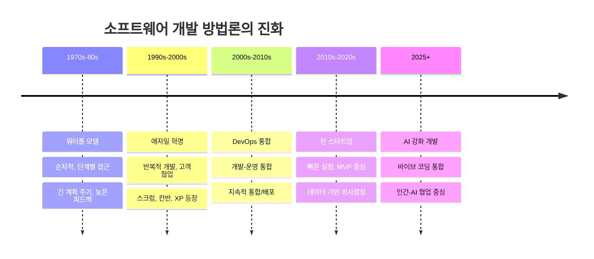
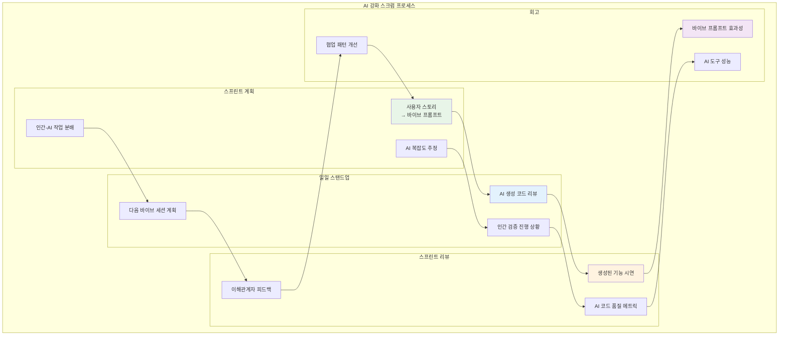

# 2장: 바이브 코딩을 위한 소프트웨어 개발 프로세스

> **"최고의 프로세스는 변화에 적응하고, 협업을 포용하며, 고객에게 가능한 한 빨리 그리고 안정적으로 가치를 제공하는 것입니다."** - 현대 애자일 철학

---

## 학습 목표

이 장을 마치면 다음을 할 수 있게 됩니다:
- 전통적인 소프트웨어 개발 프로세스와 AI 강화 방법론을 비교할 수 있습니다
- 빠른 반복을 위해 바이브 코딩을 활용하는 개발 워크플로를 설계할 수 있습니다
- 애자일 원칙과 AI 지원을 결합한 하이브리드 프로세스를 구현할 수 있습니다
- AI 생성 코드를 위한 품질 게이트와 검증 메커니즘을 수립할 수 있습니다
- 인간-AI 개발 파트너십을 위한 팀 협업 패턴을 적응시킬 수 있습니다
- 바이브 코딩 환경에서 개발 속도를 측정하고 최적화할 수 있습니다
- 현대적인 AI 우선 개발 라이프사이클을 적용할 수 있습니다

---

## 2.1 전통적 개발 프로세스 vs AI 강화 프로세스

### 개발 방법론의 진화



### AI 강화 개발 라이프사이클


### 바이브 코딩이 개발 프로세스를 변화시키는 방법

**🚀 가속화된 프로토타이핑:**
- 아이디어에서 작동하는 프로토타입까지 시간 단축 (주 → 시간)
- 여러 접근법의 빠른 실험과 비교
- 초기 사용자 피드백을 위한 빠른 MVP 생성

**🔄 더 빠른 반복 주기:**
- 전통적 2주 스프린트 → AI 지원 일일 릴리스
- 실시간 코드 조정 및 개선
- 지속적인 사용자 피드백 통합

**🤝 향상된 협업:**
- 기술적이지 않은 이해관계자와의 더 나은 소통
- 자연어 요구사항에서 코드로의 직접 번역
- 실시간 프로토타입을 통한 즉각적인 피드백

---

### 💡 **바이브 코딩 프롬프트: 애자일 스프린트 계획**

**시나리오**: 2주 스프린트를 계획하고 있으며 바이브 코딩을 활용하여 팀 생산성을 극대화하고 싶습니다.

**바이브 코딩 프롬프트**:
```
스크럼 팀을 이끌고 있으며 바이브 코딩을 스프린트 계획에 통합하고 싶습니다. 다음은 저희 상황입니다:

**팀 컨텍스트**:
- 팀 규모: 개발자 5명 (바이브 코딩 경험 다양)
- 스프린트 길이: 2주
- 현재 프로젝트: 전자상거래 플랫폼 개선
- 사용 기술: React, Python, PostgreSQL

**이번 스프린트 목표**:
1. 사용자 추천 시스템 구현
2. 결제 프로세스 개선
3. 모바일 반응성 향상
4. 성능 최적화

**바이브 코딩 통합 요청**:
1. 각 사용자 스토리를 효과적인 바이브 코딩 프롬프트로 분해
2. AI 지원 작업과 수동 개발이 필요한 작업 식별
3. 품질 보증을 위한 코드 리뷰 체크리스트 생성
4. 진행 상황 추적을 위한 일일 스탠드업 구조 제안
5. 스프린트 회고를 위한 바이브 코딩 메트릭 정의

**추가 고려사항**:
- 기존 코드베이스와의 통합 방법
- 팀원별 바이브 코딩 기술 수준 차이 관리
- 전통적 개발 프로세스와의 균형
- 리스크 완화 전략

바이브 코딩을 활용한 구체적이고 실행 가능한 스프린트 계획을 만들어 주세요.
```

---

## 2.2 애자일과 바이브 코딩의 융합

### 애자일 원칙의 AI 강화

바이브 코딩은 애자일 매니페스토의 핵심 가치들을 현대화합니다:

**1. 프로세스와 도구보다 개인과 상호작용**
- AI가 프로세스 오버헤드를 줄여 인간 상호작용에 더 많은 시간 확보
- 자연어 프롬프트를 통한 더 명확한 의사소통
- 비개발자와의 협업 장벽 낮춤

**2. 포괄적인 문서보다 작동하는 소프트웨어**
- AI가 문서화 자동화로 더 많은 개발 시간 확보
- 실행 가능한 프로토타입을 통한 빠른 검증
- 코드 자체가 의도를 명확히 표현

**3. 계약 협상보다 고객 협업**
- 고객과의 실시간 프로토타이핑 세션
- 요구사항을 즉시 시연 가능한 기능으로 변환
- 피드백 주기 가속화

**4. 계획을 따르는 것보다 변화에 대응**
- AI 지원으로 방향 전환 비용 감소
- 실험 비용 최소화로 더 많은 시도 가능
- 실패에서 빠른 학습과 적응

### 바이브 코딩을 위한 스크럼 적응



### 💡 **바이브 코딩 프롬프트: 사용자 스토리를 바이브 프롬프트로 변환**

**시나리오**: 전통적인 사용자 스토리를 효과적인 바이브 코딩 프롬프트로 변환해야 합니다.

**바이브 코딩 프롬프트**:
```
다음 사용자 스토리들을 상세하고 실행 가능한 바이브 코딩 프롬프트로 변환해 주세요:

**사용자 스토리 예시**:
1. "고객으로서 제품을 쉽게 검색하여 원하는 항목을 빠르게 찾을 수 있기를 원합니다"
2. "관리자로서 재고 수준을 모니터링하여 품절을 방지하고 싶습니다"
3. "사용자로서 주문 상태를 추적하여 배송 진행 상황을 알고 싶습니다"

**변환 요구사항**:
1. **명확한 수용 기준**: 각 스토리에 대한 구체적이고 테스트 가능한 기준
2. **기술적 컨텍스트**: 사용할 기술 스택과 통합 포인트 명시
3. **바이브 프롬프트**: AI가 즉시 작업할 수 있는 자연어 지시사항
4. **품질 요구사항**: 성능, 보안, 접근성 기준 포함
5. **테스트 전략**: 생성된 코드를 검증하는 방법

**현재 기술 환경**:
- 프론트엔드: React 18, TypeScript
- 백엔드: Node.js, Express
- 데이터베이스: PostgreSQL
- 기존 API 엔드포인트와 통합 필요

각 변환된 프롬프트에 대해 다음을 포함해 주세요:
- 구현 복잡도 추정 (간단/보통/복잡)
- 필요한 인간 검증 포인트
- 잠재적 위험 요소와 완화 전략
- 반복적 개선을 위한 피드백 메커니즘

실제 개발 팀이 즉시 사용할 수 있는 실용적인 변환을 제공해 주세요.
```

---

### 2.1.2 개방-폐쇄 원칙 (OCP)

> *"소프트웨어 엔티티는 확장에는 열려있고 수정에는 닫혀있어야 한다."* - 베르트랑 마이어

#### 원칙 설명

개방-폐쇄 원칙은 기존 코드를 수정하지 않고 클래스의 동작을 확장할 수 있어야 한다고 명시합니다. 이는 모순적으로 보일 수 있지만 상속, 인터페이스, 컴포지션과 같은 추상화 메커니즘을 통해 달성할 수 있습니다.

#### 추상화를 통한 OCP 달성

**전략 1: 인터페이스 기반 확장**
```python
# 수정에 닫혀있고, 확장에 열려있음
class ReportExporter:
    def export(self, data: ReportData) -> str:
        raise NotImplementedError
    
class XMLExporter(ReportExporter):
    def export(self, data: ReportData) -> str:
        # XML 특화 구현
        pass

class JSONExporter(ReportExporter):
    def export(self, data: ReportData) -> str:
        # JSON 특화 구현
        pass
```

**전략 2: 구성 기반 동작**
```python
class NotificationService:
    def __init__(self, strategies: List[NotificationStrategy]):
        self.strategies = strategies
    
    def notify(self, message: Message):
        for strategy in self.strategies:
            strategy.send(message)
```

### 💡 **바이브 코딩 프롬프트: 개방-폐쇄 원칙 구현**

**시나리오**: 기존 코드를 수정하지 않고 개방-폐쇄 원칙에 따라 시스템에 새로운 기능을 추가해야 합니다.

**바이브 코딩 프롬프트**:
```
개방-폐쇄 원칙(확장에 열려있고, 수정에 닫혀있음)을 따르면서 새로운 기능으로 시스템을 확장해야 합니다.

**현재 코드**: 

class ReportGenerator:
    def generate_pdf_report(self, data):
        # PDF 리포트 생성
        pdf_content = self.create_pdf(data)
        return pdf_content
    
    def create_pdf(self, data):
        # PDF 생성 로직
        return f"PDF: {data}"

**필요한 새 기능**: 기존 PDF 기능을 수정하지 않고 Excel 및 CSV 내보내기 기능 추가

**생성해 주세요**:

1. **확장 가능한 아키텍처 리팩토링**:
   - 확장 지점을 위한 적절한 추상화/인터페이스 생성
   - if-else 체인이나 switch 문을 다형성 설계로 변환
   - 적절한 디자인 패턴 사용 (전략, 템플릿 메서드, 팩토리 등)
   - 기존 코드와의 하위 호환성 유지

2. **완전한 작동 구현** 포함:
   - 추상 기본 클래스 또는 인터페이스
   - 새 패턴으로 변환된 기존 기능
   - 확장으로 구현된 새 기능
   - 적절한 의존성 주입과 구성

3. **확장 템플릿** 표시:
   - 향후 구현을 쉽게 추가하는 방법
   - 코드 구조와 명명 규칙
   - 필요한 메서드와 계약
   - 다른 확장 추가 예시

프로젝트에 즉시 통합할 수 있는 완전하고 실행 가능한 코드를 제공해 주세요. 이 설계의 OCP 이점을 설명하는 명확한 주석을 포함해 주세요.
```

---

### 2.1.3 리스코프 치환 원칙 (LSP)

> *"상위 클래스의 객체는 프로그램의 정확성을 깨뜨리지 않으면서 하위 클래스의 객체로 치환할 수 있어야 한다."* - 바바라 리스코프

#### 원칙 설명

LSP는 종종 SOLID 원칙 중 가장 이해하고 올바르게 적용하기 어려운 원칙입니다. 파생 클래스는 프로그램의 정확성을 변경하지 않으면서 기본 클래스를 대체할 수 있어야 합니다. 이는 단순한 상속을 넘어서며 행동적 호환성에 관한 것입니다.

#### LSP 요구사항

하위 클래스가 부모 클래스를 적절히 대체하려면 다음을 유지해야 합니다:

1. **사전 조건을 강화할 수 없음**: 하위 클래스는 부모보다 더 엄격한 요구를 할 수 없습니다
2. **사후 조건을 약화할 수 없음**: 하위 클래스는 부모의 보장을 만족하거나 넘어서야 합니다
3. **불변조건을 보존해야 함**: 클래스 수준 제약조건이 유효하게 남아있어야 합니다
4. **히스토리 제약**: 하위 클래스는 부모가 허용하지 않을 상태 변경을 허용해서는 안 됩니다

#### 일반적인 LSP 위반

**직사각형-정사각형 문제**:
```python
class Rectangle:
    def set_width(self, width):
        self._width = width
    
    def set_height(self, height):
        self._height = height
    
    def area(self):
        return self._width * self._height

class Square(Rectangle):  # LSP 위반!
    def set_width(self, width):
        self._width = width
        self._height = width  # 예상치 못한 동작
    
    def set_height(self, height):
        self._width = height  # 예상치 못한 동작
        self._height = height
```

---

## 2.2 DRY (Don't Repeat Yourself): 중복 제거

### 원칙 정의

"스스로를 반복하지 말라"(DRY) 원칙은 앤디 헌트와 데이브 토마스가 "실용주의 프로그래머"에서 공식화한 것으로 *"모든 지식 조각은 시스템 내에서 단일하고 명확하며 권위 있는 표현을 가져야 한다"*고 명시합니다.

### DRY에서 "지식" 이해하기

DRY는 단순히 중복 코드를 피하는 것이 아니라 중복 *지식*을 피하는 것입니다. 여기에는 다음이 포함됩니다:
- **비즈니스 규칙**: 검증 로직, 계산 공식, 워크플로 규칙
- **구성**: 데이터베이스 연결, API 엔드포인트, 기능 플래그
- **데이터 구조**: 스키마 정의, 메시지 형식, API 계약
- **알고리즘**: 정렬 로직, 암호화 방법, 파싱 규칙

---

## 2.3 KISS (Keep It Simple, Stupid): 단순함 수용

### 단순함의 철학

미국 해군에서 기원한 KISS 원칙은 시스템이 복잡하게 만들어지기보다는 단순하게 유지될 때 최고로 작동한다고 강조합니다. 소프트웨어 개발에서 이는 문제를 효과적으로 해결하는 가장 단순한 솔루션을 선택하는 것으로 해석됩니다.

---

## 2.4 YAGNI (You Aren't Gonna Need It): 섣부른 최적화 피하기

### 원칙 설명

익스트림 프로그래밍(XP)에서 나온 YAGNI는 개발자가 명백히 필요할 때까지 기능을 추가해서는 안 된다고 명시합니다. 이 원칙은 실제 요구사항보다는 추측에 기반하여 기능을 구축하려는 경향에 맞서 싸웁니다.

---

## 2.5 관심사의 분리 (SoC): 책임 분담

### 원칙 정의

관심사의 분리는 컴퓨터 프로그램을 구별되는 섹션으로 나누는 것으로, 각각이 별도의 "관심사"나 책임을 다룹니다. 이는 모든 부분이 의미 있고 직관적인 역할을 수행하면서 변경에 대한 적응성을 최대화하는 시스템을 만듭니다.

---

## 2.6 결합도와 응집도: 모듈러 설계 달성

### 관계 이해

결합도와 응집도는 함께 소프트웨어 시스템의 유지보수성과 신뢰성을 결정하는 역관계의 품질 메트릭입니다:
- **낮은 결합도 + 높은 응집도 = 좋은 설계**
- **높은 결합도 + 낮은 응집도 = 나쁜 설계**

---

## 장 요약

설계 원칙은 유지보수 가능하고 확장 가능한 소프트웨어 시스템을 만들기 위한 기초를 제공합니다. 이 장에서 다룬 원칙들은 상호 보완적으로 작동합니다:

- **SOLID 원칙**은 모듈성과 유연성을 촉진하는 객체지향 설계 지침을 제공합니다
- **DRY**는 유지보수 부담을 줄이기 위해 지식 중복을 제거합니다
- **KISS**는 솔루션을 단순하고 이해 가능하게 유지합니다
- **YAGNI**는 과도한 엔지니어링과 섣부른 최적화를 방지합니다
- **관심사의 분리**는 시스템의 다른 측면들 간에 명확한 경계를 만듭니다
- **결합도와 응집도** 메트릭은 모듈러 설계를 평가하고 개선하는 데 도움을 줍니다

효과적인 오류 처리와 로깅은 시스템의 신뢰성을 크게 향상시키고 운영 팀의 부담을 줄이며 사용자 경험을 개선합니다. 