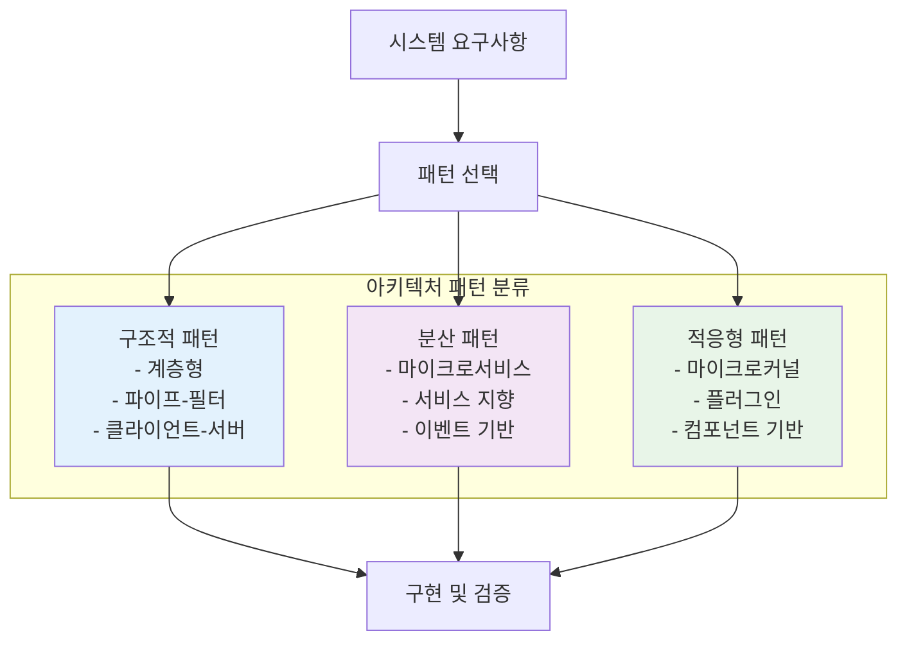
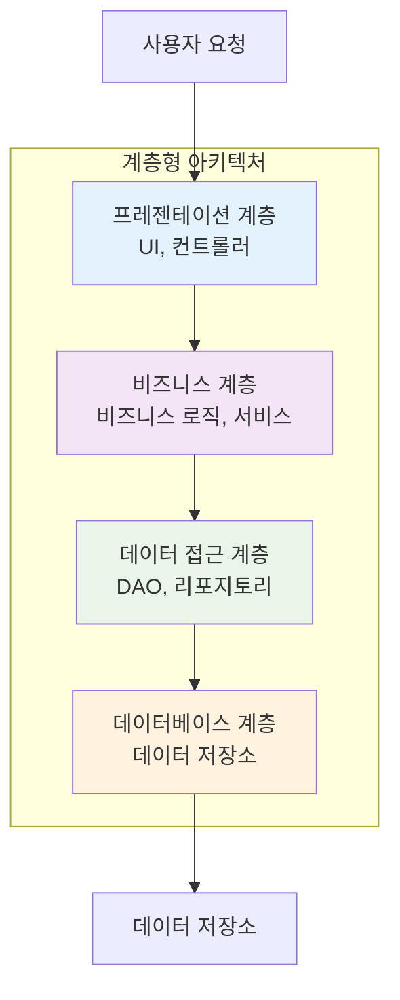
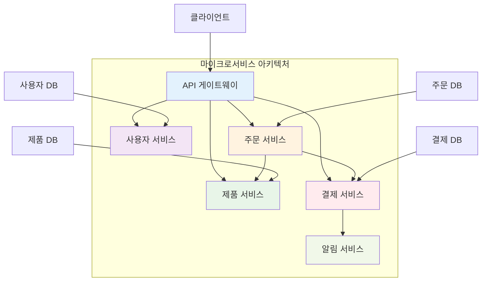
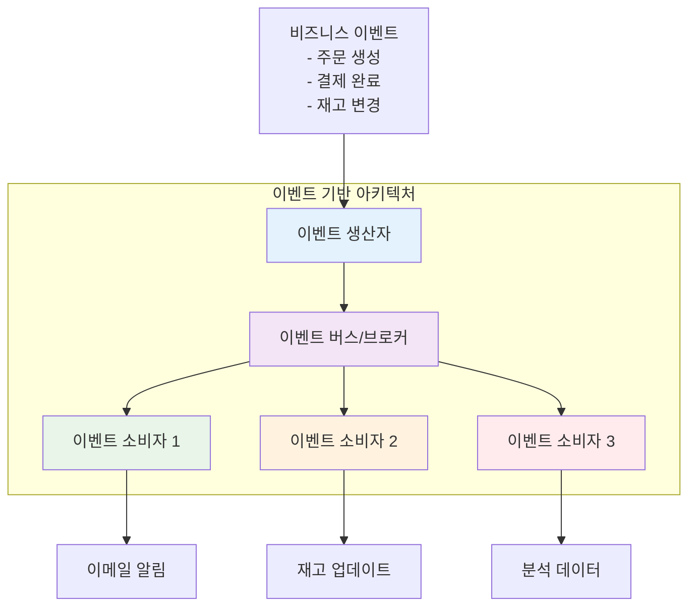

# 4장: 아키텍처 패턴

> *"아키텍처는 변경하기 어려운 결정들에 관한 것이다. 따라서 우리는 변경하기 어려운 결정을 최대한 적게 만들려고 노력해야 한다."* - 로버트 C. 마틴

---

## 학습 목표

이 장을 마치면 다음을 할 수 있게 됩니다:
- 주요 아키텍처 패턴과 그 적용 시나리오를 이해할 수 있습니다
- 바이브 코딩을 사용하여 다양한 아키텍처 접근법을 빠르게 프로토타입할 수 있습니다
- 시스템 요구사항에 따라 적절한 아키텍처 패턴을 선택할 수 있습니다
- 아키텍처 결정의 트레이드오프를 평가할 수 있습니다
- AI 지원을 통해 복잡한 시스템 설계를 문서화하고 구현할 수 있습니다

---

## 4.1 아키텍처 패턴 개요

소프트웨어 아키텍처 패턴은 일반적인 설계 문제에 대한 검증된 솔루션을 제공합니다. 각 패턴은 특정 품질 속성(성능, 확장성, 유지보수성 등)을 최적화하며 고유한 트레이드오프를 가집니다.



### 바이브 코딩과 아키텍처 설계

바이브 코딩은 아키텍처 설계에서 특히 강력합니다:
- **빠른 프로토타이핑**: 여러 아키텍처 옵션을 빠르게 구현하고 비교
- **문서 생성**: 아키텍처 결정과 트레이드오프를 자동으로 문서화
- **패턴 구현**: 복잡한 아키텍처 패턴의 보일러플레이트 코드 생성
- **마이그레이션 계획**: 기존 시스템을 새로운 아키텍처로 전환하는 전략 수립

---

## 4.2 계층형 아키텍처 (Layered Architecture)

### 패턴 개요

계층형 아키텍처는 시스템을 수평적 계층으로 구성하며, 각 계층은 특정 책임을 가지고 인접한 계층과만 통신합니다.



### 💡 **바이브 코딩 프롬프트: 계층형 아키텍처 구현**

**시나리오**: 전자상거래 시스템을 계층형 아키텍처로 설계하고 구현해야 합니다.

**바이브 코딩 프롬프트**:
```
전자상거래 시스템을 위한 완전한 계층형 아키텍처를 구현해 주세요.

**요구사항**:
1. **프레젠테이션 계층**: REST API 엔드포인트
2. **비즈니스 계층**: 주문 처리, 재고 관리, 결제 로직
3. **데이터 접근 계층**: 데이터베이스 추상화
4. **데이터베이스 계층**: 제품, 주문, 사용자 데이터

**기술 스택**: Python/FastAPI, SQLAlchemy, PostgreSQL

**필요한 기능**:
- 제품 카탈로그 관리
- 사용자 인증 및 권한
- 장바구니 및 주문 처리
- 재고 관리
- 결제 처리

**결과물**:
1. **완전한 계층 구조**: 각 계층의 명확한 책임과 인터페이스
2. **의존성 주입**: 계층 간 느슨한 결합
3. **오류 처리**: 각 계층에서의 적절한 예외 처리
4. **테스트**: 각 계층별 단위 테스트
5. **문서**: 아키텍처 결정과 계층 간 통신 방식

계층형 아키텍처의 이점과 제한사항을 설명하고, 언제 이 패턴을 사용해야 하는지 가이드를 포함해 주세요.
```

**장점과 단점**:
- ✅ **장점**: 명확한 관심사 분리, 이해하기 쉬움, 테스트 용이
- ❌ **단점**: 성능 오버헤드, 경직성, 모놀리식 배포

---

## 4.3 마이크로서비스 아키텍처

### 패턴 개요

마이크로서비스 아키텍처는 애플리케이션을 독립적으로 배포 가능한 작은 서비스들로 분해합니다.



### 💡 **바이브 코딩 프롬프트: 마이크로서비스 설계**

**바이브 코딩 프롬프트**:
```
모놀리식 전자상거래 애플리케이션을 마이크로서비스 아키텍처로 분해하고 구현해 주세요.

**현재 모놀리식 시스템**:
- 사용자 관리
- 제품 카탈로그
- 주문 처리
- 결제 시스템
- 알림 서비스

**마이크로서비스 설계 요구사항**:
1. **서비스 분해**: 비즈니스 도메인별 독립적 서비스
2. **API 게이트웨이**: 클라이언트 요청 라우팅 및 인증
3. **서비스 간 통신**: REST API 및 이벤트 기반 통신
4. **데이터 관리**: 서비스별 독립적 데이터베이스
5. **배포**: Docker 컨테이너화 및 오케스트레이션

**기술 스택**: 
- 서비스: Node.js/Express, Python/FastAPI
- 메시징: RabbitMQ 또는 Apache Kafka
- 데이터베이스: PostgreSQL, MongoDB
- 컨테이너: Docker, Docker Compose

**결과물**:
1. **완전한 마이크로서비스 구현**: 각 서비스의 독립적 코드베이스
2. **API 게이트웨이**: 라우팅, 인증, 로드 밸런싱
3. **서비스 디스커버리**: 동적 서비스 등록 및 발견
4. **모니터링**: 분산 추적 및 로깅
5. **배포 스크립트**: Docker Compose 및 Kubernetes 매니페스트

마이크로서비스의 이점과 복잡성을 설명하고, 모놀리식에서 마이크로서비스로의 마이그레이션 전략을 포함해 주세요.
```

**장점과 단점**:
- ✅ **장점**: 독립적 배포, 기술 다양성, 확장성
- ❌ **단점**: 복잡성 증가, 네트워크 지연, 데이터 일관성

---

## 4.4 이벤트 기반 아키텍처

### 패턴 개요

이벤트 기반 아키텍처는 이벤트의 생성, 감지, 소비를 통해 컴포넌트 간 통신을 수행합니다.



### 💡 **바이브 코딩 프롬프트: 이벤트 기반 시스템**

**바이브 코딩 프롬프트**:
```
전자상거래 시스템을 위한 완전한 이벤트 기반 아키텍처를 구현해 주세요.

**이벤트 시나리오**:
1. **주문 생성**: 사용자가 주문을 생성
2. **재고 확인**: 제품 재고 확인 및 예약
3. **결제 처리**: 결제 시스템에서 결제 처리
4. **주문 확정**: 결제 성공 시 주문 확정
5. **알림 발송**: 고객 및 관리자에게 알림
6. **배송 준비**: 물류 시스템에 배송 요청

**기술 요구사항**:
- 이벤트 브로커: Apache Kafka 또는 RabbitMQ
- 이벤트 저장소: Event Sourcing 패턴
- 사가 패턴: 분산 트랜잭션 관리
- CQRS: 명령과 쿼리 분리

**결과물**:
1. **이벤트 정의**: 모든 비즈니스 이벤트의 스키마
2. **이벤트 생산자**: 각 서비스의 이벤트 발행 로직
3. **이벤트 소비자**: 이벤트 처리 핸들러
4. **사가 오케스트레이터**: 복잡한 비즈니스 프로세스 관리
5. **모니터링**: 이벤트 플로우 추적 및 오류 처리

이벤트 기반 아키텍처의 이점과 복잡성을 설명하고, 이벤트 설계 모범 사례를 포함해 주세요.
```

**장점과 단점**:
- ✅ **장점**: 느슨한 결합, 확장성, 실시간 처리
- ❌ **단점**: 복잡성, 디버깅 어려움, 이벤트 순서 관리

---

## 4.5 마이크로커널 아키텍처

### 패턴 개요

마이크로커널 아키텍처는 최소한의 핵심 시스템과 플러그인 가능한 컴포넌트로 구성됩니다.

### 💡 **바이브 코딩 프롬프트: 플러그인 시스템**

**바이브 코딩 프롬프트**:
```
확장 가능한 데이터 처리 플랫폼을 마이크로커널 아키텍처로 구현해 주세요.

**핵심 시스템**:
- 데이터 파이프라인 엔진
- 플러그인 관리자
- 구성 관리
- 모니터링 시스템

**플러그인 유형**:
1. **데이터 소스**: CSV, JSON, 데이터베이스, API
2. **변환기**: 필터링, 집계, 정규화
3. **출력**: 파일, 데이터베이스, 메시지 큐

**기술 요구사항**:
- 동적 플러그인 로딩
- 플러그인 격리 및 보안
- 구성 기반 파이프라인
- 플러그인 생명주기 관리

**결과물**:
1. **마이크로커널 코어**: 최소한의 핵심 기능
2. **플러그인 인터페이스**: 표준화된 플러그인 API
3. **플러그인 예제**: 각 유형별 구현 예제
4. **플러그인 관리**: 동적 로딩 및 언로딩
5. **개발자 가이드**: 새 플러그인 개발 방법

마이크로커널 패턴의 유연성과 확장성을 보여주는 완전한 시스템을 구현해 주세요.
```

---

## 4.6 파이프-필터 아키텍처

### 패턴 개요

파이프-필터 아키텍처는 데이터를 일련의 처리 단계(필터)를 통해 흘려보내는 패턴입니다.

### 💡 **바이브 코딩 프롬프트: 데이터 파이프라인**

**바이브 코딩 프롬프트**:
```
로그 분석 시스템을 파이프-필터 아키텍처로 구현해 주세요.

**데이터 처리 파이프라인**:
1. **로그 수집**: 다양한 소스에서 로그 수집
2. **파싱**: 로그 형식 파싱 및 구조화
3. **필터링**: 관련 없는 로그 제거
4. **변환**: 데이터 정규화 및 보강
5. **집계**: 통계 및 메트릭 계산
6. **저장**: 처리된 데이터 저장

**기술 요구사항**:
- 스트리밍 처리: Apache Kafka Streams
- 필터 체인: 조합 가능한 처리 단계
- 백프레셔: 처리 속도 조절
- 오류 처리: 실패한 메시지 처리

**결과물**:
1. **필터 인터페이스**: 표준화된 처리 단계
2. **파이프라인 빌더**: 동적 파이프라인 구성
3. **필터 라이브러리**: 재사용 가능한 처리 컴포넌트
4. **모니터링**: 파이프라인 성능 및 처리량 추적
5. **구성 시스템**: YAML/JSON 기반 파이프라인 정의

실시간 로그 처리가 가능한 확장 가능한 시스템을 구현해 주세요.
```

---

## 4.7 브로커 아키텍처

### 패턴 개요

브로커 아키텍처는 분산 컴포넌트 간의 통신을 중재하는 브로커를 중심으로 구성됩니다.

### 💡 **바이브 코딩 프롬프트: 메시지 브로커 시스템**

**바이브 코딩 프롬프트**:
```
분산 시스템을 위한 메시지 브로커 아키텍처를 구현해 주세요.

**브로커 기능**:
1. **메시지 라우팅**: 발신자에서 수신자로 메시지 전달
2. **프로토콜 변환**: 다양한 통신 프로토콜 지원
3. **로드 밸런싱**: 여러 수신자 간 부하 분산
4. **메시지 큐잉**: 비동기 메시지 처리
5. **트랜잭션**: 메시지 전달 보장

**클라이언트 유형**:
- 웹 서비스 (HTTP/REST)
- 마이크로서비스 (gRPC)
- 레거시 시스템 (SOAP)
- IoT 디바이스 (MQTT)

**결과물**:
1. **브로커 코어**: 중앙 메시지 라우팅 엔진
2. **프로토콜 어댑터**: 다양한 통신 프로토콜 지원
3. **클라이언트 라이브러리**: 각 언어별 SDK
4. **관리 콘솔**: 브로커 모니터링 및 관리
5. **배포 가이드**: 고가용성 브로커 클러스터 구성

엔터프라이즈급 메시지 브로커 시스템을 구현해 주세요.
```

---

## 4.8 마스터-슬레이브 아키텍처

### 패턴 개요

마스터-슬레이브 아키텍처는 하나의 마스터 컴포넌트가 여러 슬레이브 컴포넌트를 제어하는 패턴입니다.

### 💡 **바이브 코딩 프롬프트: 분산 컴퓨팅 시스템**

**바이브 코딩 프롬프트**:
```
대용량 데이터 처리를 위한 마스터-슬레이브 분산 컴퓨팅 시스템을 구현해 주세요.

**시스템 구성**:
1. **마스터 노드**: 작업 스케줄링 및 조정
2. **워커 노드**: 실제 데이터 처리
3. **작업 큐**: 처리할 작업 관리
4. **결과 수집**: 처리 결과 집계

**처리 시나리오**:
- 대용량 이미지 처리
- 로그 파일 분석
- 머신러닝 모델 훈련
- 데이터 변환 작업

**기술 요구사항**:
- 동적 워커 스케일링
- 장애 복구 및 재시도
- 작업 진행 상황 추적
- 리소스 모니터링

**결과물**:
1. **마스터 서버**: 작업 분배 및 조정 로직
2. **워커 에이전트**: 작업 실행 및 보고
3. **작업 정의**: 다양한 처리 작업 템플릿
4. **모니터링 대시보드**: 시스템 상태 및 성능 추적
5. **자동 스케일링**: 부하에 따른 워커 노드 조정

고성능 분산 처리가 가능한 확장 가능한 시스템을 구현해 주세요.
```

---

## 4.9 아키텍처 패턴 선택 가이드

### 패턴 비교 매트릭스

| 패턴 | 복잡성 | 확장성 | 성능 | 유지보수성 | 적용 시나리오 |
|------|--------|--------|------|------------|---------------|
| **계층형** | 낮음 | 보통 | 보통 | 높음 | 전통적 웹 애플리케이션 |
| **마이크로서비스** | 높음 | 높음 | 높음 | 보통 | 대규모 분산 시스템 |
| **이벤트 기반** | 높음 | 높음 | 높음 | 낮음 | 실시간 처리 시스템 |
| **마이크로커널** | 보통 | 높음 | 보통 | 높음 | 플러그인 기반 시스템 |
| **파이프-필터** | 낮음 | 높음 | 높음 | 높음 | 데이터 처리 파이프라인 |
| **브로커** | 보통 | 높음 | 보통 | 보통 | 통합 플랫폼 |
| **마스터-슬레이브** | 보통 | 높음 | 높음 | 보통 | 분산 컴퓨팅 |

### 💡 **바이브 코딩 프롬프트: 아키텍처 결정 지원**

**바이브 코딩 프롬프트**:
```
새로운 프로젝트를 위한 최적의 아키텍처 패턴을 선택하고 구현 계획을 수립해 주세요.

**프로젝트 요구사항**:
- 온라인 학습 플랫폼
- 예상 사용자: 100만명
- 실시간 화상 강의 지원
- 콘텐츠 관리 시스템
- 결제 및 구독 관리
- 모바일 앱 지원
- 글로벌 서비스 (다중 지역)

**비기능적 요구사항**:
- 고가용성 (99.9% 업타임)
- 확장성 (피크 시간 10배 트래픽)
- 보안 (개인정보 보호)
- 성능 (3초 이내 페이지 로딩)

**제약사항**:
- 개발팀 규모: 20명
- 개발 기간: 12개월
- 예산: 제한적
- 기존 레거시 시스템 통합 필요

**필요한 결과물**:
1. **아키텍처 패턴 추천**: 요구사항에 최적화된 패턴 조합
2. **시스템 설계**: 고수준 아키텍처 다이어그램
3. **기술 스택**: 각 컴포넌트별 기술 선택
4. **구현 로드맵**: 단계별 개발 계획
5. **위험 분석**: 잠재적 문제점과 완화 전략

요구사항 분석부터 구현 계획까지 포괄적인 아키텍처 설계를 제공해 주세요.
```

---

## 요약

아키텍처 패턴은 복잡한 소프트웨어 시스템을 구축하기 위한 검증된 청사진을 제공합니다. 바이브 코딩을 활용하면:

- **빠른 프로토타이핑**: 여러 아키텍처 옵션을 신속하게 구현하고 비교
- **문서화 자동화**: 아키텍처 결정과 트레이드오프를 체계적으로 문서화
- **구현 가속화**: 복잡한 패턴의 보일러플레이트 코드를 AI로 생성
- **학습 촉진**: 새로운 아키텍처 패턴을 실습을 통해 빠르게 학습

**핵심 원칙**:
1. **요구사항 우선**: 기술이 아닌 비즈니스 요구사항에 따라 패턴 선택
2. **점진적 진화**: 단순한 패턴에서 시작하여 필요에 따라 복잡성 추가
3. **트레이드오프 인식**: 각 패턴의 장단점을 명확히 이해하고 선택
4. **지속적 평가**: 시스템 성장에 따라 아키텍처 적합성 재평가

기억하세요: 완벽한 아키텍처는 없습니다. 현재 요구사항에 가장 적합한 패턴을 선택하고, 변화하는 요구사항에 따라 진화시키는 것이 중요합니다. 