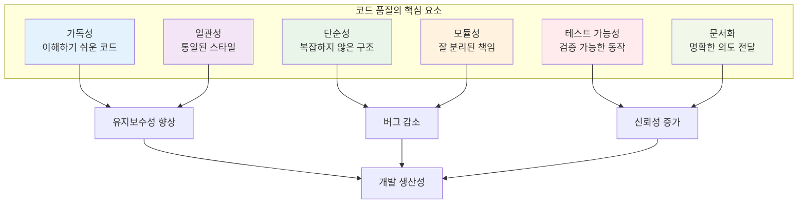

# 5장: 코드 품질과 유지보수성

> *"코드는 컴퓨터보다는 인간을 위해 작성되어야 한다. 컴퓨터는 어떤 코드든 실행할 수 있지만, 인간은 이해할 수 있는 코드만 유지보수할 수 있다."*

---

## 학습 목표

이 장을 마치면 다음을 할 수 있게 됩니다:
- 읽기 쉽고 유지보수 가능한 코드를 작성할 수 있습니다
- 바이브 코딩을 활용하여 코드 품질을 체계적으로 개선할 수 있습니다
- 효과적인 명명 규칙과 코드 구조화 기법을 적용할 수 있습니다
- 코드 리뷰와 리팩토링을 통해 지속적으로 품질을 향상시킬 수 있습니다
- AI 도구를 사용하여 코드 품질 분석과 개선을 자동화할 수 있습니다

---

## 5.1 코드 품질의 기초

### 품질 코드의 특징

고품질 코드는 다음과 같은 특징을 가집니다:



### 💡 **바이브 코딩 프롬프트: 코드 품질 종합 개선**

**시나리오**: 레거시 코드베이스의 품질을 체계적으로 개선하는 현대적인 개발 환경을 구축해야 합니다.

**바이브 코딩 프롬프트**:
```
레거시 코드베이스를 현대적인 고품질 코드로 전환하는 종합적인 개발 환경을 구축해 주세요.

**현재 상황**:
- 5년된 Python Django 프로젝트
- 일관성 없는 코딩 스타일
- 부족한 테스트 커버리지 (30%)
- 복잡한 함수들 (100줄 이상)
- 불명확한 변수명과 주석 부족
- 코드 리뷰 프로세스 없음

**목표**:
1. **자동화된 코드 품질 관리 시스템**
2. **AI 지원 코드 개선 워크플로우**
3. **팀 전체의 코드 품질 표준화**
4. **지속적인 품질 모니터링**

**필요한 구성 요소**:

1. **코드 품질 분석 도구 통합**:
   - 정적 분석: pylint, flake8, mypy
   - 복잡도 측정: radon, xenon
   - 보안 스캔: bandit, safety
   - 포맷팅: black, isort

2. **AI 지원 코드 개선 시스템**:
   - 자동 리팩토링 제안
   - 명명 규칙 개선 추천
   - 코드 스멜 감지 및 해결책
   - 성능 최적화 제안

3. **개발자 워크플로우 도구**:
   - pre-commit 훅 설정
   - IDE 통합 (VS Code/PyCharm)
   - 자동화된 코드 리뷰 봇
   - 품질 메트릭 대시보드

4. **팀 협업 프로세스**:
   - 코딩 스타일 가이드
   - 코드 리뷰 체크리스트
   - 페어 프로그래밍 가이드라인
   - 지식 공유 시스템

5. **지속적 개선 메커니즘**:
   - 품질 메트릭 추적
   - 기술 부채 관리
   - 리팩토링 우선순위 결정
   - 팀 교육 프로그램

**결과물**:
1. **완전한 개발 환경 설정**: 모든 도구와 설정 파일
2. **자동화 스크립트**: 설치, 설정, 실행 자동화
3. **코드 품질 대시보드**: 실시간 메트릭 모니터링
4. **개발자 가이드**: 도구 사용법과 모범 사례
5. **마이그레이션 계획**: 기존 코드 점진적 개선 전략

즉시 적용 가능한 실용적인 솔루션을 제공하고, 팀이 쉽게 채택할 수 있는 단계별 구현 계획을 포함해 주세요.
```

---

## 5.2 효과적인 명명 규칙

### 명명의 중요성

좋은 이름은 코드의 의도를 명확히 전달하고 유지보수성을 크게 향상시킵니다.

### 💡 **바이브 코딩 프롬프트: 스마트 명명 시스템**

**바이브 코딩 프롬프트**:
```
AI를 활용한 스마트 변수/함수 명명 시스템을 구축해 주세요.

**기능 요구사항**:
1. **컨텍스트 분석**: 코드 맥락을 이해하여 적절한 이름 제안
2. **도메인 특화**: 비즈니스 도메인에 맞는 용어 사용
3. **일관성 보장**: 프로젝트 전체의 명명 규칙 일관성
4. **다국어 지원**: 한국어 비즈니스 로직을 영어 코드로 변환

**시스템 구성**:
- 자연어 처리를 통한 의미 분석
- 기존 코드베이스 패턴 학습
- 도메인 용어집 관리
- 실시간 명명 제안

**결과물**:
1. **명명 제안 엔진**: AI 기반 이름 생성 시스템
2. **IDE 플러그인**: 실시간 명명 도움
3. **명명 규칙 검증기**: 기존 코드 검토 도구
4. **도메인 용어집**: 프로젝트별 용어 관리
5. **명명 품질 메트릭**: 이름 품질 측정 도구

개발자의 생산성을 높이고 코드 가독성을 개선하는 실용적인 도구를 만들어 주세요.
```

---

## 5.3 코드 구조화와 모듈화

### 모듈화의 원칙

효과적인 모듈화는 코드의 복잡성을 관리하고 재사용성을 높입니다.

### 💡 **바이브 코딩 프롬프트: 자동 리팩토링 시스템**

**바이브 코딩 프롬프트**:
```
대규모 모놀리식 코드베이스를 자동으로 모듈화하는 AI 리팩토링 시스템을 구축해 주세요.

**입력**: 복잡하게 얽힌 레거시 Python 코드
**출력**: 잘 구조화된 모듈식 아키텍처

**리팩토링 기능**:
1. **함수 분해**: 긴 함수를 작은 단위로 분할
2. **클래스 추출**: 관련 기능을 클래스로 그룹화
3. **모듈 분리**: 책임별로 파일 분리
4. **의존성 정리**: 순환 의존성 제거
5. **인터페이스 추출**: 추상화 계층 생성

**AI 분석 요소**:
- 코드 응집도와 결합도 분석
- 함수/클래스 책임 식별
- 데이터 플로우 추적
- 비즈니스 로직 패턴 인식

**결과물**:
1. **자동 리팩토링 엔진**: 코드 구조 개선 도구
2. **리팩토링 제안 시스템**: 개선 방안 추천
3. **영향도 분석기**: 변경 사항 영향 예측
4. **테스트 생성기**: 리팩토링 안전성 보장
5. **마이그레이션 가이드**: 단계별 적용 계획

안전하고 점진적인 코드 개선이 가능한 시스템을 구현해 주세요.
```

---

## 5.4 코드 스타일과 포맷팅

### 일관된 스타일의 중요성

일관된 코드 스타일은 팀 협업과 코드 이해도를 크게 향상시킵니다.

### 💡 **바이브 코딩 프롬프트: 지능형 코드 포맷터**

**바이브 코딩 프롬프트**:
```
팀의 코딩 스타일을 학습하고 자동으로 적용하는 지능형 코드 포맷터를 개발해 주세요.

**기능 요구사항**:
1. **스타일 학습**: 기존 코드베이스에서 패턴 추출
2. **컨텍스트 인식**: 코드 유형별 다른 포맷팅 규칙
3. **팀 선호도 반영**: 개발자별 스타일 선호도 고려
4. **점진적 개선**: 사용할수록 더 정확해지는 학습 시스템

**포맷팅 영역**:
- 들여쓰기와 공백
- 변수/함수 명명 규칙
- 주석 스타일과 위치
- 코드 블록 구조
- import 문 정리

**결과물**:
1. **학습형 포맷터**: AI 기반 코드 스타일 적용
2. **팀 스타일 프로파일**: 프로젝트별 스타일 설정
3. **실시간 제안 시스템**: 타이핑하면서 스타일 가이드
4. **스타일 일관성 검사기**: 코드 리뷰 자동화
5. **마이그레이션 도구**: 기존 코드 스타일 통일

개발자 경험을 해치지 않으면서도 일관성을 보장하는 도구를 만들어 주세요.
```

---

## 5.5 문서화와 주석

### 효과적인 문서화 전략

좋은 문서화는 코드의 의도와 맥락을 명확히 전달합니다.

### 💡 **바이브 코딩 프롬프트: 자동 문서화 시스템**

**바이브 코딩 프롬프트**:
```
코드를 분석하여 자동으로 고품질 문서를 생성하는 AI 문서화 시스템을 구축해 주세요.

**문서화 범위**:
1. **API 문서**: 함수/클래스 인터페이스 설명
2. **아키텍처 문서**: 시스템 구조와 설계 결정
3. **사용자 가이드**: 기능 사용법과 예제
4. **개발자 가이드**: 코드 기여 방법
5. **변경 로그**: 버전별 변경 사항

**AI 분석 기능**:
- 코드 의도 파악
- 비즈니스 로직 설명
- 사용 패턴 분석
- 예외 상황 문서화
- 성능 특성 설명

**문서 형식**:
- Markdown 기반 문서
- 인터랙티브 API 문서
- 코드 예제 자동 생성
- 다이어그램 자동 생성
- 다국어 문서 지원

**결과물**:
1. **자동 문서 생성기**: 코드에서 문서 추출
2. **문서 품질 검증기**: 문서 완성도 평가
3. **실시간 문서 동기화**: 코드 변경 시 문서 업데이트
4. **문서 템플릿 시스템**: 프로젝트별 문서 형식
5. **문서 검색 엔진**: 지능형 문서 검색

개발자가 문서 작성 부담 없이 고품질 문서를 유지할 수 있는 시스템을 구현해 주세요.
```

---

## 요약

코드 품질과 유지보수성은 소프트웨어 프로젝트의 장기적 성공을 결정하는 핵심 요소입니다. 바이브 코딩을 활용하면:

- **자동화된 품질 관리**: AI 도구를 통한 지속적인 코드 품질 모니터링
- **지능형 개선 제안**: 맥락을 이해한 코드 개선 방안 제시
- **팀 표준화**: 일관된 코딩 스타일과 품질 기준 유지
- **생산성 향상**: 반복적인 품질 관리 작업 자동화

**핵심 원칙**:
1. **가독성 우선**: 코드는 컴퓨터보다 인간을 위해 작성
2. **일관성 유지**: 팀 전체의 통일된 코딩 스타일
3. **지속적 개선**: 작은 개선의 누적으로 큰 변화 달성
4. **자동화 활용**: AI와 도구를 통한 효율적인 품질 관리

기억하세요: 코드 품질은 한 번에 달성되는 것이 아니라 지속적인 노력과 개선을 통해 유지되는 것입니다. 바이브 코딩은 이러한 지속적 개선을 더 쉽고 효과적으로 만들어줍니다. 