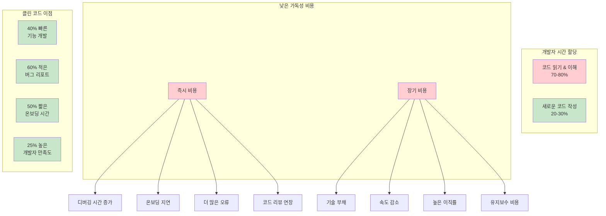
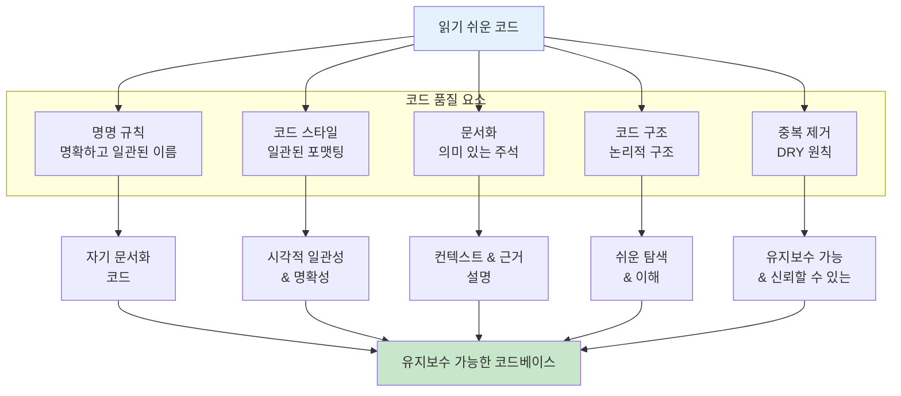

# 5장: AI 지원 코드 품질과 유지보수성

> **"AI와 협업하는 시대에도 읽기 쉬운 코드의 가치는 더욱 중요해집니다. AI는 코드를 생성할 수 있지만, 인간이 이해하고 유지보수할 수 있는 코드를 만드는 것은 여전히 우리의 책임입니다."** - 현대 소프트웨어 개발 철학

---

## 학습 목표

이 장을 마치면 다음을 할 수 있게 됩니다:
- AI 생성 코드의 품질을 평가하고 개선할 수 있습니다
- 바이브 코딩과 전통적 코딩 방식을 조합하여 최적의 코드 품질을 달성할 수 있습니다
- AI 도구를 활용하여 자동화된 코드 리뷰와 리팩토링을 수행할 수 있습니다
- 인간과 AI가 모두 이해할 수 있는 명명 규칙과 문서화 전략을 구현할 수 있습니다
- AI 지원 개발 환경에서 기술 부채를 관리하고 예방할 수 있습니다
- 코드 품질 메트릭을 통해 AI 지원 개발의 효과를 측정하고 개선할 수 있습니다

---

## 소개: 읽기 쉬운 코드의 경제학

코드의 가독성과 유지보수성은 모든 소프트웨어 프로젝트의 장기적 성공에 매우 중요합니다. 연구에 따르면 개발자는 시간의 70-80%를 기존 코드를 읽고 이해하는 데 쓰고, 새로운 코드를 작성하는 데는 20-30%만 쓴다고 합니다. 명확하고 이해하기 쉬운 코드는 디버깅, 수정, 기능 확장에 필요한 노력을 크게 줄여주어 프로젝트 지속 가능성에 대한 중요한 투자가 됩니다.

### 낮은 가독성의 비용



**즉시 비용:**
- 불분명한 로직으로 인한 디버깅 시간 증가
- 새 팀원의 온보딩 지연
- 수정 중 더 많은 오류 발생
- 코드 리뷰 사이클 연장

**장기 비용:**
- 기술 부채 누적
- 시간이 지남에 따른 팀 속도 감소
- 좌절감으로 인한 높은 개발자 이직률
- 유지보수 비용 증가

### 클린 코드의 비즈니스 케이스

가독성이 높은 코드베이스를 가진 조직이 경험하는 것:
- **40% 빠른 기능 개발** - 코드 품질에 대한 초기 투자 후
- **60% 버그 리포트 감소** - 더 명확한 로직과 더 나은 테스팅으로
- **50% 짧은 온보딩 시간** - 새 개발자를 위해
- **25% 개발자 만족도 및 보유율 증가**

---

## 5.1 의미 있는 명명 규칙



### 명명의 심리학

의미 있고 설명적인 이름을 선택하는 것은 클린하고 유지보수 가능한 코드를 작성하는 가장 중요한 측면 중 하나입니다. 우리의 뇌는 패턴 인식을 통해 정보를 처리하며, 잘 선택된 이름은 코드를 직관적으로 이해할 수 있게 만드는 정신 모델을 만듭니다.

### 효과적인 명명의 원칙

#### 1. 의도를 드러내는 이름

이름은 변수가 저장하는 것, 함수가 하는 일, 클래스가 나타내는 것을 명확히 전달해야 합니다:

```python
# 나쁜 명명
d = 30  # 날짜?
users = get_u()  # 어떤 종류의 사용자?
flag = True  # 무엇을 위한 플래그?

# 좋은 명명
days_until_expiry = 30
active_premium_users = get_active_premium_users()
is_email_verified = True
```

#### 2. 정신적 매핑 피하기

독자가 암호 같은 이름을 정신적으로 번역하도록 강요하지 마세요:

```python
# 나쁨 - 정신적 매핑 필요
for i in range(len(products)):
    if products[i].s > threshold:
        temp.append(products[i])

# 좋음 - 명확한 의도
for product in products:
    if product.stock_level > minimum_threshold:
        products_needing_restock.append(product)
```

#### 3. 검색 가능한 이름 사용

한 글자 변수와 매직 넘버는 코드를 검색할 수 없게 만듭니다:

```python
# 나쁨 - 검색 불가능
for i in range(7):
    schedule[i] = []

# 좋음 - 검색 가능하고 의미 있음
DAYS_IN_WEEK = 7
for day_index in range(DAYS_IN_WEEK):
    weekly_schedule[day_index] = []
```

### 언어와 컨텍스트별 명명 규칙

| 컨텍스트 | 규칙 | 예시 | 근거 |
|---------|------|------|------|
| **Python 변수** | snake_case | `user_account_balance` | PEP 8 표준, 높은 가독성 |
| **Python 함수** | snake_case | `calculate_monthly_payment()` | 변수와 일관성 |
| **Python 클래스** | PascalCase | `PaymentProcessor` | 함수와 구별 |
| **Python 상수** | UPPER_SNAKE_CASE | `MAX_RETRY_ATTEMPTS` | 불변 값임을 명확히 표시 |
| **JavaScript 변수** | camelCase | `userAccountBalance` | 기존 규칙 |
| **JavaScript 함수** | camelCase | `calculateMonthlyPayment()` | 변수와 일관성 |
| **데이터베이스 테이블** | snake_case | `user_payment_methods` | SQL 표준, 대소문자 무관 |
| **REST API 엔드포인트** | kebab-case | `/api/user-accounts/` | URL 친화적, 널리 채택됨 |

### 💡 **바이브 코딩 프롬프트: 명명 규칙 개선**

**바이브 코딩 프롬프트**:

```
코드베이스를 위한 자동화된 명명 규칙 분석기와 리팩토링 도구를 구축해야 합니다. 우리 팀은 가독성을 해치는 일관성 없고 불분명한 명명으로 어려움을 겪고 있습니다.

현재 문제점:
- 코드베이스 전반에 일관성 없는 명명 규칙 (camelCase vs snake_case)
- 암호 같은 약어와 한 글자 변수
- 목적이 불분명한 함수와 클래스
- 도메인 용어의 일관성 없는 사용

코드베이스 컨텍스트:
- React 프론트엔드가 있는 Python/Django 백엔드
- 100개 이상 모듈을 가진 전자상거래 플랫폼
- 다양한 경험 수준의 8명 개발자 팀
- 새로운 개발과 혼재된 레거시 코드

생성해 주세요:

1. **자동화된 명명 분석 도구**:
   - 코드베이스를 스캔하여 명명 위반을 식별하는 스크립트
   - 명명 문제 분류 (약어, 일관성 없음, 불분명한 목적)
   - 코드 사용 빈도에 기반한 심각도 점수
   - 위반을 조기에 포착하기 위한 CI/CD 통합

2. **AI 기반 명명 제안**:
   - 컨텍스트와 사용에 기반하여 더 나은 이름을 제안하는 도구
   - 비즈니스 용어를 반영하는 도메인 인식 명명
   - 관련 모듈 간 일관성 검사
   - 안전성 검사를 포함한 대량 이름 변경 기능

3. **팀 명명 표준 생성기**:
   - 명명 규칙 가이드라인 자동 생성
   - 언어별 및 프레임워크별 규칙
   - 명명 품질을 위한 코드 리뷰 체크리스트
   - 실시간 명명 피드백을 위한 IDE 플러그인/확장

4. **안전한 리팩토링 시스템**:
   - 포괄적인 테스트 커버리지를 포함한 자동화된 리팩토링
   - 명명 변경 전 영향 분석
   - 문제가 있는 변경에 대한 롤백 기능
   - 새로운 명명을 반영하는 문서 업데이트

5. **명명 품질 메트릭 대시보드**:
   - 명명 규칙 준수도 실시간 추적
   - 팀 성과 메트릭과 개선 트렌드
   - 코드 리뷰 도구와 통합
   - 더 나은 명명 관행을 장려하는 게임화

인기 있는 IDE, 정적 분석 도구, 버전 제어 시스템과의 통합을 포함하세요. 명명 개선을 일회성 노력이 아닌 지속적이고 자동화된 프로세스로 만드는 방법을 보여주세요.
```

---

## 5.2 일관된 코드 스타일과 포맷팅

### 포맷팅이 인지에 미치는 영향

일관된 코드 스타일과 포맷팅은 인지적 부하를 줄여 가독성을 향상시킵니다. 코드가 예측 가능한 패턴을 따를 때 개발자는 구조를 해독하는 대신 로직에 집중할 수 있습니다. 연구에 따르면 일관성 없게 포맷팅된 코드는 이해하고 디버그하는 데 25% 더 오래 걸린다고 합니다.

### 핵심 포맷팅 원칙

#### 1. 들여쓰기와 시각적 계층구조

적절한 들여쓰기는 논리적 구조를 반영하는 시각적 구조를 만듭니다:

```python
# 나쁜 들여쓰기
def process_order(order_data):
items = order_data.get('items', [])
if not items:
return None
    total = 0
    for item in items:
        if item['quantity'] > 0:
price = item['unit_price'] * item['quantity']
total += price
return {'total': total, 'processed': True}

# 좋은 들여쓰기
def process_order(order_data):
    items = order_data.get('items', [])
    if not items:
        return None
    
    total = 0
    for item in items:
        if item['quantity'] > 0:
            price = item['unit_price'] * item['quantity']
            total += price
    
    return {
        'total': total, 
        'processed': True
    }
```

#### 2. 논리적 그룹화를 위한 공백

전략적인 공백 사용은 관련 문장을 그룹화하는 데 도움이 됩니다:

```python
# 좋은 그룹화
def create_user_account(user_data):
    # 사용자 데이터 추출 및 준비
    username = user_data['username']
    email = user_data['email']
    password = hash_password(user_data['password'])
    
    # 고유성 제약 조건 검증
    if User.objects.filter(username=username).exists():
        raise ValidationError("사용자명이 이미 존재합니다")
    if User.objects.filter(email=email).exists():
        raise ValidationError("이메일이 이미 존재합니다")
    
    # 사용자 계정 생성
    user = User.objects.create(
        username=username, 
        email=email, 
        password=password
    )
    
    # 생성 후 작업
    send_welcome_email(user.email)
    log_user_creation(user.id)
    
    return user
```

### 💡 **바이브 코딩 프롬프트: 코드 스타일 자동화**

**바이브 코딩 프롬프트**:
```
코드 스타일과 포맷팅을 자동화하는 종합적인 시스템을 구축해 주세요.

**요구사항**:
1. **자동 포맷팅**: Black, Prettier, ESLint 통합
2. **스타일 가이드 적용**: PEP 8, Airbnb JavaScript 등
3. **실시간 피드백**: IDE에서 즉시 스타일 제안
4. **CI/CD 통합**: 스타일 위반 시 빌드 실패
5. **팀 커스터마이제이션**: 프로젝트별 스타일 규칙

**결과물**:
- 완전 자동화된 코드 포맷팅 시스템
- 팀 스타일 가이드 문서
- IDE 설정과 플러그인
- 지속적 통합 파이프라인
```

---

## 5.3 효과적인 문서화와 주석

### 좋은 주석의 특징

효과적인 주석은 "왜"를 설명하지 "무엇을"을 설명하지 않습니다:

```python
# 나쁨: 무엇을 하는지 설명
user_age = 25  # 사용자 나이를 25로 설정

# 좋음: 왜 하는지 설명
user_age = 25  # 사용자가 나이 정보를 제공하지 않은 경우 기본값 사용
```

### 문서화 모범 사례

#### 1. 함수 문서화

```python
def calculate_shipping_cost(weight, distance, shipping_method):
    """
    배송비를 계산합니다.
    
    Args:
        weight (float): 패키지 무게 (kg)
        distance (int): 배송 거리 (km)
        shipping_method (str): 배송 방법 ('standard', 'express', 'overnight')
    
    Returns:
        float: 계산된 배송비 (원)
    
    Raises:
        ValueError: 지원하지 않는 배송 방법인 경우
        
    Examples:
        >>> calculate_shipping_cost(2.5, 100, 'standard')
        5000.0
    """
```

### 💡 **바이브 코딩 프롬프트: AI 문서화 시스템**

**바이브 코딩 프롬프트**:
```
AI를 활용한 자동 문서화 시스템을 구축해 주세요.

**기능**:
1. **코드 분석**: 함수/클래스 목적과 동작 자동 분석
2. **문서 생성**: docstring, README, API 문서 자동 생성
3. **번역 지원**: 한국어-영어 문서 자동 번역
4. **업데이트 추적**: 코드 변경 시 문서 자동 업데이트
5. **품질 검증**: 문서 완성도와 정확성 검사

**결과물**:
- 자동 문서화 엔진
- IDE 플러그인
- 문서 품질 대시보드
- 팀 문서화 가이드라인
```

---

## 5.4 중복 제거와 코드 재사용

### DRY 원칙 적용

"Don't Repeat Yourself" 원칙은 코드 유지보수성의 핵심입니다:

```python
# 중복 코드 (나쁨)
def send_welcome_email(user):
    subject = "환영합니다!"
    body = f"안녕하세요 {user.name}님, 가입을 환영합니다."
    send_email(user.email, subject, body)

def send_password_reset_email(user):
    subject = "비밀번호 재설정"
    body = f"안녕하세요 {user.name}님, 비밀번호를 재설정하세요."
    send_email(user.email, subject, body)

# 리팩토링된 코드 (좋음)
def send_user_email(user, email_type):
    email_templates = {
        'welcome': {
            'subject': "환영합니다!",
            'body': f"안녕하세요 {user.name}님, 가입을 환영합니다."
        },
        'password_reset': {
            'subject': "비밀번호 재설정",
            'body': f"안녕하세요 {user.name}님, 비밀번호를 재설정하세요."
        }
    }
    
    template = email_templates[email_type]
    send_email(user.email, template['subject'], template['body'])
```

### 💡 **바이브 코딩 프롬프트: 중복 제거 자동화**

**바이브 코딩 프롬프트**:
```
코드 중복을 자동으로 감지하고 제거하는 AI 시스템을 구축해 주세요.

**기능**:
1. **중복 감지**: 동일하거나 유사한 코드 패턴 식별
2. **추상화 제안**: 공통 로직을 추출하는 방법 제안
3. **안전한 리팩토링**: 기능을 손상시키지 않는 자동 리팩토링
4. **영향 분석**: 변경사항의 영향 범위 분석
5. **테스트 생성**: 리팩토링 안전성을 보장하는 테스트 생성

**결과물**:
- 중복 코드 감지 엔진
- 자동 리팩토링 도구
- 코드 품질 메트릭
- 리팩토링 가이드라인
```

---

## 5.5 코드 리팩토링 전략

### 리팩토링의 원칙

리팩토링은 외부 동작을 변경하지 않으면서 코드의 내부 구조를 개선하는 과정입니다.

### 일반적인 리팩토링 패턴

#### 1. 긴 메서드 분해

```python
# 리팩토링 전: 긴 메서드
def process_customer_order(order_data):
    # 주문 데이터 검증
    if not order_data.get('customer_id'):
        raise ValueError("고객 ID 필요")
    if not order_data.get('items'):
        raise ValueError("주문에 아이템이 있어야 함")
    for item in order_data['items']:
        if item['quantity'] <= 0:
            raise ValueError("아이템 수량은 양수여야 함")
    
    # 총액 계산
    subtotal = 0
    for item in order_data['items']:
        product = Product.get(item['product_id'])
        item_total = product.price * item['quantity']
        subtotal += item_total
    
    tax_rate = 0.08
    tax_amount = subtotal * tax_rate
    total = subtotal + tax_amount
    
    # 주문 레코드 생성
    order = Order()
    order.customer_id = order_data['customer_id']
    order.subtotal = subtotal
    order.tax_amount = tax_amount
    order.total = total
    order.status = 'pending'
    order.save()
    
    return order

# 리팩토링 후: 집중된 메서드로 분해
def process_customer_order(order_data):
    validate_order_data(order_data)
    totals = calculate_order_totals(order_data['items'])
    order = create_order_record(order_data['customer_id'], totals)
    return order

def validate_order_data(order_data):
    if not order_data.get('customer_id'):
        raise ValueError("고객 ID 필요")
    if not order_data.get('items'):
        raise ValueError("주문에 아이템이 있어야 함")
    
    for item in order_data['items']:
        validate_order_item(item)

def calculate_order_totals(items):
    subtotal = sum(
        Product.get(item['product_id']).price * item['quantity']
        for item in items
    )
    
    tax_rate = 0.08
    tax_amount = subtotal * tax_rate
    total = subtotal + tax_amount
    
    return {
        'subtotal': subtotal,
        'tax_amount': tax_amount,
        'total': total
    }
```

### 💡 **바이브 코딩 프롬프트: 레거시 코드 리팩토링**

**바이브 코딩 프롬프트**:

```
대규모의 복잡한 코드베이스를 기능을 유지하면서 안전하게 리팩토링할 수 있는 종합적인 레거시 코드 현대화 시스템을 구축해야 합니다.

레거시 코드 도전 과제:
- 2015년부터의 10,000줄 이상 모놀리식 Python 애플리케이션
- 비즈니스 로직, 데이터 액세스, 프레젠테이션 관심사가 혼재
- 단위 테스트가 없어 변경이 위험함
- 성능 문제와 메모리 누수
- 새 기능 추가나 버그 수정이 어려움

현재 시스템 컨텍스트:
- 전자상거래 주문 처리 시스템
- 다운타임이 불가능한 중요한 비즈니스 기능
- 외부 결제 및 배송 API와의 다중 통합
- 잘 문서화되지 않은 복잡한 비즈니스 규칙
- 코드 품질을 개선하면서 새 기능을 추가해야 하는 팀

생성해 주세요:

1. **자동화된 레거시 코드 분석 시스템**:
   - 코드 냄새와 리팩토링 기회를 식별하는 정적 분석 도구
   - 컴포넌트 관계를 이해하기 위한 의존성 매핑
   - 복잡성 메트릭과 기술 부채 평가
   - 다양한 리팩토링 접근 방식에 대한 위험 분석

2. **안전한 리팩토링 프레임워크**:
   - 기존 테스트가 없는 레거시 코드를 위한 자동화된 테스트 생성
   - 롤백 기능을 포함한 점진적 리팩토링 도구
   - 자동화된 테스트를 통한 동작 보존 검증
   - 고위험 변경을 위한 병렬 구현 전략

3. **모듈러 아키텍처 마이그레이션 도구**:
   - 비즈니스 로직을 별도 모듈로 자동 추출
   - 적절한 관심사 분리를 통한 서비스 레이어 생성
   - 데이터베이스 액세스 레이어 추상화 및 최적화
   - 컴포넌트 간 깔끔한 인터페이스를 위한 API 설계

4. **지속적 리팩토링 파이프라인**:
   - 안전하고 자동화된 리팩토링을 위한 CI/CD 통합
   - 리팩토링이 성능을 저하시키지 않도록 하는 성능 모니터링
   - 자동화된 코드 품질 메트릭과 개선 추적
   - 리팩토링된 컴포넌트의 점진적 롤아웃을 위한 기능 플래그 통합

결과물로 즉시 적용 가능한 완전하고 실행 가능한 코드를 제공해 주세요. 레거시 코드 리팩토링을 체계적이고 위험이 낮으며 지속적인 가치를 제공하는 프로세스로 만드는 방법을 보여주세요.
```

---

## 장 요약

읽기 쉽고 유지보수 가능한 코드 작성은 성공적인 소프트웨어 개발의 기초입니다. 주요 원칙들:

### 핵심 개념
1. **의미 있는 명명**: 의도를 명확히 드러내는 이름 사용
2. **일관된 스타일**: 예측 가능한 코드 포맷팅과 구조
3. **효과적인 문서화**: "왜"를 설명하는 가치 있는 주석
4. **중복 제거**: DRY 원칙을 통한 코드 재사용
5. **지속적 리팩토링**: 기능을 유지하면서 구조 개선

### 실무 권장사항
- 자동화된 포맷팅 도구 사용 (Black, Prettier)
- 정적 분석으로 코드 품질 모니터링
- 포괄적인 테스트를 통한 안전한 리팩토링
- 코드 리뷰에서 가독성 중점 검토
- 문서화를 개발 프로세스의 일부로 통합

깨끗하고 읽기 쉬운 코드는 개발 속도를 높이고 버그를 줄이며 팀의 전반적인 생산성과 만족도를 향상시킵니다. 