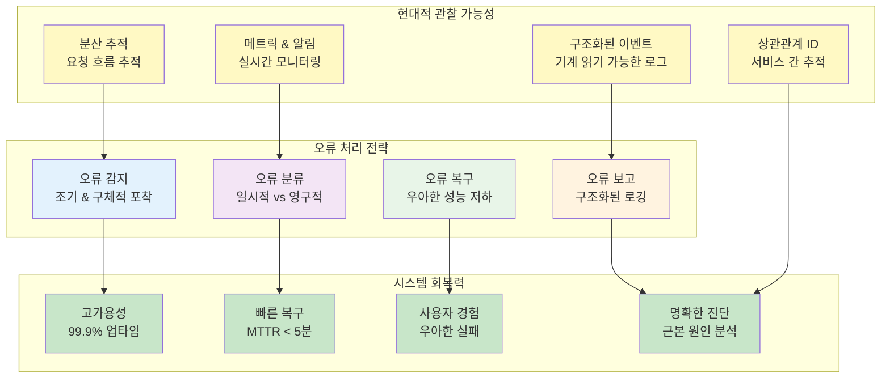

# 6장: 견고한 오류 처리와 로깅

> *"오류는 실패가 아니라, 더 회복력 있는 시스템을 구축할 기회입니다."*

---

## 학습 목표

이 장을 마치면 다음을 할 수 있게 됩니다:
- 절대 조용히 실패하지 않는 포괄적인 오류 처리 전략 구현
- 효과적인 디버깅과 모니터링을 위한 구조화된 로깅 시스템 설계
- 시스템 안정성을 유지하는 오류 복구 패턴 적용
- 개발과 프로덕션 요구사항을 모두 지원하는 오류 처리 아키텍처 생성
- 실패를 우아하게 처리하고 실행 가능한 통찰력을 제공하는 회복력 있는 시스템 구축
- 프로덕션 시스템을 위한 현대적인 관찰 가능성 관행 구현

---

## 소개: 회복력 있는 시스템 구축

오늘날의 복잡한 소프트웨어 환경에서 실패는 가능성이 아니라 확실성입니다. 데이터베이스가 다운될 수도 있고, 서비스가 응답하지 않을 수도 있으며, 네트워크 호출이 타임아웃될 수도 있고, 외부 API가 예상치 못한 데이터를 반환할 수도 있습니다. 문제는 이런 일들이 *발생할지*가 아니라 *언제* 그리고 *얼마나 잘* 시스템이 이를 처리할지입니다.

효과적인 오류 처리와 포괄적인 로깅은 회복력 있는 소프트웨어 시스템의 두 기둥입니다. 이들은 애플리케이션이 예상치 못한 상황을 우아하게 관리하면서 디버깅, 모니터링, 지속적인 개선을 위한 필수 정보를 제공할 수 있게 합니다. 현대 시스템은 실패를 염두에 두고 설계되어야 하며, 재앙적 실패보다는 우아한 성능 저하를 허용하는 패턴을 구현해야 합니다.

열악한 오류 처리의 비용은 기술적 문제를 훨씬 넘어섭니다. 업계 연구에 따르면 시스템 다운타임은 조직에 분당 수천 달러의 비용을 발생시킬 수 있고, 고객 신뢰를 손상시키며, 보안 취약점을 만들 수 있습니다. 반대로 잘 구현된 오류 처리와 로깅 시스템은 평균 복구 시간(MTTR)을 60-80% 감소시키고 전체 시스템 신뢰성을 크게 향상시킬 수 있습니다.



## 6.1 효과적인 오류 처리의 원칙

견고한 오류 처리는 시스템이 안정적이고 디버깅 가능하며 유지보수 가능하도록 보장하는 기본 원칙 위에 구축됩니다. 이러한 원칙들은 수십 년의 소프트웨어 엔지니어링 경험에서 발전했으며 회복력 있는 시스템을 구축하는 데 필수적입니다.

### 핵심 오류 처리 원칙

#### **1. 절대 조용히 실패하지 말 것**
침묵 실패는 문제가 임계 상태가 될 때까지 숨기기 때문에 가장 위험한 유형의 오류입니다. 모든 오류 조건은 명시적으로 처리되고 보고되어야 합니다.

**왜 중요한가:**
- 침묵 실패는 데이터 손상과 일관성 없는 시스템 상태를 초래
- 나중에 문제가 표면화될 때 디버깅을 거의 불가능하게 만듦
- 시스템이 예측할 수 없게 동작할 때 사용자가 신뢰를 잃음
- 오류 정보 없이는 지원 팀이 고객을 도울 수 없음

**구현 전략:**
```python
# 나쁨: 침묵 실패
def process_payment(amount, card_token):
    try:
        result = payment_gateway.charge(amount, card_token)
        return result
    except:
        return None  # 침묵 실패 - 호출자가 무엇이 일어났는지 모름

# 좋음: 명시적 오류 처리
def process_payment(amount, card_token):
    try:
        result = payment_gateway.charge(amount, card_token)
        logger.info("결제가 성공적으로 처리됨", 
                   extra={"amount": amount, "transaction_id": result.id})
        return result
    except PaymentGatewayError as e:
        logger.error("결제 게이트웨이 오류", 
                    extra={"error_code": e.code, "amount": amount, "message": str(e)})
        raise PaymentProcessingError(f"결제 실패: {e.message}", error_code=e.code)
    except NetworkError as e:
        logger.error("결제 중 네트워크 오류", 
                    extra={"amount": amount, "retry_count": e.retry_count})
        raise PaymentNetworkError("결제 서비스 사용 불가", should_retry=True)
```

#### **2. 포괄적인 오류 분류 구현**
모든 오류가 동일하게 만들어지는 것은 아닙니다. 견고한 오류 처리 시스템은 적절한 응답을 가능하게 하기 위해 오류를 분류합니다.

**오류 카테고리:**

| 카테고리 | 설명 | 응답 전략 | 예시 |
|----------|-------------|-------------------|----------|
| **일시적** | 저절로 해결될 수 있는 임시 문제 | 백오프와 함께 재시도 | 네트워크 타임아웃, 속도 제한 |
| **영구적** | 개입이 필요한 문제 | 빠른 실패, 알림 | 잘못된 입력, 누락된 리소스 |
| **시스템적** | 인프라 또는 구성 문제 | 회로 차단기, 폴백 | 데이터베이스 다운, 서비스 사용 불가 |
| **비즈니스** | 도메인별 검증 실패 | 사용자 피드백, 로깅 | 잔액 부족, 만료된 토큰 |

```python
from enum import Enum
from dataclasses import dataclass
from typing import Optional

class ErrorCategory(Enum):
    TRANSIENT = "transient"
    PERMANENT = "permanent"
    SYSTEMIC = "systemic"
    BUSINESS = "business"

@dataclass
class ErrorContext:
    category: ErrorCategory
    error_code: str
    message: str
    should_retry: bool
    retry_after: Optional[int] = None
    correlation_id: Optional[str] = None
    
class PaymentError(Exception):
    def __init__(self, context: ErrorContext):
        self.context = context
        super().__init__(context.message)

# 사용 예시
def handle_payment_error(error):
    if error.context.category == ErrorCategory.TRANSIENT:
        schedule_retry(error.context.retry_after or 30)
    elif error.context.category == ErrorCategory.BUSINESS:
        notify_user(error.context.message)
    elif error.context.category == ErrorCategory.SYSTEMIC:
        trigger_circuit_breaker()
        alert_operations_team(error.context)
```

#### **3. 풍부한 오류 컨텍스트 제공**
효과적인 오류 메시지는 인간과 기계 모두가 오류를 이해하고 행동할 수 있도록 충분한 컨텍스트를 포함합니다.

**필수 컨텍스트 요소:**
- **무엇이 일어났는가**: 오류에 대한 명확한 설명
- **언제 일어났는가**: 정확한 타임스탬프와 지속 시간
- **어디서 일어났는가**: 서비스, 메서드, 코드 줄
- **왜 일어났는가**: 결정 가능한 경우 근본 원인
- **무엇을 할 것인가**: 해결을 위한 다음 단계

```python
import traceback
from datetime import datetime
from typing import Dict, Any

class ContextualError(Exception):
    def __init__(self, message: str, error_code: str, context: Dict[str, Any] = None):
        self.message = message
        self.error_code = error_code
        self.context = context or {}
        self.timestamp = datetime.utcnow().isoformat()
        self.stack_trace = traceback.format_exc()
        super().__init__(message)
    
    def to_dict(self):
        return {
            "error_code": self.error_code,
            "message": self.message,
            "timestamp": self.timestamp,
            "context": self.context,
            "stack_trace": self.stack_trace
        }

# 사용법
try:
    user = get_user(user_id)
    if not user.is_active:
        raise ContextualError(
            message="비활성 사용자에 대해 결제를 처리할 수 없음",
            error_code="USER_INACTIVE",
            context={
                "user_id": user_id,
                "user_status": user.status,
                "last_login": user.last_login.isoformat(),
                "account_type": user.account_type
            }
        )
except ContextualError as e:
    logger.error("결제 처리 실패", extra=e.to_dict())
    raise
```

#### **4. 빠른 실패 원칙 구현**
폭발 반경을 최소화하고 시스템 상태를 보존하기 위해 실행 흐름에서 가능한 한 빨리 오류를 감지하고 보고합니다.

```python
def process_order(order_data: dict):
    # 조기 검증 - 빠른 실패
    if not order_data:
        raise ValueError("주문 데이터는 비어있을 수 없음")
    
    required_fields = ['customer_id', 'items', 'payment_method']
    missing_fields = [field for field in required_fields if field not in order_data]
    if missing_fields:
        raise ValueError(f"필수 필드 누락: {missing_fields}")
    
    # 비즈니스 규칙을 조기에 검증
    customer = get_customer(order_data['customer_id'])
    if not customer.can_place_orders():
        raise BusinessRuleError(
            f"고객 {customer.id}는 주문을 할 수 없습니다",
            error_code="CUSTOMER_INELIGIBLE"
        )
    
    # 검증 후에만 처리 계속
    return create_order(order_data)
```

#### **5. 우아한 성능 저하를 위한 설계**
오류가 발생했을 때 시스템은 완전히 실패하기보다는 기능을 우아하게 저하시켜야 합니다.

```python
class RecommendationService:
    def __init__(self):
        self.ml_service = MLRecommendationService()
        self.fallback_service = PopularItemsService()
        self.cache = RedisCache()
    
    def get_recommendations(self, user_id: str, limit: int = 10):
        try:
            # 먼저 캐시 확인
            cached_recommendations = self.cache.get(f"rec:{user_id}")
            if cached_recommendations:
                return cached_recommendations[:limit]
            
            # ML 서비스 시도
            try:
                recommendations = self.ml_service.get_personalized_recommendations(user_id, limit)
                self.cache.set(f"rec:{user_id}", recommendations, ttl=3600)
                return recommendations
            except MLServiceError as e:
                logger.warning("ML 서비스 실패, 폴백 사용", 
                             extra={"user_id": user_id, "error": str(e)})
                # 인기 아이템으로 폴백
                fallback_recommendations = self.fallback_service.get_popular_items(limit)
                return fallback_recommendations
        
        except Exception as e:
            logger.error("추천 서비스 완전 실패", 
                        extra={"user_id": user_id, "error": str(e)})
            # 최소한의 기본 응답
            return []
```

### 💡 **바이브 코딩 프롬프트: 포괄적인 오류 처리 시스템**

**시나리오**: 전자상거래 플랫폼을 위한 견고한 오류 처리 시스템을 구축해야 합니다.

**바이브 코딩 프롬프트**:
```
전자상거래 플랫폼을 위한 포괄적인 오류 처리 시스템을 구축해 주세요. 다음 요구사항을 포함해야 합니다:

**핵심 요구사항**:
1. **오류 분류 시스템**: 일시적, 영구적, 시스템적, 비즈니스 오류 구분
2. **컨텍스트 보존**: 모든 오류에 풍부한 디버깅 정보 포함
3. **우아한 폴백**: 서비스 실패 시 대안 제공
4. **구조화된 로깅**: 기계 읽기 가능한 로그 형식
5. **재시도 메커니즘**: 지수 백오프와 회로 차단기 패턴

**구현해야 할 서비스들**:
- **ProductService**: 상품 정보 조회 (외부 API 종속)
- **InventoryService**: 재고 확인 (데이터베이스 종속)
- **PaymentService**: 결제 처리 (써드파티 게이트웨이)
- **OrderService**: 주문 생성 및 관리
- **NotificationService**: 이메일/SMS 알림

**오류 시나리오들**:
- 외부 API 타임아웃
- 데이터베이스 연결 실패
- 결제 게이트웨이 오류
- 재고 부족
- 잘못된 사용자 입력
- 네트워크 연결 문제

**기술 요구사항**:
- Python/FastAPI 백엔드
- PostgreSQL 데이터베이스
- Redis 캐시
- 구조화된 JSON 로깅
- Prometheus 메트릭
- 상관관계 ID 추적

**결과물**:
1. **완전한 오류 처리 프레임워크** 코드
2. **각 서비스별 구현 예시**
3. **오류 시나리오별 테스트 케이스**
4. **모니터링 및 알림 설정**
5. **운영 플레이북** (오류 대응 가이드)

프로덕션에서 바로 사용할 수 있는 실무적인 구현에 집중해 주세요. 이론적 설명보다는 작동하는 코드를 원합니다.
```

---

## 6.2 구조화된 로깅 아키텍처

효과적인 로깅은 단순히 메시지를 출력하는 것 이상입니다. 현대적인 로깅 시스템은 구조화되고, 검색 가능하며, 의미 있는 정보를 제공해야 합니다.

### 로깅의 핵심 원칙

#### **1. 구조화된 로그 형식**
JSON 형식의 구조화된 로그는 기계 읽기 가능하고 쉽게 파싱할 수 있습니다.

```python
import json
import logging
from datetime import datetime
from typing import Dict, Any

class StructuredLogger:
    def __init__(self, service_name: str):
        self.service_name = service_name
        self.logger = logging.getLogger(service_name)
        
    def _create_log_entry(self, level: str, message: str, **kwargs) -> Dict[str, Any]:
        log_entry = {
            "timestamp": datetime.utcnow().isoformat(),
            "level": level,
            "service": self.service_name,
            "message": message,
            "correlation_id": kwargs.get("correlation_id"),
            "user_id": kwargs.get("user_id"),
            "request_id": kwargs.get("request_id")
        }
        
        # 추가 컨텍스트 포함
        if "extra" in kwargs:
            log_entry.update(kwargs["extra"])
            
        return {k: v for k, v in log_entry.items() if v is not None}
    
    def info(self, message: str, **kwargs):
        log_entry = self._create_log_entry("INFO", message, **kwargs)
        self.logger.info(json.dumps(log_entry))
    
    def warning(self, message: str, **kwargs):
        log_entry = self._create_log_entry("WARNING", message, **kwargs)
        self.logger.warning(json.dumps(log_entry))
    
    def error(self, message: str, **kwargs):
        log_entry = self._create_log_entry("ERROR", message, **kwargs)
        self.logger.error(json.dumps(log_entry))

# 사용 예시
logger = StructuredLogger("payment-service")
logger.info("결제 요청 수신", 
           correlation_id="req-123",
           user_id="user-456",
           extra={"amount": 99.99, "currency": "USD"})
```

#### **2. 로그 레벨 전략**
적절한 로그 레벨은 노이즈 없이 관련 정보를 찾는 데 중요합니다.

| 레벨 | 목적 | 예시 |
|------|------|------|
| **ERROR** | 시스템 오류, 예외 | 결제 실패, API 오류 |
| **WARNING** | 잠재적 문제 | 재시도 시도, 성능 저하 |
| **INFO** | 중요한 비즈니스 이벤트 | 주문 생성, 사용자 로그인 |
| **DEBUG** | 상세한 실행 정보 | 함수 진입/종료, 변수 값 |

#### **3. 상관관계 ID와 추적성**
분산 시스템에서 요청을 추적하기 위한 ID 체계:

```python
import uuid
from contextvars import ContextVar
from functools import wraps

# 컨텍스트 변수로 상관관계 ID 저장
correlation_id_var: ContextVar[str] = ContextVar('correlation_id')

def with_correlation_id(func):
    @wraps(func)
    def wrapper(*args, **kwargs):
        # 새 상관관계 ID 생성 또는 기존 것 사용
        if not correlation_id_var.get(None):
            correlation_id_var.set(str(uuid.uuid4()))
        return func(*args, **kwargs)
    return wrapper

def get_correlation_id() -> str:
    return correlation_id_var.get()

# FastAPI 미들웨어 예시
@app.middleware("http")
async def correlation_id_middleware(request: Request, call_next):
    correlation_id = request.headers.get("X-Correlation-ID") or str(uuid.uuid4())
    correlation_id_var.set(correlation_id)
    
    response = await call_next(request)
    response.headers["X-Correlation-ID"] = correlation_id
    return response
```

---

## 6.3 오류 복구 패턴

시스템이 실패에 직면했을 때 자동으로 복구할 수 있는 패턴들을 구현합니다.

### 재시도 패턴

#### **지수 백오프 재시도**
```python
import time
import random
from typing import Callable, Any, Type

class ExponentialBackoffRetry:
    def __init__(self, 
                 max_attempts: int = 3,
                 base_delay: float = 1.0,
                 max_delay: float = 60.0,
                 backoff_factor: float = 2.0,
                 jitter: bool = True):
        self.max_attempts = max_attempts
        self.base_delay = base_delay
        self.max_delay = max_delay
        self.backoff_factor = backoff_factor
        self.jitter = jitter
    
    def retry(self, func: Callable, *args, **kwargs) -> Any:
        last_exception = None
        
        for attempt in range(self.max_attempts):
            try:
                result = func(*args, **kwargs)
                if attempt > 0:
                    logger.info("재시도 성공", 
                              extra={"attempt": attempt + 1, "function": func.__name__})
                return result
            
            except Exception as e:
                last_exception = e
                
                if attempt == self.max_attempts - 1:
                    logger.error("모든 재시도 실패", 
                               extra={"attempts": self.max_attempts, "error": str(e)})
                    break
                
                delay = min(
                    self.base_delay * (self.backoff_factor ** attempt),
                    self.max_delay
                )
                
                if self.jitter:
                    delay *= (0.5 + random.random() * 0.5)
                
                logger.warning("재시도 예정", 
                             extra={"attempt": attempt + 1, "delay": delay, "error": str(e)})
                time.sleep(delay)
        
        raise last_exception

# 사용 예시
retry_handler = ExponentialBackoffRetry(max_attempts=3)

def call_external_api():
    return retry_handler.retry(external_api_client.get_data)
```

### 회로 차단기 패턴

```python
import time
from enum import Enum
from threading import Lock

class CircuitState(Enum):
    CLOSED = "closed"      # 정상 작동
    OPEN = "open"          # 실패 상태, 요청 차단
    HALF_OPEN = "half_open"  # 테스트 상태

class CircuitBreaker:
    def __init__(self, 
                 failure_threshold: int = 5,
                 success_threshold: int = 2,
                 timeout: int = 60):
        self.failure_threshold = failure_threshold
        self.success_threshold = success_threshold
        self.timeout = timeout
        
        self.failure_count = 0
        self.success_count = 0
        self.last_failure_time = None
        self.state = CircuitState.CLOSED
        self.lock = Lock()
    
    def call(self, func: Callable, *args, **kwargs) -> Any:
        with self.lock:
            if self.state == CircuitState.OPEN:
                if time.time() - self.last_failure_time < self.timeout:
                    raise CircuitBreakerOpenError("회로 차단기가 열려있음")
                else:
                    self.state = CircuitState.HALF_OPEN
                    self.success_count = 0
            
            try:
                result = func(*args, **kwargs)
                self._on_success()
                return result
            except Exception as e:
                self._on_failure()
                raise
    
    def _on_success(self):
        if self.state == CircuitState.HALF_OPEN:
            self.success_count += 1
            if self.success_count >= self.success_threshold:
                self.state = CircuitState.CLOSED
                self.failure_count = 0
                logger.info("회로 차단기 닫힘")
        elif self.state == CircuitState.CLOSED:
            self.failure_count = max(0, self.failure_count - 1)
    
    def _on_failure(self):
        self.failure_count += 1
        self.last_failure_time = time.time()
        
        if self.failure_count >= self.failure_threshold:
            self.state = CircuitState.OPEN
            logger.warning("회로 차단기 열림", 
                         extra={"failure_count": self.failure_count})

class CircuitBreakerOpenError(Exception):
    pass
```

---

## 6.4 현대적 관찰 가능성

### 분산 추적

```python
from opentelemetry import trace
from opentelemetry.exporter.jaeger.thrift import JaegerExporter
from opentelemetry.sdk.trace import TracerProvider
from opentelemetry.sdk.trace.export import BatchSpanProcessor

# 트레이서 설정
trace.set_tracer_provider(TracerProvider())
tracer = trace.get_tracer(__name__)

jaeger_exporter = JaegerExporter(
    agent_host_name="localhost",
    agent_port=6831,
)

span_processor = BatchSpanProcessor(jaeger_exporter)
trace.get_tracer_provider().add_span_processor(span_processor)

def traced_function(func):
    @wraps(func)
    def wrapper(*args, **kwargs):
        with tracer.start_as_current_span(func.__name__) as span:
            try:
                result = func(*args, **kwargs)
                span.set_status(trace.Status(trace.StatusCode.OK))
                return result
            except Exception as e:
                span.set_status(
                    trace.Status(trace.StatusCode.ERROR, str(e))
                )
                span.record_exception(e)
                raise
    return wrapper

@traced_function
def process_order(order_id: str):
    with tracer.start_as_current_span("validate_order") as span:
        span.set_attribute("order.id", order_id)
        # 주문 검증 로직
    
    with tracer.start_as_current_span("process_payment"):
        # 결제 처리 로직
        pass
```

### 메트릭과 알림

```python
from prometheus_client import Counter, Histogram, Gauge, start_http_server
import time

# 메트릭 정의
request_count = Counter('requests_total', '총 요청 수', ['method', 'endpoint', 'status'])
request_duration = Histogram('request_duration_seconds', '요청 처리 시간')
error_count = Counter('errors_total', '총 오류 수', ['error_type'])
active_connections = Gauge('active_connections', '활성 연결 수')

class MetricsCollector:
    def __init__(self):
        self.start_time = time.time()
    
    def record_request(self, method: str, endpoint: str, status: int, duration: float):
        request_count.labels(method=method, endpoint=endpoint, status=status).inc()
        request_duration.observe(duration)
    
    def record_error(self, error_type: str):
        error_count.labels(error_type=error_type).inc()
    
    def update_active_connections(self, count: int):
        active_connections.set(count)

# 메트릭 서버 시작
start_http_server(8000)
metrics = MetricsCollector()
```

---

## 6.5 프로덕션 로깅 모범 사례

### 로그 집계와 검색

```python
import structlog
from elasticsearch import Elasticsearch

# Structlog 설정
structlog.configure(
    processors=[
        structlog.stdlib.filter_by_level,
        structlog.stdlib.add_logger_name,
        structlog.stdlib.add_log_level,
        structlog.stdlib.PositionalArgumentsFormatter(),
        structlog.processors.TimeStamper(fmt="iso"),
        structlog.processors.StackInfoRenderer(),
        structlog.processors.format_exc_info,
        structlog.processors.UnicodeDecoder(),
        structlog.processors.JSONRenderer()
    ],
    context_class=dict,
    logger_factory=structlog.stdlib.LoggerFactory(),
    wrapper_class=structlog.stdlib.BoundLogger,
    cache_logger_on_first_use=True,
)

class ElasticsearchLogHandler(logging.Handler):
    def __init__(self, es_client: Elasticsearch, index_name: str):
        super().__init__()
        self.es_client = es_client
        self.index_name = index_name
    
    def emit(self, record):
        try:
            log_entry = json.loads(record.getMessage())
            self.es_client.index(
                index=f"{self.index_name}-{datetime.now().strftime('%Y.%m.%d')}",
                body=log_entry
            )
        except Exception:
            # 로깅 실패 시 조용히 넘어감 (로깅이 앱을 중단시키면 안됨)
            pass
```

### 민감한 정보 필터링

```python
import re
from typing import Dict, Any

class SensitiveDataFilter:
    def __init__(self):
        self.patterns = {
            'credit_card': re.compile(r'\b\d{4}[-\s]?\d{4}[-\s]?\d{4}[-\s]?\d{4}\b'),
            'ssn': re.compile(r'\b\d{3}-\d{2}-\d{4}\b'),
            'email': re.compile(r'\b[A-Za-z0-9._%+-]+@[A-Za-z0-9.-]+\.[A-Z|a-z]{2,}\b'),
            'phone': re.compile(r'\b\d{3}-\d{3}-\d{4}\b'),
        }
    
    def filter_log_data(self, data: Dict[str, Any]) -> Dict[str, Any]:
        filtered_data = {}
        
        for key, value in data.items():
            if isinstance(value, str):
                filtered_value = value
                for pattern_name, pattern in self.patterns.items():
                    filtered_value = pattern.sub('[REDACTED]', filtered_value)
                filtered_data[key] = filtered_value
            elif isinstance(value, dict):
                filtered_data[key] = self.filter_log_data(value)
            else:
                filtered_data[key] = value
        
        return filtered_data

# 사용 예시
filter_instance = SensitiveDataFilter()
safe_log_data = filter_instance.filter_log_data(log_data)
```

---

## 6.6 요약

견고한 오류 처리와 로깅 시스템은 현대 소프트웨어의 필수 구성 요소입니다. 주요 원칙들:

### 핵심 개념
1. **절대 침묵 실패 금지**: 모든 오류를 명시적으로 처리
2. **오류 분류**: 적절한 응답 전략을 위한 카테고리화
3. **풍부한 컨텍스트**: 디버깅을 위한 충분한 정보 제공
4. **우아한 성능 저하**: 완전한 실패보다는 부분적 기능 제공
5. **구조화된 로깅**: 기계 읽기 가능한 로그 형식

### 실무 권장사항
- 상관관계 ID로 분산 시스템 추적
- 지수 백오프와 회로 차단기 패턴 구현
- 프로메테우스 메트릭으로 시스템 상태 모니터링
- 민감한 데이터 자동 필터링
- 프로덕션에서 적절한 로그 레벨 유지

효과적인 오류 처리와 로깅은 시스템의 신뢰성을 크게 향상시키고 운영 팀의 부담을 줄이며 사용자 경험을 개선합니다. 