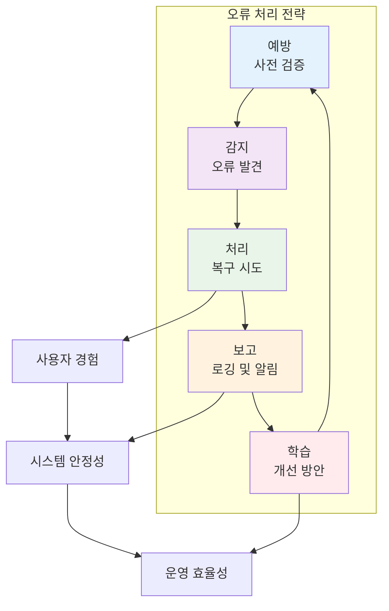

# 6장: 오류 처리와 로깅

> *"오류는 불가피하다. 중요한 것은 오류를 우아하게 처리하고, 그로부터 학습하는 것이다."*

---

## 학습 목표

이 장을 마치면 다음을 할 수 있게 됩니다:
- 견고한 오류 처리 전략을 설계하고 구현할 수 있습니다
- 효과적인 로깅 시스템을 구축하여 시스템 모니터링을 개선할 수 있습니다
- 바이브 코딩을 활용하여 오류 처리와 로깅 코드를 자동 생성할 수 있습니다
- 분산 시스템에서의 오류 추적과 디버깅 기법을 적용할 수 있습니다
- AI 지원을 통해 오류 패턴을 분석하고 예방 조치를 수립할 수 있습니다

---

## 6.1 오류 처리 전략

### 오류 처리의 중요성

효과적인 오류 처리는 시스템의 안정성과 사용자 경험을 크게 좌우합니다.



### 💡 **바이브 코딩 프롬프트: 지능형 오류 처리 시스템**

**시나리오**: 마이크로서비스 아키텍처에서 포괄적인 오류 처리와 복구 시스템을 구축해야 합니다.

**바이브 코딩 프롬프트**:
```
분산 시스템을 위한 지능형 오류 처리 및 복구 시스템을 구축해 주세요.

**시스템 요구사항**:
1. **다층 오류 처리**: 네트워크, 서비스, 비즈니스 로직 레벨
2. **자동 복구**: 일시적 오류에 대한 재시도 및 회로 차단기
3. **우아한 성능 저하**: 부분적 서비스 장애 시 핵심 기능 유지
4. **실시간 모니터링**: 오류 패턴 감지 및 알림
5. **학습 기반 개선**: 오류 데이터 분석을 통한 시스템 개선

**기술 스택**: Python/FastAPI, Redis, PostgreSQL, Kafka

**핵심 기능**:

1. **오류 분류 시스템**:
   - 일시적 오류 (네트워크 타임아웃, 서비스 과부하)
   - 영구적 오류 (잘못된 데이터, 권한 부족)
   - 시스템 오류 (데이터베이스 연결 실패, 메모리 부족)
   - 비즈니스 오류 (유효성 검사 실패, 규칙 위반)

2. **복구 전략**:
   - 지수 백오프를 통한 재시도
   - 회로 차단기 패턴
   - 벌크헤드 격리
   - 타임아웃 관리

3. **모니터링 및 알림**:
   - 실시간 오류율 추적
   - 임계값 기반 알림
   - 오류 트렌드 분석
   - 성능 영향 측정

**결과물**:
1. **오류 처리 프레임워크**: 재사용 가능한 오류 처리 컴포넌트
2. **복구 엔진**: 자동 복구 로직 및 정책 관리
3. **모니터링 대시보드**: 실시간 오류 현황 및 메트릭
4. **알림 시스템**: 다양한 채널을 통한 오류 알림
5. **분석 도구**: 오류 패턴 분석 및 개선 제안

프로덕션 환경에서 즉시 사용 가능한 견고한 시스템을 구현해 주세요.
```

---

## 6.2 로깅 시스템 설계

### 효과적인 로깅 전략

체계적인 로깅은 시스템 운영과 문제 해결의 핵심입니다.

### 💡 **바이브 코딩 프롬프트: 통합 로깅 플랫폼**

**바이브 코딩 프롬프트**:
```
마이크로서비스 환경을 위한 중앙집중식 로깅 및 분석 플랫폼을 구축해 주세요.

**플랫폼 요구사항**:
1. **로그 수집**: 다양한 소스에서 로그 통합 수집
2. **실시간 처리**: 스트리밍 로그 처리 및 분석
3. **지능형 분석**: AI 기반 로그 패턴 분석
4. **시각화**: 직관적인 로그 대시보드
5. **알림**: 이상 패턴 감지 시 자동 알림

**기술 스택**: 
- 수집: Fluentd, Logstash
- 저장: Elasticsearch, ClickHouse
- 처리: Apache Kafka, Apache Spark
- 시각화: Grafana, Kibana

**핵심 기능**:

1. **로그 수집 및 파싱**:
   - 다양한 로그 형식 지원 (JSON, 구조화, 비구조화)
   - 실시간 로그 스트리밍
   - 로그 정규화 및 보강
   - 민감 정보 마스킹

2. **지능형 분석**:
   - 이상 패턴 자동 감지
   - 로그 클러스터링 및 분류
   - 트렌드 분석 및 예측
   - 근본 원인 분석

3. **검색 및 시각화**:
   - 고성능 로그 검색
   - 실시간 대시보드
   - 커스텀 알림 규칙
   - 로그 기반 메트릭 생성

**결과물**:
1. **로그 수집 파이프라인**: 확장 가능한 로그 수집 시스템
2. **분석 엔진**: AI 기반 로그 분석 도구
3. **시각화 대시보드**: 운영팀을 위한 모니터링 인터페이스
4. **알림 시스템**: 지능형 이상 감지 및 알림
5. **API 및 SDK**: 개발팀을 위한 로깅 도구

운영팀과 개발팀 모두가 효과적으로 사용할 수 있는 통합 플랫폼을 구현해 주세요.
```

---

## 6.3 분산 추적과 관찰 가능성

### 관찰 가능성의 세 기둥

현대적인 시스템 관찰 가능성은 메트릭, 로그, 추적의 조합으로 구성됩니다.

### 💡 **바이브 코딩 프롬프트: 분산 추적 시스템**

**바이브 코딩 프롬프트**:
```
마이크로서비스 간 요청 흐름을 추적하고 성능을 분석하는 분산 추적 시스템을 구축해 주세요.

**시스템 목표**:
1. **요청 추적**: 서비스 간 요청 경로 완전 추적
2. **성능 분석**: 병목 지점 식별 및 최적화 제안
3. **오류 추적**: 분산 환경에서의 오류 전파 경로 분석
4. **의존성 매핑**: 서비스 간 의존성 자동 발견
5. **용량 계획**: 트래픽 패턴 분석을 통한 용량 계획

**기술 스택**: OpenTelemetry, Jaeger, Zipkin, Prometheus

**핵심 기능**:

1. **추적 데이터 수집**:
   - 자동 계측 (Auto-instrumentation)
   - 커스텀 스팬 및 태그
   - 샘플링 전략
   - 컨텍스트 전파

2. **분석 및 시각화**:
   - 서비스 맵 자동 생성
   - 성능 히트맵
   - 오류율 및 지연시간 분석
   - 비교 분석 (시간대별, 버전별)

3. **알림 및 자동화**:
   - SLA 위반 감지
   - 성능 저하 자동 알림
   - 자동 스케일링 트리거
   - 장애 전파 차단

**결과물**:
1. **추적 수집 에이전트**: 각 서비스용 계측 라이브러리
2. **분석 플랫폼**: 추적 데이터 분석 및 시각화
3. **모니터링 대시보드**: 실시간 성능 모니터링
4. **자동화 도구**: 성능 기반 자동 대응 시스템
5. **개발자 도구**: 로컬 개발 환경 추적 도구

개발팀이 성능 문제를 빠르게 식별하고 해결할 수 있는 도구를 만들어 주세요.
```

---

## 요약

오류 처리와 로깅은 안정적이고 관찰 가능한 시스템을 구축하는 핵심 요소입니다. 바이브 코딩을 활용하면:

- **지능형 오류 처리**: AI 기반 오류 분류 및 자동 복구
- **통합 로깅**: 분산 환경에서의 중앙집중식 로그 관리
- **실시간 모니터링**: 시스템 상태의 실시간 가시성
- **예측적 분석**: 오류 패턴 분석을 통한 사전 대응

**핵심 원칙**:
1. **사전 예방**: 오류 발생 전 위험 요소 식별
2. **빠른 감지**: 문제 발생 시 즉시 감지 및 알림
3. **자동 복구**: 가능한 한 자동으로 문제 해결
4. **지속적 학습**: 오류 데이터를 통한 시스템 개선

기억하세요: 완벽한 시스템은 없습니다. 중요한 것은 문제가 발생했을 때 빠르게 감지하고, 우아하게 처리하며, 그로부터 학습하는 것입니다. 