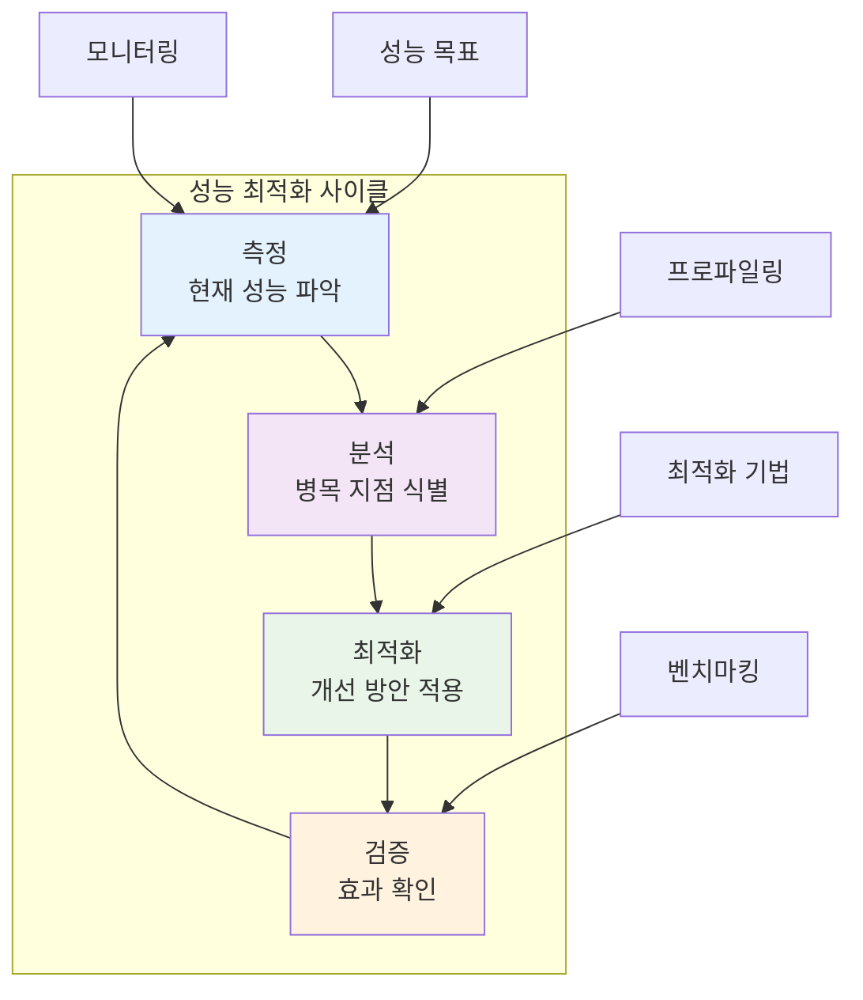

# 7장: 성능 최적화

> *"조기 최적화는 모든 악의 근원이다. 하지만 성능을 무시하는 것은 더 큰 악이다."*

---

## 학습 목표

이 장을 마치면 다음을 할 수 있게 됩니다:
- 체계적인 성능 분석과 최적화 방법론을 적용할 수 있습니다
- 바이브 코딩을 활용하여 성능 병목 지점을 식별하고 해결할 수 있습니다
- 다양한 성능 최적화 기법을 상황에 맞게 선택하고 구현할 수 있습니다
- 성능 모니터링 시스템을 구축하여 지속적인 성능 관리를 수행할 수 있습니다
- AI 지원을 통해 성능 패턴을 분석하고 예측적 최적화를 수행할 수 있습니다

---

## 7.1 성능 최적화 방법론

### 성능 최적화의 원칙

효과적인 성능 최적화는 측정, 분석, 최적화, 검증의 순환 과정입니다.



### 💡 **바이브 코딩 프롬프트: 지능형 성능 최적화 플랫폼**

**시나리오**: 대규모 웹 애플리케이션의 성능을 자동으로 분석하고 최적화하는 AI 기반 플랫폼을 구축해야 합니다.

**바이브 코딩 프롬프트**:
```
웹 애플리케이션을 위한 AI 기반 성능 최적화 플랫폼을 구축해 주세요.

**플랫폼 목표**:
1. **자동 성능 분석**: 코드와 시스템 성능 자동 분석
2. **병목 지점 식별**: AI를 통한 성능 병목 자동 감지
3. **최적화 제안**: 맞춤형 성능 개선 방안 제시
4. **자동 적용**: 안전한 최적화 자동 적용
5. **지속적 모니터링**: 성능 변화 실시간 추적

**기술 스택**: Python/Django, React, PostgreSQL, Redis, Elasticsearch

**핵심 기능**:

1. **성능 프로파일링**:
   - 코드 레벨 성능 분석
   - 데이터베이스 쿼리 최적화
   - 메모리 사용량 분석
   - 네트워크 지연시간 측정

2. **AI 기반 분석**:
   - 성능 패턴 학습
   - 이상 징후 자동 감지
   - 최적화 우선순위 결정
   - 성능 예측 모델링

3. **최적화 엔진**:
   - 캐싱 전략 자동 적용
   - 데이터베이스 인덱스 최적화
   - 코드 리팩토링 제안
   - 리소스 할당 최적화

4. **모니터링 및 알림**:
   - 실시간 성능 대시보드
   - 성능 저하 자동 알림
   - 트렌드 분석 및 예측
   - 용량 계획 지원

**결과물**:
1. **성능 분석 엔진**: 자동 성능 프로파일링 도구
2. **AI 최적화 시스템**: 지능형 성능 개선 제안
3. **모니터링 대시보드**: 실시간 성능 시각화
4. **자동화 도구**: 성능 최적화 자동 적용
5. **개발자 도구**: IDE 통합 성능 분석 플러그인

개발팀이 성능 문제를 사전에 예방하고 빠르게 해결할 수 있는 종합 플랫폼을 구현해 주세요.
```

---

## 7.2 데이터베이스 성능 최적화

### 데이터베이스 최적화 전략

데이터베이스는 대부분 애플리케이션의 성능 병목 지점입니다.

### 💡 **바이브 코딩 프롬프트: 데이터베이스 최적화 도구**

**바이브 코딩 프롬프트**:
```
데이터베이스 성능을 자동으로 분석하고 최적화하는 지능형 도구를 개발해 주세요.

**최적화 영역**:
1. **쿼리 최적화**: 느린 쿼리 식별 및 개선
2. **인덱스 관리**: 최적 인덱스 전략 제안
3. **스키마 최적화**: 테이블 구조 개선 방안
4. **캐싱 전략**: 효과적인 캐싱 구현
5. **파티셔닝**: 대용량 데이터 분할 전략

**기술 요구사항**:
- PostgreSQL, MySQL, MongoDB 지원
- 실시간 쿼리 분석
- 자동 인덱스 추천
- 성능 메트릭 수집
- 최적화 효과 측정

**결과물**:
1. **쿼리 분석기**: 느린 쿼리 자동 감지 및 최적화
2. **인덱스 어드바이저**: AI 기반 인덱스 추천
3. **스키마 최적화기**: 테이블 구조 개선 제안
4. **캐싱 매니저**: 지능형 캐싱 전략 구현
5. **성능 모니터**: 데이터베이스 성능 실시간 추적

데이터베이스 관리자와 개발자 모두가 사용할 수 있는 실용적인 도구를 만들어 주세요.
```

---

## 7.3 프론트엔드 성능 최적화

### 웹 성능 최적화 기법

사용자 경험을 좌우하는 프론트엔드 성능 최적화는 매우 중요합니다.

### 💡 **바이브 코딩 프롬프트: 웹 성능 최적화 도구**

**바이브 코딩 프롬프트**:
```
React 웹 애플리케이션을 위한 종합적인 성능 최적화 도구를 구축해 주세요.

**최적화 영역**:
1. **번들 최적화**: JavaScript/CSS 번들 크기 최소화
2. **이미지 최적화**: 자동 이미지 압축 및 포맷 변환
3. **로딩 최적화**: 지연 로딩 및 코드 분할
4. **캐싱 전략**: 브라우저 캐싱 최적화
5. **렌더링 최적화**: React 컴포넌트 성능 개선

**기술 스택**: React, Webpack, Vite, Next.js

**핵심 기능**:
- 자동 성능 분석
- 최적화 제안 및 적용
- 실시간 성능 모니터링
- A/B 테스트 지원
- 성능 예산 관리

**결과물**:
1. **성능 분석 도구**: 웹 성능 자동 분석
2. **최적화 엔진**: 자동 성능 개선 적용
3. **모니터링 시스템**: 실시간 성능 추적
4. **개발자 도구**: 성능 최적화 가이드
5. **CI/CD 통합**: 빌드 시 성능 검증

사용자 경험을 크게 개선할 수 있는 실용적인 도구를 구현해 주세요.
```

---

## 7.4 시스템 리소스 최적화

### 리소스 효율성 향상

CPU, 메모리, 네트워크 등 시스템 리소스의 효율적 사용이 중요합니다.

### 💡 **바이브 코딩 프롬프트: 리소스 최적화 시스템**

**바이브 코딩 프롬프트**:
```
클라우드 환경에서 시스템 리소스를 자동으로 최적화하는 지능형 관리 시스템을 구축해 주세요.

**최적화 목표**:
1. **비용 효율성**: 리소스 사용량 대비 비용 최소화
2. **성능 보장**: SLA 요구사항 충족
3. **자동 스케일링**: 트래픽에 따른 동적 확장/축소
4. **리소스 예측**: 미래 리소스 요구량 예측
5. **장애 대응**: 리소스 부족 시 자동 대응

**기술 스택**: Kubernetes, Prometheus, Grafana, AWS/GCP

**핵심 기능**:
- 실시간 리소스 모니터링
- AI 기반 사용량 예측
- 자동 스케일링 정책
- 비용 최적화 제안
- 성능 임계값 관리

**결과물**:
1. **리소스 모니터**: 실시간 리소스 사용량 추적
2. **예측 엔진**: AI 기반 리소스 요구량 예측
3. **자동 스케일러**: 지능형 자동 확장/축소
4. **비용 최적화기**: 리소스 비용 최소화 도구
5. **알림 시스템**: 리소스 이상 상황 자동 알림

운영 비용을 절감하면서도 성능을 보장하는 시스템을 구현해 주세요.
```

---

## 7.5 성능 모니터링과 알림

### 지속적인 성능 관리

성능 최적화는 일회성이 아닌 지속적인 과정입니다.

### 💡 **바이브 코딩 프롬프트: 성능 모니터링 플랫폼**

**바이브 코딩 프롬프트**:
```
애플리케이션 성능을 종합적으로 모니터링하고 관리하는 플랫폼을 구축해 주세요.

**모니터링 범위**:
1. **애플리케이션 성능**: 응답시간, 처리량, 오류율
2. **인프라 성능**: CPU, 메모리, 디스크, 네트워크
3. **사용자 경험**: 페이지 로딩 시간, 상호작용 지연
4. **비즈니스 메트릭**: 전환율, 이탈률, 매출 영향
5. **외부 의존성**: API, 데이터베이스, 서드파티 서비스

**기술 스택**: Prometheus, Grafana, ELK Stack, New Relic

**핵심 기능**:
- 실시간 성능 대시보드
- 지능형 이상 감지
- 자동 알림 및 에스컬레이션
- 성능 트렌드 분석
- 근본 원인 분석

**결과물**:
1. **통합 대시보드**: 모든 성능 메트릭 시각화
2. **이상 감지 엔진**: AI 기반 성능 이상 감지
3. **알림 시스템**: 다채널 성능 알림
4. **분석 도구**: 성능 트렌드 및 패턴 분석
5. **보고서 생성기**: 자동 성능 보고서 작성

개발팀과 운영팀이 성능을 효과적으로 관리할 수 있는 플랫폼을 구현해 주세요.
```

---

## 요약

성능 최적화는 사용자 경험과 비즈니스 성공에 직결되는 중요한 영역입니다. 바이브 코딩을 활용하면:

- **자동화된 성능 분석**: AI를 통한 병목 지점 자동 식별
- **지능형 최적화**: 맞춤형 성능 개선 방안 제시
- **예측적 관리**: 성능 문제 사전 예방
- **지속적 모니터링**: 실시간 성능 추적 및 관리

**핵심 원칙**:
1. **측정 우선**: 추측이 아닌 데이터 기반 최적화
2. **점진적 개선**: 작은 개선의 누적으로 큰 효과 달성
3. **사용자 중심**: 기술적 성능보다 사용자 경험 우선
4. **지속적 관리**: 일회성이 아닌 지속적인 성능 관리

기억하세요: 성능 최적화는 기술적 도전이자 비즈니스 기회입니다. 올바른 접근법과 도구를 사용하면 사용자 만족도와 비즈니스 성과를 동시에 향상시킬 수 있습니다. 