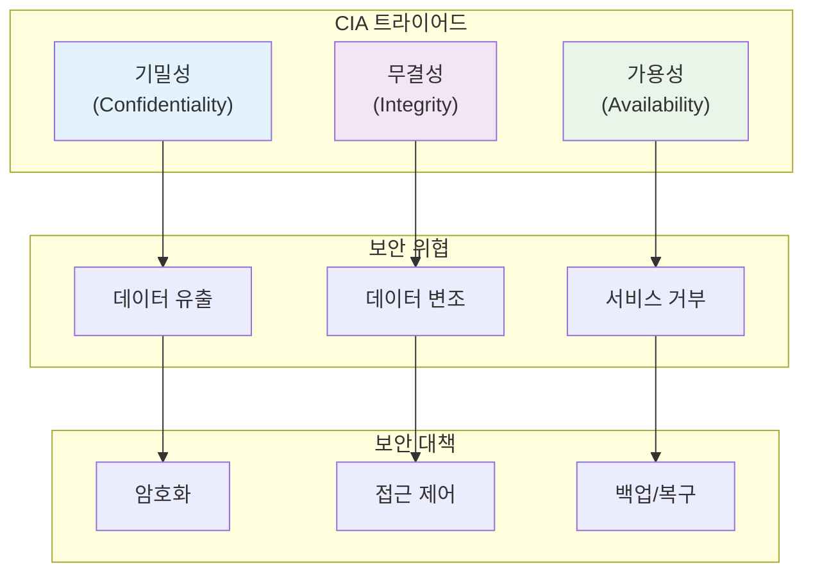

# 8장: 보안 실무

> *"보안은 제품이 아니라 과정이다. 한 번 구현하고 끝나는 것이 아니라 지속적으로 관리해야 하는 것이다."*

---

## 학습 목표

이 장을 마치면 다음을 할 수 있게 됩니다:
- 포괄적인 보안 전략을 설계하고 구현할 수 있습니다
- 바이브 코딩을 활용하여 보안 취약점을 식별하고 해결할 수 있습니다
- 다양한 보안 위협에 대한 방어 메커니즘을 구축할 수 있습니다
- 보안 모니터링과 사고 대응 시스템을 운영할 수 있습니다
- AI 지원을 통해 보안 위협을 예측하고 자동으로 대응할 수 있습니다

---

## 8.1 보안 기초와 위협 모델링

### 보안의 기본 원칙

정보 보안의 기본 원칙인 CIA 트라이어드를 중심으로 보안 전략을 수립합니다.



### 💡 **바이브 코딩 프롬프트: 종합 보안 플랫폼**

**시나리오**: 기업 웹 애플리케이션을 위한 다층 보안 시스템을 구축해야 합니다.

**바이브 코딩 프롬프트**:
```
엔터프라이즈 웹 애플리케이션을 위한 종합적인 보안 플랫폼을 구축해 주세요.

**보안 요구사항**:
1. **인증 및 권한 관리**: 다단계 인증 및 세밀한 권한 제어
2. **데이터 보호**: 암호화, 마스킹, 익명화
3. **네트워크 보안**: 방화벽, DDoS 방어, 침입 탐지
4. **애플리케이션 보안**: 코드 스캔, 취약점 분석
5. **모니터링**: 실시간 위협 탐지 및 대응

**기술 스택**: Python/Django, React, PostgreSQL, Redis, Kubernetes

**핵심 기능**:

1. **인증 시스템**:
   - OAuth 2.0/OpenID Connect
   - 다단계 인증 (MFA)
   - 생체 인증 지원
   - SSO (Single Sign-On)

2. **권한 관리**:
   - 역할 기반 접근 제어 (RBAC)
   - 속성 기반 접근 제어 (ABAC)
   - 동적 권한 할당
   - 최소 권한 원칙

3. **데이터 보안**:
   - 종단간 암호화
   - 데이터베이스 암호화
   - 개인정보 마스킹
   - 데이터 분류 및 라벨링

4. **위협 탐지**:
   - AI 기반 이상 행위 탐지
   - 실시간 로그 분석
   - 침입 탐지 시스템
   - 취약점 스캐닝

**결과물**:
1. **통합 인증 시스템**: 다양한 인증 방식 지원
2. **권한 관리 엔진**: 세밀한 접근 제어
3. **데이터 보호 도구**: 암호화 및 마스킹 솔루션
4. **보안 모니터링**: 실시간 위협 탐지 및 알림
5. **보안 대시보드**: 보안 현황 시각화

GDPR, HIPAA 등 규정 준수를 포함한 엔터프라이즈급 보안 솔루션을 구현해 주세요.
```

---

## 8.2 웹 애플리케이션 보안

### OWASP Top 10 대응

웹 애플리케이션의 주요 보안 취약점에 대한 체계적인 대응이 필요합니다.

### 💡 **바이브 코딩 프롬프트: 웹 보안 스캐너**

**바이브 코딩 프롬프트**:
```
웹 애플리케이션의 보안 취약점을 자동으로 탐지하고 수정하는 AI 기반 보안 스캐너를 개발해 주세요.

**스캔 대상**:
1. **OWASP Top 10**: 주요 웹 취약점
2. **코드 분석**: 정적/동적 코드 분석
3. **의존성 검사**: 서드파티 라이브러리 취약점
4. **설정 검토**: 보안 설정 검증
5. **API 보안**: REST/GraphQL API 보안 검사

**기술 요구사항**:
- 다양한 언어 지원 (Python, JavaScript, Java)
- CI/CD 파이프라인 통합
- 실시간 스캔 및 알림
- 자동 수정 제안
- 규정 준수 검증

**핵심 기능**:
- SQL 인젝션 탐지
- XSS 취약점 분석
- 인증/권한 검증
- 암호화 검사
- 보안 헤더 검증

**결과물**:
1. **취약점 스캐너**: 자동 보안 취약점 탐지
2. **코드 분석기**: 정적/동적 코드 보안 분석
3. **수정 제안 엔진**: AI 기반 취약점 수정 방안
4. **보안 대시보드**: 취약점 현황 및 트렌드
5. **CI/CD 플러그인**: 개발 파이프라인 통합

개발팀이 보안을 쉽게 관리할 수 있는 실용적인 도구를 만들어 주세요.
```

---

## 8.3 API 보안

### API 보안 모범 사례

API는 현대 애플리케이션의 핵심이므로 강력한 보안이 필요합니다.

### 💡 **바이브 코딩 프롬프트: API 보안 게이트웨이**

**바이브 코딩 프롬프트**:
```
마이크로서비스 환경을 위한 지능형 API 보안 게이트웨이를 구축해 주세요.

**보안 기능**:
1. **인증/인가**: JWT, OAuth 2.0, API 키 관리
2. **속도 제한**: 지능형 레이트 리미팅
3. **입력 검증**: 자동 페이로드 검증
4. **위협 탐지**: 이상 트래픽 감지
5. **암호화**: 전송 중 데이터 보호

**기술 스택**: Kong, Envoy, Istio, Kubernetes

**핵심 기능**:
- 동적 API 정책 관리
- 실시간 위협 분석
- 자동 차단 및 격리
- API 사용량 모니터링
- 보안 이벤트 로깅

**결과물**:
1. **API 게이트웨이**: 중앙집중식 API 보안
2. **정책 엔진**: 동적 보안 정책 관리
3. **위협 탐지 시스템**: AI 기반 이상 탐지
4. **모니터링 대시보드**: API 보안 현황
5. **개발자 포털**: API 보안 가이드

API 보안을 자동화하고 개발자 경험을 향상시키는 솔루션을 구현해 주세요.
```

---

## 8.4 데이터 보호와 프라이버시

### 개인정보 보호 규정 준수

GDPR, CCPA 등 개인정보 보호 규정 준수가 필수입니다.

### 💡 **바이브 코딩 프롬프트: 데이터 프라이버시 플랫폼**

**바이브 코딩 프롬프트**:
```
GDPR 및 CCPA 규정을 준수하는 데이터 프라이버시 관리 플랫폼을 구축해 주세요.

**규정 준수 요구사항**:
1. **데이터 분류**: 개인정보 자동 식별 및 분류
2. **동의 관리**: 사용자 동의 수집 및 관리
3. **접근 권리**: 데이터 열람, 수정, 삭제 권리
4. **데이터 최소화**: 필요 최소한의 데이터만 수집
5. **보안 조치**: 적절한 기술적/관리적 보호조치

**기술 요구사항**:
- 다양한 데이터 소스 지원
- 자동 데이터 분류
- 동의 관리 시스템
- 데이터 계보 추적
- 규정 준수 보고

**핵심 기능**:
- 개인정보 자동 탐지
- 동의 상태 추적
- 데이터 주체 권리 처리
- 데이터 보존 정책
- 침해 신고 자동화

**결과물**:
1. **데이터 분류 엔진**: AI 기반 개인정보 식별
2. **동의 관리 시스템**: 사용자 동의 수집/관리
3. **권리 처리 도구**: 데이터 주체 권리 자동 처리
4. **규정 준수 대시보드**: 준수 현황 모니터링
5. **감사 도구**: 규정 준수 감사 지원

법적 요구사항을 충족하면서도 사용자 경험을 해치지 않는 솔루션을 구현해 주세요.
```

---

## 요약

보안은 현대 소프트웨어 개발의 필수 요소입니다. 바이브 코딩을 활용하면:

- **자동화된 보안 검사**: AI를 통한 취약점 자동 탐지
- **지능형 위협 대응**: 실시간 위협 분석 및 자동 대응
- **규정 준수 자동화**: 개인정보 보호 규정 자동 준수
- **보안 개발 통합**: DevSecOps를 통한 보안 내재화

**핵심 원칙**:
1. **보안 내재화**: 개발 초기부터 보안 고려
2. **다층 방어**: 여러 보안 계층을 통한 종합적 보호
3. **지속적 모니터링**: 실시간 위협 탐지 및 대응
4. **규정 준수**: 법적 요구사항 자동 준수

기억하세요: 보안은 일회성 작업이 아닌 지속적인 과정입니다. 위협은 계속 진화하므로 보안 대책도 함께 발전해야 합니다. 