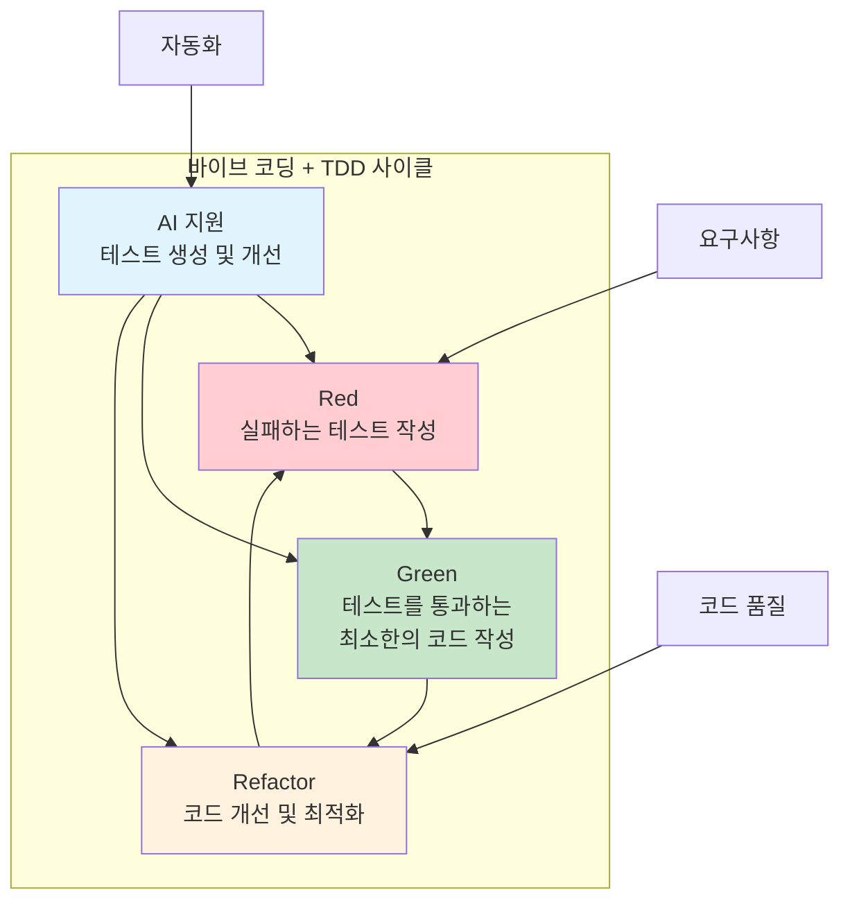

# 9장: 테스트 주도 개발 (TDD)

> *"테스트는 코드가 작동한다는 것을 증명하는 것이 아니라, 코드가 의도한 대로 작동한다는 확신을 주는 것이다."*

---

## 학습 목표

이 장을 마치면 다음을 할 수 있게 됩니다:
- TDD의 Red-Green-Refactor 사이클을 효과적으로 적용할 수 있습니다
- 바이브 코딩을 활용하여 테스트 케이스를 자동 생성하고 관리할 수 있습니다
- 다양한 테스트 유형(단위, 통합, E2E)을 적절히 조합할 수 있습니다
- 테스트 자동화 파이프라인을 구축하여 지속적인 품질 보장을 수행할 수 있습니다
- AI 지원을 통해 테스트 커버리지를 최적화하고 테스트 유지보수를 자동화할 수 있습니다

---

## 9.1 TDD 기초와 철학

### TDD의 핵심 원칙

TDD는 테스트를 먼저 작성하고 코드를 나중에 작성하는 개발 방법론입니다.



### 💡 **바이브 코딩 프롬프트: AI 기반 TDD 플랫폼**

**시나리오**: 개발팀의 TDD 도입을 지원하는 AI 기반 테스트 자동화 플랫폼을 구축해야 합니다.

**바이브 코딩 프롬프트**:
```
개발팀의 TDD 실천을 지원하는 AI 기반 테스트 자동화 플랫폼을 구축해 주세요.

**플랫폼 목표**:
1. **테스트 자동 생성**: 요구사항에서 테스트 케이스 자동 생성
2. **TDD 가이드**: Red-Green-Refactor 사이클 지원
3. **테스트 품질 관리**: 테스트 커버리지 및 품질 최적화
4. **지속적 개선**: 테스트 결과 분석을 통한 개선 제안
5. **팀 협업**: TDD 모범 사례 공유 및 학습

**기술 스택**: Python/pytest, JavaScript/Jest, Java/JUnit, Docker

**핵심 기능**:

1. **AI 테스트 생성**:
   - 자연어 요구사항에서 테스트 케이스 추출
   - 코드 분석을 통한 엣지 케이스 식별
   - 테스트 데이터 자동 생성
   - 모의 객체 자동 생성

2. **TDD 워크플로우 지원**:
   - Red 단계: 실패하는 테스트 작성 가이드
   - Green 단계: 최소한의 구현 코드 제안
   - Refactor 단계: 코드 개선 방안 제시
   - 사이클 진행 상황 추적

3. **테스트 품질 분석**:
   - 커버리지 분석 및 개선 제안
   - 테스트 중복 감지 및 최적화
   - 테스트 실행 시간 최적화
   - 플레이키 테스트 감지

4. **협업 및 학습**:
   - TDD 모범 사례 추천
   - 팀 테스트 메트릭 대시보드
   - 페어 프로그래밍 지원
   - 테스트 리뷰 자동화

**결과물**:
1. **AI 테스트 생성기**: 요구사항 기반 테스트 자동 생성
2. **TDD 워크플로우 도구**: Red-Green-Refactor 사이클 지원
3. **테스트 품질 분석기**: 커버리지 및 품질 최적화
4. **협업 플랫폼**: 팀 TDD 실천 지원
5. **IDE 플러그인**: 개발 환경 통합 TDD 도구

개발팀이 TDD를 쉽게 도입하고 지속적으로 실천할 수 있는 종합 플랫폼을 구현해 주세요.
```

---

## 9.2 단위 테스트 작성

### 효과적인 단위 테스트

단위 테스트는 TDD의 기초이며 코드 품질의 핵심 지표입니다.

### 💡 **바이브 코딩 프롬프트: 지능형 단위 테스트 생성기**

**바이브 코딩 프롬프트**:
```
코드를 분석하여 포괄적인 단위 테스트를 자동 생성하는 AI 시스템을 개발해 주세요.

**테스트 생성 범위**:
1. **기본 기능 테스트**: 정상적인 입력에 대한 예상 출력
2. **경계값 테스트**: 최소/최대값, 빈 값, null 처리
3. **예외 처리 테스트**: 오류 상황에 대한 적절한 처리
4. **상태 변화 테스트**: 객체 상태 변화 검증
5. **의존성 테스트**: 외부 의존성과의 상호작용

**기술 요구사항**:
- 다양한 언어 지원 (Python, JavaScript, Java, C#)
- 코드 정적 분석
- 테스트 데이터 자동 생성
- 모의 객체 자동 생성
- 테스트 품질 평가

**핵심 기능**:
- 함수/메서드 시그니처 분석
- 데이터 플로우 추적
- 엣지 케이스 자동 식별
- 테스트 데이터 생성
- 어설션 자동 생성

**결과물**:
1. **코드 분석 엔진**: 함수/클래스 구조 분석
2. **테스트 생성기**: 포괄적인 단위 테스트 자동 생성
3. **데이터 생성기**: 다양한 테스트 데이터 자동 생성
4. **품질 평가기**: 생성된 테스트의 품질 평가
5. **IDE 통합**: 개발 환경에서 바로 사용 가능

개발자가 테스트 작성 시간을 크게 단축할 수 있는 실용적인 도구를 만들어 주세요.
```

---

## 9.3 통합 테스트와 E2E 테스트

### 다층 테스트 전략

단위 테스트만으로는 충분하지 않으며, 통합 테스트와 E2E 테스트가 필요합니다.

### 💡 **바이브 코딩 프롬프트: 통합 테스트 자동화 플랫폼**

**바이브 코딩 프롬프트**:
```
마이크로서비스 환경을 위한 통합 테스트 및 E2E 테스트 자동화 플랫폼을 구축해 주세요.

**테스트 범위**:
1. **API 통합 테스트**: 서비스 간 API 호출 검증
2. **데이터베이스 통합**: 데이터 일관성 및 트랜잭션 검증
3. **메시지 큐 테스트**: 비동기 메시지 처리 검증
4. **E2E 시나리오**: 사용자 여정 전체 검증
5. **성능 테스트**: 통합 환경에서의 성능 검증

**기술 스택**: Docker, Kubernetes, Selenium, Cypress, Postman

**핵심 기능**:
- 테스트 환경 자동 구성
- 서비스 의존성 관리
- 테스트 데이터 준비
- 병렬 테스트 실행
- 결과 분석 및 보고

**결과물**:
1. **테스트 환경 관리**: Docker 기반 격리된 테스트 환경
2. **API 테스트 도구**: 자동 API 테스트 생성 및 실행
3. **E2E 테스트 프레임워크**: 사용자 시나리오 자동 테스트
4. **성능 테스트 도구**: 통합 환경 성능 검증
5. **CI/CD 통합**: 파이프라인 통합 테스트 자동화

복잡한 분산 시스템에서도 안정적으로 작동하는 테스트 플랫폼을 구현해 주세요.
```

---

## 9.4 테스트 자동화와 CI/CD

### 지속적인 테스트 실행

테스트 자동화는 지속적 통합/배포의 핵심 요소입니다.

### 💡 **바이브 코딩 프롬프트: 지능형 테스트 파이프라인**

**바이브 코딩 프롬프트**:
```
AI를 활용한 지능형 테스트 자동화 파이프라인을 구축해 주세요.

**파이프라인 기능**:
1. **스마트 테스트 선택**: 변경 사항에 따른 최적 테스트 선택
2. **병렬 실행 최적화**: 테스트 실행 시간 최소화
3. **실패 분석**: 테스트 실패 원인 자동 분석
4. **자동 복구**: 일시적 실패에 대한 자동 재시도
5. **품질 게이트**: 품질 기준에 따른 배포 제어

**기술 스택**: Jenkins, GitHub Actions, GitLab CI, Docker

**핵심 기능**:
- 코드 변경 영향 분석
- 테스트 우선순위 결정
- 리소스 최적화
- 실패 패턴 학습
- 자동 보고서 생성

**결과물**:
1. **스마트 테스트 선택기**: 변경 사항 기반 테스트 최적화
2. **병렬 실행 엔진**: 테스트 실행 시간 최소화
3. **실패 분석기**: AI 기반 테스트 실패 원인 분석
4. **품질 게이트**: 자동 품질 검증 및 배포 제어
5. **대시보드**: 테스트 현황 및 트렌드 시각화

개발팀의 생산성을 크게 향상시킬 수 있는 지능형 파이프라인을 구현해 주세요.
```

---

## 9.5 테스트 유지보수와 최적화

### 지속 가능한 테스트 관리

테스트 코드도 프로덕션 코드만큼 중요하며 지속적인 관리가 필요합니다.

### 💡 **바이브 코딩 프롬프트: 테스트 유지보수 도구**

**바이브 코딩 프롬프트**:
```
테스트 코드의 품질과 유지보수성을 자동으로 관리하는 AI 도구를 개발해 주세요.

**유지보수 영역**:
1. **테스트 리팩토링**: 중복 제거 및 구조 개선
2. **플레이키 테스트 관리**: 불안정한 테스트 식별 및 수정
3. **테스트 성능 최적화**: 실행 시간 단축
4. **커버리지 최적화**: 효과적인 테스트 커버리지 달성
5. **테스트 문서화**: 테스트 의도 및 시나리오 문서화

**기술 요구사항**:
- 테스트 코드 정적 분석
- 실행 패턴 분석
- 커버리지 분석
- 성능 프로파일링
- 자동 리팩토링

**핵심 기능**:
- 테스트 중복 감지
- 플레이키 테스트 식별
- 성능 병목 분석
- 커버리지 갭 분석
- 자동 개선 제안

**결과물**:
1. **테스트 분석기**: 테스트 코드 품질 분석
2. **리팩토링 도구**: 자동 테스트 코드 개선
3. **플레이키 테스트 관리**: 불안정한 테스트 해결
4. **성능 최적화기**: 테스트 실행 시간 단축
5. **문서 생성기**: 테스트 문서 자동 생성

테스트 코드의 장기적 품질을 보장하는 종합 관리 도구를 구현해 주세요.
```

---

## 요약

테스트 주도 개발은 고품질 소프트웨어 개발의 핵심 실천법입니다. 바이브 코딩을 활용하면:

- **자동화된 테스트 생성**: AI를 통한 포괄적인 테스트 케이스 자동 생성
- **지능형 테스트 관리**: 테스트 품질 및 성능 최적화
- **효율적인 파이프라인**: 스마트한 테스트 실행 및 분석
- **지속적인 개선**: 테스트 결과 분석을 통한 품질 향상

**핵심 원칙**:
1. **테스트 우선**: 코드보다 테스트를 먼저 작성
2. **작은 단위**: 작고 집중된 테스트 케이스
3. **빠른 피드백**: 신속한 테스트 실행과 결과 확인
4. **지속적 개선**: 테스트 품질의 지속적 향상

기억하세요: TDD는 단순히 테스트를 작성하는 것이 아니라 더 나은 설계와 코드 품질을 위한 개발 방법론입니다. 바이브 코딩은 이러한 TDD 실천을 더 쉽고 효과적으로 만들어줍니다. 