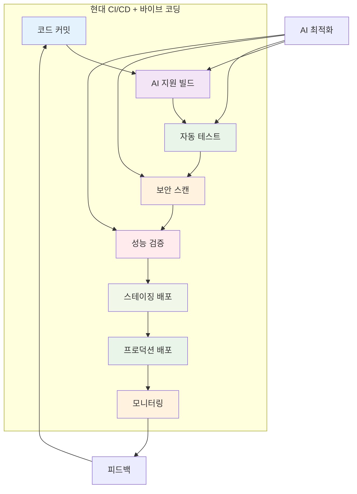

# 10장: CI/CD와 DevOps

> *"소프트웨어 배포는 이벤트가 아니라 일상적인 과정이어야 한다."*

---

## 학습 목표

이 장을 마치면 다음을 할 수 있게 됩니다:
- 현대적인 CI/CD 파이프라인을 설계하고 구축할 수 있습니다
- 바이브 코딩을 활용하여 배포 자동화와 인프라 관리를 수행할 수 있습니다
- DevOps 문화와 실천법을 팀에 도입할 수 있습니다
- 컨테이너화와 오케스트레이션을 통한 현대적 배포를 구현할 수 있습니다
- AI 지원을 통해 배포 위험을 예측하고 자동으로 대응할 수 있습니다

---

## 10.1 CI/CD 기초와 파이프라인 설계

### CI/CD의 핵심 개념

지속적 통합과 지속적 배포는 현대 소프트웨어 개발의 필수 요소입니다.



### 💡 **바이브 코딩 프롬프트: AI 기반 CI/CD 플랫폼**

**시나리오**: 다양한 프로젝트를 지원하는 지능형 CI/CD 플랫폼을 구축해야 합니다.

**바이브 코딩 프롬프트**:
```
다양한 기술 스택을 지원하는 AI 기반 CI/CD 플랫폼을 구축해 주세요.

**플랫폼 목표**:
1. **지능형 파이프라인**: AI를 통한 최적 빌드/배포 전략
2. **다중 환경 지원**: 개발, 스테이징, 프로덕션 환경 관리
3. **자동 최적화**: 빌드 시간 및 리소스 사용량 최적화
4. **위험 예측**: 배포 위험 사전 감지 및 대응
5. **통합 모니터링**: 배포 후 성능 및 안정성 추적

**기술 스택**: Jenkins, GitLab CI, GitHub Actions, Docker, Kubernetes

**핵심 기능**:

1. **지능형 파이프라인 생성**:
   - 프로젝트 분석을 통한 최적 파이프라인 자동 생성
   - 기술 스택별 맞춤형 빌드 전략
   - 의존성 분석 및 캐싱 최적화
   - 병렬 처리를 통한 빌드 시간 단축

2. **AI 기반 품질 게이트**:
   - 코드 품질 자동 분석
   - 테스트 커버리지 검증
   - 보안 취약점 스캔
   - 성능 회귀 감지

3. **스마트 배포 관리**:
   - 블루-그린 배포
   - 카나리 배포
   - 롤백 자동화
   - 배포 위험 평가

4. **통합 모니터링**:
   - 실시간 배포 상태 추적
   - 성능 메트릭 모니터링
   - 오류 감지 및 알림
   - 사용자 영향 분석

**결과물**:
1. **파이프라인 생성기**: AI 기반 최적 파이프라인 자동 생성
2. **품질 게이트 시스템**: 다층 품질 검증
3. **배포 관리 도구**: 안전한 배포 전략 구현
4. **모니터링 대시보드**: 통합 배포 현황 시각화
5. **개발자 도구**: IDE 통합 CI/CD 관리

개발팀이 복잡한 설정 없이 바로 사용할 수 있는 직관적인 플랫폼을 구현해 주세요.
```

---

## 10.2 컨테이너화와 오케스트레이션

### Docker와 Kubernetes

컨테이너 기술은 현대적 배포의 핵심입니다.

### 💡 **바이브 코딩 프롬프트: 컨테이너 관리 플랫폼**

**바이브 코딩 프롬프트**:
```
마이크로서비스를 위한 지능형 컨테이너 관리 및 오케스트레이션 플랫폼을 구축해 주세요.

**플랫폼 기능**:
1. **자동 컨테이너화**: 애플리케이션 자동 컨테이너 변환
2. **지능형 스케줄링**: 리소스 최적화 배치
3. **자동 스케일링**: 트래픽 기반 동적 확장/축소
4. **서비스 메시**: 마이크로서비스 간 통신 관리
5. **보안 관리**: 컨테이너 보안 정책 자동 적용

**기술 스택**: Docker, Kubernetes, Istio, Helm

**핵심 기능**:
- Dockerfile 자동 생성
- Kubernetes 매니페스트 최적화
- 리소스 사용량 모니터링
- 자동 장애 복구
- 보안 정책 관리

**결과물**:
1. **컨테이너 빌더**: 자동 Dockerfile 생성 및 최적화
2. **오케스트레이션 엔진**: Kubernetes 클러스터 관리
3. **스케일링 시스템**: 지능형 자동 확장/축소
4. **서비스 메시 관리**: 마이크로서비스 통신 최적화
5. **보안 관리 도구**: 컨테이너 보안 자동화

운영팀과 개발팀 모두가 쉽게 사용할 수 있는 컨테이너 플랫폼을 구현해 주세요.
```

---

## 10.3 인프라스트럭처 as 코드 (IaC)

### 코드로 관리하는 인프라

인프라를 코드로 관리하면 일관성과 재현성을 보장할 수 있습니다.

### 💡 **바이브 코딩 프롬프트: IaC 자동화 플랫폼**

**바이브 코딩 프롬프트**:
```
클라우드 인프라를 코드로 관리하는 AI 기반 IaC 플랫폼을 구축해 주세요.

**플랫폼 기능**:
1. **인프라 설계**: 요구사항 기반 인프라 아키텍처 자동 생성
2. **코드 생성**: Terraform, CloudFormation 코드 자동 생성
3. **비용 최적화**: 리소스 사용량 분석 및 비용 최적화
4. **보안 강화**: 보안 모범 사례 자동 적용
5. **변경 관리**: 인프라 변경 사항 추적 및 관리

**기술 스택**: Terraform, Ansible, AWS/Azure/GCP

**핵심 기능**:
- 인프라 요구사항 분석
- 최적 아키텍처 설계
- IaC 코드 자동 생성
- 드리프트 감지
- 비용 모니터링

**결과물**:
1. **인프라 설계 도구**: AI 기반 아키텍처 자동 설계
2. **코드 생성기**: IaC 코드 자동 생성 및 최적화
3. **비용 최적화기**: 클라우드 비용 분석 및 절감
4. **보안 검증기**: 인프라 보안 자동 검증
5. **변경 관리 시스템**: 인프라 변경 추적 및 승인

인프라 관리를 단순화하고 자동화하는 종합 플랫폼을 구현해 주세요.
```

---

## 10.4 모니터링과 관찰 가능성

### 프로덕션 환경 관리

배포 후 시스템의 건강성을 지속적으로 모니터링해야 합니다.

### 💡 **바이브 코딩 프롬프트: 통합 관찰 가능성 플랫폼**

**바이브 코딩 프롬프트**:
```
마이크로서비스 환경을 위한 통합 관찰 가능성 플랫폼을 구축해 주세요.

**관찰 가능성 영역**:
1. **메트릭**: 시스템 성능 및 비즈니스 메트릭
2. **로그**: 중앙집중식 로그 수집 및 분석
3. **추적**: 분산 요청 추적
4. **알림**: 지능형 이상 감지 및 알림
5. **대시보드**: 실시간 시스템 현황 시각화

**기술 스택**: Prometheus, Grafana, ELK Stack, Jaeger

**핵심 기능**:
- 자동 메트릭 수집
- 로그 상관관계 분석
- 분산 추적 시각화
- AI 기반 이상 감지
- 자동 알림 및 에스컬레이션

**결과물**:
1. **메트릭 수집기**: 자동 메트릭 수집 및 분석
2. **로그 분석 엔진**: 지능형 로그 분석 및 검색
3. **추적 시스템**: 분산 요청 추적 및 시각화
4. **이상 감지 엔진**: AI 기반 이상 패턴 감지
5. **통합 대시보드**: 모든 관찰 가능성 데이터 시각화

운영팀이 시스템을 효과적으로 모니터링하고 관리할 수 있는 플랫폼을 구현해 주세요.
```

---

## 10.5 DevOps 문화와 협업

### 개발과 운영의 통합

DevOps는 기술뿐만 아니라 문화와 프로세스의 변화입니다.

### 💡 **바이브 코딩 프롬프트: DevOps 협업 플랫폼**

**바이브 코딩 프롬프트**:
```
개발팀과 운영팀의 협업을 촉진하는 DevOps 플랫폼을 구축해 주세요.

**협업 기능**:
1. **통합 워크플로우**: 개발부터 운영까지 통합 프로세스
2. **지식 공유**: DevOps 모범 사례 및 경험 공유
3. **자동화 도구**: 반복 작업 자동화
4. **성과 측정**: DevOps 메트릭 추적 및 개선
5. **교육 지원**: 팀 역량 강화 프로그램

**기술 스택**: Slack/Teams 통합, Jira, Confluence

**핵심 기능**:
- 통합 대시보드
- 자동화 워크플로우
- 지식 베이스
- 성과 메트릭
- 교육 콘텐츠

**결과물**:
1. **협업 대시보드**: 개발/운영 통합 현황
2. **자동화 도구**: 반복 작업 자동화
3. **지식 관리 시스템**: DevOps 모범 사례 공유
4. **성과 측정 도구**: DevOps 메트릭 추적
5. **교육 플랫폼**: 팀 역량 강화 지원

조직의 DevOps 문화 정착을 지원하는 종합 플랫폼을 구현해 주세요.
```

---

## 요약

CI/CD와 DevOps는 현대 소프트웨어 개발의 핵심 실천법입니다. 바이브 코딩을 활용하면:

- **지능형 파이프라인**: AI를 통한 최적화된 빌드/배포 자동화
- **컨테이너 관리**: 효율적인 컨테이너화 및 오케스트레이션
- **인프라 자동화**: 코드로 관리하는 일관된 인프라
- **통합 모니터링**: 포괄적인 시스템 관찰 가능성

**핵심 원칙**:
1. **자동화 우선**: 수동 작업의 최소화
2. **빠른 피드백**: 신속한 문제 감지 및 대응
3. **지속적 개선**: 프로세스의 지속적 최적화
4. **협업 문화**: 개발과 운영의 통합

기억하세요: DevOps는 도구가 아닌 문화입니다. 기술적 자동화와 함께 팀 간 협업과 소통을 개선하는 것이 성공의 열쇠입니다. 