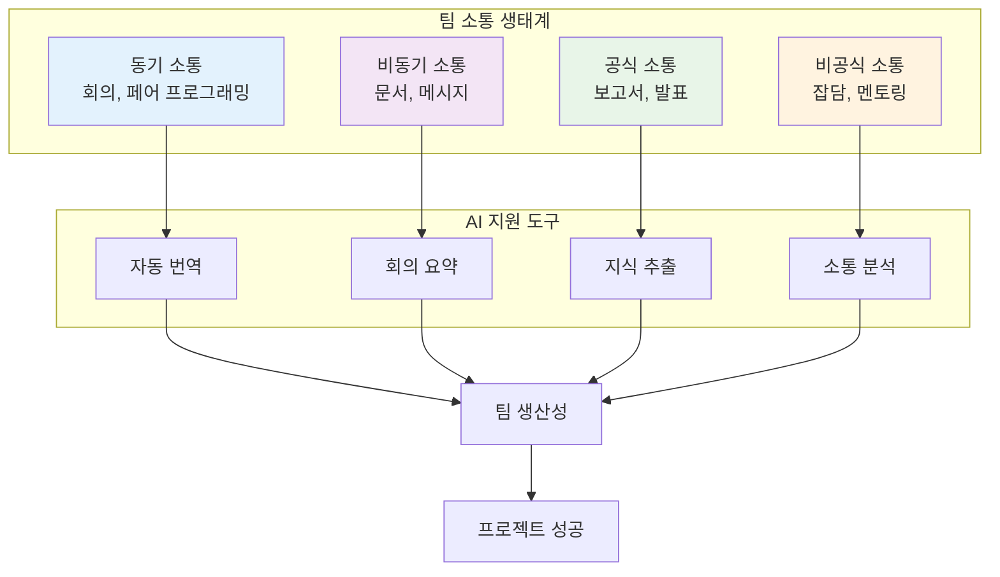

# 11장: 팀 협업과 소통

> *"혼자 가면 빠르게 갈 수 있지만, 함께 가면 더 멀리 갈 수 있다."*

---

## 학습 목표

이 장을 마치면 다음을 할 수 있게 됩니다:
- 효과적인 팀 협업 프로세스를 설계하고 운영할 수 있습니다
- 바이브 코딩을 활용하여 팀 소통과 지식 공유를 개선할 수 있습니다
- 다양한 협업 도구를 통합하여 생산성을 향상시킬 수 있습니다
- 원격 및 하이브리드 팀 환경에서 효과적으로 협업할 수 있습니다
- AI 지원을 통해 팀 역학을 분석하고 협업 품질을 최적화할 수 있습니다

---

## 11.1 효과적인 팀 소통

### 소통의 중요성

좋은 소통은 성공적인 소프트웨어 개발의 기초입니다.



### 💡 **바이브 코딩 프롬프트: AI 기반 팀 소통 플랫폼**

**시나리오**: 글로벌 분산 팀을 위한 지능형 소통 및 협업 플랫폼을 구축해야 합니다.

**바이브 코딩 프롬프트**:
```
글로벌 분산 개발팀을 위한 AI 기반 소통 및 협업 플랫폼을 구축해 주세요.

**플랫폼 목표**:
1. **언어 장벽 해소**: 실시간 번역 및 문화적 맥락 이해
2. **지식 관리**: 팀 지식의 체계적 수집 및 공유
3. **소통 최적화**: 효과적인 소통 패턴 분석 및 개선
4. **협업 자동화**: 반복적인 협업 작업 자동화
5. **팀 건강도 모니터링**: 팀 역학 및 만족도 추적

**기술 스택**: Slack/Teams API, OpenAI, React, Node.js, PostgreSQL

**핵심 기능**:

1. **지능형 소통 지원**:
   - 실시간 다국어 번역
   - 문화적 맥락 고려한 메시지 조정
   - 소통 스타일 분석 및 개선 제안
   - 자동 회의 요약 및 액션 아이템 추출

2. **지식 관리 시스템**:
   - 대화에서 지식 자동 추출
   - 프로젝트별 지식 베이스 구축
   - 전문가 식별 및 연결
   - 지식 검색 및 추천

3. **협업 최적화**:
   - 최적 회의 시간 제안
   - 팀 워크로드 분석
   - 협업 패턴 시각화
   - 생산성 메트릭 추적

4. **팀 건강도 관리**:
   - 소통 빈도 및 품질 분석
   - 팀 만족도 모니터링
   - 갈등 조기 감지
   - 팀 빌딩 활동 제안

**결과물**:
1. **통합 소통 허브**: 모든 소통 채널 통합 관리
2. **AI 번역 엔진**: 실시간 다국어 소통 지원
3. **지식 관리 시스템**: 팀 지식 자동 수집 및 공유
4. **협업 분석 도구**: 팀 협업 패턴 분석 및 최적화
5. **팀 대시보드**: 팀 건강도 및 생산성 시각화

문화적 다양성을 존중하면서도 효과적인 협업을 가능하게 하는 플랫폼을 구현해 주세요.
```

---

## 11.2 코드 리뷰와 페어 프로그래밍

### 협업을 통한 코드 품질 향상

코드 리뷰와 페어 프로그래밍은 코드 품질과 지식 공유의 핵심입니다.

### 💡 **바이브 코딩 프롬프트: 지능형 코드 리뷰 시스템**

**바이브 코딩 프롬프트**:
```
AI를 활용한 지능형 코드 리뷰 및 페어 프로그래밍 지원 시스템을 구축해 주세요.

**시스템 기능**:
1. **자동 코드 분석**: AI 기반 코드 품질 및 보안 검토
2. **리뷰어 매칭**: 최적 리뷰어 자동 선정
3. **페어 프로그래밍 지원**: 실시간 협업 도구
4. **지식 전수**: 시니어-주니어 멘토링 지원
5. **리뷰 품질 관리**: 리뷰 프로세스 최적화

**기술 스택**: GitHub/GitLab API, VS Code Live Share, WebRTC

**핵심 기능**:
- 코드 변경 사항 자동 분석
- 리뷰 포인트 자동 제안
- 실시간 코드 공유 및 편집
- 음성/화상 통화 통합
- 리뷰 히스토리 및 학습

**결과물**:
1. **AI 코드 분석기**: 자동 코드 품질 검토
2. **스마트 리뷰어 매칭**: 최적 리뷰어 추천
3. **페어 프로그래밍 도구**: 실시간 협업 환경
4. **멘토링 시스템**: 지식 전수 지원
5. **리뷰 분석 대시보드**: 리뷰 품질 및 효과 측정

코드 품질 향상과 팀 학습을 동시에 지원하는 시스템을 구현해 주세요.
```

---

## 11.3 프로젝트 관리와 계획

### 애자일 방법론과 도구

효과적인 프로젝트 관리는 팀 협업의 핵심입니다.

### 💡 **바이브 코딩 프롬프트: AI 기반 프로젝트 관리 도구**

**바이브 코딩 프롬프트**:
```
애자일 개발팀을 위한 AI 기반 프로젝트 관리 및 계획 도구를 구축해 주세요.

**도구 기능**:
1. **지능형 스프린트 계획**: AI 기반 작업 추정 및 할당
2. **리스크 예측**: 프로젝트 위험 요소 조기 감지
3. **자동 보고**: 진행 상황 자동 추적 및 보고
4. **리소스 최적화**: 팀 역량 기반 작업 분배
5. **성과 분석**: 팀 생산성 및 품질 메트릭

**기술 스택**: Jira/Asana API, React, Python, Machine Learning

**핵심 기능**:
- 작업 복잡도 자동 추정
- 팀 역량 분석
- 진행 상황 실시간 추적
- 병목 지점 자동 감지
- 성과 예측 모델링

**결과물**:
1. **스프린트 플래너**: AI 기반 스프린트 계획 도구
2. **리스크 모니터**: 프로젝트 위험 예측 시스템
3. **자동 보고서**: 진행 상황 자동 생성 및 공유
4. **리소스 옵티마이저**: 팀 역량 기반 작업 할당
5. **성과 대시보드**: 팀 생산성 시각화

프로젝트 성공률을 높이고 팀 부담을 줄이는 지능형 도구를 구현해 주세요.
```

---

## 11.4 지식 공유와 문서화

### 팀 지식의 체계적 관리

지식 공유는 팀의 집단 지성을 높이는 핵심 요소입니다.

### 💡 **바이브 코딩 프롬프트: 지능형 지식 관리 시스템**

**바이브 코딩 프롬프트**:
```
개발팀을 위한 AI 기반 지식 관리 및 공유 플랫폼을 구축해 주세요.

**플랫폼 기능**:
1. **자동 지식 추출**: 코드, 문서, 대화에서 지식 자동 추출
2. **지능형 검색**: 맥락을 이해하는 지식 검색
3. **개인화 학습**: 개인별 맞춤 학습 콘텐츠 추천
4. **전문가 네트워크**: 도메인 전문가 자동 식별 및 연결
5. **지식 품질 관리**: 지식의 정확성 및 최신성 유지

**기술 스택**: Elasticsearch, NLP, React, Python, Neo4j

**핵심 기능**:
- 다양한 소스에서 지식 수집
- 지식 그래프 구축
- 의미 기반 검색
- 개인화 추천
- 지식 품질 평가

**결과물**:
1. **지식 추출 엔진**: 다양한 소스에서 지식 자동 수집
2. **지능형 검색 시스템**: 맥락 기반 지식 검색
3. **학습 추천 엔진**: 개인별 맞춤 학습 콘텐츠
4. **전문가 매칭**: 도메인 전문가 자동 연결
5. **지식 품질 관리**: 지식 정확성 및 최신성 보장

팀의 집단 지성을 극대화하는 지식 관리 플랫폼을 구현해 주세요.
```

---

## 11.5 원격 및 하이브리드 팀 관리

### 분산 팀의 효과적 운영

원격 및 하이브리드 근무 환경에서의 팀 관리는 새로운 도전입니다.

### 💡 **바이브 코딩 프롬프트: 원격 팀 협업 플랫폼**

**바이브 코딩 프롬프트**:
```
원격 및 하이브리드 개발팀을 위한 종합 협업 플랫폼을 구축해 주세요.

**플랫폼 기능**:
1. **가상 오피스**: 몰입감 있는 원격 협업 환경
2. **시간대 관리**: 글로벌 팀의 시간대 최적화
3. **비동기 협업**: 시간차 협업 도구
4. **팀 문화 유지**: 원격 환경에서의 팀 빌딩
5. **웰빙 모니터링**: 원격 근무자 건강 관리

**기술 스택**: WebRTC, VR/AR, React, Node.js, WebSocket

**핵심 기능**:
- 가상 협업 공간
- 실시간 화면 공유
- 비동기 의사결정 도구
- 팀 활동 추적
- 웰빙 지표 모니터링

**결과물**:
1. **가상 오피스**: 몰입형 원격 협업 환경
2. **시간대 옵티마이저**: 글로벌 팀 일정 최적화
3. **비동기 협업 도구**: 시간차 협업 지원
4. **팀 문화 플랫폼**: 원격 팀 빌딩 활동
5. **웰빙 대시보드**: 팀원 건강 및 만족도 추적

물리적 거리를 극복하고 강한 팀 결속력을 유지하는 플랫폼을 구현해 주세요.
```

---

## 요약

팀 협업과 소통은 성공적인 소프트웨어 개발의 핵심입니다. 바이브 코딩을 활용하면:

- **지능형 소통**: AI를 통한 언어 장벽 해소 및 소통 최적화
- **협업 자동화**: 반복적인 협업 작업의 자동화
- **지식 관리**: 팀 지식의 체계적 수집 및 공유
- **원격 협업**: 분산 팀의 효과적 협업 지원

**핵심 원칙**:
1. **투명한 소통**: 열린 소통 문화 조성
2. **지속적 학습**: 팀 전체의 역량 향상
3. **상호 존중**: 다양성을 인정하는 협업
4. **효율적 프로세스**: 생산성을 높이는 협업 방식

기억하세요: 기술은 도구일 뿐이며, 진정한 협업은 사람과 사람 사이의 신뢰와 소통에서 시작됩니다. AI와 도구는 이러한 인간적 협업을 더욱 효과적으로 만들어주는 역할을 합니다. 