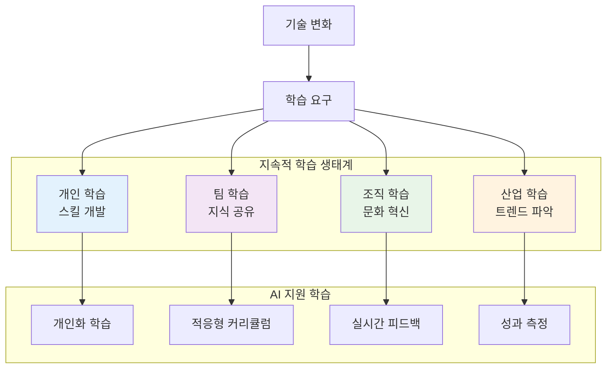

# 12장: 지속적 학습과 미래 트렌드

> *"미래를 예측하는 가장 좋은 방법은 그것을 창조하는 것이다."* - 피터 드러커

---

## 학습 목표

이 장을 마치면 다음을 할 수 있게 됩니다:
- 개인과 팀의 지속적 학습 체계를 구축할 수 있습니다
- 바이브 코딩을 활용하여 새로운 기술을 빠르게 학습하고 적용할 수 있습니다
- 소프트웨어 개발의 미래 트렌드를 이해하고 대비할 수 있습니다
- AI와 함께하는 개발 환경에서 경쟁력을 유지할 수 있습니다
- 기술 변화에 적응하는 조직 문화를 조성할 수 있습니다

---

## 12.1 지속적 학습의 중요성

### 변화하는 기술 환경

소프트웨어 개발 분야는 빠르게 변화하며, 지속적 학습이 필수입니다.



### 💡 **바이브 코딩 프롬프트: AI 기반 학습 플랫폼**

**시나리오**: 개발자와 팀을 위한 개인화된 지속적 학습 플랫폼을 구축해야 합니다.

**바이브 코딩 프롬프트**:
```
개발자를 위한 AI 기반 개인화 학습 및 스킬 개발 플랫폼을 구축해 주세요.

**플랫폼 목표**:
1. **개인화 학습**: 개인의 스킬과 목표에 맞춤형 학습 경로
2. **실무 연계**: 실제 프로젝트와 연결된 학습 경험
3. **지속적 평가**: 스킬 발전 상황 실시간 추적
4. **커뮤니티 학습**: 동료와의 협력 학습 환경
5. **미래 준비**: 신기술 트렌드 기반 학습 추천

**기술 스택**: React, Python, TensorFlow, Neo4j, WebRTC

**핵심 기능**:

1. **스킬 평가 및 분석**:
   - 코드 분석을 통한 현재 스킬 레벨 평가
   - 프로젝트 기여도 기반 역량 측정
   - 학습 스타일 및 선호도 분석
   - 개인별 강점/약점 식별

2. **개인화 학습 경로**:
   - 목표 기반 맞춤형 커리큘럼 생성
   - 적응형 학습 속도 조절
   - 실무 프로젝트 연계 학습
   - 마이크로러닝 콘텐츠 제공

3. **실시간 학습 지원**:
   - 코딩 중 실시간 학습 제안
   - 오류 기반 학습 기회 제공
   - 베스트 프랙티스 자동 추천
   - 멘토링 매칭 시스템

4. **커뮤니티 및 협업**:
   - 스터디 그룹 자동 매칭
   - 프로젝트 기반 팀 학습
   - 지식 공유 및 토론
   - 피어 리뷰 시스템

**결과물**:
1. **스킬 분석 엔진**: 개인 역량 자동 평가 및 분석
2. **학습 경로 생성기**: AI 기반 맞춤형 커리큘럼
3. **실시간 학습 도우미**: 개발 중 학습 지원
4. **커뮤니티 플랫폼**: 협력 학습 환경
5. **성과 대시보드**: 학습 진도 및 성과 시각화

개발자가 평생 학습을 지속할 수 있는 종합 플랫폼을 구현해 주세요.
```

---

## 12.2 새로운 기술 동향

### 주목해야 할 기술 트렌드

소프트웨어 개발의 미래를 형성하는 주요 기술들을 이해해야 합니다.

### 💡 **바이브 코딩 프롬프트: 기술 트렌드 분석 시스템**

**바이브 코딩 프롬프트**:
```
소프트웨어 개발 기술 트렌드를 분석하고 예측하는 AI 시스템을 구축해 주세요.

**시스템 기능**:
1. **트렌드 감지**: 새로운 기술 동향 자동 감지
2. **영향도 분석**: 기술 변화가 산업에 미치는 영향 평가
3. **학습 우선순위**: 개발자별 학습해야 할 기술 우선순위
4. **미래 예측**: 기술 발전 방향 예측 모델링
5. **실무 적용**: 현재 프로젝트에 적용 가능한 기술 추천

**기술 스택**: Python, NLP, Machine Learning, Web Scraping

**핵심 기능**:
- 다양한 소스에서 기술 정보 수집
- 트렌드 패턴 분석
- 기술 성숙도 평가
- 채택률 예측
- 개인화 추천

**결과물**:
1. **트렌드 모니터**: 실시간 기술 동향 추적
2. **영향도 분석기**: 기술 변화 영향 평가
3. **학습 추천 엔진**: 개인별 기술 학습 가이드
4. **예측 모델**: 기술 발전 방향 예측
5. **적용 가이드**: 실무 적용 방안 제시

개발자와 조직이 기술 변화에 선제적으로 대응할 수 있는 시스템을 구현해 주세요.
```

---

## 12.3 AI와 함께하는 개발의 미래

### AI 네이티브 개발 환경

AI가 개발 프로세스의 모든 단계에 통합되는 미래를 준비해야 합니다.

### 💡 **바이브 코딩 프롬프트: 차세대 AI 개발 환경**

**바이브 코딩 프롬프트**:
```
AI가 완전히 통합된 차세대 개발 환경을 구축해 주세요.

**환경 특징**:
1. **AI 페어 프로그래머**: 실시간 코딩 파트너
2. **지능형 아키텍처**: AI 기반 시스템 설계
3. **자동 최적화**: 성능 및 보안 자동 개선
4. **예측적 디버깅**: 버그 발생 전 사전 감지
5. **자연어 개발**: 자연어로 소프트웨어 개발

**기술 스택**: GPT-4+, Code Generation AI, VS Code Extensions

**핵심 기능**:
- 실시간 코드 생성 및 리뷰
- 아키텍처 자동 설계
- 성능 최적화 자동화
- 보안 취약점 사전 감지
- 자연어 기반 개발

**결과물**:
1. **AI 코딩 어시스턴트**: 고도화된 코딩 파트너
2. **지능형 IDE**: AI 통합 개발 환경
3. **자동 최적화 엔진**: 성능/보안 자동 개선
4. **예측 디버거**: 사전 버그 감지 시스템
5. **자연어 개발 도구**: 말로 하는 프로그래밍

개발자의 창의성을 극대화하는 AI 네이티브 환경을 구현해 주세요.
```

---

## 12.4 조직의 학습 문화 구축

### 학습하는 조직 만들기

개인의 학습을 넘어 조직 전체의 학습 문화를 구축해야 합니다.

### 💡 **바이브 코딩 프롬프트: 조직 학습 문화 플랫폼**

**바이브 코딩 프롬프트**:
```
조직의 학습 문화를 촉진하고 관리하는 종합 플랫폼을 구축해 주세요.

**플랫폼 기능**:
1. **학습 문화 진단**: 조직의 학습 성숙도 평가
2. **지식 자산 관리**: 조직 지식의 체계적 관리
3. **학습 커뮤니티**: 부서 간 지식 교류 촉진
4. **혁신 프로젝트**: 학습 기반 혁신 활동 지원
5. **성과 측정**: 학습 문화의 비즈니스 임팩트 측정

**기술 스택**: React, Node.js, GraphQL, Analytics

**핵심 기능**:
- 학습 활동 추적
- 지식 네트워크 분석
- 혁신 아이디어 관리
- 성과 지표 측정
- 문화 변화 모니터링

**결과물**:
1. **문화 진단 도구**: 학습 문화 성숙도 평가
2. **지식 관리 시스템**: 조직 지식 자산 관리
3. **학습 커뮤니티**: 부서 간 지식 교류 플랫폼
4. **혁신 관리 도구**: 학습 기반 혁신 지원
5. **성과 대시보드**: 학습 문화 ROI 측정

지속적으로 학습하고 혁신하는 조직 문화를 만드는 플랫폼을 구현해 주세요.
```

---

## 12.5 개인 경력 개발 전략

### 미래 지향적 경력 설계

변화하는 기술 환경에서 개인의 경력을 전략적으로 관리해야 합니다.

### 💡 **바이브 코딩 프롬프트: AI 경력 코치 시스템**

**바이브 코딩 프롬프트**:
```
개발자를 위한 AI 기반 경력 개발 및 코칭 시스템을 구축해 주세요.

**시스템 기능**:
1. **경력 분석**: 현재 경력 상태 종합 분석
2. **목표 설정**: 개인 목표 기반 경력 로드맵
3. **스킬 갭 분석**: 목표 달성을 위한 필요 스킬
4. **기회 추천**: 경력 발전 기회 자동 추천
5. **멘토링 매칭**: 적합한 멘토 연결

**기술 스택**: Python, Machine Learning, NLP, React

**핵심 기능**:
- 경력 데이터 분석
- 시장 동향 분석
- 개인화 추천
- 목표 추적
- 네트워킹 지원

**결과물**:
1. **경력 분석기**: 개인 경력 상태 종합 분석
2. **로드맵 생성기**: 맞춤형 경력 발전 계획
3. **스킬 추천 엔진**: 필요 스킬 및 학습 방법 제안
4. **기회 탐지기**: 경력 발전 기회 자동 발견
5. **멘토링 플랫폼**: AI 기반 멘토-멘티 매칭

개발자가 성공적인 경력을 설계하고 관리할 수 있는 AI 코치를 구현해 주세요.
```

---

## 요약

지속적 학습과 미래 준비는 현대 개발자의 필수 역량입니다. 바이브 코딩을 활용하면:

- **개인화 학습**: AI를 통한 맞춤형 학습 경험
- **트렌드 대응**: 기술 변화에 대한 선제적 대응
- **AI 협업**: AI와 함께하는 효율적 개발
- **조직 혁신**: 학습 문화 기반 조직 혁신

**핵심 원칙**:
1. **평생 학습**: 지속적인 자기 개발
2. **적응력**: 변화에 대한 유연한 대응
3. **협업**: AI와 인간의 효과적 협력
4. **혁신**: 새로운 가능성에 대한 열린 마음

**미래를 위한 준비**:
- **기술적 역량**: 새로운 기술에 대한 지속적 학습
- **소프트 스킬**: 창의성, 비판적 사고, 협업 능력
- **적응력**: 변화하는 환경에 대한 유연성
- **리더십**: 팀과 조직의 변화를 이끄는 능력

기억하세요: 미래는 예측하는 것이 아니라 준비하는 것입니다. 지속적인 학습과 적응을 통해 변화하는 기술 환경에서 성공할 수 있습니다. 바이브 코딩은 이러한 여정을 더욱 효과적이고 즐겁게 만들어줄 것입니다. 