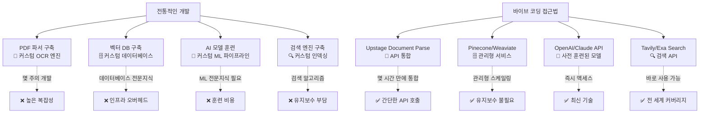
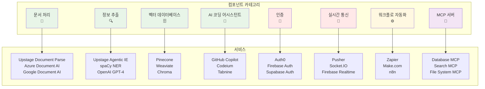
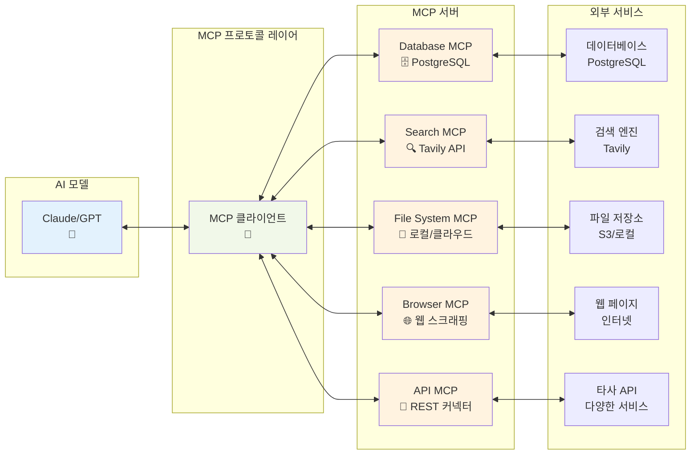
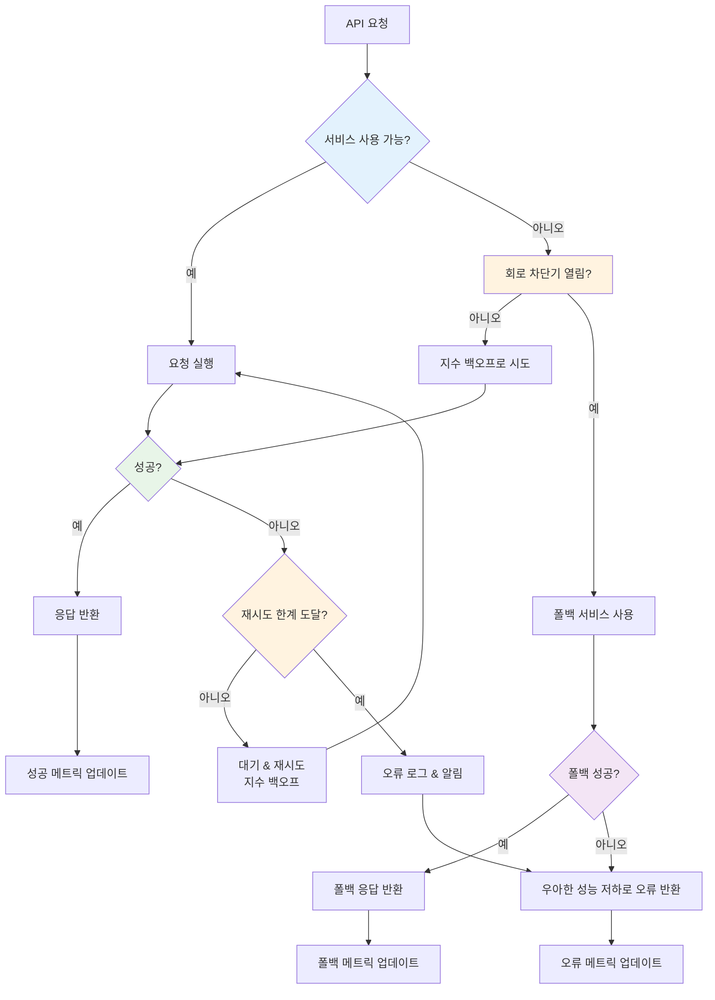
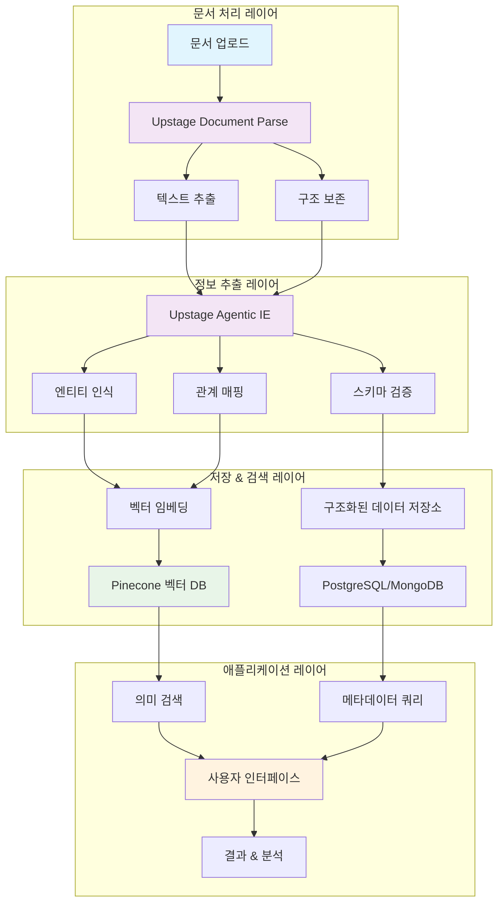

# 12장: 바이브 코딩 컴포넌트 활용하기

## 학습 목표
- 바이브 코딩에서 기존 컴포넌트와 서비스를 효과적으로 활용하는 방법 이해
- 문서 처리, 정보 추출, AI 코딩 도구 등 다양한 서비스 카테고리 파악
- 컴포넌트 통합을 통한 개발 생산성 향상 방법 습득
- 실용적인 바이브 코딩 프롬프트 작성 기법 학습

## 12.1 바이브 코딩 컴포넌트 철학

### 구축하지 말고, 조합하라

바이브 코딩의 핵심 철학 중 하나는 "모든 것을 처음부터 구축하지 않는다"는 것입니다. 대신 기존의 검증된 서비스와 컴포넌트를 결합하여 빠르고 효율적으로 솔루션을 구축합니다.

#### 컴포넌트 우선 사고의 장점
```
전통적인 개발           vs       바이브 코딩 접근법
─────────────              ──────────────────
PDF 파서 구축       →       Upstage Document Parse API 사용
벡터 데이터베이스 구축 →      Pinecone/Weaviate 서비스 사용
AI 모델 훈련        →       OpenAI/Claude API 사용
검색 엔진 구축      →       Tavily/Exa Search API 사용
```



### LEGO 블록 접근법

바이브 코딩 컴포넌트를 LEGO 블록처럼 생각해보세요. 각 컴포넌트는 다음을 가지고 있습니다:
- **명확한 인터페이스** (APIs, SDKs)
- **특정 기능** (문서 파싱, 정보 추출)
- **쉬운 통합** (REST APIs, 웹훅)
- **확장 가능한 아키텍처** (클라우드 기반 서비스)

## 12.2 필수 컴포넌트 카테고리



### 12.2.1 문서 처리 & OCR

#### Upstage Document Parse
**서비스**: https://www.upstage.ai/products/document-parse

**기능**: OCR 기능을 갖춘 고급 문서 파싱
- PDF, 이미지, 스캔된 문서에서 텍스트 추출
- 문서 구조와 형식 유지
- 다중 언어 및 복잡한 레이아웃 지원

**바이브 코딩 프롬프트**:
```
"Upstage Document Parse API를 사용하는 Python 스크립트를 만들어 주세요:
1. PDF 문서 업로드
2. 구조를 유지하면서 모든 텍스트 콘텐츠 추출
3. 추출된 텍스트를 구조화된 JSON 형식으로 저장
4. 재시도 로직으로 API 오류를 우아하게 처리
5. 대용량 문서를 위한 진행 상황 추적 포함"
```

#### 대안 문서 처리 서비스
- **Azure Document Intelligence**: Microsoft의 OCR 및 문서 분석
- **Google Document AI**: Google Cloud의 문서 처리
- **Amazon Textract**: AWS 문서 분석 서비스
- **Tesseract OCR**: 오픈소스 OCR 엔진

### 12.2.2 정보 추출

#### Upstage Agentic IE (정보 추출)
**서비스**: https://www.upstage.ai/products/information-extract

**기능**: AI 기반 문서 정보 추출
- 핵심 엔티티, 관계, 구조화된 데이터 식별
- 사용자 정의 추출 스키마 지원
- 추출된 정보에 대한 신뢰도 점수 제공

**바이브 코딩 프롬프트**:
```
"Upstage Agentic IE를 사용하는 문서 분석 파이프라인을 구축해 주세요:
1. 송장 처리를 위한 사용자 정의 추출 스키마 정의
2. 공급업체명, 금액, 날짜, 라인 아이템 추출
3. 비즈니스 규칙에 따른 추출 데이터 검증
4. JSON 및 CSV 형식으로 결과 내보내기
5. 데이터 품질 메트릭과 신뢰도 점수 포함"
```

#### 기타 정보 추출 도구
- **spaCy NER**: 개체명 인식
- **Stanford CoreNLP**: 자연어 처리 스위트
- **OpenAI GPT-4**: 사용자 정의 추출 작업용
- **Hugging Face Transformers**: 사전 훈련된 추출 모델

### 12.2.3 모델 컨텍스트 프로토콜 (MCP) 서버

#### MCP 서버란?
모델 컨텍스트 프로토콜 서버는 AI 모델이 외부 도구와 데이터 소스에 액세스할 수 있도록 표준화된 인터페이스를 제공합니다.

**Awesome MCP 목록의 주요 MCP 서버**:
- **Database MCP**: PostgreSQL, MySQL, SQLite 연결
- **Web Search MCP**: Tavily, Exa, Google Search 통합
- **File System MCP**: 로컬 및 클라우드 파일 작업
- **API Integration MCP**: REST API 커넥터
- **Browser MCP**: 웹 스크래핑 및 자동화

**MCP 통합용 바이브 코딩 프롬프트**:
```
"다음을 포함하는 포괄적인 MCP 서버 구성을 설정해 주세요:
1. 데이터 저장용 PostgreSQL 데이터베이스 연결
2. 웹 정보 검색을 위한 Tavily 검색 통합
3. 문서 관리를 위한 파일 시스템 액세스
4. 보안 API 인증 제공
5. 적절한 오류 처리 및 로깅 구현
6. 모든 통합을 보여주는 샘플 워크플로 생성"
```

**MCP 통합 아키텍처**:


### 12.2.4 AI 코딩 어시스턴트

#### GitHub Copilot 및 다른 옵션들
- **GitHub Copilot**: AI 페어 프로그래머
- **Amazon CodeWhisperer**: AWS 통합 코딩 어시스턴트
- **Tabnine**: AI 코드 완성
- **Codeium**: 무료 AI 코딩 어시스턴트
- **Sourcegraph Cody**: 코드 인텔리전스 플랫폼

**AI 어시스턴트 통합용 바이브 코딩 프롬프트**:
```
"AI 코딩 어시스턴트 효과를 최대화하는 개발 워크플로를 만들어 주세요:
1. 여러 AI 어시스턴트 설정 (Copilot, Codeium)
2. 다양한 코딩 작업을 위한 사용자 정의 프롬프트 구성
3. 코드 품질 검사 및 검증 구현
4. 일반적인 개발 패턴용 템플릿 생성
5. AI 생성 테스트 케이스로 자동화 테스트 설정"
```

### 12.2.5 벡터 데이터베이스 & 임베딩

#### 인기 있는 벡터 데이터베이스 서비스
- **Pinecone**: 관리형 벡터 데이터베이스
- **Weaviate**: 오픈소스 벡터 검색 엔진
- **Chroma**: 오픈소스 임베딩 데이터베이스
- **Qdrant**: 벡터 유사성 검색 엔진
- **Milvus**: 오픈소스 벡터 데이터베이스

**벡터 데이터베이스 설정용 바이브 코딩 프롬프트**:
```
"Pinecone을 사용하는 의미 검색 시스템을 구축해 주세요:
1. OpenAI 임베딩 API와 통합
2. 문서 청킹 전략 구현
3. 메타데이터 필터링이 있는 유사성 검색 제공
4. 대용량 문서 세트를 위한 배치 처리 포함
5. 자주 액세스하는 벡터를 위한 캐싱 구현
6. 검색 기능을 위한 REST API 생성"
```

### 12.2.6 API 통합 & 워크플로 자동화

#### Zapier & Make.com
- **Zapier**: 노코드 자동화 플랫폼
- **Make.com**: 시각적 자동화 빌더
- **n8n**: 오픈소스 워크플로 자동화
- **Pipedream**: 서버리스 통합 플랫폼

**워크플로 자동화용 바이브 코딩 프롬프트**:
```
"Make.com을 사용하는 자동화 워크플로를 설계해 주세요:
1. 새 문서의 이메일 첨부파일 모니터링
2. Upstage Document Parse를 사용한 문서 처리
3. Agentic IE를 사용한 핵심 정보 추출
4. Notion 데이터베이스에 결과 저장
5. 중요한 문서에 대한 Slack 알림 전송
6. 오류 처리 및 재시도 메커니즘 포함"
```

### 12.2.7 실시간 통신

#### WebSocket & 실시간 서비스
- **Pusher**: 실시간 메시징 서비스
- **Socket.IO**: 실시간 양방향 통신
- **Firebase Realtime Database**: Google의 실시간 동기화
- **Supabase Realtime**: 오픈소스 Firebase 대안

**실시간 통합용 바이브 코딩 프롬프트**:
```
"Pusher를 사용하는 실시간 협업 시스템을 구축해 주세요:
1. 실시간 문서 편집 및 댓글 기능 활성화
2. AI 처리 상태 업데이트 브로드캐스트
3. 사용자 존재 표시기 구현
4. 메시지 기록 및 재생 기능 포함
5. 오프라인 동기화 기능 제공"
```

### 12.2.8 인증 & 보안

#### Auth0 & Firebase Auth
- **Auth0**: 신원 플랫폼
- **Firebase Authentication**: Google의 인증 서비스
- **Supabase Auth**: 오픈소스 인증
- **Clerk**: 개발자 우선 인증

**보안 통합용 바이브 코딩 프롬프트**:
```
"Auth0를 사용하는 보안 인증 시스템을 구현해 주세요:
1. 여러 소셜 로그인 프로바이더 지원
2. 역할 기반 액세스 제어 (RBAC) 구현
3. JWT 토큰 관리 제공
4. API 라우트 보호 포함
5. 보안 세션 관리 구현
6. 보안 이벤트에 대한 감사 로깅 추가"
```

## 12.3 컴포넌트 통합 전략

### 12.3.1 API 우선 아키텍처

**설계 원칙**:
- **느슨한 결합**: 컴포넌트가 잘 정의된 API를 통해 상호작용
- **장애 허용성**: 서비스 장애를 우아하게 처리
- **비동기 처리**: 장시간 실행 작업에 큐 사용
- **캐싱 전략**: 지능적인 캐싱 레이어 구현

### 12.3.2 오류 처리 & 복원력

**복원력 있는 통합용 바이브 코딩 프롬프트**:
```
"다음을 포함하는 복원력 있는 API 통합 프레임워크를 만들어 주세요:
1. 재시도를 위한 지수 백오프 구현
2. 실패하는 서비스를 위한 회로 차단기 패턴 제공
3. 포괄적인 로깅 및 모니터링 포함
4. 중요한 서비스를 위한 폴백 메커니즘 구현
5. 모든 통합 컴포넌트에 대한 상태 검사 제공
6. 서비스 성능 저하에 대한 알림 생성"
```

**오류 처리 & 복원력 플로우**:


### 12.3.3 비용 최적화

**전략**:
- **사용량 모니터링**: API 호출 및 비용 추적
- **캐싱**: 중복 API 호출 감소
- **배치 처리**: 여러 작업 결합
- **계층 관리**: 적절한 서비스 계층 사용

## 12.4 실용적인 통합 예시

### 12.4.1 문서 처리 파이프라인

**바이브 코딩 프롬프트**:
```
"다음을 포함하는 완전한 문서 처리 파이프라인을 구축해 주세요:
1. 드래그 앤 드롭 인터페이스를 통한 문서 수락
2. 텍스트 추출을 위한 Upstage Document Parse 사용
3. 정보 추출을 위한 Upstage Agentic IE 적용
4. Pinecone 벡터 데이터베이스에 결과 저장
5. 의미 검색 기능 제공
6. 진행 추적 및 오류 처리 포함
7. 사용자 인증 및 문서 소유권 구현
8. React/Next.js를 사용한 반응형 웹 인터페이스 생성"
```

**완전한 문서 처리 아키텍처**:


### 12.4.2 AI 기반 지식 베이스

**바이브 코딩 프롬프트**:
```
"다음을 포함하는 AI 기반 지식 베이스 시스템을 만들어 주세요:
1. 데이터 소스를 위한 여러 MCP 서버 통합
2. 의미 검색을 위한 벡터 임베딩 사용
3. Claude/GPT를 사용한 RAG (검색 보강 생성) 구현
4. 실시간 협업 기능 제공
5. 문서 버전 제어 포함
6. 스마트 분류 및 태그 구현
7. 사용 통찰력을 위한 분석 대시보드 생성
8. 여러 파일 형식 및 데이터 소스 지원"
```

### 12.4.3 자동화된 콘텐츠 분석

**바이브 코딩 프롬프트**:
```
"다음을 포함하는 자동화된 콘텐츠 분석 플랫폼을 개발해 주세요:
1. 여러 콘텐츠 소스 모니터링 (RSS, API, 업로드)
2. 문서 파싱 서비스를 사용한 콘텐츠 처리
3. AI를 사용한 엔티티 및 관계 추출
4. 감정 분석 및 주제 모델링 수행
5. 자동화된 요약 및 인사이트 생성
6. 콘텐츠 유사성 감지 구현
7. 사용자 정의 가능한 대시보드 및 보고서 제공
8. 중요한 콘텐츠에 대한 자동화된 알림 포함"
```

## 12.5 컴포넌트 통합 모범 사례

### 12.5.1 구성 관리

**환경 변수**:
```bash
# API 키 및 시크릿
UPSTAGE_API_KEY=your_api_key
PINECONE_API_KEY=your_pinecone_key
OPENAI_API_KEY=your_openai_key

# 서비스 엔드포인트
UPSTAGE_DOCUMENT_PARSE_URL=https://api.upstage.ai/v1/document-parse
AGENTIC_IE_URL=https://api.upstage.ai/v1/information-extract

# 구성
MAX_RETRIES=3
TIMEOUT_SECONDS=30
CACHE_TTL=3600
```

### 12.5.2 모니터링 & 관찰 가능성

**추적할 주요 메트릭**:
- API 응답 시간 및 성공률
- 컴포넌트 가용성 및 상태
- 작업당 비용 및 사용 추세
- 오류율 및 실패 패턴
- 사용자 참여 및 만족도 메트릭

### 12.5.3 문서화 & 테스팅

**문서화용 바이브 코딩 프롬프트**:
```
"컴포넌트 통합을 위한 포괄적인 문서를 만들어 주세요:
1. 예시가 포함된 API 참조
2. 단계별 통합 가이드 제공
3. 오류 코드 및 문제 해결 문서화
4. 성능 벤치마크 및 제한 사항 포함
5. 여러 언어로 코드 예시 제공
6. 대화형 API 문서 생성
7. 복잡한 워크플로를 위한 비디오 튜토리얼 포함"
```

## 12.6 고급 통합 패턴

### 12.6.1 이벤트 기반 아키텍처

**이벤트 스트림 구현**:
- **Kafka**: 분산 이벤트 스트리밍
- **AWS EventBridge**: 서버리스 이벤트 버스
- **Google Pub/Sub**: 메시지 큐잉 서비스
- **Redis Streams**: 경량 이벤트 스트리밍

### 12.6.2 컴포넌트를 사용한 마이크로서비스

**서비스 메시 통합**:
- **Istio**: 마이크로서비스용 서비스 메시
- **Consul Connect**: 서비스 발견 및 구성
- **Envoy Proxy**: 엣지 및 서비스 프록시

### 12.6.3 서버리스 통합

**서버리스 플랫폼**:
- **AWS Lambda**: 서비스형 함수
- **Vercel Functions**: 엣지 컴퓨팅
- **Netlify Functions**: JAMstack 함수
- **Google Cloud Functions**: 이벤트 기반 컴퓨트

## 12.7 통합의 미래 보장

### 12.7.1 버전 관리

**API 버전 관리 전략**:
- 주요 변경사항에 대한 의미 체계 버전 관리
- 이전 버전과의 호환성 고려사항
- 사용 중단된 기능에 대한 마이그레이션 경로
- 점진적 롤아웃을 위한 기능 플래그

### 12.7.2 확장 고려사항

**수평 확장**:
- 여러 인스턴스에 걸친 로드 밸런싱
- 데이터베이스 샤딩 및 복제
- 글로벌 배포를 위한 CDN 통합
- 수요에 따른 자동 확장

## 12.8 요약

바이브 코딩 컴포넌트는 다음을 통해 개발 프로세스를 변화시킵니다:

1. **개발 가속화**: 처음부터 구축하는 대신 기존 서비스 활용
2. **신뢰성 향상**: 실전에서 검증된 컴포넌트와 서비스 사용
3. **비용 절감**: 클라우드 서비스로 사용한 만큼만 지불
4. **확장성 강화**: 관리형 서비스로 내장된 확장
5. **가치에 집중**: 인프라가 아닌 고유한 비즈니스 로직에 시간 투자

### 핵심 교훈

- **생성보다 조합**: 모든 것을 구축하기보다는 기존 컴포넌트 결합
- **API 우선 설계**: 처음부터 통합을 위한 설계
- **복원력 계획**: 적절한 오류 처리 및 폴백 메커니즘 구현
- **비용 인식**: 사용량 모니터링 및 비용 효율성 최적화
- **문서화 우선**: 모든 통합에 대한 포괄적인 문서 유지

### 다음 단계

1. 프로젝트와 관련된 컴포넌트 식별
2. 개념 증명 통합 생성
3. 적절한 오류 처리 및 모니터링 구현
4. 사용 패턴에 따라 점진적으로 확장
5. 성능 및 비용에 대해 지속적으로 최적화

개발의 미래는 기존 서비스와 컴포넌트의 지능적인 조합에 있습니다. 이러한 통합 패턴을 마스터함으로써 최소한의 노력으로 최대한의 영향력을 발휘하는 강력하고 확장 가능한 애플리케이션을 구축할 수 있는 능력을 갖추게 될 것입니다. 